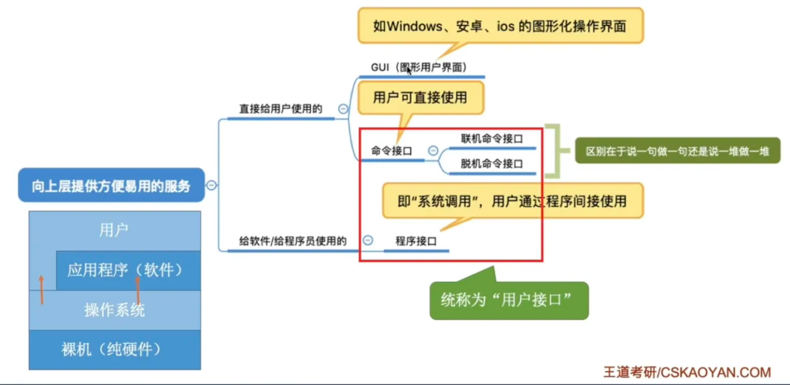

# 计算机系统概述

!!! important
    本章常以选择题的形式考察，重点考查操作系统的功能、运行环境和提供的服务。

## 操作系统的基本概念

### 操作系统的概念、功能

操作系统 (Operating System, OS)

1. 是系统资源的管理者：控制和管理整个计算机系统的硬件和软件资源
2. 是最接近硬件的一层软件
3. 向上层提供方便易用的服务

??? info "More details"
    操作系统是指 **控制和管理整个计算机系统的硬件和软件资源**，并合理地组织调度计算机的工作和资源的分配，以 **提供给用户和其他软件方便的接口和环境**；它是计算机系统中最基本的 **系统软件**。

操作系统的功能和目标：

1) 向上层提供方便易用的服务

2) 作为最接近硬件的层次，实现对硬件机器的拓展。

> - 没有任何软件支持的计算机称为 <u>裸机</u>。
> - 在裸机上安装的操作系统，可以提供资源管理功能和方便用户的服务功能，将其改造为功能更加强大、易用的机器。
> - 通常把覆盖了软件的机器称为 **扩充机器**，或称为 **虚拟机**。

### 操作系统的特征

#### 并发 | Concurrence

**并发**：指两个或多个事件在同一时间间隔内发生。这些事件宏观上是同时发生的，微观上是交替进行的。

!!! warning "易混淆概念"
    **并行性** 是指系统具有同时进行运算或操作的特性，在同一时刻能完成两种或两种以上的工作
    
    ??? info
        操作系统的并发性是通过时分技术实现的，而 CPU 与 I/O 设备、I/O 设备与 I/O 设备之间则可以实现真正的并行
    
    !!! warning "重要考点"
        - 单核 CPU 同一时刻只能执行一个程序，多个程序只能 **并发** 执行；
        - 多核 CPU 同一时刻能执行多个程序，多个程序可以 **并行** 执行。
        - 但如果“同时”执行的程序数大于 CPU 的核数，那么这些程序就只能并发执行，因此 并发性是操作系统的最基本特征。

> 操作系统引入进程的目的是使得程序能并发执行。

#### 共享 | Sharing

**共享**：即资源共享，是指系统中的资源可供内存中多个并发执行的进程共同使用。资源共享主要分为 **互斥共享** 和 **同时访问** 两种。

**1) 互斥共享方式**：

- 系统中的某些资源，虽然可以提供给多个进程使用，但 **一段时间内只允许一个进程访问该资源**。

- 当某个进程要访问一个资源的时候，必须提出请求。如果资源空闲，系统就分配。反之，让其等待。

??? note "临界资源"
    - 将在一段时间内只允许一个进程访问的资源称为 **临界资源**
    - 计算机系统中大多数的物理设备及某些软件中使用的栈、变量和表格等都属于临界资源，需要被互斥地访问

**2) 同时访问方式**：

- 

#### 虚拟 | Virtual

#### 异步 | Asynchronism

