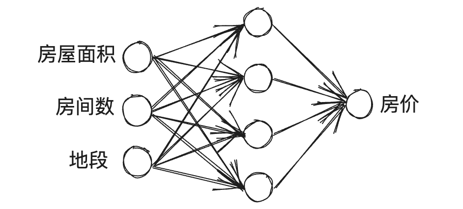

# Introduction to Deep Learning

## What is a Neural Network

- 人工神经网络（artificial neural network, ANN），简称神经网络（nerual network, NN），是一种数学模型或计算模型，用于对函数进行估计和近似
- 神经网络主要由“输入层”，“隐藏层”和“输出层”组成，其中“隐藏层”可以有多层
    - 实际中，网络输入层的每个神经元代表一个特征，输出层个数代表了分类标签的个数
    - 隐藏层层数及隐藏层神经元是由人工设定

    ??? example 
        - 以预测房价举例，房价的影响因素为房屋面积、房间数、地段（以三个为例子）等，这些因素就是输入层的神经元
        - 输出层的神经元个数为 1，代表房价clea
        - 则该神经网络为最简单的两层神经网络

        

## Supervised Learning with Neural Networks
 
??? info 
    - 目前机器学习常分为监督学习（Supervised Learning）、半监督学习（Semi-supervised Learning）、无监督学习（Unsupervised Learning）和强化学习（Reinforcement Learning）
        - 通俗讲，监督的含义就是训练数据集和测试数据集有没有标签
    - **$\lceil$Supervised Learning$\rfloor$**: 
        - 数据集中包含包含特征（feature）和标签（label），即最后预测结果是否正确是有标准答案做参考对比的
    - **$\lceil$Unsupervised Learning$\rfloor$**: 
        - 数据集中只包含特征，没有标签，即最后预测结果是否正确是没有标准答案做参考对比的
    - **$\lceil$Semi-supervised Learning$\rfloor$**: 
        - 数据集中一部分包含特征和标签，剩余部分不含标签，例如在图像识别中，手工标记出一部分含有西瓜的图片，将不完全标记的数据集用半监督学习算法进行训练，使模型能准确从一堆照片中识别出西瓜
        - 在半监督学习中，也包含两种学习方法
            1. 将没有标签和有标签的数据同等对待训练
            2. 将没有标签的数据作为需要被预测的数据对待
    - **$\lceil$Reinforcement Learning$\rfloor$**: 
        - 强化学习是一种机器学习方法，强调如何基于环境而行动，以取得最大化的预期利益
        - 强化学习的主要特点是 agent 可以根据当前的状态，选择一个动作，然后环境会根据这个动作给 agent 一个奖励，agent 根据这个奖励来判断这个动作是不是一个好的动作，然后不断的学习，最终学到一个最优的策略
        - 强化学习的一个典型应用是机器人的自主导航，机器人在环境中移动，每移动一步，环境会给机器人一个奖励，机器人根据这个奖励来判断这个动作是不是一个好的动作，然后不断的学习，最终学到一个最优的策略

- 机器学习也常被用于结构化数据（Structured Data）和非结构化数据（Unstructured Data）的处理
    - 结构化数据：数据常以表格的形式存在，每一行代表一个样本，每一列代表一个特征。意味着每个特征都有清晰的定义
    - 非结构化数据：数据以图片、音频、视频、文本等形式存在，无法用表格的形式表示。例如图像中的像素值、文本中的某个单词......

- 下面的课程中，为更清楚解释算法原理会多用非结构化数据的例子

