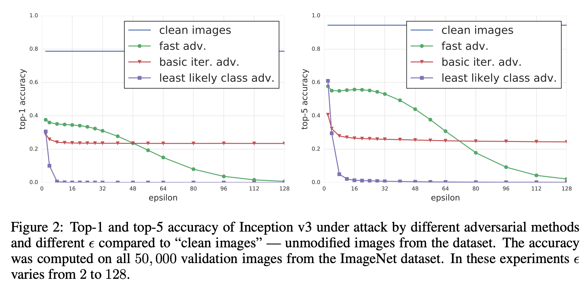

# BIM | Basic Iterative Method

> 又称 I-FGSM (Iterative Fast Gradient Sign Method)

!!! abstract "paper"
    [论文地址](https://arxiv.org/abs/1607.02533)

    论文主要提出：
    
    - BIM 攻击算法
    - ILCM (Iterative Least-likely Class Method) 攻击算法
    - 验证了在真实物理环境中，通过图像采集得到的对抗样本是否依旧能够使得分类器分类错误(本篇不介绍)

## BIM

- 与 [FGSM](FGSM.md) 类似，都是基于梯度的攻击方法。不同的是，BIM 是一种迭代攻击方法：
    - 对于 FGSM，每次寻找对抗样本，改变量是 $\epsilon \cdot sign(\nabla_x J(\boldsymbol{\theta}, \boldsymbol{x}, y))$，这样是把每个像素点都改变了 $\epsilon$ 的量
    - 由于 FGSM 提出的假设是：目标损失函数是近似线性的，即 $J(\boldsymbol{\theta}, \boldsymbol{x}, y) \approx \boldsymbol{w}^T \boldsymbol{x}$。之后在 $\boldsymbol{x}$ 上加一个扰动 $\boldsymbol{\eta}$，使得 $J(\boldsymbol{\theta}, \boldsymbol{x}, y)$ 变化最大，由 $J(\boldsymbol{\theta}, \boldsymbol{x + \boldsymbol{\eta}}, y) - J(\boldsymbol{\theta}, \boldsymbol{x}, y) \approx \boldsymbol{w}^T \boldsymbol{\eta}$ 要最大，故而 $\boldsymbol{\eta} = \epsilon \cdot sign(\nabla_x J(\boldsymbol{\theta}, \boldsymbol{x}, y))$
- 但 BIM 作者表示 $J$ 和 $\boldsymbol{x}$ 很可能不是高度线性关系，那么就可能存在一个在 $(0, \boldsymbol{\eta})$ 间的扰动，使得 $J(\boldsymbol{\theta}, \boldsymbol{x}, y)$ 变化更大且此时 $\boldsymbol{x}$ 的改变量小于 $\epsilon$
- 基于此，作者提出迭代寻找各个像素点的扰动，即 I-FGSM or BIM，每次迭代都在上一次迭代的基础上进行扰动，这样总能砸到较好的步调使梯度上升，最差的情况就是迭代总改变量为 $\epsilon$，这样就和 FGSM 一样

$$
\begin{matrix}
&\boldsymbol{X}_0^{'} = \boldsymbol{X} \\
&\boldsymbol{X}_{N+1}^{'} = Clip_{X, \epsilon} \{\boldsymbol{X}_N^{'} + \alpha \cdot sign(\nabla_X J(\boldsymbol{\theta}, \boldsymbol{X}_N^{'}, y_{true}))\}
\end{matrix}
$$

- $\boldsymbol{X}_{N+1}^{'}$ 是第 $N+1$ 次迭代后的得到的对抗样本
- $\alpha$: 控制扰动大小的参数
- $sign$: 符号函数
- $J$: 损失函数
- $\boldsymbol{\theta}$: 模型参数
- $y_{true}$: 正确标签
- $Clip$: 裁剪函数，将值限制在不大于 $\epsilon$ 的范围内
    - 在迭代更新过程中，随迭代次数增加，部分像素值可能溢出，例如超出 (0,1) 的范围，此时需要进行裁剪，将其用最接近的值代替，例如超出 1 的值用 1 代替，超出 0 的值用 0 代替。这样确保了新样本的各像素在原样本的邻域内，使图像免于失真
    - 其具体公式如下 ($\boldsymbol{X}(x, y, z)$ 表示图像 $X$ 在坐标 $(x, y)$ 处的第 $z$ 个通道的像素值)：

    $$Clip_{X, \epsilon}\{\boldsymbol{X}^{'}\}(x, y, z) = \min \{255, \boldsymbol{X}(x, y, z) + \epsilon, \max \{0, \boldsymbol{X}(x, y, z) - \epsilon, \boldsymbol{X}^{'}(x, y, z)\}\}$$

- 迭代的含义：每次迭代都会在上一次迭代的基础上进行扰动，各个像素改变量为 $\alpha$, 且每次迭代都会裁剪，保证了新样本的扰动不会超过 $\epsilon$

??? success "code"
    [:fontawesome-regular-file-code: Download bim_tutorial.ipynb](../bim_tutorial.ipynb){ .md-button }

## Info-ILCM

ICLM(Iterative Least-likely Class Method) 算法是 BIM 的一个变种，将输入图像分类到最不可能的类别

$$
\begin{matrix}
&\boldsymbol{X}_0^{'} = \boldsymbol{X} \\
&\boldsymbol{X}_{N+1}^{'} = Clip_{\boldsymbol{X}, \epsilon} \{\boldsymbol{X}_N^{'} - \alpha \cdot sign(\nabla_X J(\boldsymbol{\theta}, \boldsymbol{X}_N^{'}, y_{LL}))\}
\end{matrix}
$$

- 由公式可看出，其与 BIM 的区别是 $\alpha$ 的符号不同，即 ILCM 是在原样本的基础上减去梯度，而 BIM 是在原样本的基础上加上梯度
- 同时原本的真实标签 $y_{true}$ 被替换为最不可能的标签 $y_{LL}$ (此修改使模型优化的目标是最终对应类别为 $y_{LL}$ 的分类标签的概率越来越大)

> 该算法和常规分类模型训练类似，只是监督信息并不是真实标签了

该算法主要在于选择 $y_{LL}$(原输入图像在分类模型中分类概率最小的类别), 其可由一下公式得到：

$$
y_{LL} = \underset{y}{argmin} \{p(y | \boldsymbol{X})\}
$$

- $p(y | \boldsymbol{X})$ 表示在给定输入 $\boldsymbol{X}$ 的情况下，模型预测为 $y$ 的概率

!!! info "实验效果"
    

    由上图所示：当 $\epsilon$ 较小时，BIM 比原始 FGSM 效果好且 ICLM 效果最好且 ICLM 需要的扰动量最小
