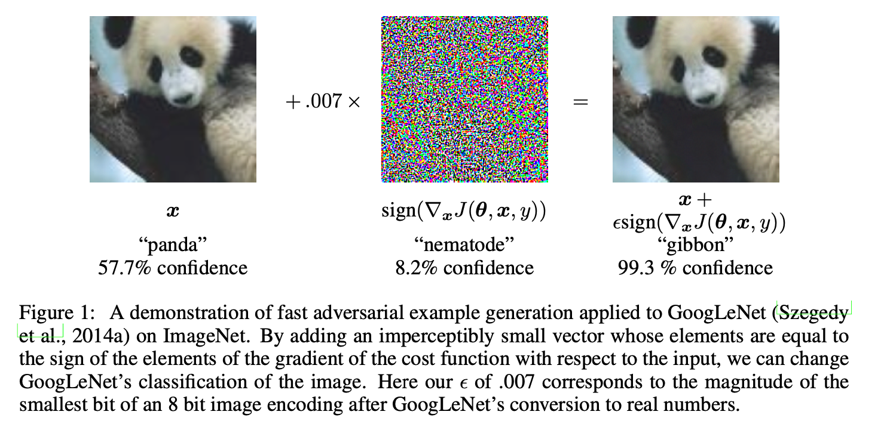

# FGSM | Fast Gradient Sign Method

!!! quote "Paper"
    [论文地址](https://arxiv.org/abs/1412.6572)

!!! abstract "特点"
    - 基于梯度的攻击方法
    - 无目标攻击
    - 无穷范数攻击
    - 白盒攻击

## 引言

> [Explaining And Harnessing Adversarial Examples](https://arxiv.org/abs/1412.6572) 主要提出对于对抗样本存在原因的一种新解释，即神经网络的线性特性，并提出了快速有效生成对抗样本的方法，即 FGSM

### 线性模型的对抗样本

- 在许多问题中，单个输入特征的精度是有限的。例如，数字图像通常每像素只使用8位，即每个像素的亮度值在 0 到 255 之间变化，因此他们丢弃动态范围 1/255[^1] 的所有信息。
- 故而，当扰动 $\boldsymbol{\eta}$ 的每个元素都小于最小精度时，理论上对一个类别分离良好的问题，分类器应对 $\boldsymbol{\tilde{x}} = \boldsymbol{x} + \boldsymbol{\eta}$ 和 $\boldsymbol{x}$ 分配相同类别，即 $||\boldsymbol{\eta}||_{\infty} < \epsilon$, 其中 $\epsilon$ 足够小，可被与我们问题相关联的传感器或数据存储设备丢弃

$$
\boldsymbol{w}^T \tilde{\boldsymbol{x}} = \boldsymbol{w}^T \boldsymbol{x} + \boldsymbol{w}^T \boldsymbol{\eta}
$$

- $\boldsymbol{w}$：模型的权重参数
- $\tilde{\boldsymbol{x}}$：代表一个生成的对抗样本
- $\boldsymbol{x}$：原始样本
- $\boldsymbol{\eta}$：代表在正常样本上添加的扰动，其中扰动向量中每一元素的数值绝对值大小都不超过 $\epsilon$

- 对抗性扰动会导致激活增长 $\boldsymbol{w}^T \boldsymbol{\eta}$, 通过赋予 $\boldsymbol{\eta} = \epsilon sign(\boldsymbol{w})$，可以在 $\boldsymbol{\eta}$ 上受到最大范数约束的情况下最大化此增量。若 $\boldsymbol{w}$ 有 $n$ 个维度且权重向量的元素的平均大小为 $m$，则激活将以 $\epsilon n m$ 增长
- 同时，$||\boldsymbol{\eta}||_{\infty}$ 不随 $n$ 而增长，但扰动引起的激活增长却随 $n$ 而增长，故而当 $n$ 足够大时，即使扰动的最大范数很小，也能对模型的输出造成很大的影响
- 由此，对于高维问题，可以对输入做许多无穷小的扰动，从而使模型的输出发生较大的变化。

> 这表明，如果一个简单的线性模型的输入具有足够的维数，那么它就可以有对抗样本

### 非线性模型的线性扰动

- 上述关于线性模型的对抗样本的分析给出了一种快速生成对抗样本的思路。
- 假设神经网络太线性而无法对抗线性扰动，LSTM，ReLU 和 maxout 网络等都被设计为以一种很线性的方式运行以便于优化。出于同样的原因，更多的非线性模型，如 Sigmoid 网络也被仔细调整，使其大部分时间花在非饱和、更线性的状态上。这种线性行为表明，线性模型的这种廉价的、分析性的扰动也能破坏神经网络
- 由此引入本篇重点 —— [FGSM](#fgsm)

## FGSM

- 因为白盒攻击已知模型的内部结构和参数，故最有效的白盒攻击算法即是对模型输入的梯度进行有限扰动，使扰动后的损失函数值最大化，从而使模型的输出发生改变
- 在设计神经网络时，会使用梯度下降法使 gradient 最小，而对抗攻击相反，FGSM 使梯度上升，使得损失函数最大化

具体讲，FGSM 是在白盒环境下，通过求出模型对输入的导数，然后用符号函数得到具体的梯度方向，接着乘上一个步长，得到最终的扰动值，最后将扰动值加到原始输入上，得到对抗样本，如：
(数学表达如下)：

$$
\boldsymbol{x}^{'} = \boldsymbol{x} + \epsilon \cdot sign(\nabla_x J(\boldsymbol{\theta}, \boldsymbol{x}, y))
$$

- $\boldsymbol{x}$：原始样本
- $\boldsymbol{x}^{'}$：对抗样本
- $\epsilon$：扰动值，一旦超出阈值，该对抗样本会被人眼识别出来
- $\boldsymbol{\theta}$: 模型的权重参数
- $J$: 损失函数
- $y$: 真实标签
- $\nabla_{\boldsymbol{x}}$: 表示对 $x$ 求偏导
- 我们可以围绕 $\boldsymbol{\theta}$ 的当前值来线性化损失函数，以获得 $\epsilon \cdot sign(\nabla_{\boldsymbol{x}} J(\boldsymbol{\theta}, \boldsymbol{x}, y))$ 的 optimal max-norm constrained perturbation(最优的最大范数约束扰动)，将其称为生成对抗样本的“快速梯度符号法” （FGSM）

## Implementation

!!! note "Pytorch 实现"
    [:fontawesome-regular-file-code: Download fgsm_tutorial.ipynb](../fgsm_tutorial.ipynb){ .md-button }

[^1]: 当我们谈论动态范围1/255时，我们是在讨论这个最小变化量1相对于整个可能的亮度范围（0到255）的比例。所以，1/255是表示在8位图像中，最小的亮度变化量占总亮度范围的比例

