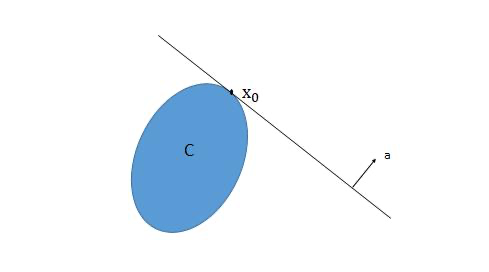

# 凸函数

## 凸集 | Convex Set

对于一个凸集 $C$ 

- $\lceil$ **数学定义** $\rfloor$: 

$$
\alpha x + (1 - \alpha) y \in C, ~~ \forall x, y \in C, \alpha \in [0, 1]
$$

> 也就是说，对于凸集 $C$ 中的任意两个点 $x, y$，它们的线性组合 $\alpha x + (1 - \alpha) y$ 也在 $C$ 中 (向量三点共线定理)

- $\lceil$ **几何意义** $\rfloor$: 
    - 将凸集想象成一个形状，凸集内任意两点的连线都在凸集内部

### 两个重要性质

> 对机器学习对分类问题，尤其是 SVM 等算法理论有重要支撑作用

1. $\lceil$ **Separating Hyperplane Theorem** $\rfloor$:
   
    - 两个不相交的凸集之间必然存在一个分割超平面使得两个凸集分别在超平面的两侧。
    - 即对非空凸集 $C_1$ 和 $C_2$， 且 $C_1 \cap C_2 = \empty$, 则必然存在 $a, b$， 使得
     $$
     a^T x \leq b, ~~ \forall x \in C_1 \\
     a^T x \geq b, ~~ \forall x \in C_2
     $$

2. $\lceil$ **Supporting Hyperplane Theorem** $\rfloor$:
   
   - 凸集边界上的一点必然存在一个支撑超平面穿过该点
   - 即对非空凸集 $C$, $x_0$ 是 $C$ 的边界上的一点(即 $x_0 \in \text{bd}C$)，则必然存在 $a \ne 0$ 使得 $a^T x \leq a^T x_0, ~~ \forall x \in C$, 称 $\{x | a^Tx = a^Tx_0 \}$ 为在 $x_0$ 处 $C$ 的支撑超平面
   - 
   - 逆定理：若内部非空的闭集 $C$ 在它的边界上任意点都有支撑超平面，则 $C$ 是凸集

### Operations that preserve convexity

1. 凸集的交集是凸集
2. 凸集的仿射变换是凸集，即 $C$ 是凸集，$A$ 是矩阵，$b$ 是向量，则 $A C + b = \{Ax + b | x \in C \}$ 是凸集

## Epigraph

对于一个函数 $f(x)$ ，Epigraph 指的是函数 $f(x)$ 中或其上方的部分

> 例如 $f(x) = x^2$，则 Epigraph 为 $y \geq x^2$ 的部分

## 凸函数 | Convex Function

