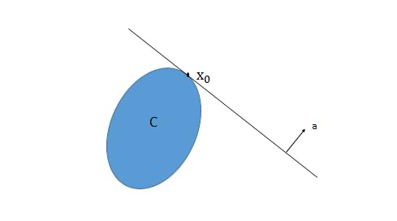

# 凸优化

## 凸集 | Convex Set

对于一个凸集 $C$ 

- $\lceil$ **数学定义** $\rfloor$: 

$$
\alpha x + (1 - \alpha) y \in C, ~~ \forall x, y \in C, \alpha \in [0, 1]
$$

> 也就是说，对于凸集 $C$ 中的任意两个点 $x, y$，它们的线性组合 $\alpha x + (1 - \alpha) y$ 也在 $C$ 中 (向量三点共线定理)

- $\lceil$ **几何意义** $\rfloor$: 
    - 将凸集想象成一个形状，凸集内任意两点的连线都在凸集内部

### 两个重要性质

> 对机器学习对分类问题，尤其是 SVM 等算法理论有重要支撑作用

1. $\lceil$ **Separating Hyperplane Theorem** $\rfloor$:
   
    - 两个不相交的凸集之间必然存在一个分割超平面使得两个凸集分别在超平面的两侧。
    - 即对非空凸集 $C_1$ 和 $C_2$， 且 $C_1 \cap C_2 = \emptyset$, 则必然存在 $a, b$， 使得
     
        $$
        \begin{matrix}
        a^T x \leq b, ~~ \forall x \in C_1 \\
        a^T x \geq b, ~~ \forall x \in C_2
        \end{matrix}
        $$

2. $\lceil$ **Supporting Hyperplane Theorem** $\rfloor$:
   
   - 凸集边界上的一点必然存在一个支撑超平面穿过该点
   - 即对非空凸集 $C$, $x_0$ 是 $C$ 的边界上的一点(即 $x_0 \in \text{bd}C$)，则必然存在 $a \ne 0$ 使得 $a^T x \leq a^T x_0, ~~ \forall x \in C$, 称 $\{x | a^Tx = a^Tx_0 \}$ 为在 $x_0$ 处 $C$ 的支撑超平面
   - 
   - 逆定理：若内部非空的闭集 $C$ 在它的边界上任意点都有支撑超平面，则 $C$ 是凸集

### Operations that preserve convexity

1. Intersection：凸集的交集是凸集
2. Scaling and translation: 如果 $C$ 是凸集，则 $\forall a, b$, $aC + b = \{ax + b | x \in C \}$ 是凸集
3. Affine images and preimages: 如果 $f(x) = Ax + b$，$C$ 和 $D$ 是凸集，那么 $f(C) = \{f(x) | x \in C \}$ 和 $f^{-1}(D) = \{x | f(x) \in D \}$ 都是凸集

> 2 和 3 的区别是：
> 
> - 2 仅对凸集做了尺度或平移变换
> - 3 中 $A$ 是矩阵，$b$ 是向量，$f$ 是仿射变换，即 $f(x) = Ax + b$，$f$ 既可以对凸集做尺度或平移变换，也可以对凸集做线性变换

## Epigraph

对于一个函数 $f(x)$ ，Epigraph 指的是函数 $f(x)$ 中或其上方的部分

> 例如 $f(x) = x^2$，则 Epigraph 为 $y \geq x^2$ 的部分

## 凸函数 | Convex Function

- 定义：定义在 $\mathbb{R}^n \rightarrow \mathbb{R}$ 上的函数 $f$ 是凸函数，当且仅当对于 $f$ 的定义域 $\mathbb{D}$ 是凸集且 $\forall x, y \in \mathbb{D}$ 和 $\forall \alpha \in [0, 1]$，有 $f(\alpha x + (1 - \alpha) y) \leq \alpha f(x) + (1 - \alpha) f(y)$ 成立

### 一阶充要条件

- 假设定义在 $\mathbb{R}^n \rightarrow \mathbb{R}$ 上的函数 $f$ 可微（即 $\forall x \in \mathbb{D}(f)$, 梯度 $\nabla f(x)$ 存在），则 $f$ 是凸函数当且仅当定义域是凸集且 $\forall x, y \in \mathbb{D}$，有 $f(y) \geq f(x) + \nabla f(x)^T (y - x)$ 成立
- 从几何意义讲，即定义域内所有函数值都大于等于该点的切线值 

### 二阶充要条件

记函数的一阶导数和二阶导数分别为 $g$ 和 $H$:

$$
g(x) = \nabla f(x) = 
\begin{bmatrix}
\frac{\partial f(x)}{\partial x_1} \\
\frac{\partial f(x)}{\partial x_2} \\
\vdots \\
\frac{\partial f(x)}{\partial x_n}
\end{bmatrix}
$$

$$
H(x) = \nabla^2 f(x) =
\begin{bmatrix}
\frac{\partial^2 f(x)}{\partial x_1^2} & \frac{\partial^2 f(x)}{\partial x_1 \partial x_2} & \cdots & \frac{\partial^2 f(x)}{\partial x_1 \partial x_n} \\
\frac{\partial^2 f(x)}{\partial x_2 \partial x_1} & \frac{\partial^2 f(x)}{\partial x_2^2} & \cdots & \frac{\partial^2 f(x)}{\partial x_2 \partial x_n} \\
\vdots & \vdots & \ddots & \vdots \\
\frac{\partial^2 f(x)}{\partial x_n \partial x_1} & \frac{\partial^2 f(x)}{\partial x_n \partial x_2} & \cdots & \frac{\partial^2 f(x)}{\partial x_n^2}
\end{bmatrix}
$$

假设定义在 $\mathbb{R}^n \rightarrow \mathbb{R}$ 上的函数 $f$ 二阶可微（即 $H(x)$ 存在），则 $f$ 是凸函数当且仅当定义域是凸集且 $\forall x \in \mathbb{D}$，有海森矩阵 $H(x) \succeq 0$ 成立 （$\succeq$ 表示半正定）

- 直观来讲：如果一个函数 $f$ 的 Epigraph 是凸集，则称 $f$ 是凸函数

> 如果函数 $f$ 的二阶导数大于等于 0（对于一维函数）或者海森矩阵是半正定的（对于多维函数），则该函数是凸函数

??? note "reference"
    - [CMU - Convex Optimization](https://www.stat.cmu.edu/~ryantibs/convexopt/)
    - [Convex Optimization(wrote by Boyd & Vandenberghe)](https://web.stanford.edu/~boyd/cvxbook/bv_cvxbook.pdf)

To Be Continued
