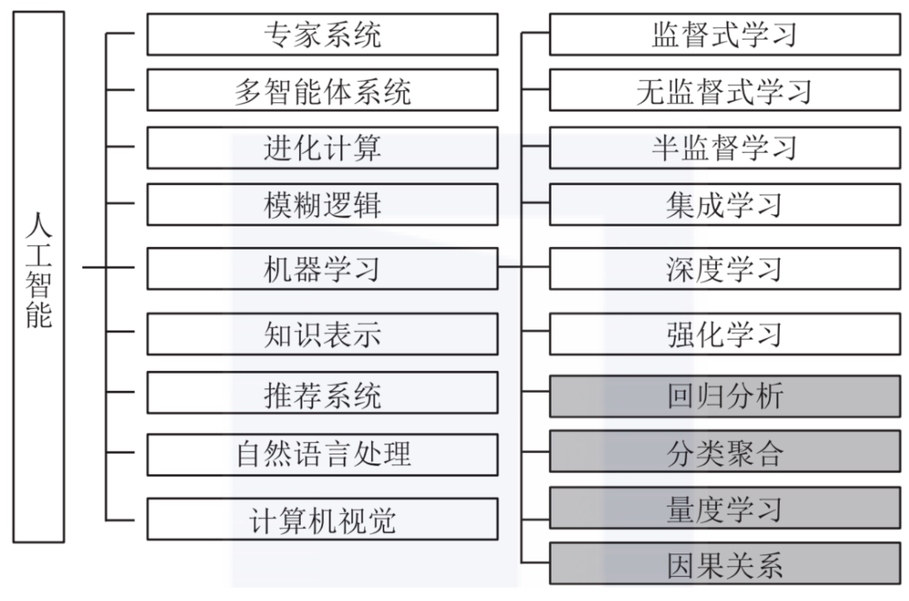
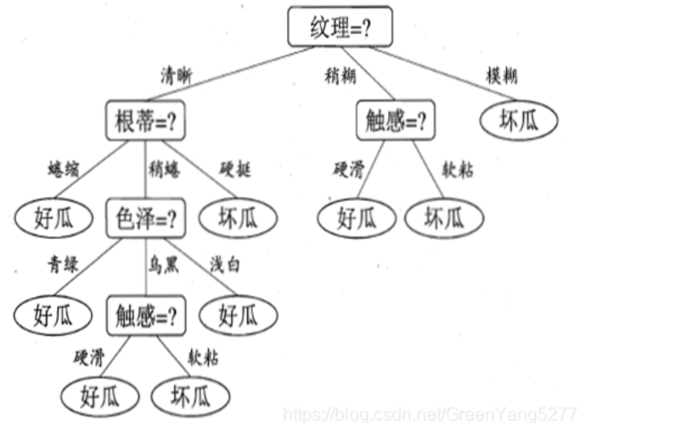
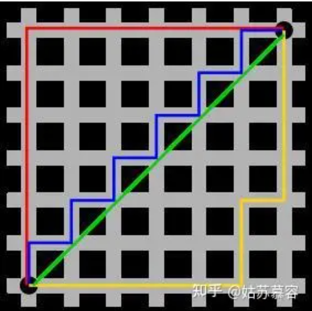

# 人工智能算法

## 人工智能，机器学习和深度学习的关系

- 人工智能是一个大的概念，包括了很多技术和方法。机器学习是人工智能的一个分支，是实现人工智能的一种方法。深度学习是机器学习的一种方法，是实现机器学习的一种方法。深度学习是一种特殊的机器学习方法，它使用深层神经网络模型来实现机器学习。
- 即深度学习 $\in$ 机器学习 $\in$ 人工智能

!!! tip 
    

    参考 https://blog.csdn.net/zw0Pi8G5C1x/article/details/123606179

- 机器学习：基于数据和算法，通过训练数据来调整模型参数，从而实现预测和分类等功能。常见的机器学习算法包括线性回归、决策树、支持向量机等。
- 深度学习：使用神经网络模型，通过反向传播算法和梯度下降优化技术来调整网络权重和参数。常见的深度学习模型包括卷积神经网络（CNN）、循环神经网络（RNN）、Transformer 等 

## 人工智能算法分类

### 机器学习算法

#### 线性回归 | Linear Regression

- 线性回归可能是最流行的机器学习算法。
- 线性回归就是要找一条直线，并且让这条直线尽可能地拟合散点图中的数据点。它试图通过将直线方程与该数据拟合来表示自变量（x 值）和数值结果（y 值）。然后就可以用这条线来预测未来的值！
- 这种算法最常用的技术是最小二乘法，它是一种统计技术，用于找到一条直线，使得所有数据点到直线的距离的平方和最小。

#### 逻辑回归 | Logistic Regression

- 逻辑回归是一种用于解决分类问题的机器学习算法，和线性回归类似，但逻辑回归的输出是一个概率值，用于表示某个样本属于某个类别的概率。
- 通过设定一个阈值，将概率值转换为类别标签，从而实现分类。

#### 决策树 | Decision Tree

- 决策树是一种树形结构的机器学习算法，它使用树形图来表示决策和决策结果。
- 决策树算法是一种监督学习算法，它可以用于分类和回归问题。
- 决策树算法的核心思想是通过对数据集进行多次划分，找到最佳的划分方式，从而构建一个树形结构，用于预测新的数据。

??? example
    

#### 朴素贝叶斯 | Naive Bayes

- 朴素贝叶斯是一种基于贝叶斯定理的机器学习算法，它是一种简单但有效的分类算法。

!!! def "贝叶斯定理"
    贝叶斯定理是关于随机事件 A 和 B 的条件概率的一则定理。贝叶斯定 理的数学表达式如下：

    $$P(A|B) = \frac{P(B|A)P(A)}{P(B)}$$

    - 其中，$P(A|B)$ 是在事件 B 发生的条件下事件 A 发生的概率。
    - 这里约定：
        - $P(A)$ 是事件 A 的先验概率，称为“先验”是因为它是在考虑任何 B 的情况下就已经存在的概率。
        - $P(A|B)$ 是已知 B 发生后 A 的条件概率，也由于得自 B 的取值而被称作 A 的后验概率。
        - $P(B|A)$ 是已知 A 发生后 B 的条件概率，也由于得自 A 的取值而被称作 B 的后验概率。
        - $P(B)$ 是 B 的先验概率，也作标淮化常量（normalizing constant）
    - 因此，贝叶斯定理也可以表述为：

    $$\text{后验概率 = \frac{(相似度 * 先验概率)}{标淮化常量}}$$

    - 即，后验概率与先验概率和相似度的乘积成正比

    ??? info
        - 通常，事件 A 在事件 B 发生的条件下的概率，与事件 B 在事件 A 发生的条件下的概率是不一样的；然而，这两者是有确定关系的，贝叶斯定理就是这种关系的陈述。
        - 通俗地讲就是当你不能确定某一个事件发生的概率时，你可以依靠与该事件本质属性相关的事件发生的概率去推测该事件发生的概率。用数学语言表达就是：支持某项属性的事件发生得愈多，则该事件发生的的可能性就愈大。这个推理过程有时候也叫贝叶斯推理。

#### 支持向量机 | SVM

- 支持向量机（support vector machines, SVM）是一种二分类模型，它的基本模型是定义在特征空间上的间隔最大的线性分类器，间隔最大使它有别于感知机；
- SVM 的的学习策略就是间隔最大化，可形式化为一个求解凸二次规划的问题，也等价于正则化的合页损失函数的最小化问题。

TODO

#### K-最近邻算法 | K-Nearest Neighbors

- KNN 通过在整个训练集中搜索 K 个最相似的实例，即 K 个邻居，并为所有这些 K 个实例分配一个公共输出变量，来对对象进行分类。
- K 的选择很关键：较小的值可能会得到大量的噪声和不准确的结果，而较大的值是不可行的。它最常用于分类，但也适用于回归问题。
- 用于评估实例之间相似性的距离可以是欧几里得距离（Euclidean distance）或曼哈顿距离（Manhattan distance）等。

??? quote
    https://blog.csdn.net/m0_74405427/article/details/133714384

??? info "欧几里得 / 曼哈顿距离"
    - 欧几里得距离：两点之间的直线距离，即两点之间的最短距离。
    - 曼哈顿距离：两点之间的曼哈顿距离是指沿着网格线走到目的地的距离，即两点在各个坐标轴上的距离之和。

    

    - 图1中红线代表曼哈顿距离，绿色代表欧氏距离，也就是直线距离，而蓝色和黄色代表等价的曼哈顿距离。

#### K-均值聚类 | K-Means Clustering

- K-均值（K-means）是通过对数据集进行分类来聚类的。例如，这个算法可用于根据购买历史将用户分组。它在数据集中找到 K 个聚类。K- 均值用于无监督学习，因此，我们只需使用训练数据 X，以及我们想要识别的聚类数量 K。
- 该算法根据每个数据点的特征，将每个数据点迭代地分配给 K 个组中的一个组。它为每个 K- 聚类（称为质心）选择 K 个点。基于相似度，将新的数据点添加到具有最近质心的聚类中。这个过程一直持续到质心停止变化为止。

TODO

#### 随机森林 | Random Forest

!!! attention
    [点击跳转](./randomForest.md)

