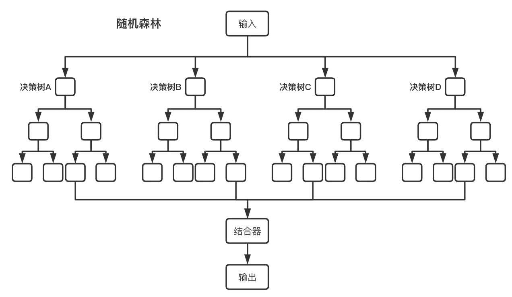

# 随机森林 | Random Forest

!!! abstract "简介"
    - 基于决策树的集成学习算法
    - 基本思想是，许多人的意见要比个人的意见更准确。

## 集成学习

- 集成学习通俗讲就是通过训练学习出多个 **判别器**，然后将这些判别器的结果进行整合，以此来提高整体的预测准确率。
- 优势是提升了模型的泛化能力，比单个模型的预测效果更好；能方便进行并行化处理，提高了训练速度。

## Bagging 算法

Bagging 算法是一种集成学习算法，全称为自助聚集算法（Bootstrap Aggregating）。

!!! note "算法步骤"
    1. 假设训练数据集大小为 N, 每次从训练数据集中随机 **有放回** 抽取 M 个样本组成子数据集，一共抽 K 次
    2. 根据第一步构成的 K 个子数据集，分别训练出 K 个模型
    3. 但需要做预测的时候，使用这 K 个模型预测，再通过平均值或多数分类的方式得到预测结果

## 随机森林算法

- 可以理解随机森林算法是以决策树为判别器的 Bagging 算法。
- 将多个决策树结合在一起，每次数据集是随机有放回的选出，同时 **随机选出部分特征** 作为输入，所以该算法被称为随机森林算法。



> 图片来自 https://blog.csdn.net/sai_simon/article/details/123082619

!!! note "算法步骤"
    假设训练集 T 的大小为 N ，特征数目为 M ，随机森林的大小为 K

    ```
    遍历随机森林的大小 K 次：
      1. 从训练集 T 中有放回抽样的方式，取样N 次形成一个新子训练集 D
      2. 随机选择 m 个特征，其中 m < M
      3. 使用新的训练集 D 和 m 个特征，学习出一个完整的决策树
    得到随机森林
    ```