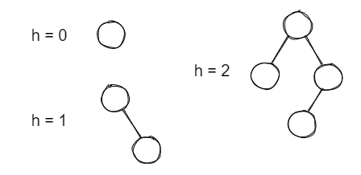
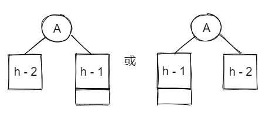
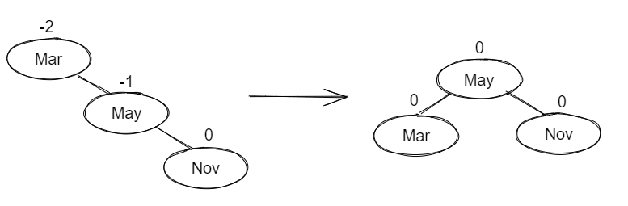
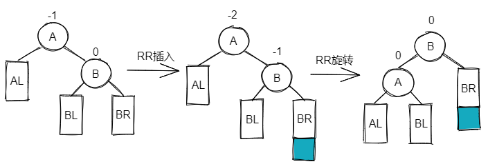
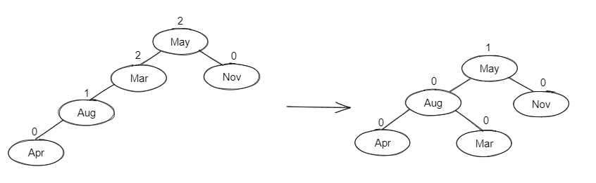
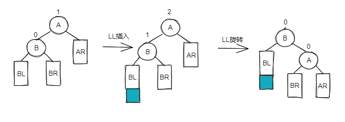
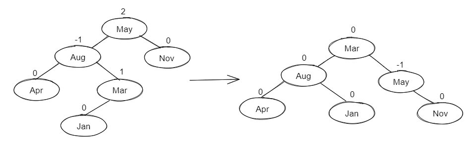
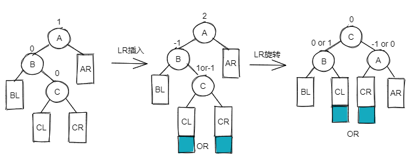
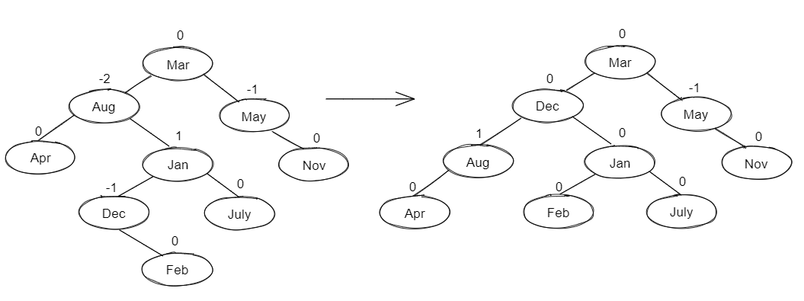
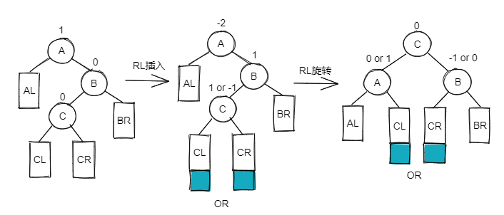

# AVL Trees

> Adelson-Velskii-Landis (AVL) Trees (1962)

!!! note "Definitions"
    * An empty binary tree is height balanced. If $T$ is a nonempty binary tree with $T_L$ and $T_R$ as its left and right subtrees, then $T$ is height balanced if
        1. $T_L$ and $T_R$ are height balanced, and
        2. $| h_L - h_R | \le 1$ where $h_L$ and $h_R$ are heights of $T_L$ and $T_R$ 
    * The balanced factor $BF$ (node) = $h_L - h_R$. In an AVL tree, $BF$ (node) = -1, 0, or 1

## Maximum Height

* Let $n_h$ be the minimum number of nodes in a balanced binary tree with height $h$
    * 结点数最小时: 
    
    * In genernal ( $n_h = n_{h-1} + n_{h-2} + 1$ ): 
    
        * Cause Fibonacci sequence: $F_0 = 1, ~ F_1 = 1, ~ F_i = F_{i-1} + F_{i-2}$ for $i > 1$
        * $n_h = n_{h-1} + n_{h-2} + 1 ~~ \Rightarrow ~~ n_h = F_{h+2} - 1 (h \ge 0)$ 
        * $F_i ~ \approx ~ \frac{1}{\sqrt{5}} ( \frac{1+\sqrt{5}}{2} )^i ~~ \Rightarrow ~~ n_h ~ \approx ~ \frac{1}{\sqrt{5}} ( \frac{1+\sqrt{5}}{2} )^{h+2} - 1 ~~ \Rightarrow ~~ h = O(log ~ n_h)$ 
        * $n \ge n_h ~~ \Rightarrow ~~ h = O(log ~ n)$ 

## Rotation

### RR

> Single Rotation

??? example "依次插入 Mar, May, Nov"
    
    不平衡的 "发现者" 是 Mar, “麻烦结点” Nov 在发现者的右子树的右边，因而叫 “RR 插入”，需要 "RR 旋转" 即右单旋

### LL

> Single Rotation

??? example "再依次插入 Aug, Apr"
    
    "发现者" 是 Mar, “麻烦结点” Apr 在发现者的左子树的左边，因而叫 “LL 插入”，需要 "LL 旋转" 即左单旋

### LR

> Double Rotation

??? example "再插入 Jan"
    
    "发现者" 是 May, “麻烦结点” Jan 在发现者的左子树的右边，因而叫 “LR 插入”，需要 "LR 旋转"

### RL

> Double Rotation

??? example "再插入 Dec, July, Feb"
    
    "发现者" 是 Aug, “麻烦结点” Feb 在发现者的右子树的左边，因而叫 “RL 插入”，需要 "RL 旋转"

