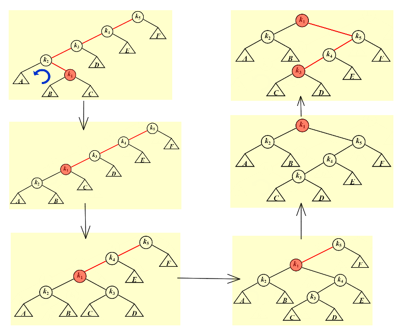
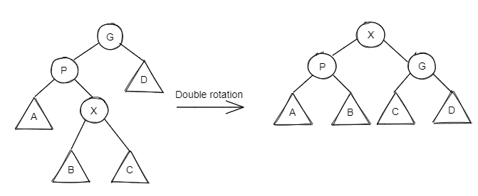
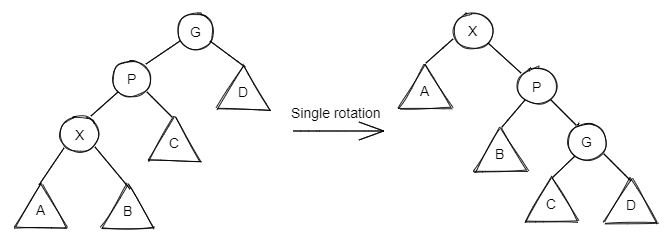
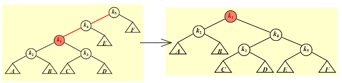
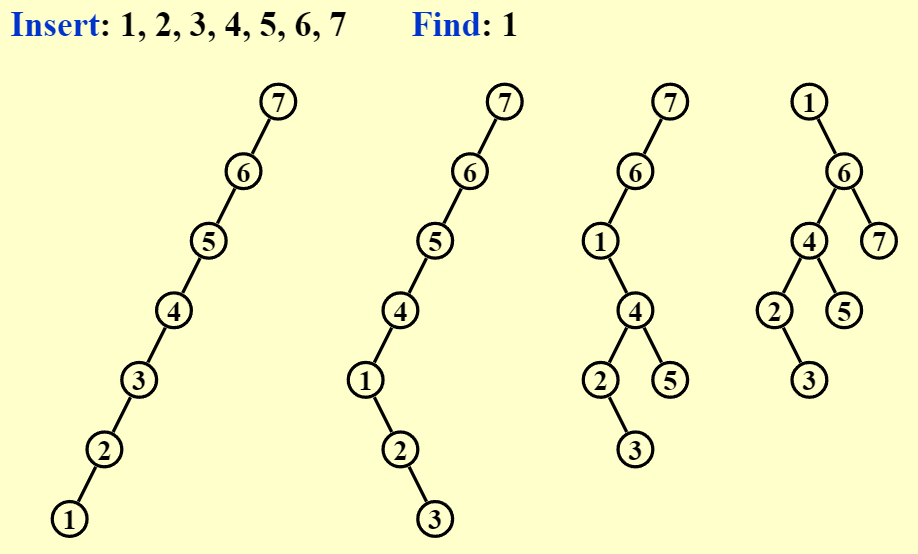
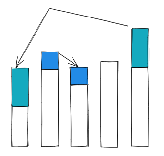
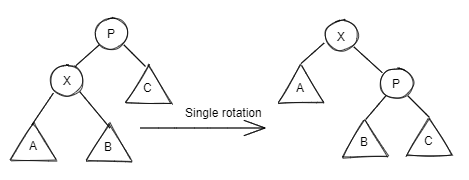

# Splay Trees & Amortized Analysis

## Splay Trees | 伸展树

!!! abstract "Splay Tree - Definition"
    A relatively simple date structure, known as splay tree, that guarantees that any m consecutive tree operations take at most $O(Mlog~N)$ time.

    > It means that the <u>amortized</u> time is $O(log~N)$ 
    > Any simgle operation might take $O(N)$ time

### Find

* 伸展树的核心想法是: 一个节点被访问后，通过一系列 AVL Tree 的旋转方法将它转至根节点
* 尝试单旋:
    * 
    * 发现 K~3~ 沉到了更底部
* 给出新的旋转方法: 
    > For any nonroot node X, denote its parent by P and grandparent by G: 
    * Case 1: P is the root ——> Rotate X and P
    * Case 2: P is not the root 
        * Zig-zag:
            
        * Zig-zig:
            

        > 第一个为 LR， 第二个为两次 LL
* 那么对于开始的图形，使用 Splay 得到
    
    
    > Splaying not only moves the accessed node to the root, but also roughly halves the depth of most nodes on the path.

??? example "举个栗子"
    

### Deletions

* Step 1: Find X (X will be at the root)
* Step 2: Remove X (There will be two subtrees $T_L$ and $T_R$ )
* Step 3: FindMax( $T_L$ ) (The largest element will be the root of $T_L$ , and has no right child)
* Step 4: Make $T_R$ the right child of the root of $T_L$ 
 
## Amortized Analysis | 摊还分析

??? abstract
    Almost the most difficult question in ADS

* worst-case bound $\ge$ amortized bound $\ge$ average-case bound
* 分析方法: 
    * Aggregate analysis | 聚合分析
    * Accounting method | 核算法
    * Potential method | 势能方法 (Highest-level)

### Aggregate Analysis

Show that for all n, a sequence of n operations takes *worst-case* time $T(n)$ in total. In the worst case, the average cost, or *amortized cost* per operation is $\frac{T(n)}{n}$ 

??? example "Stack with MultiPop(int k, Stack S)"
    ```c
    Algorithm{
        while(!IsEmpty(S) $$ k > 0)
        {
            Pop(S);
            k --;
        }
    }
    ```
    * Consider a sequence of $n$ Push, Pop, and MultiPop operations on an initially empty stack. (sizeof(S) $\le n$ )
        * $n$ 次操作, push 的操作 $\le n$ (pop 必须要有 push), 最多的费用 $\approx 2n-2$
        * $T_{amortized} ~ = ~ O(n) / n ~ = ~ O(1)$

### Accounting Method

* When an operation’s *amortized cost* $\hat{c_i}$ exceeds its *actual cost* $c_i$ , we assign the difference to specific objects in the data structure as *credit* (namely $\Delta _i$). Credit can help *pay* for later operations whose amortized cost is less than their actual cost.
* "劫富济贫"，将时间划分

??? example "柱状图表示各情况的时间费用"
    

* $\frac{\sum \hat{c_i}}{n} ~ = \frac{\sum c_i}{n} + \frac{\sum \Delta _i}{n} ~ \le ~ A$ 
* 若希望 $\frac{\sum \hat{c_i}}{n} \le A$ (A 为某个数值)， 虽然 $\Delta _i$ 取值都有可能，但如果 $\frac{\sum \Delta _i}{n} \ge 0$ .
* 此时如果可以证明 $\frac{max \sum \hat{c_i}}{n} \le A ~ \approx ~ \frac{\sum c_i}{n} \le A$ (其实就等价于计算最大的摊还费用 $\le A$ , 即 *worst-case* 下费用 $\le A$ )

??? example "Stack with MultiPop(int k, Stack S)"
    * $c_i$ for Push: 1; Pop: 1; MultiPop: min(sizeof(S), k)
    * $\hat{c_i}$ for Push: 2; Pop: 0; MultiPop: 0
     
    Starting from an empty stack —— *Credits* for
    * Push: +1; Pop: -1; MultiPop: -1 for each +1 ( $\sum Credits \ge 0$ )
    * sizeof(S) $\ge 0 ~~ \Rightarrow ~~ Credits \ge 0$
    * $\Rightarrow ~~ O(n) = \sum\limits_{i=1}^n \hat{c_i} \ge \sum\limits_{i=1}^n c_i$ 
    * $\Rightarrow ~~ T_{amortized} = O(n)/n = O(1)$

### Potential Method

* Take a closer look at the *credit* —— $\hat{c_i} - c_i = Credit = \Phi(D_i) - \Phi(D_{i-1})$ ( $\Phi \rightarrow Potential ~ function$  )
* $\sum\limits_{i=1}^n \hat{c_i} = \sum\limits_{i=1}^n (c_i + \Phi (D_i) - \Phi (D_{i-1})) = (\sum\limits_{i=1}^n c_i) + \Phi (D_n) - \Phi (D_0)$
* 其中, $\Phi (D_n) - \Phi (D_0) \ge 0$ (我们希望做到 $\Phi (D_0) = 0  ~,~ \Phi(D_n) \ge 0$ , $\Phi(D_0)$ 是常数也没有问题)
* In general, a good potential function should always assume its minimum at the start of the sequence

??? example "Stack with MultiPop(int k, Stack S)"
    * $D_i$ = the stack that results after the *i* -th operation 
    * $\Phi (D_i)$ = the number of objects in the stack $D_i$
            * $\Phi (D_i) \ge 0 = \Phi (D_0)$
        * Push: $\Phi (D_i) - \Phi (D_{i-1}) = (sizeof(S) + 1) - sizeof(S) = 1$
            * $\hat{c_i} = c_i + \Phi (D_i) - \Phi (D_{i-1}) = 1 + 1 = 2$
        * Pop: $\Phi (D_i) - \Phi (D_{i-1}) = (sizeof(S) - 1) - sizeof(S) = -1$
            * $\hat{c_i} = c_i + \Phi (D_i) - \Phi (D_{i-1}) = 1 - 1 = 0$
        * MultiPop: $\Phi (D_i) - \Phi (D_{i-1}) = (sizeof(S) - k' ) - sizeof(S) = -k'$
            * $\hat{c_i} = c_i + \Phi (D_i) - \Phi (D_{i-1}) = k' - k' = 0$
    * $\sum\limits_{i=1}^n \hat{c_i} = \sum\limits_{i=1}^n O(1) = O(n) \ge (\sum\limits_{i=1}^n c_i) ~~ \Rightarrow ~~ T_{amortized} = O(n)/n = O(1)$

[example] : Splay Trees: $T_{amortized} = O(log N)$ 
* $D_i$ = the root of the resulting tree
* $\Phi(D_i)$ : must increase by at most $O(log N)$ over $n$ steps, AND will also cancel out the number of rotations (zig: 1; zig-zag: 2; zig-zig: 2)
* $\Phi(T) = \sum\limits_{i \in T} log~S(i)$ where $S(i)$ is the number of descendants of $i$ ( $i$ itself included)

> $T$ 即 $D(i)$ , $log~S(i) called <u>Rank</u> of the subtree \approx Height of the tree$ 
`
* $\Phi(T) = \sum\limits_{i \in T} Rank(i)$ 
    * Zig: <br>
        * $\hat{c_i} = 1 + R_2(X) - R_1(X) + R_2(P) - R_1(P)$
        * $\le 1 + R_2(X) - R_1(X)$ ( $R_2(X)$ 表示旋转后的这个点的秩函数)
    * Zig-zag: <br>
        * $\hat{c_i} = 2 + R_2(X) - R_1(X) + R_2(P) - R_1(P) + R_2(G) - R_1(G)$
        * $\le 2(R_2(X) - R_1(X))$ 
        > $(a+b)^2 \ge 4ab ~~ \Rightarrow ~~ 2log~(a+b) \ge 2 + log~a + log~b$ 
    * Zig-zig: <br>
        * $\hat{c_i} = 2 + R_2(X) - R_1(X) + R_2(P) - R_1(P) + R_2(G) - R_1(G)$
        * $\le 3(R_2(X) - R_1(X))$ 
* [Theorem] : The amortized time to splay a tree with root $T$ at node $X$ is at most $3(R(T) - R(X)) + 1 = O(log~N)$ 

