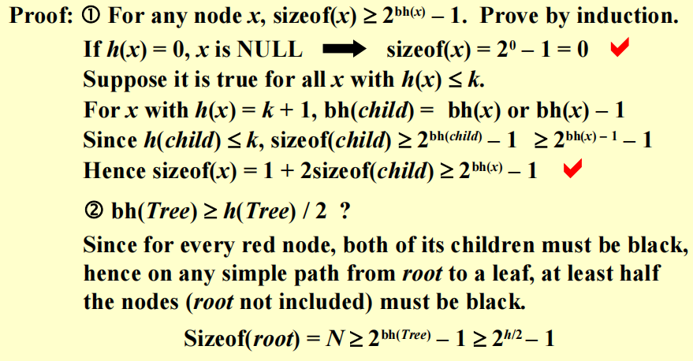
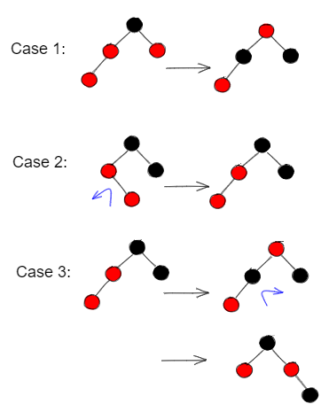
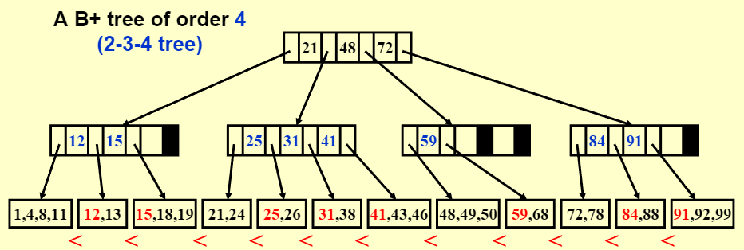

# Red-Black & B+

## Red-Black Tree

!!! note "[Definition]"
    * A red-black tree is a binary search tree that satifies the following red-black properties;
        1. Every node is either red or black
        2. The root is black
        3. Every leaf (NIL) is black (红黑树的叶结点是 N+ULL 指针)
        4. If a node is red, then both its children are black
        5. For each node, all simple paths from the node to descendant leaves contain the same number of black nodes

### Black-height

* [Definition] : The black-height (黑高) of any node x, denoted by bh(x), is the number of black nodes on any simple path from x (x not included) down to a leaf, bh(Tree) = bh(root)
* [Lemma] : A red-black tree with N internal nodes has height at most 2ln(N + 1)

    ??? info "Proof"
        

### Insert

> can be done iteratively

* Sketch of the idea: <u>Insert & color red</u>

* $T = O(h) = O(lnN)$ 

### Delete

* Delete a leaf node : Reset its parent link to NIL
* Delete a degree 1 node : Replace the node by its single child
* Delete a degree 2 node :
    * Replace the node by the largest one in its left subtree or the smallest one in its right subtree
    * Delete the replacing node from the subtree

### AVL & R-B - Rotation

<table>
    <tr>
        <th colspan="3" align="center"> Number of rotations</th>
    </tr>
    <tr>
        <th> </th>
        <th>AVL</th>
        <th>Red-Black</th>
    </tr>
    <tr>
        <th>Insertion</th>
        <th> <= 2</th>
        <th> <= 2</th>
    </tr>
        <th>Deletion</th>
        <th> O(logN) </th>
        <th> <= 3</th>
    </tr>
</table>

## B+ Tree

!!! note "Definition"
    A B+ tree of order M is a tree with the following structural properties:
    
    1. The root is either a leaf or has between 2 and M children
    2. All nonleaf nodes (except the root) have between $\lceil$ M/2 $\rceil$ and M children
    3. All leaves are at the same depth

    > Assume each nonroot leaf also has between $\lceil$ M/2 $\rceil$ and M children

* [Example] : A B++ tree of order 4 —— (2-3-4 tree)



* All the actual data stored at the leaves
* Each interior node contains M pointers th the children (空余的指针指向 NULL)
* And M-1 smallest key values in the subtrees except the 1^st^ one

!!! success "For a general B+ tree of order M"
    ```c
    Btree Insert(ElementType X, Btree T)
    {
        Search from root leaf for X and find the proper leaf node;
        Insert X;
        while(this node has M+1 keys)
        {
            split it into 2 nodes with ···
            if(this node is the root)
                create a new root with two children;
            check its parent;
        }
    }
    ```

    > "split it into 2 nodes with $\lceil$ (M+1)/2 $\rceil$ and $\lfloor$ (M+1)/2 $\rfloor$ keys, respectively;"

    * $T(M, N) = O((M/log M)logN)$ 
    * $Depth(M, N) = O(\lceil log_{\lceil M/2 \rceil} N \rceil)$
    * $T_{Find}(M, N) = O(log~N)$ 

    > The best choice of M is 3 or 4