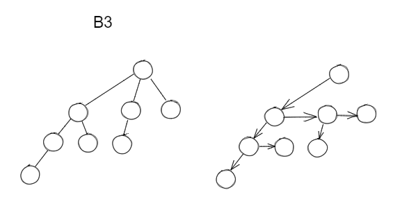

# Heap | 堆

## Leftist Heaps | 左倾堆

* [ Definition of Npl ] : The **null path length** , Npl(X), of any node X is the length of the shortest path from X to a node without two children. Define Npl(NULL) = -1. 
    * [ Note ] : Npl(X)=min{Npl(C)+1, for all C as children of X}
* [ Definition of leftist heap ] : The **leftist heap property** is that for every node X in the heap, the null path length of the **left** child is **at least as large as** that of the **right** child.
* [ Theorem ] : A leftlist tree with r nodes on the right path must have at least 2^r^ - 1 nodes.
    * [ Note ] : The leftist tree of N nodes has a right path containing at most $\lfloor \log_2{N+1} \rfloor$ nodes.
* For any node u in a Leftist heap, the right descendant path (指一直向右) from u to NULL must be (one of) the shortest path from u to NULL.
* Insertion(merge)
    * Merge(H1->Right, H2)
    * Attach(H2, H1->Right)
    * Swap(H1->Right, H1->Left) if necessary

    ??? example "Merge(recursive)"
        
        

    ??? example "Merge(iterative)"
        

* decreasekey (假如修改节点 u 的键值)
    * 将 u 和其子树取出，然后修复原树，将 u (新树的根节点) 删除，然后再插入
    * merge 修复的树和删除根节点后的树
* Time Complexity
    * $T_p = O(\log{N})$ 

## Skew Heaps | 斜堆

> a simple version of the leftist heaps

* Any M consecutive operations take at most $O(M\log{N})$ time
* Merge
    * **Always swap** the left and right children except that the largest of all the nodes on the right paths does not have its children swapped. No Npl.

!!! note 
    Skew heaps have the advantage that no extra space is required to maintaion path lengths and no tests are required to determine when to swap children.

### Amortized Analysis

* [ heavy node ] : A node p is heavy if the number of descendants of p's right subtree is at least half of the number of descendants of p, and light otherwise.

#### Amortized Analysis

Proof
$T_{\rm amortized}=O(\log{N})$
Let
$\Phi(D_i)=\rm number \ of\ heavy\ node$
Thus

$$
\begin{aligned}
&\Phi_i = h_1+h_2+h\\
&\Phi_{i+1} \le l_1+l_2+h(\rm all \ the\ h_i\ will\ change\ into\ l_i)\\
\end{aligned}
$$

$$
\begin{aligned}
T_{\rm amoritized} &= T_{\rm worst}+\Phi_{i+1}-\Phi_{i}\\
&=(l_1+l_2+h_1+h_2) + \Phi_{i+1}-\Phi_{i}\\
&\le 2(l_1+l_2)
\end{aligned}
$$

light nodes along the right path: $l=O(\log{N})\to T_{\rm amortized}=O(\log{N})$

## Binomial Queue | 二项队列

> A binomial queue is not a heap-ordered binary tree, but rather a collection of heap-ordered binary trees, known as a forest. Each heap-ordered tree is a binomial tree.

### binomial tree

* A binomial tree of height 0 is a one-node tree
* A binomial tree, $B_k$ , of height $k$ is formed by attaching a binomial tree ( $B_{k-1}$ ) to the root of another binomial tree ( $B_{k-1}$ ) (由两棵 $B_{k-1}$ binomial tree 构成)


??? info "Observation"
    $B_k$ consists of a root with $k$ children, which are $B_0, ~ B_1, ~ ··· ~, ~ B_{k-1}$. $B_k$ has exactly $2^k$ nodes. The number of nodes at depth $d$ is $\begin{pmatrix} k \\d \end{pmatrix}$ (binomial coefficient)
    
    ??? success "Proof - induction"
        * base case: $k=0$ --- true
        * assume true for $B_k$ , the number of nodes at depth $d$ is $\begin{pmatrix} k \\d \end{pmatrix}$
        * For $B_{k+1}$, the number of nodes at depth $d$ is $\begin{pmatrix} k \\d \end{pmatrix} + \begin{pmatrix} k \\d-1 \end{pmatrix}$ = $\begin{pmatrix} k+1 \\d \end{pmatrix}$

### Binomial heap

* A binomial heap is a forest of binomial trees
    * every tree in the forest is a binomial tree with distinct heights
    * each tree in the forest is heap-ordered

> * 给定节点数的 binomial heap 结构是唯一的，对应二进制编码，如有 6 (3'b110)个节点, 则其由 $B_1$ 和 $B_2$ 构成
> * 有 n 个节点的 binomial heap , 有 $\le \lfloor \log_2{n} \rfloor$ 个 binomial tree (每棵树的高度 $\le \lfloor \log_2{n} \rfloor$ ) (because $B_k$ 的最大高度是 $k$, 那么最多到 $B_{log_2n}$, 故最大高度为 $\lfloor \log_2{n} \rfloor$ )

### Operations

* Merge
    * 即比较两棵 binomial tree 的根节点的键值, 将较小的作为根节点, 将较大的作为子节点（针对最小堆排序）
    * 如果有超过两棵，随机选择两棵合并即可
    * 
* Insertion
    * 创建一个只有要插入 key 的 binomial tree ( $B_0$ )
    * 检查是否有两棵高度相同的 binomial tree, 如果有, 则合并
* DeleteMin
    * 
* DecreaseKey
    * 比如给定一个节点的指针 x ，要求将其的值降到 t (decresasekey(x, t))
    * 因为堆里面也是满足最小堆 (举例)，那么直接将 x 的值降到 t, 之后上浮即可
    * 时间复杂度为树的高度，即 $O(\log{n})$
* Deleteion
    * 要删除某个节点，直接将该节点键值减小到很小然后删除最小即可 -> decreasekey(x, -∞) + deletemin()
* makeheap
    * 从一个空的 binomial heap 开始，做 n 次 insertion 即可 --- $O(n\log{n})$ (not tight)
    * 实际上，从空堆开始，n 次连续的 insertion 操作总共只需要 $O(n)$ 时间

    ??? success "proof"
        * proof1 (均摊)
            * $B_0$ 和 $B_1$ 合并最多 n/2 次 (因为两个才合并一次)
            * 同理，$B_1$ 和 $B_2$ 合并最多 n/4 次 ···
            * n 次连续 insertion 消耗的时间为 $O(\#combine) = O(\frac{n}{2}+\frac{n}{4}+···+\frac{n}{2^{log_2~n}}) = O(n)$ (#combine 表示 number of combines)
        * proof2 (势函数)
            * $\Phi(H)$ = number of trees in H; $\Phi(empty)$ = 0; $\Phi(H) \ge$ 0
            * 每次 insertion
                * actual cost = 1 + #combines 
                * $\Delta\Phi$ = 1 - #combines (先加一个 $B_0$ , 每次合并减一，共减 #combines)
                * amortized cost = 2
            * n 次就是 2n --- $O(n)$

* 在实际实现中，常采用链表的形式来存储 binomial tree
    * 
    * 也叫做 left-child-next-sibling representation (LCNS)

??? example "pseudo-code"
    * 
    * 
    * 
    * 

??? example "code"
    ```c
    #include <stdio.h>
    #include<stdlib.h>          //二项队列支持合并，插入，删除最小值等操作，且每次操作最坏花费log N
                                //二项队列不是一个堆序，而是一群堆序的集合
    #define Infinity 10000

    #define MaxTrees  14            //Capacity size  2^14 - 1
    #define Capacity  16383

    typedef int ElementType;
    typedef struct BinNode *Position;                   //二项树节点
    typedef struct BinNode *BinTree;
    typedef struct Collection *BinQueue;                // 二项队列

    BinTree CombineTrees(BinTree T1,BinTree T2);        //合并二项树
    BinQueue Merge(BinQueue H1,BinQueue H2);            //合并二项队列，二项队列即森林，二项树的集合
    ElementType DeleteMin(BinQueue H);                  //删除二项队列中最小值
    int IsEmpty(BinQueue H);                            //判空
    int IsFull( BinQueue H );                           //判满
    BinQueue Initialize(void);                          //初始化二项队列
    static void DestroyTree( BinTree T );               //销毁二项树
    void Destroy( BinQueue H );                         //销毁二项队列
    BinQueue MakeEmpty( BinQueue H );                   //清空二项队列
    ElementType FindMin( BinQueue H );                  //找到二项队列中最小值
    BinQueue Insert( ElementType Item, BinQueue H );    //插入

    int main(void)
    {
        BinQueue H;

        H = Initialize();
        H = Insert(44,H);
        H = Insert(46,H);

        printf("%d",FindMin(H));

        printf("\nHello World!\n");

        return 0;
    }

    struct BinNode                              //二项树节点
    {
        ElementType Element;
        Position LeftChild;
        Position NextSibling;
    };

    struct Collection                           //二项队列
    {
        int CurrentSize;

        BinTree TheTrees[MaxTrees];             //二项队列的长度为MaxTrees
    };

    BinTree CombineTrees(BinTree T1,BinTree T2)  //合并T1,T2两个二项树
    {
        if(T1->Element > T2->Element)
            return CombineTrees(T2,T1);         //当T1的值小于T2的值时
        T2->NextSibling = T1->LeftChild;        //T1的右兄弟指向T2的左儿子，刚开始T1的右兄弟指向无意义点
        T1->LeftChild = T2;                     //T1的左儿子指向T2
        return T1;
    }

    BinQueue Merge(BinQueue H1,BinQueue H2)                 //合并两个二项队列
    {
        BinTree T1,T2,Carry = NULL;                         //Carry 存放上一步得来的树，可能是NULL
        int i,j;

        if(H1->CurrentSize + H2->CurrentSize >Capacity)
        printf("Merge Would Excead Capacity\n");

        H1->CurrentSize += H2->CurrentSize;                 //H1的当前大小为H1 加上 H2
        for( i = 0,j = 1; j <= H1->CurrentSize;i++,j *= 2 ) //利用j是因为当前H1的大小已经加上了H2 的大小
        {                                                   //因为二项队列中元素 按2 4 8 16 32 递增所以*2
            T1 = H1->TheTrees[i];
            T2 = H2->TheTrees[i];

            switch (!!T1 + 2 * !!T2 + 4 * !!Carry)     // !! 两个逻辑运算符，只有 1 or 0 两种结果
            {                                           //例 !!2 = 1, !!5 = 1,!!0 = 0
            case 0:                             //NO tree

            case 1:                             //only H1
                break;
            case 2:                             //only H2
                H1->TheTrees[i] = T2;
                H2->TheTrees[i] = NULL;
                break;
            case 4:                             //only Carry*
                H1->TheTrees[i] = Carry;
                Carry = NULL;
                break;
            case 3:                                     //H1 and H2
                Carry = CombineTrees(T1,T2);
                H1->TheTrees[i] = H2->TheTrees[i] = NULL;
                break;
            case 5:                                     //H1 and Carry*
                Carry = CombineTrees(T1,Carry);
                H1->TheTrees[i] = NULL;
                break;
            case 6:                                     //H2 and Carry*
                Carry = CombineTrees(T2,Carry);
                H2->TheTrees[i] = NULL;
                break;
            case 7:                                     // all trees
                H1->TheTrees[i] = Carry;
                Carry = CombineTrees(T1,T2);
                H2->TheTrees[i] = NULL;
                break;
            }
        }

    //  free(H2);

        return H1;
    }

    ElementType DeleteMin(BinQueue H)                   //删除最小值
    {

        int i,j;
        int MinTree;
        BinQueue DeletedQueue;
        Position DeletedTree,OldRoot;
        ElementType MinItem;

        if(IsEmpty(H))
        {
            printf("Empty Binomial Queue\n");
            return -Infinity;
        }

        MinItem = Infinity;
        for( i = 0; i < MaxTrees;i++)                   //遍历整个二项队列，找到具有最小值的二项树
        {
            if(H->TheTrees[i] &&
                    H->TheTrees[i]->Element < MinItem)
            {
                MinItem = H->TheTrees[i]->Element;      //最小值为 MinItem
                MinTree = i;                            //具有最小值的二项树为H->TheTrees[Mintree]
            }
        }

        DeletedTree = H->TheTrees[MinTree];         //DeletedTree and OldRoot 设为具有最小值的二项队列
        OldRoot = DeletedTree;
        DeletedTree = DeletedTree->LeftChild;           //保留最小二项树中最小节点的左孩子，右兄弟为NULL
        free(OldRoot);                                  //删除最小二项树中最小值的节点

        DeletedQueue = Initialize();                        //初始化一个二项队列DeletedQueue
                                                    //初始化该二项队列的大小为，因为删除了头节点，所以-1
        DeletedQueue->CurrentSize = (1 <<  MinTree) - 1;
        for( j = MinTree - 1; j >= 0 ; j-- )             //从该二项树前一个开始
        {                                                //将这个二项树分解为一个二项队列
            DeletedQueue->TheTrees[j] = DeletedTree;
            DeletedTree = DeletedTree->NextSibling;
            DeletedQueue->TheTrees[j]->NextSibling = NULL; //二项队列的二项树的第一个右兄弟为NULL
        }

        H->TheTrees[MinTree] = NULL;
        H->CurrentSize -= DeletedQueue->CurrentSize + 1; //减去DeletedQueue->Cur 是因为下一步合并是要加上

        Merge(H,DeletedQueue);                          //合并

        return MinItem;                                 //返回删除的最小值
    }

    int IsEmpty( BinQueue H )                               //判空
    {
        return H->CurrentSize == 0;                         //判断当前大小是否等于0
    }

    int IsFull( BinQueue H )                                //判满
    {                                                       //判断当前大小是否等于最大值
        return H->CurrentSize == Capacity;
    }

    BinQueue Initialize(void)                                   //初始化
    {
        BinQueue H;
        int i;
        H = (BinQueue)malloc(sizeof(struct Collection));    //为二项队列分配空间，包括其中二项树的空间
        if(NULL == H)
            printf("Out Of Space\n");
        H->CurrentSize = 0;                                 //当前大小为0

        for( i = 0; i < MaxTrees; i++ )
            H->TheTrees[ i ] = NULL;                        //每个二项树初始指向NULL
        return H;
    }

    static void DestroyTree( BinTree T )                    //删除二项树
    {
        if( T != NULL )
        {
            DestroyTree( T->LeftChild );                    //递归删除二项树的左儿子
            DestroyTree( T->NextSibling );                  //递归删除二项树的右兄弟
            free( T );                                      //删除该节点 or 二项树
        }
    }
    void Destroy( BinQueue H )                              //删除二项队列，但不删除头节点 H
    {
        int i;

        for( i = 0; i < MaxTrees; i++ )
            DestroyTree( H->TheTrees[ i ] );                //从头开始一个个删除二项树
    }

    BinQueue MakeEmpty( BinQueue H )                        //清空二项队列
    {
        int i;

        Destroy( H );                                           //
        for( i = 0; i < MaxTrees; i++ )
            H->TheTrees[ i ] = NULL;
        H->CurrentSize = 0;

        return H;
    }

    ElementType FindMin( BinQueue H )                              //返回最小值
    {
        int i;
        ElementType MinItem;

        if( IsEmpty( H ) )
        {
        printf("Empty binomial queue");
            return 0;
        }

        MinItem = Infinity;                                         //初始化最小值
        for( i = 0; i < MaxTrees; i++ )
        {
            if( H->TheTrees[ i ] &&
                        H->TheTrees[ i ]->Element < MinItem )
                MinItem = H->TheTrees[ i ]->Element;                //从头开始一个个找最小值
        }

        return MinItem;
    }

    BinQueue Insert( ElementType Item, BinQueue H )                 //插入一个数
        {
            BinTree NewNode;
            BinQueue OneItem;

            NewNode =(BinTree)malloc( sizeof( struct BinNode ) );   //分配一个树节点
            if( NewNode == NULL )
                printf("Out Of Space\n");
            NewNode->LeftChild = NewNode->NextSibling = NULL;
            NewNode->Element = Item;

            OneItem = Initialize();                          //初始化一个二项队列
            OneItem->CurrentSize = 1;                        //二项队列的大小为 1，即二项队列中二项树节点数
            OneItem->TheTrees[ 0 ] = NewNode;                //该二项队列只有一个二项树 NewNode

            return Merge( H, OneItem );                      //合并 H 和该二项队列
        }
    ```


