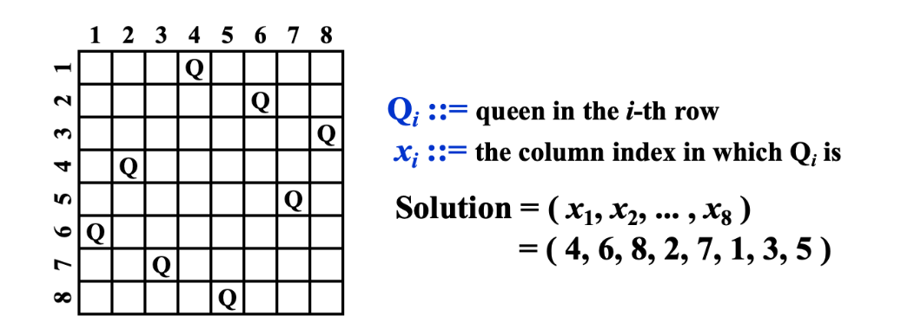
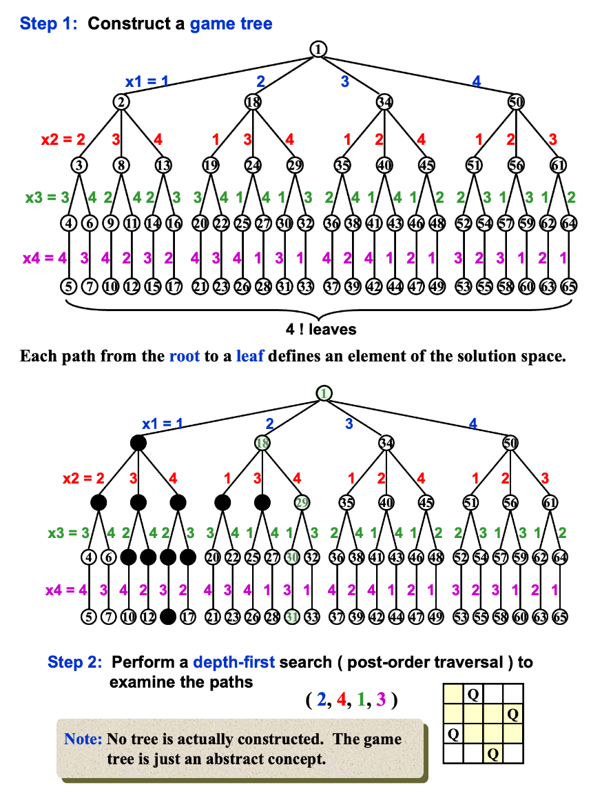
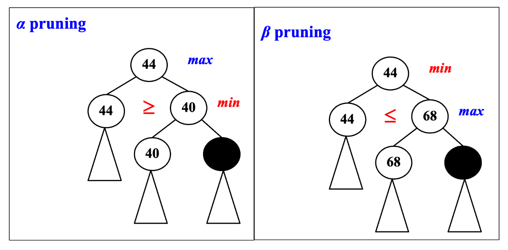

<!-- ---
password: 21@ZJU@ADS
--- -->

# Backtracking

!!! abstract "Rationale"
    - 解决问题的一个可靠的方法是列出所有候选答案，检查每个答案，然后在所有或部分候选答案被检查之后，宣布确定的答案。
    - 如果候选者有限且不是特别多的话，是可以在检查后确定答案的。
    - 而 *backtracking | 回溯法* 使我们能够消除对大量候选子集的显式检查，同时仍然保证如果算法运行到终止时能找到答案。这种方法其实就是 *pruning | 剪枝* 思想。

    !!! def "basic idea"
        - Suppose we have a partial solution $(x_1, x_2, \ldots, x_i)$, where each $x_k \in S_k$ for $1 \leq k \leq i < n$. 
        - First we add $x_{i+1} \in S_{i+1}$ and check if the new solution $(x_1, x_2, \ldots, x_{i+1})$ satisfies the constraints.
        - If the answer is **"yes"**, we continue to add the next $x$, **else** we delete $x_i$ and **backtrack** to the previous partial solution $(x_1, x_2, \ldots, x_{i-1})$.

<u>DFS + purning = backtracking</u>

下面，由一些经典问题来引入回溯法的基本思想。

## Eight Queens Problem

!!! abstract "Problem"
    - 在 8 $\times$ 8 格的国际象棋上摆放 **8 个 queen**，使其不能互相攻击
    - 即任意两个皇后都不能处于同一行、同一列或同一斜线上，问有多少种摆法。

例如其中一种解法如下：



该问题的 **Constraints** 如下：

1. $S_i = \{1, 2, 3, 4, 5, 6, 7, 8\}$ for $1 \leq i \leq 8$
2. $x_i \neq x_j$ if $i \neq j$
3. $(x_i - x_j) / (i - j) \neq \pm 1$ if $i \neq j$

> - 其实，这个问题的 Constraints 第一个暗示解空间有 $8^8$ 种可能
> - 问题的第二条约束条件暗示了解空间的大小缩减为为 $8!$ 种可能


!!! example "以四皇后为例"
    

## Turnpike problem

* For every d remaining in D, at least one of its endpoints is not determined
* For maximum d remaining in D, at least one of its endpoints is a~0~ or a~n-1~

```c
bool Reconstruct(DistType X[ ], DistSet D, int N, int left, int right)
{
    /* X[1]...X[left-1] and X[right+1]...X[N] are solved */
    bool Found = false;
    if ( Is_Empty( D ) ) return true; /* solved */
    D_max = Find_Max( D ); /* option 1：X[right] = D_max */
    /* check if |D_max-X[i]|D is true for all X[i]’s that have been solved */
    OK = Check( D_max, N, left, right ); /* pruning */
    if ( OK ) {
        /* add X[right] and update D */
        X[right] = D_max;
        for ( i=1; i<left; i++ )
            Delete( |X[right]-X[i]|, D);
        for ( i=right+1; i<=N; i++ )
            Delete( |X[right]-X[i]|, D);
        Found = Reconstruct ( X, D, N, left, right-1 );
        if ( !Found ) {
            /* if does not work, undo */
            for ( i=1; i<left; i++ )
                Insert( |X[right]-X[i]|, D);
            for ( i=right+1; i<=N; i++ )
                Insert( |X[right]-X[i]|, D);
        }
    } /* finish checking option 1 */
    if ( !Found ) { /* if option 1 does not work */
        /* option 2: X[left] = X[N]-D_max */
        OK = Check( X[N]-D_max, N, left, right );
        if ( OK ) {
            X[left] = X[N] – D_max;
            for ( i=1; i<left; i++ )
                Delete( |X[left]-X[i]|, D);
            for ( i=right+1; i<=N; i++ )
                Delete( |X[left]-X[i]|, D);
            Found = Reconstruct (X, D, N, left+1, right );
            if ( !Found ) {
                for ( i=1; i<left; i++ )
                    Insert( |X[left]-X[i]|, D);
                for ( i=right+1; i<=N; i++ )
                    Insert( |X[left]-X[i]|, D);
            }
        } /* finish checking option 2 */
    } /* finish checking all the options */
    return Found;
}
```

* worst case: O(2^n^) (rare)
* best case: O(n) (most instances)

## Game - Tic-Tac-Toe

## Pruning

不管树中黑色节点的值是多少，都没有意义



$\alpha-\beta$ pruning: when both techniques are combined.  In practice, it limits the searching to only                $O(\sqrt{N})$ nodes, where N is the size of the full game tree.

!!! quote "参考"
    [最清晰易懂的MinMax算法和Alpha-Beta剪枝详解](https://blog.csdn.net/weixin_42165981/article/details/103263211)