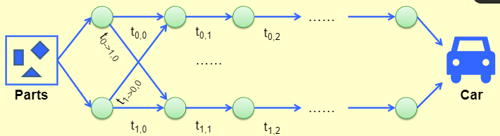

<!-- 2023-04-17 -->

# Dynamic Programming

??? note "DP vs. DivideConquer"
    - DP: optimal substructure + overlapping subproblems
    - DC: optimal substructure + no overlapping subproblems
    - a DC algorithm can be turned into a DP algorithm by caching the results of the subproblems

!!! abstract "Design a DP"
    1. Characterize the structure of an optimal solution | 设计最优解的结构 
    2. Recursively define the value of an optimal solution | 递归定义最优解的值
    3. Compute the value of an optimal solution, typically in a bottom-up fashion | 计算最优解的值，通常自底向上
    4. Construct an optimal solution from computed information | 从计算的信息中构造最优解

## Product Assembly

* Given:
      * Two assembly lines for the same car
      * Different technology(time) for each stage
      * One can change lines between stages
      * Minimize the total assembly time <br>
1. Characterize an optimal solution
      * 

## KnapSack Problem

!!! abstract "KnapSack Problem"
   * Input: $n$ items, each with a weight $w_i$ and a value $v_i$ , and a knapsack of capacity $C$ 
   * Output: a subset of items with maximum $\sum\limits_{i\in S } v_i$ such that $\sum\limits _{i\in S} w_i \leq C$

* 针对第 $n$ 个 item, 有下面两种情况
    * $n \notin S_{opt}$ -> $S_{opt}$ = 前 $n-1$ 个 item 的最优解 (total weight $\leq C$)
    * $n \in S_{opt}$ -> $S_{opt}$ = 前 $n-1$ 个 item 的最优解 (total weight $\leq C - w_n$) + 第 $n$ 个 item

??? example "Pseudo-code"
    ```c++ title="Computing V[][]"
    V[0][c] = 0 for 0 <= c <= C
    for i = 1 to n
        for c = 0 to C
            if w[i] > c
                V[i][c] = V[i-1][c]
            else
                V[i][c] = max{V[i-1][c], V[i-1][c-w[i]] + v[i]}
    return V[n][C]
    ```
    ```c++ title="Reconstructing optimal solution"
    c = C
    S = {}
    for i = n downto 1
        if c >= w[i] and V[i][c] = V[i-1][c-w[i]] + v[i]
            S = S U {i}
            c = c - w[i]
    return S
    ```

## Optimal Binary Search Tree

