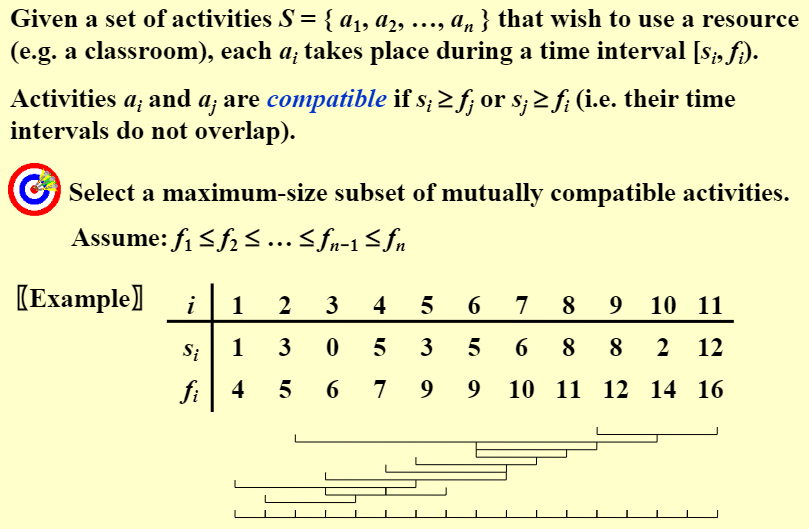
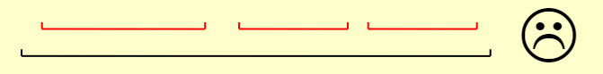
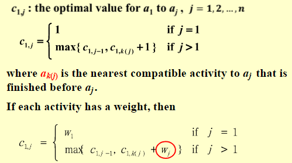

# Greedy Algorithms

!!! abstract
    Make decisions in stages. Find a **best** choice at each stage, under some **greedy criterion**, without violating the **"feasibility"**

## Activity Selection

!!! note "question"
    

* A DP Solution
    * For Set $\{a_1 ~ a_2 ~ ... ~ a_i ~ ... a_k ~ ... ~ a_j ~ ... ~ a_n\}$ , $S_{ij}$ is the set of $\{a_i ~ ... ~ a_k ~ ... ~ a_j \}$ 
    
    $$
    c_{ij}=\left\{
    \begin{aligned}
    & 0 & if ~ ~& S_{ij}  =  \Phi \\
    & \underset{a_k ~ \in ~ S_{ij}}{max} \{c_{ik} + c_{kj} + 1\} & if ~~ & S_{ij}  \ne  \Phi \\
    \end{aligned}
    \right.
    $$

* "Greedy Solution"

    === "Rule 1"
        Select the interval which **starts earliest** (but not overlapping the already chosen intervals)
        
    === "Rule 2"
        Select the interval which **shortest** (but not overlapping the already chosen intervals)
        
    === "Rule 3"
        Select the interval with the **fewest conflicts** with other remaining intervals (but not overlapping the already chosen intervals)
        
    === "Rule 4 - CORRECT"
        * Select the interval which **ends first** (but not overlapping the already chosen intervals) -> Resource become free as soon as possible
        * Is simultaneously suitable for WRONG CASE shown above

* Correctness:
    1. Feasibility: non-overlapping intervals
    2. Optimality: a maximum-size subset

* [**Theorem**] -> Consider any nonempty subproblem $S_k$ . Let $a_m$ be an activity in $S_k$ with the earliest finish time, Then $a_m$ is included in a maximum-size subset of mutually compatible activities of $S_k$
* [**Proof**] -> 
    * Let $A_k$ be the optimal solution set, and $a_{ef}$ be the activity in $A_k$ with the earliest finish time.
    * If $a_m$ and $a_{ef}$ are the same, we are done! Else ......
    * replace $a_{ef}$ by $a_m$ and get $A_k'$ .
    * Since $f_m \le f_{ef}$ , $A_k'$ is optimal as well.
* [Implementation] ->
    1. Select the first activity; Recursively solve for the rest.
    2. Remove tail recursion by iterations. -> $O(NlogN)$

??? example "Another Look at DP Solution"
    

    * Q1: Is the DP solution still correct? -> Yes
    * Q2: Is the Greedy solution still correct? -> No

## Data Compression

!!! note "definition"
  