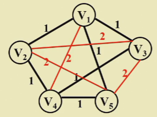

# NP - Completeness

## Post Correspondence Problem

!!! example
    * Given: a collection of domainos, say
    
    | 1    |      | 2    |      | 3    |      | 4    |
    | ---- | ---- | ---- | ---- | ---- | ---- | ---- |
    | B    |      | A    |      | CA   |      | ABC  |
    | CA   |      | AB   |      | A    |      | C    |

    * Goal: to find a finite sequence of dominos (repetitions allowed) such that the top and bottom strings are the same.
    * For example: **ABCAAABC**

    | 1    | 2    | 3    | 4    | 5    |
    | ---- | ---- | ---- | ---- | ---- |
    | A    | B    | CA   | A    | ABC  |
    | AB   | CA   | A    | AB   | C    |

> Thinking: Does a solution always exist for the example above?

* Theorem: The Post Correspondence Problem is <u>undecidable</u>, provided that the alphabet $\sum$ has at least two symbols.

> Undecidable: There is no algorithm that can solve the problem.

## The class NP

??? info "TURNING MACHINE"
    * **Task** : To simulate any kind of computation which a mathematician can by some arithmetical method.
    * **Components** : 
        * Infinite Memory (DATA storage): Infinite 1-dimensional tape divided into units.
        * Scanner (INSTRUCTION storage) | Finite state controller: control head movements according to current state and the symbol that head is pointing to.
    * **Operations** :
        1. Change the finite control state.
        2. Erase the symbol in the unit currently pointed by head, and write a new symbol in.
        3. Head moves one unit to the left or right, or stay still.

* A **Deterministic Turing Machine(确定性图灵机)** executes one instruction at each point in time. Then depending on the instruction, it goes to the next *unique* instruction.
* A **Nondeeterministic Turing Machine(非确定性图灵机)** is *free to choose* its next step from a finite set. And if one of these steps leads to a solution, it will *always choose the correct one*.

> Undecidable problems are still undecidable.

* **NP**: *Nondeterministic Polynomial-time*

> 这课只需要记住确定性图灵机解决的是 P 类问题，非确定性图灵机解决的是 NP 类问题 (P 一定是 NP 的子集)
> A problem is in NP if we can verify **any <u>true</u> solution** in *polynomial time*.

!!! note
    Not all decidable problems are in NP. For example, consider the problem of determining whether a graph **does not** have a Hamiltonian cycle. This problem is decidable, but it is not in NP.

## NP - Complete Problems --- the hardest

* An **NP - complete problem** has the property that any problem in NP can be **polynomially reduced** to it.

> If we can solve **any** NP - complete problem in *polynomial* time, then we can solve all NP problems in polynomial time.

??? example "Example-1"
    === "Problem"
        * Suppose that we already know that the Hamiltonian Cycle problem is NP - complete. Prove that the traveling salesman problem is NP - complete as well.
            * **Hamiltonian Cycle Problem**: Given a graph $G = (V, E)$ , is there a simple cycle that visits all vertices?
            * **Traveling Salesman Problem**: Given a complete graph $G = (V, E)$ with edge costs, and an integer $K$ , is there a simple cycle that visits all vertices and has total cost $\le K$ ?
    === "Proof"
        * TSP is obviously in NP. We can verify a solution in polynomial time by checking that it is a simple cycle and that its total cost is $\le K$ .
        
        
        
        * K = | V |. G has a Hamiltonian cycle if and only if G' has a TSP tour of total weight | V |.

??? example "Example-2"
    === "Championship Problems"
        * A fan wonders at a particular time point if his/her favorite team is theoretically possible to be the league champion in the current season. 
            * The a-points rule: after each game a points are awarded (split into 0 <= b <= a and a - b) (a-Championship problem)
            * The (0, a-b)-point rule: win with b points, lose with zero points, and tie with a points ((0, a, b) - Championship problem)
        
        * (0, 1, 2)-Championship is in P while (0, 1, 3)-Chanpionship is NP-complete.

## A Formal-language Framework

