# 动画基本原则

> 迪士尼的 12 条动画基本原则

1. Squash and Stretch (挤压和伸展)
	- 挤压和伸展是指通过物体的形变来表现物体的刚度和质量
	- 在使用“挤压和伸展”原则时，通常使变形的物体<u>保持其体积不变</u>   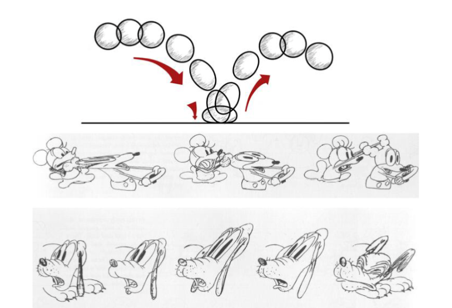
2. Anticipation（预期性）
	- 动画中的动作通常包括动作的准备、实际的动作和动作的完成三部分。第一部分就叫做预期性   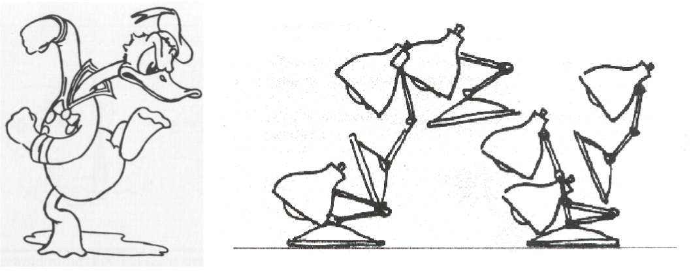
3. Staging（布局）
	- 布局就是以一种容易理解的方式展示动作或对象
	- 在设置场景时，一个至关重要的因素是要考虑到观众
	- 角色的仪态及表演方式，配合适当的摄影机运动，使得动画能够有效地表达角色的特性及故事中的信息   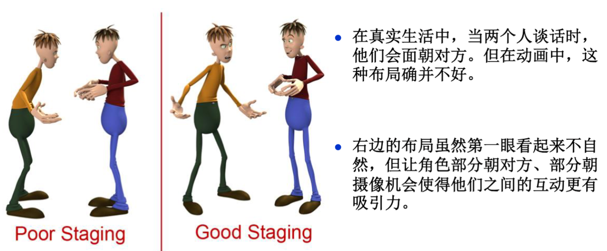
4. Straight-Ahead Action and Pose-to-Pose Action (连贯动作法与关键动作法)
	-  属两种不同的动画制作方式
		- 前者根据连续的动作依序制作每一帧画面
		-  后者是先定义关键的主要动作，而后再制作关键动作间的画面 (关键帧方法)
5. Follow-Through and Overlapping Action (跟随动作与重叠动作)
	- 没有任何一种物体会突然停止，物体的运动是一个部分接着一个部分的”，这是Walt Disney当初对于运动物体的诠释，之后动画师将这样的理论以跟随动作或重叠动作来称呼，我们可以用另一种更科学的方式来描述这个原理，就是“动者恒动”   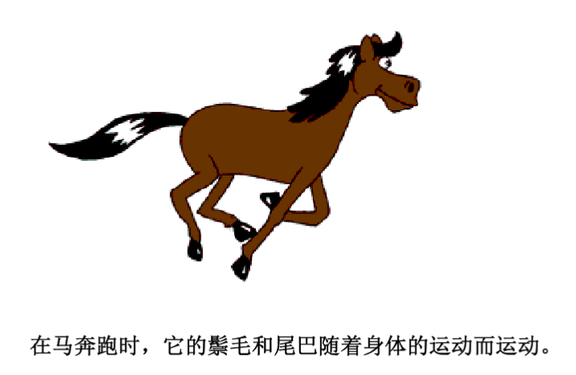   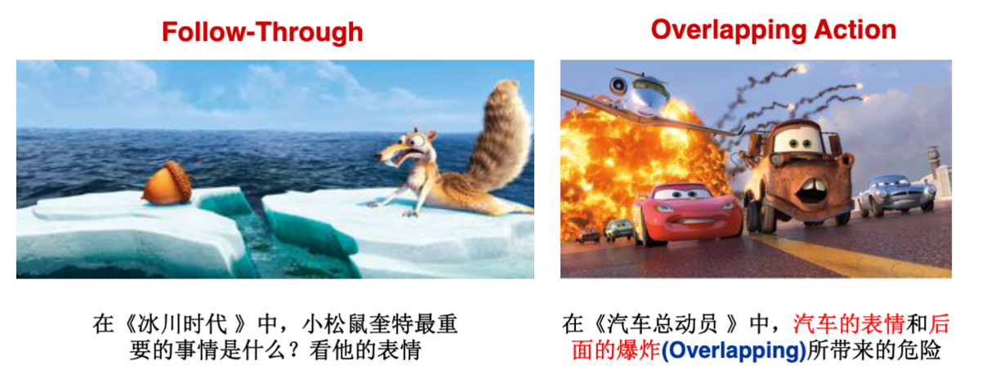ß
6. Slow In and Slow Out (慢入和慢出)
	- 所有物体自静止开始运动，逐渐加速；从运动状态回到静止状态，则逐渐减慢
	- 慢入和慢出是指动作的加速和减速。自然界中物体的运动具有加速和减速的性质
	- 动作的慢入和慢出使得物体的运动更加符合自然规律，因此应该应用于绝大多数的动作   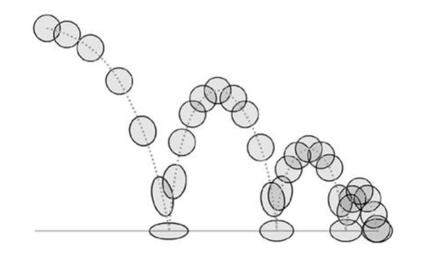
7. Arcs（弧形动作）
	- 在现实世界中，几乎所有的运动都是沿着一条略带圆弧的轨道移动的, 尤其是生物的运动。因此，在制作动画时，角色的运动轨迹就不应是直线，而应该是比较自然的曲线
	- 只有在特殊的情况下，角色或者角色的一部分会完全沿着直线运动  
8. Secondary Motion（附属运动）
	- 当角色进行主要动作时，附属于角色的部分，例如触须、尾巴等，会以附属动作来点缀主要动作的效果 (为动画增添乐趣和真实性)   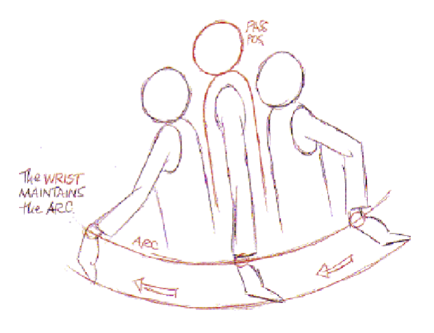
9. Timing（掌握时序）
	- 时间的调配和选择是影响动画效果的最关键因素之一
	- 通过时序来表现物体的大小、重量和个性
10. Exaggeration（夸张）
	- 夸张手法用于强调某个动作，但使用时应小心谨慎，不能随意。使用夸张手法时，要注意明确动作或者序列的表现目标，然后确定哪一部分需要夸大表现。使用夸张的结果通常是动画更加真实和有趣
11. Solid Drawing (not for 3D Animation)
12. Appeal（吸引力）
	- 吸引力是指任何观众愿意观看的东西,以表现出角色的个性
	- 目标：建立角色与观众的某种联系
	- 当设计角色时，以独特的造型或姿态来提高观众对角色的印象。例如高矮胖瘦可分别代表角色的不同个性   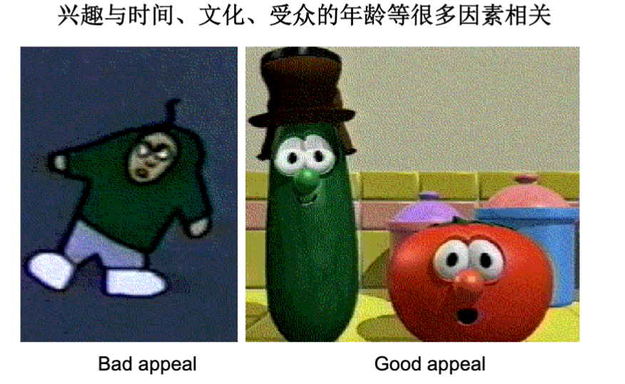

> - 一些衍生的原则 
> 	1. Depth of Field (景深)
> 		-  简单地来说，焦点附近的物体很清晰，而离 焦点远的景物变模糊   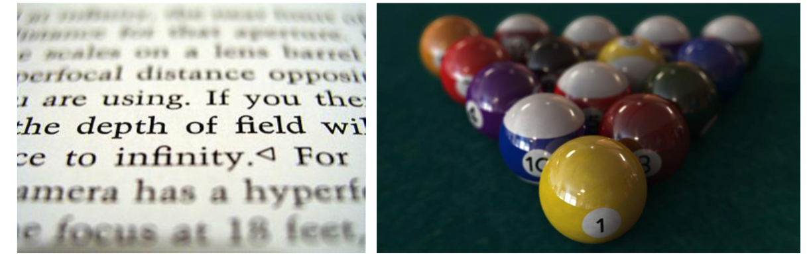
> 	2.  Balance & Weight（平衡及重量感）
> 		- 了解运动物体的重心所在，重心的位置可影响物体在视觉上的稳定度； 物体在视觉上的轻重如何，除了在造型上予以定义外，也需由动作来表现物体的重量感   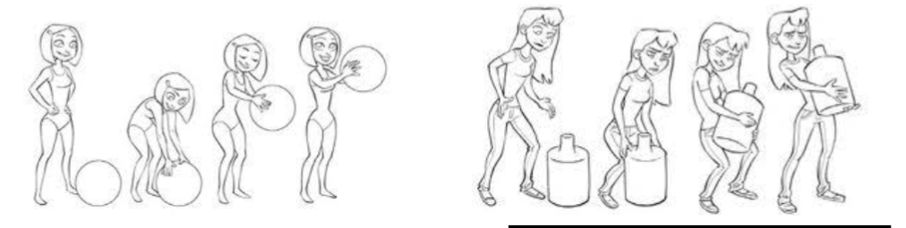ß

---

- Spacetime Optimization
	- 计算机自动生成台灯跳跃动作的序列。动画师只给定了台灯的起始位置和终点， 所有的中间跳跃过程由计算机通过计算自动得出，用于自动生成这个动画序列的计算机程序主要是解算了一种名为 Spacetime Optimization 的问题  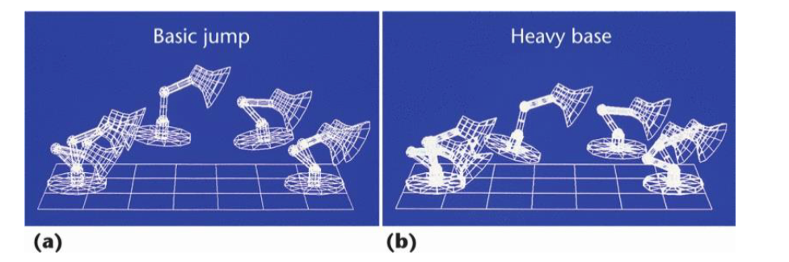
- 物理原理
	- 物体可看成由无数小的粒子组成，我们考虑如何生成一个小粒子的动画。假设有一个很小的粒子，它身上携带这一个很小的喷射引擎，这个引擎可以产生力来推动这个粒子运动
	- 计算机可通过一种算法，来自动产生引擎的喷射力，使得这个小粒子可以从一开始 给定的初始位置 X(0)，运动到我们想让它达到的终点位置 X(T)。对此，我们有几个约束条件：
		1. 动力学约束： $ma = mg + f(t)$ ;
		2. 位置约束：粒子在运动时的起点和终点 (pose to pose) ;
		3. 目标约束：粒子耗能最小 (使用最少的燃料/最省力) 
        
        $$\min \int^{T}_{t_0} ||f(t)||^2 dt$$