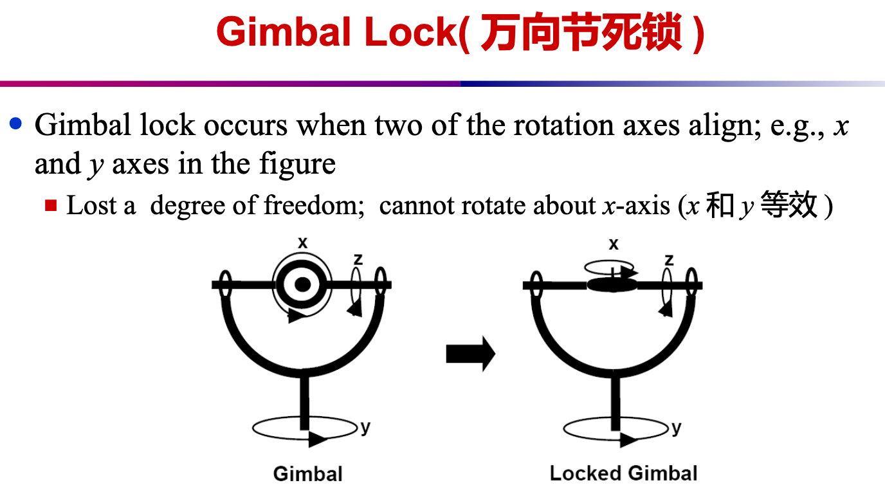
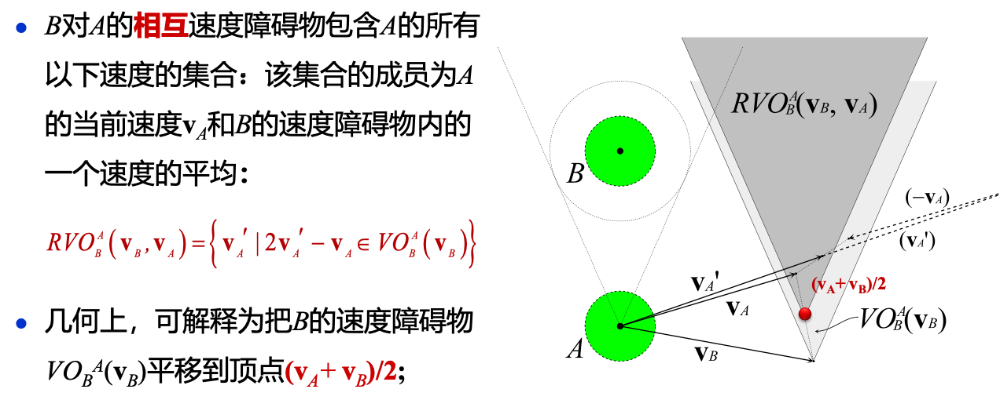
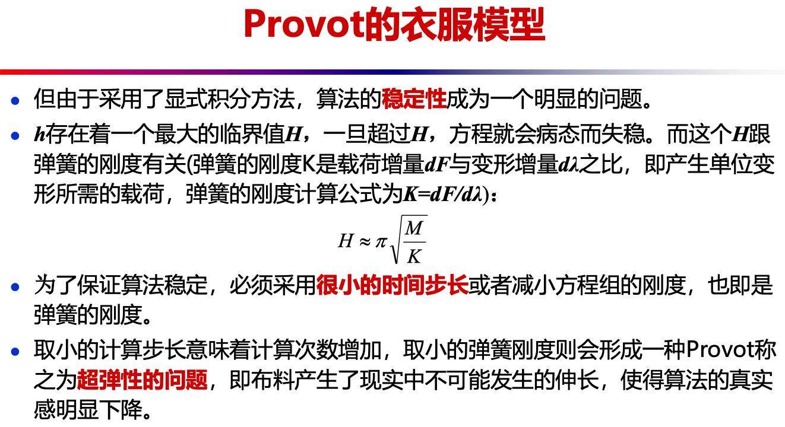
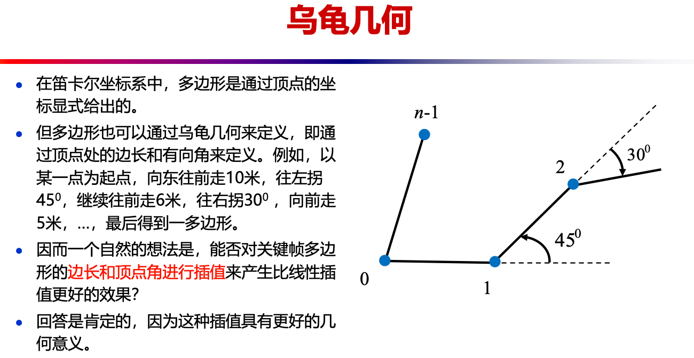
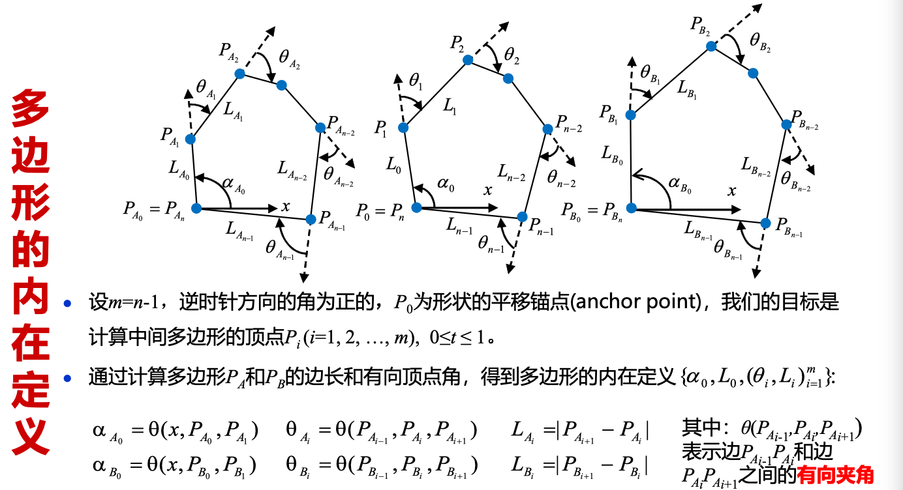

# 考试大纲

```ad-abstract
仅供参考
```

## 需要掌握的内容

### 动画介绍

> [1-计算机动画简介](1-计算机动画简介.md)

```ad-question
title: 动画的基本知识


```

```ad-question
title: 动画形成的视觉原理

- 所谓动画，就是指通过以每秒若干帧的速度顺序地播放静止图像帧以产生运动错觉的艺术。
- <u>动画利用人的视觉残留特点，即上个画面的残留还未消失，下一个画面又进入视觉，这样循环往复，在人的眼中形成动态的画面。</u>
```

```ad-info
title: 什么是计算机动画


```

### 动画基本原则

> [2-动画基本原则](2-动画基本原则.md)

```ad-question
title: 12 条基本原则

1. Squash and Stretch (挤压和伸展)
2. Anticipation（预期性）
3. Staging（布局）
4. Straight-Ahead Action and Pose-to-Pose Action (连贯动作法与关键动作法)
5. Follow-Through and Overlapping Action (跟随动作与重叠动作)
6. Slow In and Slow Out (慢入和慢出)
7. Arcs（弧形动作）
8. Secondary Motion（附属运动）
9. Timing（掌握时序）
10. Exaggeration（夸张）
11. <font color="#7f7f7f">Solid Drawing (not for 3D Animation)</font>
12. Appeal（吸引力）

> 衍生规则：
> 1. Depth of Field (景深)
> 2. Balance & Weight（平衡及重量感）
```

### 变换和旋转表示

```ad-question
title: 万向节死锁的概念




```

!!! question "旋转的四元数表示"
    
    
    
    

    ???+ info "Math"
        
        
        

    ???+ info "Advantages"
        - Good and smooth interpolation
        - No gimbal lock
        - Can be composed much more efficiently (requiring 8 multiplications and 4 divices)
        - But:
            - Impossible to visualize
            - Unintutive
        - Good for internal representation of rotation!

### 二维多边形形状渐变

> - 在二维角色动画中，经常会碰到这样的问题：给定一个初始和最终的形状（shape），我们称它们为<font color="#ff0000">关键帧形状</font>，求从初始形状 **光滑过渡** 到最终形状的 **中间形状**
> - 这个问题称为二维形状的自然渐变（Shape Blending | Shape Morphing）

```ad-question
title: 2D Shape Blending 涉及的两个子问题

1. 顶点的对应关系问题
2. 顶点的插值问题
```

```ad-question
title: 基于内在形状插值的多边形渐变方法的基本思想

对关键帧多边形的 **边长和顶点角** 进行插值。数学原理为 **乌龟几何与拉格朗日乘数法** 优化。（使用乌龟几何对多边形进行定义，通过插值得到中间多边形的边长和顶点角，由于通常不封闭，所以保持插值的顶点角不变，使用拉格朗日乘数法来适当调整插值得到的边长。）

> - 数学原理：乌龟几何 + Lagrange 乘数法优化
> - 通过顶点处的边长和有向角来定义多边形
> - 通过对关键帧多边形的 **边长和顶点角进行插值** 来产生比线性插值更好的结果
> - 拉格朗日乘数法优化用于处理插值后起始点和终止点不在同一位置的问题
```

```ad-question
title: Edge Tweaking 思想

- 保持插值的顶点角不变，适当调整插值得到的边长 (解决中间多边形不封闭的问题)

> 这是一个具有约束条件的极值问题，可以用拉格朗日乘数法求解
```

### 二维图像 Morphing

```ad-question
title: 图像 morphing 思想

- 首先用简单的几何元建立图像特征之间的对应关系，然后由这些特征对应关系计算出 morphing 所需的几何变换，几何变换定义了两幅图像上点之间的几何对应关系。
- 满射 C0 把第一幅图像的几何形状映射为第二幅图像的几何形状，满射 C1 则反过来。需要两个映射的原因是图像点与点之间的对应关系不一定是一一对应。
- 图像变形对齐后再对颜色进行插值，得到中间帧图像。
```

```ad-question
title: 基于网格的图像 morphing 原理

- 在源图像中，放置曲面网格 Ms，Ms 指定了控制顶点的坐标。在目标图像中，放置网格 Md，Md 指定了 Ms 在目标图像的对应点。
- 曲面 Ms 和 Md 用来定义把源图像的所有点映射到目标图像的空间变换，它们的拓扑关系相同。
- 中间帧的图像生成步骤：
	1. 线性插值网格 Ms 和 Md，得到网格 M
	2. 应用由网格 Ms 和 M 定义的变换，使源图像 Is 扭曲变形到 I0
	3. 应用由网格 Md 和 M 定义的变换，使目标图像 Id 变形到 I1
	4. 对图像 I0 和 I1 进行线性插值，得到中间帧图像
```

```ad-question
title: 基于线对的图象 morphing 方法

- 采用逆向映射：逐个扫描目标图像的像素，根据其位置采样源图像。
- 在源图像中定义一条有向线段，再在目标图像中定义一条有向线段，则映射把一条直线映射为另一条直线。
- 设两幅图像分别为 Is 和 Id，先在两幅图像中定义控制变形的对应直线对，通过插值得到中间图像 I 的直线。由 Is->I 的直线对变换可以得到一副变形图 I1，由 Id->I 的直线对变换可以得到 I2。对交溶参数作动画，把 I1 和 I2 进行交溶处理可以得到中间的变形图像 I
```

### 三维 Morphing 技术

```ad-question
title: 二、三维形状渐变 (morphing) 各有什么优缺点？

- 二维：
	- 优点：是一种达到特殊视觉效果的有效方法；可以让人产生神奇的三维形状改变的错觉，可以避免复杂的三维造型过程
	- 缺点：可能生成一些意料之外的图像（线对特征法）；物体没有三维几何信息，不能进行几何变换
- 三维：
	- 优点：能生成更逼真和生动的特技效果，且得到的中间帧是物体的模型而不是图像，运用范围更广
	- 缺点：物体之间的对应关系很难建立，而且该方法对物体的几何表示也相当苛刻
```

```ad-question
title: 基于星形物体的多面体 morphing 方法

- 合并一对三维多面体物体模型的拓扑结构，使它们拥有相同的顶点，边，面网络结构，然后对相应的顶点进行插值
- 通过合并拓扑结构将一个物体的形状变换为另一个物体的形状可以分为两步：
	1. 建立源物体与目标物体上的点的对应关系（对应问题）
	2. 插值对应的点（插值问题）
- 对于亏格为零的两个多面体，可采取下面的三个步骤来建立亏格为零的多面体之间的对应关系：
	1. 把两个多面体投影到单位球面上
	2. 将投影在单位球面上的两个拓扑结构合并在一起构成一个新的拓扑结构
	3. 将新的拓扑结构映射回原来的两个多面体


- 一旦顶点对应关系建立以后，通常采用线性插值或 Hermite 插值来插值相应的顶点
```

```ad-question
title: 基于体表示的三维 morphing 方法

- 思想：给定源体 S 和目标体 T，首先根据指定的对应特征生成一空间变换，该变换使给定的两个体扭曲变形成 S’ 和 T’，达到几何对齐的目的；然后对得到的两个扭曲变形体 S’ 和 T’ 进行混合。
- 当 Warping 操作生成两个扭曲变形的体和后，我们可以采用多种方法对它们进行混合
	- 先对S’ 和 T’ 进行体绘制，然后把绘制好的图象进行交溶处理。该方法的缺点是生成结果的光照和遮挡情况不正确，且缺乏真实的三维 morphing 效果
	- 对 S’ 和 T’ 体素的颜色和不透明度值进行交溶处理，然后对混合后的体素进行体绘制 (volume rendering)。通常，后一种方法可以得到更好的三维 morphing 效果
- 优点：与物体的几何和拓扑结构无关；提供了一种统一的处理方法（几何表示的物体都可以转化成体表示）。   
- 缺点：走样现象严重，精度没有基于几何表示的好；几何模型转换为体素表示的计算时间较费。
```

### 粒子系统

```ad-question
title: 粒子系统的基本原理

- 粒子系统的作用：模拟不规则自然景物生成和动画的系统，使造型和动画巧妙地连成一体
- 粒子系统基于的假设：
	1. 粒子一般不与其它粒子碰撞
	2. 除非处于聚集状态，粒子不向其它粒子投影
	3. 粒子只向其它环境投影
	4. 粒子不反射光
	5. 粒子通常有有限的生命周期
- **粒子系统的基本思想** 是将许多简单形状的微小粒子作为基本元素聚集起来形成一个不规则模糊物体。每个粒子均经历出生，成长，衰老和死亡的过程。生成粒子系统的某一帧画面的基本步骤是：
	1. 生成新的粒子并加入系统中
	2. 赋予新粒子一定的属性
	3. 删除已经超过生命周期的粒子
	4. 根据粒子的动态属性对粒子进行移动和变换
	5. 绘制并显示由有生命的粒子组成的图形
- 粒子的生成：对于每一帧，根据一个控制的随机过程生成粒子
	- 用户可以控制每帧的平均粒子数和其概率分布；
	- 粒子数可以是时间的函数。
- 粒子的属性：位置，速度，大小，周期，质量，力加速器，生命周期，绘制属性……
```

### 群组动画

```ad-question
title: Boids 模型的三条原则，每条原则的含义

1. 碰撞避免原则：避免与相邻的群体成员相碰   
2. 速度匹配原则：尽量保持与周围邻居群体成员的速度匹配   
3. 群体合群原则：群体成员尽量靠近
```

```ad-question
title: Reynolds 导航方法中的追逐和躲避模型、障碍避免模型、 路径跟随、流场跟随行为模型、领导模型

- 追逐和躲避模型:
	- 追逐一个移动的角色。  
	- 假设猎物在预测区间 T 内不会转向。  
	- 猎物在将来的位置可通过把它的当前速度乘以T，并把该偏移量与当前位置相加来得到
	 
> 

- 障碍避免模型: 返回避免最有威胁障碍物的导航值；如果没有碰撞是迫在眉睫的，返回一个特殊值（空值，或零向量），表示在这一时刻不需要纠正量

> 

- 路径跟随模型:
	- 沿着一条路径移动角色，并同时保持在脊柱线的指定半径内
	- 投影距离小于路径半径时，不需要进行导航校正；否则，把预测的位置投影到路径上，把该点作为目标点，并进行寻找行为

> 

- 流场跟随行为模型
	- 假设运动区域已经有一个速度流场  
	- 估算角色将来的位置并计算在这点的流场  
	- 得到的速度 (F) 即为我们期望的速度，导航方向 (S) 为期望速度和当前速度的差

> 

- 领导模型
	- 如果一个跟随成员发现自己处于领导前面的一个矩形区域，它会横向远离领导者的路径；否则，到达 (arrival) 目标为领导后面的一个偏移点
	- 跟随成员采用分离行为来避免相互拥挤

> 
```

```ad-question
title: Helbing 基于社会力模型的群体行为模拟方法的基本原理

- 社会力模型以牛顿动力学为基础，由各个力的表达式来体现行人不同的动机和影响。在 **社会力模型** 中，由于对影响个体的因素考虑得比较全面，对个体行为的建模比较合理，该模型可以逼真地模拟人群的疏散过程。   
- 个体的实际行为受 **主观意识，其它个体及障碍物** 三方面因素的影响，均可等效为力在个体上的作用。
```

```ad-question
title: 相互速度障碍物 (RVO) 原理

- 假设个体以匀速前进；
- 每个个体在保持与周围个体相对运动的同时，在速度域中计算出可能导致碰撞的速度集合，并对自身速度进行必要的调整（选择当前速度和一个位于速度障碍物外部的速度的平均）
- 在调整过程中，碰撞避免的任务同时分配给相关的个体，使它们相互协调完成碰撞避免任务

> 
> 
```

### 关节动画

```ad-question
title: 运动捕获系统 (MOCAP) 流水线

标定 -> 捕获 -> 三维位置重建 -> 拟合到骨架 -> 后处理
```

```ad-question
title: 基于运动捕获的关节动画制作的优缺点

- 优点：只要能被捕获，可以记录人体运动的所有细节，运动真实
- 缺点：不容易进行编辑和控制，较昂贵
```

!!! question "正向运动学、逆向运动学原理 (IK)，逆向雅克比方法求解 IK 的原理"
    !!! note "正向运动学 (FK) 原理"
        - 动画师通过 **直接指定** 关节处的关节运动参数来控制物体的运动
        - 从关节空间映射到笛卡尔空间；   
        - 计算整棵树（深度优先遍历）
        > 

    !!! note "逆向运动学 (IK) 原理"
        - 动画师指定目标位置，系统求解满足要求的关节角；
        - 从笛卡尔空间映射到关节空间；
        - 给定初始姿态向量和目标姿态向量，计算关节向量的值，使得物体满足所需的姿势；
        - 一旦得到关节向量值后，可以对角色的初始姿态和最终姿态的关节向量值进行插值，从而得到角色动画；
    
    !!! note "逆向雅克比求解 IK 的原理"
        - 逆向雅克比矩阵把笛卡尔空间的速度映射到关节空间的速度；   
        - 给定初始姿势和所需要的姿势，**迭代** 变化关节角，使得末端影响器朝目标位置和方向前进；   
            - 对于中间帧，插值得到所需的姿态向量
                - 对于每一步 k, 通过上述公式得到关节的角速度 $\dot{\theta}$ ，然后执行 

        $$\theta_{k+1} = \theta_k + \Delta t \dot{\theta}$$

```ad-question
title: 循环坐标下降法 (CCD) 原理

- 对所有受 IK 影响的骨骼，按从最远侧子骨骼到父骨骼的顺序执行迭代操作：旋转当前骨骼，使当前骨骼位置到目标骨骼的连线指向 IK 目标位置

> 由于所有骨骼是从一个特定状态出发开始 IK 计算，所得到的结果也会比较稳定。通常 5 ～ 10 次迭代之后就能得到很好的结果


```

```ad-question
title: 骨架与角色模型的绑定原理

- <u>角色的表面（外皮）必须随着骨架的运动而运动（变形）</u>
- 在骨架绑定中，皮肤的运动定义为对应控制骨架的函数；
- 很多骨架绑定系统采用一个称为中性姿势或静止姿势的几何信息；
- 自动绑定主要包括两个过程：
	- 首先在未知的三维模型中嵌入骨架
	- 然后计算骨骼对表面网格上每个顶点的影响权值，并将表面皮肤依附在骨骼上
```

!!! question "顶点混合 (Vertex Blending) 的原理和数学表示"

    !!! note "原理"
        - 假设一个数字角色的手臂用前臂和后臂来模拟，最简单的顶点混合方法是前臂和后臂单独设置动画，但关节处用一柔性的 “skin” 来连接
        - 柔性部分的一部分顶点由前臂的矩阵来变换，另一部分由后臂的矩阵来变换。即：一个三角形的顶点可以由不同的矩阵来变换，而不是一个矩阵。这种基本技术有时也称为 “Stitching”
        - 进一步推广：一个顶点可以由几个不同的矩阵进行加权变换
        - 实施方法：在物体上放置关节骨架，每个骨架都按用户给定的权因子影响顶点
    
    !!! note "数学表示"
        
        

### 变形动画

```ad-question
title: 基于 Blend Shapes 表情动画的原理

- 首先对人脸表情进行三维扫描，然后构建一组关键姿态表情的形状 --- Blend Shapes
- 把这些基本的人脸 Shape 作为表情基<br>
- 根据插值这些 Blend Shapes 来得到任意的表情<br>
```

```ad-question
title: FACE IK 的原理


```

```ad-question
title: Deformation 与 Morphing 的区别

- 变形 Deformation 是指将几何对象的形状作某种扭曲，形变，使它形成动画师所需要的形状。在这种变化中，**几何对象的拓扑关系保持不变** 
- 与 Morphing 不同，空间变形更具有某种随意性，所以空间变形也常称为自由变形
```

```ad-question
title: 与物体表示无关的变形的原理

- 既可以用于多边形表示的物体，又可以用于参数曲面表示的物体
- 用少量的点去有效控制更多的点。在传统CSG造型方法的基础上，进行非线性整体变形（变换是物体顶点位置的函数）和局部変形（改变物体的切向量空间，积分得到物体变形后的整体位置）
```

```ad-question
title: 扩展的 FFD 方法 EFFD 的原理

- FFD (不直接操作物体，而是将物体嵌入一空间，当所嵌的空间变形时，物体也随之变形) 只适合平行六面体的 lattice 形状，扩展的 FFD 方法允许非平行六面体的 lattice 形状，从而能实现更任意的变形。
- EFFD 型 lattice 允许 FFD 型 lattice 作为它结构的一部分，许多个 FFD 型 lattice 可合并构成 EFFD 的 lattice。通过把多个基本 EFFD 块融合，得到更复杂的复合 EFFD 块。使用迭代求解采用 EFFD 块对物体进行变形

> 
> 
```

```ad-question
title: 基于 Cage 的变形原理

- 构建模型的 Cage（一个包裹高分辨率模型的低分辨率控制网格）；
- 计算模型的 Cage 坐标;
- 编辑 Cage 模型;
- 把 Cage 的变形通过预先计算的 Cage 坐标光滑传播到其包裹的模型
```

!!! question "Laplacian 微分坐标及其变形原理"

    - 拉普拉斯坐标 ($\delta$ - Coordinate) --- 将每个顶点的笛卡尔坐标转换为拉普拉斯坐标 (数学意义为一个顶点的笛卡尔坐标和这个点所有邻接点的笛卡尔坐标的加权平均，物理意义为拉普拉斯坐标能够记录模型的局部细节特征)：

    $$\begin{align}
    \delta_i &= (\delta_i^{(x)},~ \delta_i^{(y)},~ \delta_i^{(z)}) \\
    &= \mathbf{v}_i - \frac{1}{d_i} \sum\limits_{j \in N(i)} \mathbf{v}_j
    \end{align}$$

    - 从微分几何上，拉普拉斯坐标写成下式：

    $$\delta_i =  \frac{1}{d_i} \sum\limits_{j \in N(i)} (\mathbf{v}_i - \mathbf{v}_j)$$

    - 原理：使形变前的点的拉普拉斯坐标与形变后的点的拉普拉斯坐标在局部坐标系内尽可能相等

### 布料动画

```ad-question
title: 布料动画和仿真中的核心问题有哪 4 个

1. 建立布料的物理（力学）模型（表达能力）
2. 布料物理参数的确定
3. 物理模型的求解
4. 碰撞检测和响应
```

```ad-question
title: 布料的物理机械性能主要有哪 4 种

拉伸力、压缩力、剪切力和弯曲力
```

```ad-question
title: 布料的弹簧-质点模型主要有哪 3 种弹簧，并图示


```

```ad-question
title: Provot 的衣服模型的原理

- Provot 提出了一种可以看作是从 Breen 的粒子系统（把布料模型表示成为一套相互作用的粒子系统）简化而来的弹簧-质点模型，并在此基础上发展了一套非常简单有效的算法。
- Provot 采用了简单高效的显式 Euler 法求解微分方程组，效率与显示效果均不错

> 
> 
```

```ad-question
title: 布料动画中大步长隐式方法的原理

- 布料模拟的积分计算部分的主要开销在由于稳定性限制计算步长只能取很小值，因而被迫在两帧画面之间计算多次；   
- <u>因此设法取较大的时间步长可以有效提高算法效率。使用隐式方法来积分，在不降低刚度的条件下可以取得较大的时间步长</u>

> 
```

### 隐函数曲面造型和动画技术

```ad-question
title: 隐式曲面表示的优缺点

- 优点：
	1. 很容易进行点的内外测试 
	2. 很容易计算曲面的交/差/并   
	3. 很容易处理拓扑变化
- 缺点：
	1. 曲面通过间接指定   
	2. 很难描述尖锐特征   
	3. 很难对曲面上的点进行枚举   
	4. 绘制慢
```

```ad-question
title: 隐式曲面中核函数的选择

- 选择低通滤波函数（例如高斯函数）


```

!!! question "Wyvill 的六次多项式势函数的图形形状"

    $$f_i(r) = 
    \begin{cases}
    - \frac{4}{9} (\frac{r}{R_i})^6 + \frac{17}{9} (\frac{r}{R_i})^4 - \frac{22}{9} (\frac{r}{R_i})^2 + 1, & 0 \le r \le R_i \\
    0, &r \ge R_i
    \end{cases}$$

    

---

## 数学知识

> 基于内在形状插值的多边形渐变方法的数学原理：乌龟几何 + Lagrange 乘数法优化





---

> 平时的随堂作业 （上面不含的内容）

```ad-info
title: 随堂作业 1 - 粒子动画

```

```ad-info
title: 随堂作业 3 - 群组动画 2

```

```ad-info
title: 随堂作业 5 - 布料动画

```