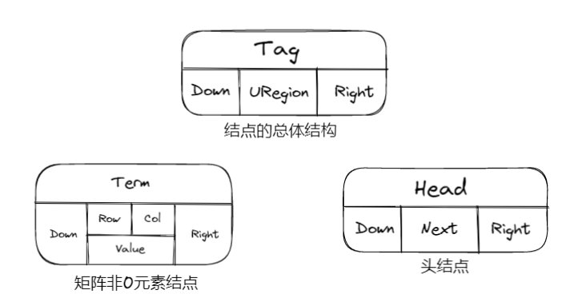
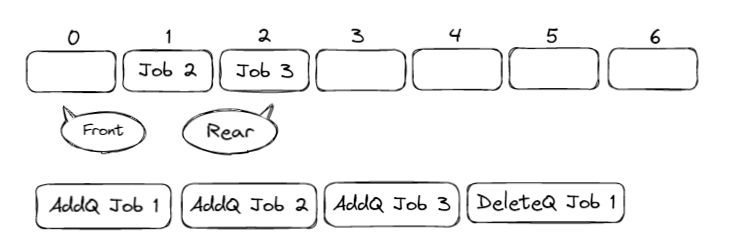
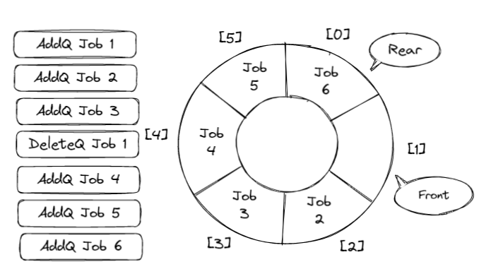
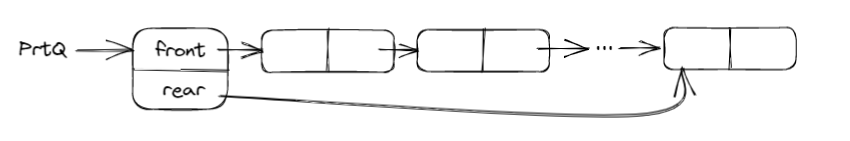

# 线性表&栈&队列

## 线性表 | Lists

### 线性表的抽象数据类型描述

1.  `类型名称` : 线性表 | List
2.  `数据对象集` :  线性表是n( $\ge$ 20)个元素构成的有序序列
3.  `操作集` : 线性表 L $\epsilon$ List，整数 i 表示位置，元素 X $\epsilon$ ElementType.

### 线性表的顺序存储实现

#### 线性表的数组存储实现

* 主要操作实现

??? example "初始化(建立空的顺序表)"
    ```c
    List MakeEmpty()
    {
        List Ptrl;
        Ptrl = (List)malloc(sizeof(struct LNode));
        Ptrl->Last = -1;
        return Ptrl;
    }
    ```

??? example "查找"
    ```c
    int Find(ElementType X, List Ptrl)
    {
        int i = 0;
        while(i <= Ptrl->Last && Ptrl->Data[i] != X)
        {
            i++;
        }
        if(i > Ptrl->Last)
            return -1;
        else
            return i;
    }
    ```

??? example "在第i(1 <= i <= n+1)个位置上插入新元素X"
    ```c
    void Insert(ElementType X, int i, List L)
    {
        int j;
        if(Ptrl->Last == MAXSIZE-1)
        {
            printf("表满");
            return ;
        }
        if(i < 1 || i > Ptrl->Last+2 )
        {
            printf("位置不合法");
            return;
        }
        for(j = Ptrl->Last; j >= i - 1; j--)
        {
            Ptrl->Data[j+1] = Ptrl->Data[j];
        }
        Ptrl->Data[i-1] = X;
        Ptrl->Last++;
        return;   
    }
    ```

??? example "删除"
    ```c
    void Delete( int i, List Ptrl )
    {
        int j;
        if(i < 1 || i > Ptrl->Last+1)
        {
            printf("不存在");
            return;
        }
        for(j = i; i <= Ptrl->Last; j++)
        {
            Ptrl->Data[j-1] = Ptrl->Data[j];
        }
        Ptrl->Last--;
        return E;
    }
    ```

#### 线性表的链表存储实现

* 不要求逻辑上相邻的两个元素在物理上也相邻
* 通过修改”链“建立起数据元素之间逻辑关系

!!! tip
	插入、删除不需要移动数据元素，只需要修改”链“

??? example "链表结构"
    ```c
    typedef struct LNode *List;
    struct LNode{
        ElementType Data;
        List Next;
    };
    struct LNode L;
    List Ptrl;
    ```

* 主要操作:

??? example "求表长"
    ```c
    int Length(List Ptrl)
    {
        List p = Ptrl;
        int j = 0;
        while(p)
        {
            p = p->Next;
            j ++;
        }
        return j;
    }
    ```

??? example "查找"
    ```c
    /*（1）按序号查找*/
    List FindKth(int K, List Ptrl)
    {
    List p = Ptrl;
        while(p != NULL && i < k)
        {
            p = p->Next;
            i++;
        }
        if(i == K)
            return p;
        else
            return NULL;
    }
    /*（2）按值查找*/
    List Find(ElementType X, List Ptrl)
    {
        List p = Ptrl;
        while(p != NULL && p->Data != X)
        {
            p = p->Next;
        }
        return p;
    }
    ```

??? example "在第i-1(1 <= i <= n+1)个节点后插入一个值为X的新节点"
    ```c
    List Insert(ElementType X, List Ptrl)
    {
        List p, s;
        if(i == 1)
        {
            s = (List)malloc(sizeof(struct LNode));
            s->Data = X;
            s->Next = Ptrl;
            return s;
        }
        p = Findkth(i-1, Ptrl);
        if(p == NULL)
        {
            printf("参数i错误");
            return NULL;
        }
        else
        {
            s = (List)malloc(sizeof(struct LNode));
            s->Data = X;
            s->Next = p->Next;
            p->Next = s;
            return Ptrl;
        }
    }
    ```

??? example "删除第i个节点（1 <= i <= n）"
    ```c
    List Delete(int i, List Ptrl)
    {
        List p, s;
        if(i == 1)
        {
            s = Ptrl;
            if( Ptrl != NULL)
                Ptrl = Ptrl->Next;
            else
                return NULL;
            free(s);
            return Ptrl;
        }
        p = FindKth(i-1, Ptrl);
        if( p == NULL)
        {
            printf("第%d个节点不存在"，i-1);
            return NULL;
        }
        else if(p->Next == NULL)
        {
            printf("第%d个节点不存在"，i);
            return NULL;
        }
        else
        {
            s = p->Next;
            p->Next = s->Next;
            free(s);
            return Ptrl;
            
        }
    }
    ```

### 广义表

* 广义表是线性表的推广
* 对于线性表来说，n 个元素都是基本的单元素
* 广义表中，这些元素不仅可以是单元素还可以是另一个广义表

??? example "广义表结构"
    ```c
    typedef struct GNode *Glist;
    struct GNode{
        int Tag;    /* 标志域，0表示节点是单元素，1表示是广义表*/
        union{      /* 子表指针域Sublist与单元素数据域Data复用，即共用存储空间*/
            ElementType Data;
            GList SubList;
        }URegion;
        GList Next; /* 指向后继节点 */
    }
    ```

### 多重链表

!!! note
    链表中的节点可能同时隶属于多个链

* 多重链表中节点的指针域会有多个，如前面的例子包含了Next和Sublist两个指针域；
* 但包含两个指针域的链表并不一定是多重链表，比如双向链表

!!! note
    * 用一个标识域Tag来区分头节点和非0元素节点:<br>
    * 头节点的标识值为“Head”，矩阵非0元素节点的标识值为“Term”<br>
    
	
??? example "线性表的定义与操作-顺序表"
    ```c 
    typedef int Position;
    typedef struct LNode *List;
    struct LNode {
        ElementType Data[MAXSIZE];
        Position Last;
    };
    /* 初始化 */
    List MakeEmpty()
    {
        List L;

        L = (List)malloc(sizeof(struct LNode));
        L->Last = -1;
    
        return L;
    }
    /* 查找 */
    #define ERROR -1
    
    Position Find( List L, ElementType X )
    {
        Position i = 0;
    
        while( i <= L->Last && L->Data[i]!= X )
            i++;
        if ( i > L->Last )  return ERROR; /* 如果没找到，返回错误信息 */
        else  return i;  /* 找到后返回的是存储位置 */
    }
    /* 插入 */
    /*注意:在插入位置参数P上与课程视频有所不同，课程视频中i是序列位序（从1开始），这里P是存储下标位置（从0开始），两者差1*/
    bool Insert( List L, ElementType X, Position P ) 
    { /* 在L的指定位置P前插入一个新元素X */
        Position i;
    
        if ( L->Last == MAXSIZE-1) {
            /* 表空间已满，不能插入 */
            printf("表满"); 
            return false; 
        }  
        if ( P<0 || P>L->Last+1 ) { /* 检查插入位置的合法性 */
            printf("位置不合法");
            return false; 
        } 
        for( i=L->Last; i>=P; i-- )
            L->Data[i+1] = L->Data[i]; /* 将位置P及以后的元素顺序向后移动 */
        L->Data[P] = X;  /* 新元素插入 */
        L->Last++;       /* Last仍指向最后元素 */
        return true; 
    } 
    /* 删除 */
    /*注意:在删除位置参数P上与课程视频有所不同，课程视频中i是序列位序（从1开始），这里P是存储下标位置（从0开始），两者差1*/
    bool Delete( List L, Position P )
    { /* 从L中删除指定位置P的元素 */
        Position i;
    
        if( P<0 || P>L->Last ) { /* 检查空表及删除位置的合法性 */
            printf("位置%d不存在元素", P ); 
            return false; 
        }
        for( i=P+1; i<=L->Last; i++ )
            L->Data[i-1] = L->Data[i]; /* 将位置P+1及以后的元素顺序向前移动 */
        L->Last--; /* Last仍指向最后元素 */
        return true;   
    }
    ```
??? example "线性表的定义与操作-链式表"
    ```c
    typedef struct LNode *PtrToLNode;
    struct LNode {
        ElementType Data;
        PtrToLNode Next;
    };
    typedef PtrToLNode Position;
    typedef PtrToLNode List;

    /* 查找 */
    #define ERROR NULL
    
    Position Find( List L, ElementType X )
    {
        Position p = L; /* p指向L的第1个节点 */
    
        while ( p && p->Data!=X )
            p = p->Next;
    
        /* 下列语句可以用 return p; 替换 */
        if ( p )
            return p;
        else
            return ERROR;
    }
    
    /* 带头节点的插入 */
    /*注意:在插入位置参数P上与课程视频有所不同，课程视频中i是序列位序（从1开始），这里P是链表节点指针，在P之前插入新节点 */
    bool Insert( List L, ElementType X, Position P )
    { /* 这里默认L有头节点 */
        Position tmp, pre;
    
        /* 查找P的前一个节点 */        
        for ( pre=L; pre&&pre->Next!=P; pre=pre->Next ) ;            
        if ( pre==NULL ) { /* P所指的节点不在L中 */
            printf("插入位置参数错误\n");
            return false;
        }
        else { /* 找到了P的前一个节点pre */
            /* 在P前插入新节点 */
            tmp = (Position)malloc(sizeof(struct LNode)); /* 申请、填装节点 */
            tmp->Data = X; 
            tmp->Next = P;
            pre->Next = tmp;
            return true;
        }
    }
    
    /* 带头节点的删除 */
    /*注意:在删除位置参数P上与课程视频有所不同，课程视频中i是序列位序（从1开始），这里P是拟删除节点指针 */
    bool Delete( List L, Position P )
    { /* 这里默认L有头节点 */
        Position pre;
    
        /* 查找P的前一个节点 */        
        for ( pre=L; pre&&pre->Next!=P; pre=pre->Next ) ;            
        if ( pre==NULL || P==NULL) { /* P所指的节点不在L中 */
            printf("删除位置参数错误\n");
            return false;
        }
        else { /* 找到了P的前一个节点pre */
            /* 将P位置的节点删除 */
            pre->Next = P->Next;
            free(P);
            return true;
        }
    }
    ```

## 栈 | Stacks

### 堆栈的抽象数据类型描述

* **类型名称** : 堆栈(Stack)
* **数据对象集** : 一个有0个或多个元素的有穷线性表
* **操作集** : 长度为MaxSize的堆栈S $\in$ Stack，堆栈元素item $\in$ ElementType
!!! note
    1. Stack CreateStack( int MaxSize ): 生成空堆栈，其最大长度为MaxSize<br>
    2. int IsFull( Stack S, int MaxSize ): 判断堆栈S是否已满<br>
    3. void Push( Stack S, ElementType item ): 将元素item压入堆栈<br>
    4. int IsEmpty( Stack S ): 判断堆栈S是否为空<br>
    5. ElementType Pop( Stack S ): 删除并返回栈顶元素

### 栈的顺序存储实现

* 栈的顺序存储结构通常由一个一维数组和一个记录栈顶元素位置的变量组成

??? example "堆栈的定义与操作-顺序存储"
    ```c
    typedef int Position;
    struct SNode {
        ElementType *Data; /* 存储元素的数组 */
        Position Top;      /* 栈顶指针 */
        int MaxSize;       /* 堆栈最大容量 */
    };
    typedef struct SNode *Stack;

    Stack CreateStack( int MaxSize )
    {
        Stack S = (Stack)malloc(sizeof(struct SNode));
        S->Data = (ElementType *)malloc(MaxSize * sizeof(ElementType));
        S->Top = -1;
        S->MaxSize = MaxSize;
        return S;
    }

    bool IsFull( Stack S )
    {
        return (S->Top == S->MaxSize-1);
    }

    bool Push( Stack S, ElementType X )
    {
        if ( IsFull(S) ) {
            printf("堆栈满");
            return false;
        }
        else {
            S->Data[++(S->Top)] = X;
            return true;
        }
    }

    bool IsEmpty( Stack S )
    {
        return (S->Top == -1);
    }

    ElementType Pop( Stack S )
    {
        if ( IsEmpty(S) ) {
            printf("堆栈空");
            return ERROR; /* ERROR是ElementType的特殊值，标志错误 */
        }
        else 
            return ( S->Data[(S->Top)--] );
    }
    ```

### 堆栈的链式存储实现

* 栈的链式存储结构实际上就是一个单链表，叫做链栈。插入和删除操作只能在链栈的栈顶进行
> 用链表的头做栈的Top，单向链表的链尾不可做Top

??? example "堆栈的定义与操作-链式存储"
    ```c
    typedef struct SNode *PtrToSNode;
    struct SNode {
        ElementType Data;
        PtrToSNode Next;
    };
    typedef PtrToSNode Stack;

    Stack CreateStack( ) 
    { /* 构建一个堆栈的头节点，返回该节点指针 */
        Stack S;

        S = (Stack)malloc(sizeof(struct SNode));
        S->Next = NULL;
        return S;
    }

    bool IsEmpty ( Stack S )
    { /* 判断堆栈S是否为空，若是返回true；否则返回false */
        return ( S->Next == NULL );
    }

    bool Push( Stack S, ElementType X )
    { /* 将元素X压入堆栈S */
        PtrToSNode TmpCell;

        TmpCell = (PtrToSNode)malloc(sizeof(struct SNode));
        TmpCell->Data = X;
        TmpCell->Next = S->Next;
        S->Next = TmpCell;
        return true;
    }

    ElementType Pop( Stack S )  
    { /* 删除并返回堆栈S的栈顶元素 */
        PtrToSNode FirstCell;
        ElementType TopElem;

        if( IsEmpty(S) ) {
            printf("堆栈空"); 
            return ERROR;
        }
        else {
            FirstCell = S->Next; 
            TopElem = FirstCell->Data;
            S->Next = FirstCell->Next;
            free(FirstCell);
            return TopElem;
        }
    }
    ```

### 堆栈应用：表达式求值

#### 中缀表达式求值

**基本策略** ： 将中缀表达式转换为逆波兰表达式(后缀表达式)，然后求值

#### 中缀表达式如何转换为逆波兰表达式

> 从头到尾读取中缀表达式的每个对象，对不同对象按不同情况处理

1. 运算数：直接输出
2. 左括号：压入堆栈
3. 右括号：将栈顶的运算符弹出并输出，直到遇到左括号（出栈，不输出）；
4. 运算符
     1. 若优先级大于栈顶运算符，则把它入栈
     2. 若小于等于，则将栈顶运算符弹出并输出；再比较新的栈顶运算符，直到该运算符大于栈顶运算符优先级为止，然后将该运算符入栈
5. 若各对象处理完毕，则将堆栈中存留的运算符一并输出


## 队列 | Queues

!!! abstract
    队列：具有一定操作约束的线性表(插入和删除操作：只能在一段插入，而在另一端删除)<br>
    1. 数据插入：入队列<br>
    2. 数据删除：出队列<br>
    3. 先来先服务<br>
    4. 先进先出<br>

### 队列的抽象数据类型描述

* **类型名称** : 队列(Queue)
* **数据对象集** : 一个有0个或多个元素的有穷线性表
* **操作集** : 长度为MaxSize的队列Q $\in$ Queue，队列元素item $\in$ ElementType
!!! note
    1. Queue CreateQueue( int MaxSize ): 生成长度为MaxSize的空队列<br>
    2. int IsFullQ( Queue Q, int MaxSize ): 判断队列Q是否已满<br>
    3. void AddQ( Queue Q, ElementType item ): 将数据元素item插入队列Q中<br>
    4. int IsEmptyQ( Queue Q ): 判断队列Q是否为空<br>
    5. ElementType DeleteQ( Queue Q ): 将队头数据元素从队列中删除并返回

### 队列的顺序存储实现

* 队列的顺序存储结构通常用一个一维数组和一个记录队列头元素位置的变量front以及一个记录队列尾元素位置的变量rear组成

#### 一维数组队列



#### 顺环队列


判断顺环队列空和满可以用两种解决方案
1. 使用额外标记：Size或者Tag域
2. 仅使用n-1个数组空间(Front == Rear时为空)

??? example "队列的定义与操作-顺序存储"
    ```c
    typedef int Position;
    struct QNode {
        ElementType *Data;     /* 存储元素的数组 */
        Position Front, Rear;  /* 队列的头、尾指针 */
        int MaxSize;           /* 队列最大容量 */
    };
    typedef struct QNode *Queue;

    Queue CreateQueue( int MaxSize )
    {
        Queue Q = (Queue)malloc(sizeof(struct QNode));
        Q->Data = (ElementType *)malloc(MaxSize * sizeof(ElementType));
        Q->Front = Q->Rear = 0;
        Q->MaxSize = MaxSize;
        return Q;
    }

    bool IsFull( Queue Q )
    {
        return ((Q->Rear+1)%Q->MaxSize == Q->Front);
    }

    bool AddQ( Queue Q, ElementType X )
    {
        if ( IsFull(Q) ) {
            printf("队列满");
            return false;
        }
        else {
            Q->Rear = (Q->Rear+1)%Q->MaxSize;
            Q->Data[Q->Rear] = X;
            return true;
        }
    }

    bool IsEmpty( Queue Q )
    {
        return (Q->Front == Q->Rear);
    }

    ElementType DeleteQ( Queue Q )
    {
        if ( IsEmpty(Q) ) { 
            printf("队列空");
            return ERROR;
        }
        else  {
            Q->Front =(Q->Front+1)%Q->MaxSize;
            return  Q->Data[Q->Front];
        }
    }
    ```
    
### 队列的链表存储实现



??? example "队列的定义与操作-链式存储"
    ```c
    typedef struct Node *PtrToNode;
    struct Node { /* 队列中的节点 */
        ElementType Data;
        PtrToNode Next;
    };
    typedef PtrToNode Position;

    struct QNode {
        Position Front, Rear;  /* 队列的头、尾指针 */
        int MaxSize;           /* 队列最大容量 */
    };
    typedef struct QNode *Queue;

    bool IsEmpty( Queue Q )
    {
        return ( Q->Front == NULL);
    }

    ElementType DeleteQ( Queue Q )
    {
        Position FrontCell; 
        ElementType FrontElem;
        
        if  ( IsEmpty(Q) ) {
            printf("队列空");
            return ERROR;
        }
        else {
            FrontCell = Q->Front;
            if ( Q->Front == Q->Rear ) /* 若队列只有一个元素 */
                Q->Front = Q->Rear = NULL; /* 删除后队列置为空 */
            else                     
                Q->Front = Q->Front->Next;
            FrontElem = FrontCell->Data;

            free( FrontCell );  /* 释放被删除节点空间  */
            return  FrontElem;
        }
    }
    ```
