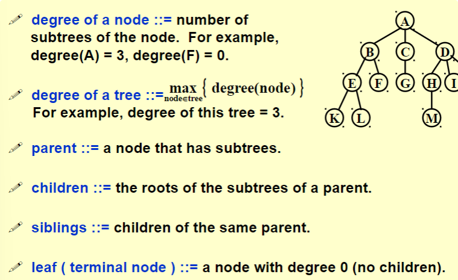
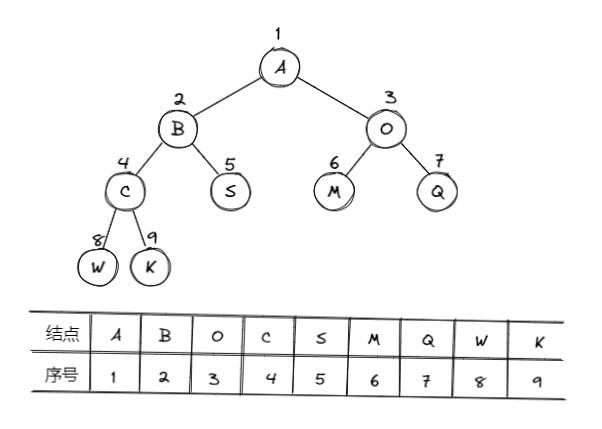
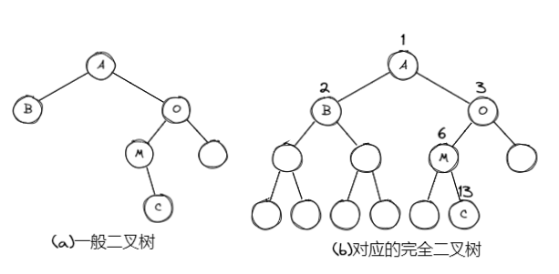
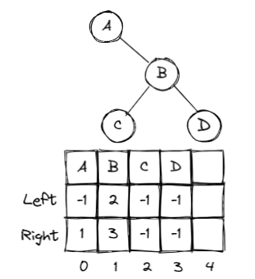

# 树 | Tree

## 树的定义

* 树：n(n $\ge$ 20)个节点构成的有限集合；
* 当n = 0时，称为空树；
* 对于任一棵非空树(n $>$ 0)，它具备以下性质：
  * 树中有一个称为“根”的特殊节点，用r表示；
  * 其余节点可分为m(m $>$ 0)个互不相交的有限集 T~1~ , T~2~ , ···, T~m~ , 其中每个集合本身又是一棵树，称为原来树的“子树”

### 一些基本术语

1. 节点的度(Degree): 节点的子树个数
2. 树的度：树的所有节点中最大的度数
3. 叶节点(Leaf): 度为0的节点
4. 父节点(Parent): 有子树的节点是其子树的根节点的父节点
5. 子节点(Child): 若A节点是B节点的父节点，则称B节点是A节点的子节点；子节点也称孩子节点
6. 兄弟节点(Sibiling): 具有同一父节点的各节点彼此是兄弟节点
7. 路径和路径长度：从节点 n~1~ 到 n~k~ 的路径为一个节点序列 n~1~ , n~2~ ,···, n~k~ , n~i~ 是 n~i+1~ 的父节点。路径所包含边的个数为路径的长度
8. 祖先节点(Ancestor): 沿树根到某一节点路径上的所有节点都是这个节点的祖先节点。
9. 子孙节点(Descendant): 某一节点的子树中的所有节点是这个节点的子孙。
10. 节点的层次(Level): 规定根节点在1层，其他任一节点的层数是其父节点的层数加1
11. 树的深度(Depth): 树中所有节点中最大层次是这棵树的深度

??? quote
     
     

### 二叉树的定义

* 二叉树(binary tree): 通常指有根二叉树。每个节点至多有两个子节点的树。通常将子节点确定一个顺序，称左子节点和右子节点
* 特殊二叉树
    1. 完整二叉树(full/proper binary tree): 每个节点的子节点均为0或2个
     $$leaves = nodes-\frac{nodes-1}{degree}$$ 
    2. 完美二叉树(即满二叉树，perfect binary tree): 所有叶节点深度均相同的二叉树——深度为k(k $\ge$ -1)且有 2^k+1^ - 1 个节点
    3. 完全二叉树(complete binary tree): 仅最深两层节点的度可以小于2，且最深一层的节点都集中在该层最左边的连续位置上 || 所有节点的编号都与满二叉树中的编号相同的二叉树
    4. 斜二叉树(skewed binary tree): 没有任何左/右节点的树，称为右/左斜二叉树

### 二叉树的几个重要性质

1. 一个二叉树第i层的最大节点数为: 2^i-1^ , i $\ge$ 1
2. 深度为k的二叉树有最大节点总数为: 2^k^ - 1 , k $\ge$ 1
3. 对任何非空二叉树，若 n~0~ 表示叶节点的个数、n~2~ 是度为2的非叶节点个数，那么两者满足关系 n~0~ = n~2~ + 1
   
## 二叉树的抽象数据类型

* **类型名称** : 二叉树
* **数据对象集** : 一个有穷的节点集合。若不为空，则由根节点和其左、右二叉子树组成

* **操作集** : BT $\in$ BinTree，Item $\in$ ElementType, 重要操作有：
!!! note
    1. Boolean IsEmpty( BinTree BT ): 判断BT是否为空<br>
    2. void Traversal( BinTree BT ): 遍历，按某顺序访问每个节点<br>
    3. BinTree CreateBinTree( ): 创建一个二叉树<br>

## 二叉树的存储结构

### 顺序存储结构

1. 完全二叉树: 从上到下、从左至右顺序存储n个节点的完全二叉树的节点父子关系；
!!! example
     <br>
     完全二叉树的叶子节点数: $n_0 = \frac{n+1}{2}$ <br>
           1. 当n为偶数时，$n_0 = \frac{n}{2}$ <br>
           2. 当n为奇数时，$n_0 = \frac{n+1}{2}$

* 非根节点(序号i > 1)的父节点的序号是 $\lfloor \frac{i}{2} \rfloor $ (不超过 i/2 的最大整数)；
    * 节点(序号为i)的左孩子节点的序号是 2i (2i $\le$ n，否则没有左孩子)
    * 节点(序号为i)的右孩子节点的序号是 2i+1 (2i+1 $\le$ n，否则没有右孩子)
  
2. 一般二叉树: 也可以采用上述结构，但会造成空间浪费
??? example
    
* 链表存储(每个节点的结构可以如下表示)

!!! note
    ```c
        typedef struct TreeNode *BinTree;
        typedef BinTree Position;
        struct TreeNode{
            ElementType Data;
            BinTree Left;
            BinTree Right;
        }
    ``` 

## 二叉树的遍历

### 先序遍历 | PreOrder

* 遍历过程
    1. 访问根节点
    2. 先序遍历左子树
    3. 先序遍历右子树
    ??? example
        <br>
        print的顺序 $\Rightarrow$ A B D F E C G H I
??? note "递归算法"
    ```c
      void PreOrderTraversal( BinTree BT)
      {
          if( BT ){
              printf("%d", BT->Data);
              PreOrderTraversal(BT->Left);
              PreOrderTraversal(BT->Right);
          }
      }
    ```

### 中序遍历 | InOrder

* 遍历过程
    1. 中序遍历其左子树
    2. 访问根节点
    3. 中序遍历其右子树
    ??? example
        <br>
        print的顺序 $\Rightarrow$ D B E F A G H C I
??? note "递归算法"
    ```c
      void InOrderTraversal( BInTree BT)
      {
          if( BT ){
              PreOrderTraversal(BT->Left);
              printf("%d", BT->Data);
              PreOrderTraversal(BT->Right);
          }
      }
    ```
??? note "非递归算法"
    ```c
      void InOrderTraversal(BinTree BT)
      {
          BinTree T = BT;
          Stack S = CreatStack(MaxSize);	/*创建并初始化堆栈S*/
          while(T || !IsEmpty(S))
          {
              while(T)					/*一直向左并将沿途节点压入堆栈*/
              {
                  Push(S, T);
                  T = T->Left;
              }
              if(!IsEmpty(S))
              {
                  T = Pop(S);				/*节点弹出堆栈*/
                  printf("%5d", T->Data);	/*（访问）打印节点*/
                  T = T->Right;			/*转向右子树*/
              }
          }
      }
    ```

### 后序遍历 | PostOrder

* 遍历过程
    1. 后序遍历其左子树
    2. 后序遍历其右子树
    3. 访问根节点
    ??? example
        <br>
        print的顺序 $\Rightarrow$ D E F B H G I C A
??? note "递归算法"
    ```c
      void PostOrderTraversal( BInTree BT)
      {
          if( BT ){
              PreOrderTraversal(BT->Left);
              PreOrderTraversal(BT->Right);
              printf("%d", BT->Data);
          }
      }
    ```

### 层序遍历 | LevelOrder

* 层序基本过程:
    1. 根节点入队
    2. 从队列中取出一个元素
    3. 访问该元素所指节点
    4. 若该元素所指节点的左、右孩子节点非空，则将其左、右孩子的指针入队

??? example "层序遍历的队列实现"
    ```c
    void LevelOrderTraversal(BinTree BT)
    {
        Queue Q;
        BinTree T;
        if(!BT)	return;				/*若是空树则直接返回*/
        Q = CreatQueue(MaxSize);	/*创建并初始化队列Q*/
        AddQ(Q, BT);
        while(!IsEmptyQ(Q))
        {
            T = DeleteQ(Q);
            printf("%d\n", T->Data);	/*访问取出队列的节点*/
            if(T->Left)		
                AddQ(Q, T->Left);
            if(T->Right)
                AddQ(Q, T->Right);
        }
    }
    ```

## 建树及同构判别

### 二叉树表示

* 结构数组表示二叉树: 静态链表



??? example "code"
    ```c title="二叉树表示"
    #define MaxTree 10
    #define ElementType char
    #define Tree int
    #define Null -1
    struct TreeNode
    {
        ElementType Element;
        Tree Left;
        Tree Right;
    }T1[MaxTree], T2[MaxTree];
    ```

### 程序框架搭建

```c title="Pseudocode: main_function"
    int main()
    {
        建二叉树1;
        建二叉树2;
        判断是否同构并输出;

        return 0;
    }
```
??? example "code"
    ```c title="main"
    int main()
    {
        Tree R1, R2;
        
        R1 = BuildTree(T1);
        R2 = BuildTree(T2);
        if(Isomorphic(R1, R2))
            printf("Yes\n");
        else
            printf("No\n");
        
        return 0;
    }
    ```
    ```c title="BuildTree"
    Tree BulidTree(struct TreeNode T[])
    {
        ……
        scanf("%d\n", &N);
        if(N)
        {
            for(i=0; i<N; i++)
            {
                scanf("%c %c %C\n", &T[i].Element, &cl, &cr);
                if(cl != '-')
                {
                    T[i].Left = cl-'0';
                    check[T[i].Left] = 1;
                }
                else
                {
                    T[i].Left = Null;
                    T[i].Right = cr-'0';
                    check[T[i].Right] = 1;
                }
                for(i=0; i<N; i++)
                    if(!check[i]) 
                        break;
                Root = i;
            }
        }
        return Root;
    }
    ```
    ```c title="判断同构"
    int Isomorphic(Tree R1, Tree R2)
    {
        if((R1==Null) && (R2==Null))
            return 1;
        if(((R1==Null) && (R2!=Null)) || ((R1!=Null) && (R2==Null)))
            return 0;
        if(T1[R1].Element != T2[R2].Element)
            return 0;
        if((T1[R1].Left == Null) && (T2[R2].Left == Null))
            return Isomorphic(T1[R1].Right, T2[R2].Right);
        
        if(((T1[R1].Left != Null) && (T2[R2].Left != Null))&&
        ((T1[T1[R1].Left].Element) == (T2[T2[R2].Left].Element)))
            return (Isomorphic(T1[R1].Left,T2[R2].Left ) &&
                    Isomorphic(T1[R1].Right,T2[R2].Right ));
        else
            return (Isomorphic(T1[R1].Left,T2[R2].Right ) &&
                    Isomorphic(T1[R1].Right,T2[R2].Left ));
        
    }
    ```

## 二叉搜索树 | Binary Search Tree(BST)

> 二叉搜索树，也称二叉排序树或二叉查找树

* 一棵二叉树可以为空；如果不为空，满足以下性质：
    1. 非空左子树的所有键值小于其根节点的键值
    2. 非空右子树的所有键值大于其根节点的键值
    3. 左、右子树都是二叉搜索树

### BST的特别函数

#### Find()

> 从BST中查找元素 X, 返回其所在节点的地址

1. 查找从根节点开始，如果树为空，返回 NULL
2. 若搜索树非空，则将根节点关键字和 X 进行比较，并进行不同处理:
      1. 若 X 小于根节点键值，只需在左子树中继续搜索
      2. 若大于，则在右子树中继续搜素
      3. 若相等，搜索完成，返回指向此节点的指针
??? example "code"
    ```c
    Position Find( ElementType X, BinTree BST )
    {
        if( !BST)	return NULL;
        if( X > BST->Data )
            return Find( X, BST->Right );	/*尾递归*/
        else if( X < BST->Data)
            return Find( X, BST->Left );	/*尾递归*/
        else
            return BST;
    }
    ```
    由于非递归函数执行效率高，可将“尾递归”函数改为迭代函数
    ```c
    Position IterFind( ElementType X, BinTree BST)
    {
        while( BST )
        {
            if( X > BST->Data )
                BST = BST->Right;
            else if( X < BST->Data )
                BST = BST->Left;
            else
                return BST;
        }
        return NULL;
    }
    ```

#### FindMin()

* 从BST中查找并返回最小元素所在节点的地址
* 最小元素一定在树的最左分支的端节点上

```c
Position FindMin( BinTree BST)
{
    if( !BST )
        return NULL;
    else if( !BST->Left)
        return BST;
    else
        return FindMin( BST->Left );
}
```

#### FindMax()

* 从二叉搜索树BST中查找并返回最大元素所在节点的地址
* 最大元素一定在树的最右分支的端节点上

```c
Position FindMax( BinTree BST)
{
    if( BST )
        while(BST->Right)
            BST = BST->Right;
        return BST;
}
```

#### Insert()

* 插入X(可以采用与Find类似的方法)

```c
BinTree Insert( ElementType X, BinTree BST)
{
    if( !BST )
    {
        BST = malloc(sizeof(struct TreeNode));
        BSt->Data = X;
        BST->Left = BST->Right = NULL;
    }
    else
    {
        if( X < BST->Data )
            BST->Left = Insert( X, BST->Left);
        else if( X > BST->Data)
            BST->Right = Insert( X, BST->Right);
    }
    return BST;
}
```

#### Delete()

* 考虑三种情况
    1. 要删除的节点是叶节点：直接删除，并再修改其父节点指针——置为NULL
    2. 要删除的节点只有一个孩子节点：将其父节点的指针指向要删除节点的孩子节点
    3. 要删除的节点有左右两颗子树：用另一节点替代被删除节点——右子树的最小元素 或者 左子树的最大元素

```c
BinTree Delete( ELementType X, BinTree BST)
{
    Position Tmp;
    if( !BST )
        printf("要删除的元素未找到");
    else if( X < BST->Data )
        BST->Left = Delete( X, BST->Left);/*左子树递归删除*/
    else if( X > BST->Right )
        BST->Right = Delete( X, BST->Right);/*右子树递归删除*/
    else
        if( BST->Left && BST->Right )
        {
            Tmp = FindMin( BST->Right );
                        /*在右子树中找到最小元素填充删除节点*/
            BST->Data = Tmp->Data;
            BST->Right = Delete( BST->Data, BST->Right);
        }
        else	/*被删除节点有一个或无子节点*/
        {
            Tmp = BST;
            if( !BST->Left)	/*有右孩子或无*/
                BST = BST->Right;
            else if( !BST->Right)/*有左孩子或无*/
                BST = BST->Left;
            free( Tmp );
        }
    return BST;
}
```

## 线索二叉树 | Threaded binary tree

* Rule 1: 若节点的左子树为空，将其空左儿子指向中序遍历前驱(上一个遍历的节点)
* Rule 2: 空右儿子指向中序遍历的后继(若前驱/后继均无，则引出为 NULL)
* Rule 3: 线索二叉树必须有一个头节点且其左儿子指向第一个节点

```c
typedef  struct  ThreadedTreeNode  *PtrTo  ThreadedNode;
typedef  struct  PtrToThreadedNode  ThreadedTree;
typedef  struct  ThreadedTreeNode {
    int     LeftThread;   /* if it is TRUE, then Left */
    ThreadedTree  Left;      /* is a thread, not a child ptr.   */ 
    ElementTypeElement;intRightThread; /* if it is TRUE, then Right */
    ThreadedTree  Right;    /* is a thread, not a child ptr.   */
}
```
!!! quote
    [CSDN-线索二叉树](https://blog.csdn.net/qq_46104786/article/details/121361566?spm=1001.2101.3001.6650.1&utm_medium=distribute.pc_relevant.none-task-blog-2%7Edefault%7ECTRLIST%7ERate-1-121361566-blog-70183267.pc_relevant_aa&depth_1-utm_source=distribute.pc_relevant.none-task-blog-2%7Edefault%7ECTRLIST%7ERate-1-121361566-blog-70183267.pc_relevant_aa&utm_relevant_index=2)

## 优先队列 | Priority Queues

!!! abstract
    * 优先队列(priority queue)也称为堆(heap)
    * 特殊的"队列"，取出元素的顺序是按照元素的优先级(关键字)大小，而不是元素进入队列的先后顺序

??? example "堆的一些例子"
    
    <center><font face="JetBrains Mono" size=2 color=grey >图片摘自 MOOC</font></center>

### 若采用数组或链表实现

* 数组: 
    * 插入 —— 元素总是插入尾部          ~ $\Theta (1)$ 
    * 删除 —— 
        * 查找最大(或最小)关键字        ~ $\Theta (n)$ 
        * 从数组中删去需要移动的元素    ~ $O(n)$ 
* 链表:
    * 插入 —— 元素总是插入链表头部      ~ $\Theta (1)$ 
    * 删除 ——
        * 查找最大(或最小)关键字        ~ $\Theta (n)$ 
        * 删去节点                      ~ $\Theta (1)$ 
* 有序数组:
    * 插入 —— 
        * 找到合适的位置                ~ $O(n)$ 或 $O(log_2 n)$ 
        * 移动与元素并插入              ~ $O(n)$ 
    * 删除 —— 删去最后一个元素          ~ $\Theta (1)$
* 有序链表: 
    * 插入 —— 
        * 找到合适的位置                ~ $O(n)$ 
        * 插入元素                      ~ $\Theta (1)$ 
    * 删除 —— 删除首元素或最后元素      ~ $\Theta (1)$ 
 
### 二叉堆 | binary heap

* 二叉堆是一种完全二叉树——任意节点的值都 $\le$ (或 $\ge$ ) 父节点的值(即最大最小堆)

!!! info "引申"
    * D-heap | D-堆 是指每个节点有 d 个儿子
        * 若D-堆使用数组存储，且一个节点的下标为 i 
        * 其父节点的位置是 $\lceil (i + d - 2)/d \rceil $  
        * 其第一个儿子位于 $ (i - 2)d + 2 $ 
        * 最后一个儿子位于 $ (i - 1)d + 1 $ 
    
    ??? example "一道PTA例题"
        

### 堆的操作

> 以最大堆为例

1. 最大堆的创建
```c
typedef struct HeapStruct *MaxHeap;
struct HeapStruct{
    ElementType *Elements;	/*存储堆元素的数组*/
    int	Size;	/*堆的当前元素个数*/
    int Capacity;	/*堆的最大容量*/
};

MaxHeap Create( int MaxSize )
{
    MaxHeap H = malloc(sizeof( struct HeapStruct));
    H->Elements = malloc((MaxSize+1) * sizeof(ELementType));
    H->Size = 0;
    H->Capacity = MaxSize;
    H->Elements[0] = MaxData;
        /*定义“哨兵”为大于堆中所有可能元素的值，便于以后更快操作*/
    return H;
}
```
2. 插入——先放到最后一个位置，然后和父节点比较交换···
```c
void Insert(MaxHeap H, ElementType item)
{
    /*将元素item插入到最大堆H，其中H->Elements[0]已经定义为哨兵*/
    int i;
    if(IsFull(H))
    {
        printf("最大堆已满");
        return ;
    }
    i = ++H->Size;	/*i指向插入后堆中的最后一个元素的位置*/
    for(; H->Elements[i/2] < item; i /=2)
        H->Elements[i] = H->Elements[i/2];	/*向下过滤节点*/
    H->Elements[i] = item;	/*将item插入*/
}
```
> `H->Elements[0]` 是哨兵元素，它不小于堆中的最大元素，控制循环结束
3. 删除——将最后一个元素放到根节点，然后和儿子比较交换···
```c
ElementType DeleteMax( MaxHeap H)
{/*从最大堆H中取出键值为最大的元素，并删除一个节点*/
    int Parent, Child;
    ElementType MaxItem, temp;
    if( IsEmpty(H))
    {
        printf("最大堆已为空");
        return ;
    }
    MaxItem = H->Elements[1];	/*取出根节点最大值*/
    /*用最大堆中最后一个元素从根节点开始向上过滤下层节点*/
    temp = H->Elements[H->Size--];
    for( Parent=1; Parent*2 <= H->Size; Parent = Child)
    {
        Child = Parent * 2;
        if((Child != H->Size) && 
        (H->Elements[Child] < H->Elements[Child+1]))
            Child ++;	/*Child指向左右子节点的较大者*/
        if( temp >= H->Elements[Child])
            break;
        else	/*移动temp元素到下一层*/
            H->Elements[Parent] = H->Elements[Child];
    }
    H->Elements[Parent] = temp;
    return MaxItem;
}
```
4. Percolate: 自上而下或自下而上堆化(将元素向上或向下移动)
      * 可以实现非最值元素的删除
5. 构建一个堆——将已存在的 N 个元素按堆要求存放到一个一维数组
      * 通过插入操作，将 N 个元素相继插入到一个初始化为空的栈中，时间代价最大为 $O(NlogN)$ 
      * 时间复杂度为 $O(N)$ 的建立方法
          1. 将 N 个元素按输入顺序存入，先满足完全二叉树的结构特性
          2. 调整节点位置，即进行 Percolate 操作以满足最大堆的有序特性

??? example "完整代码"
    ```c
    typedef struct HNode *Heap; /* 堆的类型定义 */
    struct HNode {
        ElementType *Data; /* 存储元素的数组 */
        int Size;          /* 堆中当前元素个数 */
        int Capacity;      /* 堆的最大容量 */
    };
    typedef Heap MaxHeap; /* 最大堆 */
    typedef Heap MinHeap; /* 最小堆 */

    #define MAXDATA 1000  /* 该值应根据具体情况定义为大于堆中所有可能元素的值 */

    MaxHeap CreateHeap( int MaxSize )
    { /* 创建容量为MaxSize的空的最大堆 */

        MaxHeap H = (MaxHeap)malloc(sizeof(struct HNode));
        H->Data = (ElementType *)malloc((MaxSize+1)*sizeof(ElementType));
        H->Size = 0;
        H->Capacity = MaxSize;
        H->Data[0] = MAXDATA; /* 定义"哨兵"为大于堆中所有可能元素的值*/

        return H;
    }

    bool IsFull( MaxHeap H )
    {
        return (H->Size == H->Capacity);
    }

    bool Insert( MaxHeap H, ElementType X )
    { /* 将元素X插入最大堆H，其中H->Data[0]已经定义为哨兵 */
        int i;
    
        if ( IsFull(H) ) { 
            printf("最大堆已满");
            return false;
        }
        i = ++H->Size; /* i指向插入后堆中的最后一个元素的位置 */
        for ( ; H->Data[i/2] < X; i/=2 )
            H->Data[i] = H->Data[i/2]; /* 上滤X */
        H->Data[i] = X; /* 将X插入 */
        return true;
    }

    #define ERROR -1 /* 错误标识应根据具体情况定义为堆中不可能出现的元素值 */

    bool IsEmpty( MaxHeap H )
    {
        return (H->Size == 0);
    }

    ElementType DeleteMax( MaxHeap H )
    { /* 从最大堆H中取出键值为最大的元素，并删除一个节点 */
        int Parent, Child;
        ElementType MaxItem, X;

        if ( IsEmpty(H) ) {
            printf("最大堆已为空");
            return ERROR;
        }

        MaxItem = H->Data[1]; /* 取出根节点存放的最大值 */
        /* 用最大堆中最后一个元素从根节点开始向上过滤下层节点 */
        X = H->Data[H->Size--]; /* 注意当前堆的规模要减小 */
        for( Parent=1; Parent*2<=H->Size; Parent=Child ) {
            Child = Parent * 2;
            if( (Child!=H->Size) && (H->Data[Child]<H->Data[Child+1]) )
                Child++;  /* Child指向左右子节点的较大者 */
            if( X >= H->Data[Child] ) break; /* 找到了合适位置 */
            else  /* 下滤X */
                H->Data[Parent] = H->Data[Child];
        }
        H->Data[Parent] = X;

        return MaxItem;
    } 

    /*----------- 建造最大堆 -----------*/
    void PercDown( MaxHeap H, int p )
    { /* 下滤：将H中以H->Data[p]为根的子堆调整为最大堆 */
        int Parent, Child;
        ElementType X;

        X = H->Data[p]; /* 取出根节点存放的值 */
        for( Parent=p; Parent*2<=H->Size; Parent=Child ) {
            Child = Parent * 2;
            if( (Child!=H->Size) && (H->Data[Child]<H->Data[Child+1]) )
                Child++;  /* Child指向左右子节点的较大者 */
            if( X >= H->Data[Child] ) break; /* 找到了合适位置 */
            else  /* 下滤X */
                H->Data[Parent] = H->Data[Child];
        }
        H->Data[Parent] = X;
    }

    void BuildHeap( MaxHeap H )
    { /* 调整H->Data[]中的元素，使满足最大堆的有序性  */
    /* 这里假设所有H->Size个元素已经存在H->Data[]中 */

        int i;

        /* 从最后一个节点的父节点开始，到根节点1 */
        for( i = H->Size/2; i>0; i-- )
            PercDown( H, i );
    }
    ```

## 并查集 | disjoint set

!!! abstract
    并查集是一种数据结构，支持两种操作: 

    * Union | 合并集合
    * Find | 查询元素所在集合

并查集中集合存储的两种实现: 

* 树结构存储: 树的每一个节点代表一个集合元素
!!! example
    
* 数组存储: 将数组中每个元素的类型描述为
```c
typedef struct{
    ElementType Data;
    int Parent;
}SetType;
```
!!! example
    

### 集合运算 -- Find

> 查找某个元素所在集合(用根节点表示)

```c
int Find( SetType S[], ELementType X)
{
    /*在数组S中查找值为X的元素所属的集合*/
    /*MaxSize是全局变量，为数组S的最大长度*/
    int i;
    for( i=0; i < MaxSize && S[i].Data != X; i++);
    if( i >= MaxSize )
        return -1;	/*未找到X,返回 -1*/
    for( ; S[i].Parent >= 0; i = S[i].Parent);
    return i;	/*找到X所属的集合，返回树根节点在数组S中的下标*/	
}
```

### 集合运算 -- Union

1. 分别找到 X1 和 X2 两个元素所在集合树的根节点
2. 若不同根，则将其中一个根节点的父节点的数组下标设为另一根节点的数组下标
```c
void Union( SetType S[], ElementType X1, ElementType X2)
{
    int Root1, Root2;
    Root1 = Find(S, X1);
    Root2 = Find(S, X2);
    if( Root1 != Root2)
        S[Root2].Parent = Root1;
}
```
> 为改善合并后的查找性能，可以采用将小的集合合并到相对大的集合中(并用利用数组下标提示集合中元素数量)
> 
> <center><font face="JetBrains Mono" size=2 color=grey >图片摘自 MOOC</font></center>

#### Smart Union -- Union-by-Size

> * 按大小合并(union-by-size)始终将小的树合并到大的树上，进而减小树的高度
> * 令 S[root] = -size (size 表示树的大小并初始化为 -1)

!!! note "Lemma"
    * Let $T$ be a tree created by union-by-size with N nodes, then $height(T) \le \lfloor log_2N \rfloor + 1$
    * Proof: 通过归纳法，每个元素的集合名最多更改 $log_2 N$ 次
    * 且 N 次 union 和 M 次 find 操作的时间复杂度为 $O( N + M log_2 N )$ 

    ??? quote 
        

在数组中采用树的大小的负值来记录，以证明若使用按大小求并则连续 M 次运算需要 $O(M)$ 平均时间。这是因为当随机的 Union 执行时整个算法一般只有一些很小的集合（通常含一个元素）与大集合合并。

#### Smart Union -- Union-by-Height

> * 按高度合并(union-by-height)始终将浅的树成为深的树
> * 同样保证了所有的树的深度最多是 $O(log N)$ 

??? quote
    

### 路径压缩 | Path Compression

* 路径压缩在一次 Find 操作期间执行。设操作为 Find(X)，此时路径压缩的效果是: 从 X 到根的路径上的每一个节点都使其父节点变成根。
```c
SetType Find(ElementType X, DisjSet S)
{
    return (S[X] <= 0) ? X : S[X] = Find(S[X], S);
}
```
* 路径压缩对于基本的 Find 操作唯一的变化是使得 S[X] 等于由 Find 返回的值
* 在集合的根被递归找到后， X 就直接指向它，因此实现路径压缩


