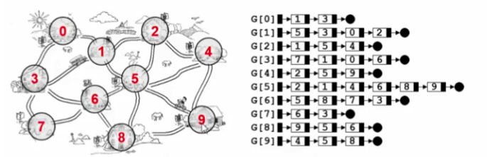
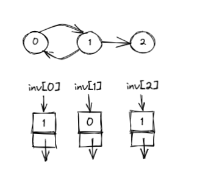
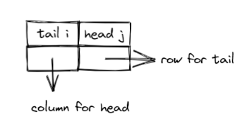
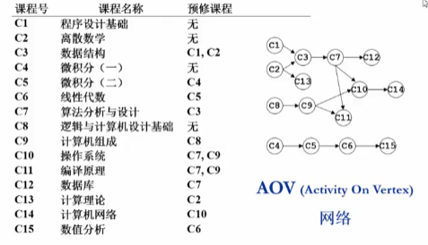
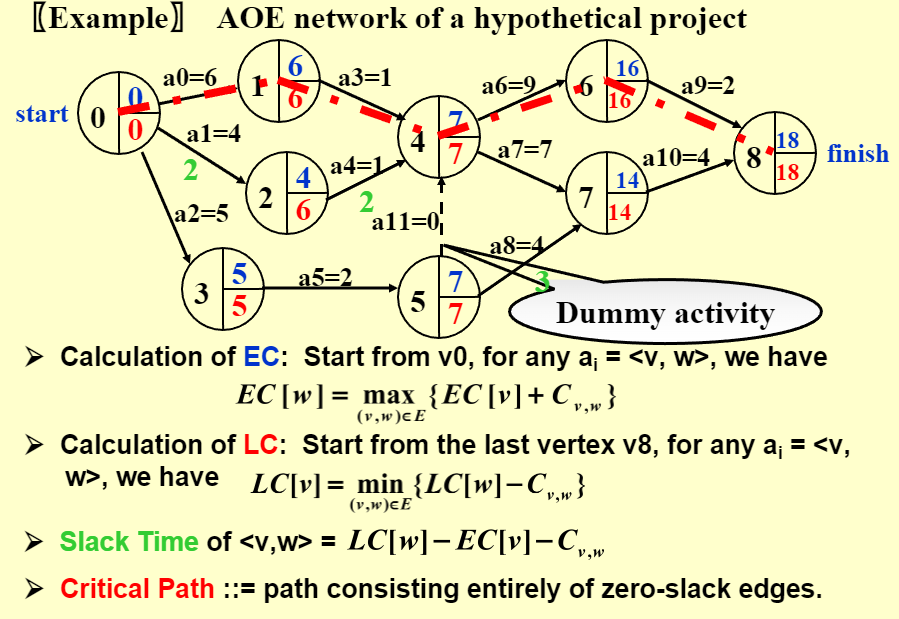
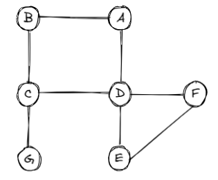

# 图 | Graph

## Definitions

1. Length of a path: 路径上边的数目
2. Simple path: Path 中的点 v~i1~, v~i2~, ···, v~in~ 都不同
3. 无向图
      1. connected: 若存在一条从 v~i~ 到 v~j~ 的路径，则称 v~i~ 和 v~j~ 连通
      2. connected graph: 任意点之间都连通，称无向图是连通的
      3. connected component: 无向图的极大连通子图
4. tree: 连通的无环图
5. DAG: directed acyclic graph | 有向无环图 
6. Strongly connected component: 有向图的极大强连通子图
7. Degree(v): 
      1. 对有向图，度分为入度和出度
      2. 对无向图，度数是与其相邻的节点数
      3. 边数等于所有节点的度数和除以 2

## 图的表示

1. 邻接矩阵 G[N][N] —— N 个顶点从 0 到 N-1 编号
      * G[i][j] = < v~i~, v~j~ > 是 G 中的边 ? 1 : 0
        
!!! tip
    * 对于无向图的存储，用一个长度为 N(N+1)/2 的一维数组 A 存储 {G~00~, G~10~, G~11~, ···, G~(n-1)0~, ···, G~(n-1)(n-1)~}, 则 G~ij~ 在 A 中对应的下标是: i * (i + 1) / 2 + j
    * 对于网络，只要把 G[i][j] 的值定义为边 < v~i~, v~j~ > 的权重即可
2. 邻接表表示法 —— G[N] 为指针数组，对应矩阵每行要给链表且只存非 0 元素
   
      * 对于无向图，每个边会被存储两次
      * 对于有向图，无法遍历入度，如果要查询入度可采用以下两种方法:
          * 增加逆邻接表 <br> 
          * 采用多重链表 <br> 

## 拓扑排序

!!! abstract
      * AOV 网络 —— 定点表示活动，边表示先后关系
      * 若存在一条从 i 到 j 的路径，则称 i 为 j  的前驱(predecessor), j 是 i 的后继(successor)
      * 若存在一条边 < i, j >，则称 i 是 j 的直接前驱(immediate predecessor)，j 是 i 的直接后继

### 拓扑序

* 若在图中从 V 到 W 有一条有向路径，则 V 一定排在 W 之前。满足此条件的顶点序列称为一个拓扑序(获得一个拓扑序的过程就是拓扑排序)
* AOV 如果有合理的拓扑序，则必定是有向无环图(Directed Acyclic Graph, DAG)
> 
> 如果有向图中出现环，一定不可能得到一个合理的拓扑序

### 拓扑排序算法

```c
void Topsort(Graph G)
{
      int Counter;
      Vertex V, W;
      for(Counter = 0; Counter < NUmVertex; Counter ++)
      {
            V = FindNeVertexOfDegreeZero();     /* O(|V|) */
            if(V == NotAVertex)
            {
                  Error("Graph has a cycle");
                  break;
            }
            TopNum[V] = Counter;    /*or output V*/
            for(each W adjacent to V)
                  Indegree[W] --;
      }
}
```

* 上述算法的时间复杂度 $T = O(|V|^2) $
* Improvement: 随时将入度变为 0 的顶点放到一个容器中(栈或队列等)

```c title="Improvement"
void Topsort( Graph G )
{   
      Queue  Q;
      int  Counter = 0;
      Vertex  V, W;
      Q = CreateQueue( NumVertex );  
      MakeEmpty( Q );
      for ( each vertex V )
            if ( Indegree[ V ] == 0 )   
                  Enqueue( V, Q );
      while ( !IsEmpty( Q ) )
      {
            V = Dequeue( Q );
            TopNum[ V ] = ++ Counter; /* assign next */
            for ( each W adjacent to V )
                  if ( – – Indegree[ W ] == 0 )  
                        Enqueue( W, Q );
      }  /* end-while */
      if ( Counter != NumVertex )
            Error( “Graph has a cycle” );
      
      DisposeQueue( Q ); /* free memory */}
```
> 若有环则一定会存在找不到入度为 0 的点，来进入构成环的子图

??? example "邻接表存储---拓扑排序算法"
    ```c
    bool TopSort( LGraph Graph, Vertex TopOrder[] )
    { /* 对Graph进行拓扑排序,  TopOrder[]顺序存储排序后的顶点下标 */
    int Indegree[MaxVertexNum], cnt;
    Vertex V;
    PtrToAdjVNode W;
    Queue Q = CreateQueue( Graph->Nv );
    
    /* 初始化Indegree[] */
    for (V=0; V<Graph->Nv; V++)
          Indegree[V] = 0;
          
    /* 遍历图，得到Indegree[] */
    for (V=0; V<Graph->Nv; V++)
          for (W=Graph->G[V].FirstEdge; W; W=W->Next)
                Indegree[W->AdjV]++; /* 对有向边<V, W->AdjV>累计终点的入度 */
                
    /* 将所有入度为0的顶点入列 */
    for (V=0; V<Graph->Nv; V++)
          if ( Indegree[V]==0 )
                AddQ(Q, V);
                
    /* 下面进入拓扑排序 */ 
    cnt = 0; 
    while( !IsEmpty(Q) ){
          V = DeleteQ(Q); /* 弹出一个入度为0的顶点 */
          TopOrder[cnt++] = V; /* 将之存为结果序列的下一个元素 */
          /* 对V的每个邻接点W->AdjV */
          for ( W=Graph->G[V].FirstEdge; W; W=W->Next )
                if ( --Indegree[W->AdjV] == 0 )/* 若删除V使得W->AdjV入度为0 */
                AddQ(Q, W->AdjV); /* 则该顶点入列 */ 
    } /* while结束*/
    
    if ( cnt != Graph->Nv )
          return false; /* 说明图中有回路, 返回不成功标志 */ 
    else
          return true;
    }
    ```

## 最短路算法

!!! abstract "最短路径问题的抽象"
    在网络中，求两个不同顶点之间的所有路径中，边的权值之和最小的那一条路径。这条路径即两点之间的最短路径(Shortest Path), 第一个顶点为源点(Source), 最后一个顶点为终点(Destination)

### 问题分类

1. 单源最短路径: 从固定源点出发，求其到所有其他顶点的最短路径
      1. (有向)无权图
      2. (有向)有权图
2. 多源最短路径: 求任意两顶点间的最短路径

### 无权图的单源最短路

> 按照递增(递减)的顺序找出到各顶点的最短路
> 采用 BFS(Breadth-first search)

!!! note "Implementation"
    ```c
    Table[i].Dist = distance from s to vi  /* initialized to be  except fors */
    Table[i].Known = 1 if vi is checked; or 0 if not
    Table[ i ].Path = for tracking the path   /* initialized to be 0 */
    ```
1. Normal:
```c
void Unweighted( Table T )
{   int  CurrDist;
    Vertex  V, W;
    for ( CurrDist = 0; CurrDist < NumVertex; CurrDist ++ ) {
        for ( each vertex V )
	if ( !T[ V ].Known && T[ V ].Dist == CurrDist ) {
	    T[ V ].Known = true;
	    for ( each W adjacent to V )
	        if ( T[ W ].Dist == Infinity ) {
		T[ W ].Dist = CurrDist + 1;
		T[ W ].Path = V;
	        } /* end-if Dist == Infinity */
	} /* end-if !Known && Dist == CurrDist */
    }  /* end-for CurrDist */
}
```
> $T = O(|V|^2)$ 
2. Improvement:
```c
void Unweighted( Table T )
{   /* T is initialized with the source vertex S given */
    Queue  Q;
    Vertex  V, W;
    Q = CreateQueue (NumVertex );  MakeEmpty( Q );
    Enqueue( S, Q ); /* Enqueue the source vertex */
    while ( !IsEmpty( Q ) ) {
        V = Dequeue( Q );
        T[ V ].Known = true; /* not really necessary */
        for ( each W adjacent to V )
	if ( T[ W ].Dist == Infinity ) {
	    T[ W ].Dist = T[ V ].Dist + 1;
	    T[ W ].Path = V;
	    Enqueue( W, Q );
	} /* end-if Dist == Infinity */
    } /* end-while */
    DisposeQueue( Q ); /* free memory */
}
```
> $T = O(|V|+|E|)$ 

### 有权图的单源最短路

> 按照递增的顺序找出到各顶点的最短路

#### Dijkstra 算法

* 令 S = {源点 s + 已经确定了最短路径的顶点 v~i~ }
* 对任一未收录的顶点 v, 定义 dist[v] 为 s 到 v 的最短路径长度，但该路径仅经过 s 中的顶点。
* 由于路径按照递增顺序生成
    * 真正的最短路必须只经过 S 中的顶点
    * 每次从未收录的顶点中选一个 dist 最小的收录
    * 增加一个 v 进入 S，可能影响另一个 w 的 dist 值(dist[w] = min{dist[w], dist[v] + < v, w > 的权重})

!!! example "code"
    ```c title="伪码"
    void Dijkstra(Table T)
    {
          Vertex V, W;
          for(;;)     /* O(|V|) */
          {
                V = smallest unknown distance vertex;
                if(V == NotAVertex)
                      break;
                T[V].Known = true;
                for(each W adjacent to V)
                      if(!T[W].Known)
                            if(T[V].Dist + Cvw < T[W].Dist)
                            {
                                  Decrease(T[W].Dist to T[V].Dist + Cvw);
                                  T[W].Path = V;
                            }/* end-if update W */
          }/* end-for(;;) */
    }
    /* 不能解决有负边的情况 */
    ```

    ??? example "Dijkstra算法的声明"
        ```c 
        typedef int Vertex;
        struct TableEntry
        {
              List Header;      /* Adjacency list */
              int Known;
              DistType Dist;
              Vertex Path;
        };
        /* Vertices are numbered from 0 */
        #define NotAVertex (-1)
        typedef struct TableEntry Table[NumVertex];
        ```

    ??? example "表初始化例程"
        ```c 
        void InitTable(Vertex Start, Graph G, Table T)
        {
              int i;
              ReadGraph(G, T);  /* Read graph somehow */
              for(i = 0; i < NumVertex; i++)
              {
                    T[i].Known = False;
                    T[i].Dist = Infinity;
                    T[i].Path = NotAVertex;
              }
              T[Start].dist = 0;
        }
        ```

    ??? example "显示实际最短路径的例程"
        ```c
        /* Print shortest path to V after Dijkstra has run */
        /* Assume that the path exists */
        void PrintPath(Vertex V, Table T)
        {
              if(T[V].Path != NotAVertex)
              {
                    PrintPath(T[V].Path, T);
                    printf(" to");
              }
              printf("%v", V);  // %v 是伪代码
        }
        ```
* 因为判定条件 T[V].Dist + Cvw < T[W].Dist，T[i].Dist 要初始化为正无穷
* 优化如下：
    * Implementation 1: 直接扫描所有未收录顶点 -- $O(|V|)$ 
        * $T = O(|V|^2 + |E|)$ -- 对于稠密图效果好
    * Implementation 2: 将 dist 存在最小堆中 -- $O(log|V|)$ 
        * 更新 T[W].Dist 的值 -- $O(log|V|)$ 
        * $ T = O(|V|log|V| + |E|log|V|) = O(|E|log|V|) $  -- 对稀疏图效果好(指 V 和 E 一个数量级)

#### 带负权图

时间复杂度 $T = O(|V| \times |E|)$
```c
void  WeightedNegative( Table T )
{   
    Queue  Q;
    Vertex  V, W;
    Q = CreateQueue (NumVertex );  
    MakeEmpty( Q );
    Enqueue( S, Q ); /* Enqueue the source vertex */
    while ( !IsEmpty( Q ) ) 
    {
        V = Dequeue( Q );   /* each vertex can dequeue at most |V| times */
        for ( each W adjacent to V )
            if ( T[ V ].Dist + Cvw < T[ W ].Dist )  /* no longer once per edge */
            {
                T[ W ].Dist = T[ V ].Dist + Cvw;
                T[ W ].Path = V;
                if ( W is not already in Q )
                    Enqueue( W, Q );
            } /* end-if update */
    } /* end-while */
    DisposeQueue( Q ); /* free memory */
}
/* negative-cost cycle will cause indefinite loop */
```

#### 无环图 | Acyclic Graph

> 此部分主要是其在 AOE(Activity On Edge) 网络的应用 
> 一般用于安排项目的工序

* 每个结点存储一个最早完成时间和最晚完成时间
* 每条边存在一个持续时间(边权 C )和一个松弛时间
* 相关计算:
    * EC(earliest completion): 最早完成时间，从前往后计算
    * LC(latest completion): 最晚完成时间，用需要最长的时间从后向前依次减去
    * Slack Time: 松弛时间 | 机动时间，最早完成的时间和要求的最晚完成的时间之间的时间
    * Critical Path: 关键路径，可能不止一条但找出一条路径上所有点都是关键点（松弛时间为0）的就行

??? quote 
    
    <center><font face="JetBrains Mono" size=2 color=grey >图片摘自课程PPT </font></center>
    [CSDN-AOE网络(大力海棠的博客)](https://blog.csdn.net/justinzengTM/article/details/83062682)

??? success "拓展"

    !!! abstract "多源最短路"
        算法——(直接将单源最短路算法调用 |V| 遍 or Floyd 算法)

    ```c title="Floyd 算法"
    void Floyd()
    {
        for( i = 0; i < N; i++)
        {
            for( j = 0; j < N; j++)
            {
                D[i][j] = G[i][j];
                path[i][j] = -1;
                /*path用于记录路径*/
            }
        }
        for( k = 0; k < N; k++)
        {
            for( i = 0; i < N; i++)
            {
                for( j = 0; j < N; j++)
                {
                    if( D[i][k] + D[k][j] < D[i][j])
                    {
                        D[i][j] = D[i][k] + D[k][j];
                        path[i][j] = k;
                        /*如果将i到j的最短路径*/
                    }
                }
            }
        }
    }
    ```

## 最小生成树 | Minimum Spanning Tree

* 是一棵树，且：
    * 无回路
    * 连通的
    * |V|个顶点一定有|V|-1条边
* 是生成树
    * 包含全部顶点
    * |V|-1条边都在图中
* 边的权重和最小

> 向生成树中任加一条边都一定构成回路
> 最小生成树存在 $\Leftrightarrow$ 图连通

### Prim 算法

> 稠密图一般用次算法，每次寻找的是和已经收罗进最小生成树所有顶点相邻的边
> 类似 Dijkstra 算法, $T = O( |V| ^2 )$ 

??? example "code"
    ```c title="邻接矩阵存储"
    /* 邻接矩阵存储 - Prim最小生成树算法 */

    Vertex FindMinDist( MGraph Graph, WeightType dist[] )
    { /* 返回未被收录顶点中dist最小者 */
        Vertex MinV, V;
        WeightType MinDist = INFINITY;

        for (V=0; V<Graph->Nv; V++) {
            if ( dist[V]!=0 && dist[V]<MinDist) {
                /* 若V未被收录，且dist[V]更小 */
                MinDist = dist[V]; /* 更新最小距离 */
                MinV = V; /* 更新对应顶点 */
            }
        }
        if (MinDist < INFINITY) /* 若找到最小dist */
            return MinV; /* 返回对应的顶点下标 */
        else return ERROR;  /* 若这样的顶点不存在，返回-1作为标记 */
    }

    int Prim( MGraph Graph, LGraph MST )
    { /* 将最小生成树保存为邻接表存储的图MST，返回最小权重和 */
        WeightType dist[MaxVertexNum], TotalWeight;
        Vertex parent[MaxVertexNum], V, W;
        int VCount;
        Edge E;
        
        /* 初始化。默认初始点下标是0 */
        for (V=0; V<Graph->Nv; V++) {
            /* 这里假设若V到W没有直接的边，则Graph->G[V][W]定义为INFINITY */
            dist[V] = Graph->G[0][V];
            parent[V] = 0; /* 暂且定义所有顶点的父结点都是初始点0 */ 
        }
        TotalWeight = 0; /* 初始化权重和     */
        VCount = 0;      /* 初始化收录的顶点数 */
        /* 创建包含所有顶点但没有边的图。注意用邻接表版本 */
        MST = CreateGraph(Graph->Nv);
        E = (Edge)malloc( sizeof(struct ENode) ); /* 建立空的边结点 */
            
        /* 将初始点0收录进MST */
        dist[0] = 0;
        VCount ++;
        parent[0] = -1; /* 当前树根是0 */

        while (1) {
            V = FindMinDist( Graph, dist );
            /* V = 未被收录顶点中dist最小者 */
            if ( V==ERROR ) /* 若这样的V不存在 */
                break;   /* 算法结束 */
                
            /* 将V及相应的边<parent[V], V>收录进MST */
            E->V1 = parent[V];
            E->V2 = V;
            E->Weight = dist[V];
            InsertEdge( MST, E );
            TotalWeight += dist[V];
            dist[V] = 0;
            VCount++;
            
            for( W=0; W<Graph->Nv; W++ ) /* 对图中的每个顶点W */
                if ( dist[W]!=0 && Graph->G[V][W]<INFINITY ) {
                /* 若W是V的邻接点并且未被收录 */
                    if ( Graph->G[V][W] < dist[W] ) {
                    /* 若收录V使得dist[W]变小 */
                        dist[W] = Graph->G[V][W]; /* 更新dist[W] */
                        parent[W] = V; /* 更新树 */
                    }
                }
        } /* while结束*/
        if ( VCount < Graph->Nv ) /* MST中收的顶点不到|V|个 */
        TotalWeight = ERROR;
        return TotalWeight;   /* 算法执行完毕，返回最小权重和或错误标记 */
    }
    ```

### Kruskal 算法

将每个顶点都看作一棵树，收集的是边，如果这条边收入构成回路就不收入，如果不构成就收入（从边权重最小开始收，收到边的数量为|V|-1为止）

> 稀疏图一般用此算法（边的数量和顶点数量级差不多）
> $T = O(|E|log|E|) $

```c title="伪码"
void Kruskal ( Graph G )
{   
    T = { } ;
    while ( T contains less than |V| 1 edges && E is not empty ) 
    {
        choose a least cost edge (v, w) from E ;    /* DeleteMin */
        delete (v, w) from E ;
        if  ( (v, w) does not create a cycle in T )     
            add (v, w) to T ;   /* Union / Find */
        else
            discard (v, w) ;
    }
    if( T contains fewer than |V| - 1 edges )
        Error ( “No spanning tree” ) ;}
```

??? example "code"
    ```c title="邻接矩阵存储"
    /* 邻接表存储 - Kruskal最小生成树算法 */

    /*-------------------- 顶点并查集定义 --------------------*/
    typedef Vertex ElementType; /* 默认元素可以用非负整数表示 */
    typedef Vertex SetName;     /* 默认用根结点的下标作为集合名称 */
    typedef ElementType SetType[MaxVertexNum]; /* 假设集合元素下标从0开始 */

    void InitializeVSet( SetType S, int N )
    { /* 初始化并查集 */
        ElementType X;

        for ( X=0; X<N; X++ ) S[X] = -1;
    }

    void Union( SetType S, SetName Root1, SetName Root2 )
    { /* 这里默认Root1和Root2是不同集合的根结点 */
        /* 保证小集合并入大集合 */
        if ( S[Root2] < S[Root1] ) { /* 如果集合2比较大 */
            S[Root2] += S[Root1];     /* 集合1并入集合2  */
            S[Root1] = Root2;
        }
        else {                         /* 如果集合1比较大 */
            S[Root1] += S[Root2];     /* 集合2并入集合1  */
            S[Root2] = Root1;
        }
    }

    SetName Find( SetType S, ElementType X )
    { /* 默认集合元素全部初始化为-1 */
        if ( S[X] < 0 ) /* 找到集合的根 */
            return X;
        else
            return S[X] = Find( S, S[X] ); /* 路径压缩 */
    }

    bool CheckCycle( SetType VSet, Vertex V1, Vertex V2 )
    { /* 检查连接V1和V2的边是否在现有的最小生成树子集中构成回路 */
        Vertex Root1, Root2;

        Root1 = Find( VSet, V1 ); /* 得到V1所属的连通集名称 */
        Root2 = Find( VSet, V2 ); /* 得到V2所属的连通集名称 */

        if( Root1==Root2 ) /* 若V1和V2已经连通，则该边不能要 */
            return false;
        else { /* 否则该边可以被收集，同时将V1和V2并入同一连通集 */
            Union( VSet, Root1, Root2 );
            return true;
        }
    }
    /*-------------------- 并查集定义结束 --------------------*/

    /*-------------------- 边的最小堆定义 --------------------*/
    void PercDown( Edge ESet, int p, int N )
    { /* 改编代码4.24的PercDown( MaxHeap H, int p )    */
    /* 将N个元素的边数组中以ESet[p]为根的子堆调整为关于Weight的最小堆 */
        int Parent, Child;
        struct ENode X;

        X = ESet[p]; /* 取出根结点存放的值 */
        for( Parent=p; (Parent*2+1)<N; Parent=Child ) {
            Child = Parent * 2 + 1;
            if( (Child!=N-1) && (ESet[Child].Weight>ESet[Child+1].Weight) )
                Child++;  /* Child指向左右子结点的较小者 */
            if( X.Weight <= ESet[Child].Weight ) break; /* 找到了合适位置 */
            else  /* 下滤X */
                ESet[Parent] = ESet[Child];
        }
        ESet[Parent] = X;
    }

    void InitializeESet( LGraph Graph, Edge ESet )
    { /* 将图的边存入数组ESet，并且初始化为最小堆 */
        Vertex V;
        PtrToAdjVNode W;
        int ECount;

        /* 将图的边存入数组ESet */
        ECount = 0;
        for ( V=0; V<Graph->Nv; V++ )
            for ( W=Graph->G[V].FirstEdge; W; W=W->Next )
                if ( V < W->AdjV ) { /* 避免重复录入无向图的边，只收V1<V2的边 */
                    ESet[ECount].V1 = V;
                    ESet[ECount].V2 = W->AdjV;
                    ESet[ECount++].Weight = W->Weight;
                }
        /* 初始化为最小堆 */
        for ( ECount=Graph->Ne/2; ECount>=0; ECount-- )
            PercDown( ESet, ECount, Graph->Ne );
    }

    int GetEdge( Edge ESet, int CurrentSize )
    { /* 给定当前堆的大小CurrentSize，将当前最小边位置弹出并调整堆 */

        /* 将最小边与当前堆的最后一个位置的边交换 */
        Swap( &ESet[0], &ESet[CurrentSize-1]);
        /* 将剩下的边继续调整成最小堆 */
        PercDown( ESet, 0, CurrentSize-1 );

        return CurrentSize-1; /* 返回最小边所在位置 */
    }
    /*-------------------- 最小堆定义结束 --------------------*/

    int Kruskal( LGraph Graph, LGraph MST )
    { /* 将最小生成树保存为邻接表存储的图MST，返回最小权重和 */
        WeightType TotalWeight;
        int ECount, NextEdge;
        SetType VSet; /* 顶点数组 */
        Edge ESet;    /* 边数组 */

        InitializeVSet( VSet, Graph->Nv ); /* 初始化顶点并查集 */
        ESet = (Edge)malloc( sizeof(struct ENode)*Graph->Ne );
        InitializeESet( Graph, ESet ); /* 初始化边的最小堆 */
        /* 创建包含所有顶点但没有边的图。注意用邻接表版本 */
        MST = CreateGraph(Graph->Nv);
        TotalWeight = 0; /* 初始化权重和     */
        ECount = 0;      /* 初始化收录的边数 */

        NextEdge = Graph->Ne; /* 原始边集的规模 */
        while ( ECount < Graph->Nv-1 ) {  /* 当收集的边不足以构成树时 */
            NextEdge = GetEdge( ESet, NextEdge ); /* 从边集中得到最小边的位置 */
            if (NextEdge < 0) /* 边集已空 */
                break;
            /* 如果该边的加入不构成回路，即两端结点不属于同一连通集 */
            if ( CheckCycle( VSet, ESet[NextEdge].V1, ESet[NextEdge].V2 )==true ) {
                /* 将该边插入MST */
                InsertEdge( MST, ESet+NextEdge );
                TotalWeight += ESet[NextEdge].Weight; /* 累计权重 */
                ECount++; /* 生成树中边数加1 */
            }
        }
        if ( ECount < Graph->Nv-1 )
            TotalWeight = -1; /* 设置错误标记，表示生成树不存在 */

        return TotalWeight;
    }
    ```

## 深度优先搜索 | DFS

```c
void DFS ( Vertex V )  /* this is only a template */
{   
    visited[ V ] = true;  /* mark this vertex to avoid cycles */
    for ( each W adjacent to V )
        if ( !visited[ W ] )
			DFS( W );
} /* T = O( |E| + |V| ) as long as adjacency lists are used */
```
> 是先序遍历的一种推广

### 双连通 | Binconnectivity

* 若一个图不是双连通的，那么将其删除后图不再连通的顶点叫做割点 (articulation point)
* 若一个连通的无向图中的任一顶点删除后，剩下的图仍然连通 (即连通且无割点) ，则称其为双连通
* 双连通分量 (biconnected component) 是极大的双连通子图

??? example "具有割点 C 和 D 的图"
    

* Tarjan算法
    ??? note "对顶点的 Num 赋值例程"
        ```c
        /* Assign Num and compute Parents */
        void AssignNum(Vertex V)
        {
            Vertex W;
            Num[V] = Counter ++;
            Visited[V] = True;
            for each W adjacent to V
                if(!Visited[W])
                {
                    Parent[W] = V;
                    AssignNum(W);
                }
        }
        ```
        ??? example "通过 DFS 建立的最小生成树"
            
    * Num[v] 表示 v 第一次被访问的时间戳，即 DFS 时第几个被访问（从0开始）
    * 追溯值 low[x]
        * 对于从 x 到 y 的边，如果 < x, y > 在树上，则 low[x] = min(Num[x], low[y])
        * 如果 < x, y > 不在树上，则 low[x] = min(Num[x], Num[y])
    * 寻找割点：
        * 如果 u 是 root，则 u 是割点当且仅当 u 有至少两个儿子
        * 如果 u 不是 root，则 u 是割点当且仅当存在一个儿子 v，满足 Num[u] $\leq$ low[v]

### 欧拉回路 & 欧拉路径


<center><font face="JetBrains Mono" color=grey size=18>To Be Continued</font></center>