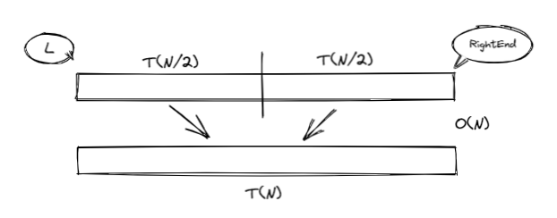
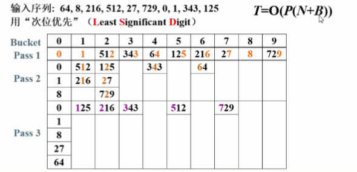

# 排序 | Sort

## 简单排序

!!! info "预备知识"
    `void XSort(ElementType A[], int N)`

    1. 大多数情况下，为简单起见，讨论从小到大的整数排序
    2. N是正整数
    3. 只讨论基于比较的排序（> = < 有定义）
    4. 只讨论内部排序
    5. 稳定性：任意两个相等的数据，排序前后的相对位置不发生改变
    6. 没有一种排序是任何情况下都表现最好的

* 插入排序

    !!! example "code"
        ```c
        void InsertionSort( ElementType A[], int N )
        { 
            int P, i;
            ElementType Tmp;
            for(P = 1; P < N; P++) 
            {
                Tmp = A[P];     /* 取出未排序序列中的第一个元素*/
                for(i = P; i > 0 && A[i-1] > Tmp; i--)
                    A[i] = A[i-1];  /*依次与已排序序列中元素比较并右移*/
                A[i] = Tmp;     /* 放进合适的位置 */
            }
        }
        ```
    * 最好情况: 输入 A[] 是有序的, $T(N) = O(N)$
    * 最坏情况: 输入 A[] 是逆序的, $T(N) = O(N^2)$

??? note "引申--时间复杂度下界"
    * 对于下标 i < j, 如果 A[i] > A[j], 则称 (i, j) 是一对逆序对 (inversion)
    * 冒泡和插入排序每次交换两个相邻元素都正好消去一个逆序对
        * 插入排序: $T(N, I) = O(N + I)$
        * 其中 I 是原始序列中逆序对的数量
    * 定理:
        * 任意 N 个不同元素组成的序列平均具有 $\frac{N（N-1）}{4}$ 个逆序对
        * 任何仅以交换相邻元素来排序的算法，其平均时间复杂度为 $\Omega (N^2)$ ( $\Omega$ 指的是下界)
    
    > 要提高算法效率，需要
    >   1. 每次消去不止一对逆序对
    >   2. 每次尽量交换相隔较远的元素

## 希尔排序 | Shell Sort

!!! abstract
    * 定义增量序列 $h_t > h_{t-1} > ··· > h_1 = 1$
    * 对每个 $h_t$ 进行 "$h_t$ -间隔" 排序 
    
    > "$h_t$ -间隔" 有序的序列，在执行 "$h_{t-1}$ -间隔" 排序后，仍然是 "$h_t$ -间隔" 有序的

### 希尔增量序列

* $h_t = \lfloor N / 2\rfloor$ , $h_k = \lfloor h_k+1 / 2 \rfloor$ 
* 最坏情况: 只在 1-sort 排序, $T(N) = O(N^2)$

```c
void Shellsort( ElementType A[ ], int N ) 
{ 
    int  i, j, Increment; 
    ElementType  Tmp; 
    for( Increment = N / 2; Increment > 0; Increment /= 2 )  
        /*h sequence */
        for( i = Increment; i < N; i++ ) 
        { /* insertion sort */
            Tmp = A[ i ]; 
            for ( j = i; j >= Increment; j - = Increment ) 
                if( Tmp < A[ j - Increment ] ) 
                    A[ j ] = A[ j - Increment ]; 
                else 
                    break; 
            A[ j ] = Tmp; 
        } /* end for-I and for-Increment loops */
}
```

### 更多增量序列

!!! question
    当增量元素不互质时，导致小增量可能不起作用, 如:
    

1. Hibbard 增量序列
      1. $h_k = 2^k - 1$ —— 相邻元素互质
      2. 最坏情况: $T(N) = \Theta (N^{3/2})$
      3. 猜想: $T_{avg}(N) =O(N^{5/4})$
2. Sedgewick 增量序列 ——  { 1，5，19，41，109，··· }
      1. $9\times 4^i - 9\times 2^i + 1$ 或 $4^i - 3\times 2^i + 1$ 
      2. 猜想: $T_{avg}(N) = O(N^{7/6})$, $T_{worst}(N) = O(N^{4/3})$ 

> 当元素数量较大时，采用希尔排序 + Sedgewick 增量序列较为高效

## 堆排序

* 使用堆结构排序
* 算法一: 将元素插入堆中再依次 DeleteMin
    ```c
    void Heap_Sort(ElementType A[], int N)
    {
        int i;
        BuildHeap(A);   /* O(N) */
        for(i = 0; i < N; i++)
        {
            TempA[i] = DeleteMin(A);    /* O(logN) */
        }
        for(i = 0; i < N; i++)  /* O(N) */
        {
            A[i] = TempA[i];
        }
    }
    ```
    * $T(N) = O(N logN)$
    * 但需要额外的 $O(N)$ 空间，并且复制元素需要时间
* 算法二: 以线性时间建立堆(Percolate), 再循环将堆顶元素与最后一个元素交换再 Percolate
    * 以最大堆为例:
    ```c
    void Heap_Sort(ElementType A[], int N)
    {
        for(i = N/2; i >= 0; i--)   /* BuildHeap */
        {
            PercDown(A, i, N);
        }
        for(i = N-1; i > 0; i--)    /* 相当于 DeleteMax */
        {
            Swap(&A[0], &A[i]);
            PercDown(A, 0, i);
        }
    }
    ```
* 堆排序处理 N 个不同元素的随机排列的平均比较次数为 $2NlogN - O(NloglogN)$ 

> 虽然堆排序给出最佳平均时间复杂度，但实际效果不如希尔排序 + Sedgewick 增量

??? example "补全函数"
    ```c
    void Swap( ElementType *a, ElementType *b )
    {
        ElementType t = *a; *a = *b; *b = t;
    }
    
    void PercDown( ElementType A[], int p, int N )
    { 
    /* 将N个元素的数组中以A[p]为根的子堆调整为最大堆 */
        int Parent, Child;
        ElementType X;

        X = A[p]; /* 取出根结点存放的值 */
        for( Parent=p; (Parent*2+1)<N; Parent=Child ) {
            Child = Parent * 2 + 1;
            if( (Child!=N-1) && (A[Child]<A[Child+1]) )
                Child++;  /* Child指向左右子结点的较大者 */
            if( X >= A[Child] ) break; /* 找到了合适位置 */
            else  /* 下滤X */
                A[Parent] = A[Child];
        }
        A[Parent] = X;
    }
    ```

## 归并排序

* 关键是合并两个有序列表变成一个有序列表 (可以递归进行、分而治之)
* 递归算法: 
    * 分而治之 <br> 
    * $T(N) = T(N/2) + T(N/2) + O(N)$ $\rightarrow$ $T(N) = O(NlogN)$
    ??? example "code"
        ```c
        /* L = 左边起始位置, R = 右边起始位置, RightEnd = 右边终点位置*/
        void Merge( ElementType A[], ElementType TmpA[], int L, int R, int RightEnd )
        { /* 将有序的A[L]~A[R-1]和A[R]~A[RightEnd]归并成一个有序序列 */
            int LeftEnd, NumElements, Tmp;
            int i;
            
            LeftEnd = R - 1; /* 左边终点位置 */
            Tmp = L;         /* 有序序列的起始位置 */
            NumElements = RightEnd - L + 1;
            
            while( L <= LeftEnd && R <= RightEnd ) {
                if ( A[L] <= A[R] )
                    TmpA[Tmp++] = A[L++]; /* 将左边元素复制到TmpA */
                else
                    TmpA[Tmp++] = A[R++]; /* 将右边元素复制到TmpA */
            }

            while( L <= LeftEnd )
                TmpA[Tmp++] = A[L++]; /* 直接复制左边剩下的 */
            while( R <= RightEnd )
                TmpA[Tmp++] = A[R++]; /* 直接复制右边剩下的 */
                
            for( i = 0; i < NumElements; i++, RightEnd -- )
                A[RightEnd] = TmpA[RightEnd]; /* 将有序的TmpA[]复制回A[] */
        }

        void Msort( ElementType A[], ElementType TmpA[], int L, int RightEnd )
        { /* 核心递归排序函数 */ 
            int Center;
            
            if ( L < RightEnd ) {
                Center = (L+RightEnd) / 2;
                Msort( A, TmpA, L, Center );              /* 递归解决左边 */ 
                Msort( A, TmpA, Center+1, RightEnd );     /* 递归解决右边 */  
                Merge( A, TmpA, L, Center+1, RightEnd );  /* 合并两段有序序列 */ 
            }
        }

        void MergeSort( ElementType A[], int N )
        { /* 归并排序 */
            ElementType *TmpA;
            TmpA = (ElementType *)malloc(N*sizeof(ElementType));
            
            if ( TmpA != NULL ) {
                Msort( A, TmpA, 0, N-1 );
                free( TmpA );
            }
            else printf( "空间不足" );
        }
        ```
* 非递归算法: 

    ??? example "code"
        ```c
        /* 这里Merge函数在递归版本中给出 */

        /* length = 当前有序子列的长度*/
        void Merge_pass( ElementType A[], ElementType TmpA[], int N, int length )
        { /* 两两归并相邻有序子列 */
            int i, j;
            
            for ( i=0; i <= N-2*length; i += 2*length )
                Merge( A, TmpA, i, i+length, i+2*length-1 );
            if ( i+length < N ) /* 归并最后2个子列*/
                Merge( A, TmpA, i, i+length, N-1);
            else /* 最后只剩1个子列*/
                for ( j = i; j < N; j++ ) TmpA[j] = A[j];
        }

        void Merge_Sort( ElementType A[], int N )
        { 
            int length; 
            ElementType *TmpA;
            
            length = 1; /* 初始化子序列长度*/
            TmpA = malloc( N * sizeof( ElementType ) );
            if ( TmpA != NULL ) {
                while( length < N ) {
                    Merge_pass( A, TmpA, N, length );
                    length *= 2;
                    Merge_pass( TmpA, A, N, length );
                    length *= 2;
                }
                free( TmpA );
            }
            else printf( "空间不足" );
        }
        ```

> 归并排序在外排序中较为有用

## 快速排序

```c
void Quicksort(ElementType A[], int N)
{
    if(N < 2)
        return;
    pivot = 从 A[] 中选一个主元;
    将 S = { A[] \ pivot } 分成两个独立子集 A1 和 A2;

    A[] = Quicksort(A1, N1) + {pivot} + Quicksort(A2, N2);
}
```
> 分而治之: 
> 快速排序的最好情况 —— 每次正好中分 —— $T(N) = O(NlogN)$
> 两个主要步骤: <u>选主元</u>、<u>子集划分</u>

### 选主元

* 错误方法: pivot = arr[0] (对于已经排列好顺序的组合仍会消耗掉 $O(N^2)$ 的时间)
* 安全方法: pivot = random element in arr (额外带来的开销: 随机数的生成)
* 三数中值分割 | Median-of-Partitioning: pivot = median(left + center + right)

    ??? example "Median3"
        ```c
        ElementType Median3(ElementType A[], int Left, int Right)
        {
            int Center = (Left + Right) / 2;
            if(A[Left] > A[Center])
            {
                Swap(&A[Left], &A[Center]);
            }
            else if(A[Left] > A[Right])
            {
                Swap(&A[Left], &A[Right]);
            }
            else if(A[Right] < A[Center])
            {
                Swap(&A[Right], &A[Center]);
            }
            /* A[Left] <= A[Center] <= A[Right] */
            Swap(&A[Center], &A[Right-1]);  //将 pivot 藏到右边
            /* 只需要考虑 A[Left+1] ... A[Right-2] */
            return A[Right-1];  /* 返回 pivot */
        }
        ```

### 子集划分

* 当有元素正好等于 pivot 时
    * 停下来交换 √
    * 不理他，继续移动指针 ×

??? note "补充"
    * 小数组
        * 对于 N (N $\le$ 20), 快速排序慢于插入排序
        * 可以在递归到 N 较小的情况下将快速排序更改为插入排序
    * 复杂度 -- $T(N) = T(i) + T(N-i-1) + cN$
        * $T_{worst}(N) = T(N-1) + cN ~ \rightarrow ~ T(N) = O(N^2)$
        * $T_{best}(N) = 2T(N/2) + cN ~ \rightarrow ~ T(N) = O(NlogN)$
        * Average Case: 
            * 假设对每个 i, $T(i)$ 的平均值是 $\frac{1}{N}[\sum\limits_{j=0}^{N-1} T(j)]$ 
            * $T(N) = \frac{2}{N}[\sum\limits_{j=0}^{N-1} T(j)] + cN ~ \rightarrow ~ T(N) = O(NlogN)$

??? example "完整算法"
    ```c
    /* 快速排序 */
    ElementType Median3( ElementType A[], int Left, int Right )
    { 
        int Center = (Left+Right) / 2;
        if ( A[Left] > A[Center] )
            Swap( &A[Left], &A[Center] );
        if ( A[Left] > A[Right] )
            Swap( &A[Left], &A[Right] );
        if ( A[Center] > A[Right] )
            Swap( &A[Center], &A[Right] );
        /* 此时A[Left] <= A[Center] <= A[Right] */
        Swap( &A[Center], &A[Right-1] ); /* 将基准Pivot藏到右边*/
        /* 只需要考虑A[Left+1] … A[Right-2] */
        return  A[Right-1];  /* 返回基准Pivot */
    }

    void Qsort( ElementType A[], int Left, int Right )
    { /* 核心递归函数 */ 
        int Pivot, Cutoff, Low, High;
        
        if ( Cutoff <= Right-Left ) { /* 如果序列元素充分多，进入快排 */
            Pivot = Median3( A, Left, Right ); /* 选基准 */ 
            Low = Left; High = Right-1;
            while (1) { /*将序列中比基准小的移到基准左边，大的移到右边*/
                while ( A[++Low] < Pivot ) ;
                while ( A[--High] > Pivot ) ;
                if ( Low < High ) Swap( &A[Low], &A[High] );
                else break;
            }
            Swap( &A[Low], &A[Right-1] );   /* 将基准换到正确的位置 */ 
            Qsort( A, Left, Low-1 );    /* 递归解决左边 */ 
            Qsort( A, Low+1, Right );   /* 递归解决右边 */  
        }
        else InsertionSort( A+Left, Right-Left+1 ); /* 元素太少，用简单排序 */ 
    }

    void QuickSort( ElementType A[], int N )
    { /* 统一接口 */
        Qsort( A, 0, N-1 );
    }
    ```

## 基数排序

!!! abstract 
    这之上的排序算法都有一个共同点 --- 仅仅基于比较大小决定排序位置，所有这些算法时间复杂度都需要进行 $\Omega (NlogN)$ 次比较 & 只用到比较的任何排序算法在最坏情况下都需要 $\lceil log(N!) \rceil$ 次比较并平均需要 $log(N!)$ 次比较

### 桶排序

* 如果输入数据都小于 M，则可以用一个大小为 M 的数组来记录某个值出现了多少次，这个数组称为桶 (bucket)
* 桶初始化为 0，遍历输入数据，将每个数据对应的桶加 1
* 最后遍历桶中的所有元素，对于 bucket[x] = y，将 x 输出 y 次
* 时间复杂度 $O(N+M)$ (如果 N $\ll$ M, 用基数排序)

??? example 
    * 假设有 N 个学生, 他们的成绩是 0 到 100 之间的整数 (于是有 M = 101 个不同的成绩值) 。如何在线性时间将学生按成绩排序: 
    ```c
    void BucketSort(ElementType A[], int N)
    {
        count[] 初始化;
        while(读入一个学生成绩)
            将其插入 count[grade] 链表
        for(i = 0; i < M; i++)
            if(count[i])
                输出整个 count[i] 链表
    }
    ```

### 基数排序

* 从低位（LSD，Least Significant Digit）到高位（MSD），对每一位进行进行排序 (次位优先)
* 时间复杂度 $O(P(N+B))$ , 其中 $P$ 为轮数, $N$ 为元素个数, $B$ 为桶个数
??? example
    
    <center><font face="JetBrains Mono" size=2 color=grey >图片摘自 MOOC</font></center>
    
    > 此问题中，P 即是 logB

??? example "code-LSD"
    ```c
    /* 基数排序 - 次位优先 */

    /* 假设元素最多有MaxDigit个关键字，基数全是同样的Radix */
    #define MaxDigit 4
    #define Radix 10

    /* 桶元素结点 */
    typedef struct Node *PtrToNode;
    struct Node {
        int key;
        PtrToNode next;
    };

    /* 桶头结点 */
    struct HeadNode {
        PtrToNode head, tail;
    };
    typedef struct HeadNode Bucket[Radix];
    
    int GetDigit ( int X, int D )
    { /* 默认次位D=1, 主位D<=MaxDigit */
        int d, i;
        
        for (i=1; i<=D; i++) {
            d = X % Radix;
            X /= Radix;
        }
        return d;
    }

    void LSDRadixSort( ElementType A[], int N )
    { /* 基数排序 - 次位优先 */
        int D, Di, i;
        Bucket B;
        PtrToNode tmp, p, List = NULL; 
        
        for (i=0; i<Radix; i++) /* 初始化每个桶为空链表 */
            B[i].head = B[i].tail = NULL;
        for (i=0; i<N; i++) { /* 将原始序列逆序存入初始链表List */
            tmp = (PtrToNode)malloc(sizeof(struct Node));
            tmp->key = A[i];
            tmp->next = List;
            List = tmp;
        }
        /* 下面开始排序 */ 
        for (D=1; D<=MaxDigit; D++) { /* 对数据的每一位循环处理 */
            /* 下面是分配的过程 */
            p = List;
            while (p) {
                Di = GetDigit(p->key, D); /* 获得当前元素的当前位数字 */
                /* 从List中摘除 */
                tmp = p; p = p->next;
                /* 插入B[Di]号桶尾 */
                tmp->next = NULL;
                if (B[Di].head == NULL)
                    B[Di].head = B[Di].tail = tmp;
                else {
                    B[Di].tail->next = tmp;
                    B[Di].tail = tmp;
                }
            }
            /* 下面是收集的过程 */
            List = NULL; 
            for (Di=Radix-1; Di>=0; Di--) { /* 将每个桶的元素顺序收集入List */
                if (B[Di].head) { /* 如果桶不为空 */
                    /* 整桶插入List表头 */
                    B[Di].tail->next = List;
                    List = B[Di].head;
                    B[Di].head = B[Di].tail = NULL; /* 清空桶 */
                }
            }
        }
        /* 将List倒入A[]并释放空间 */
        for (i=0; i<N; i++) {
            tmp = List;
            List = List->next;
            A[i] = tmp->key;
            free(tmp);
        } 
    }
    ```

??? example "code-MSD"
    ```c
    /* 基数排序 - 主位优先 */

    /* 假设元素最多有MaxDigit个关键字，基数全是同样的Radix */

    #define MaxDigit 4
    #define Radix 10

    /* 桶元素结点 */
    typedef struct Node *PtrToNode;
    struct Node{
        int key;
        PtrToNode next;
    };

    /* 桶头结点 */
    struct HeadNode {
        PtrToNode head, tail;
    };
    typedef struct HeadNode Bucket[Radix];
    
    int GetDigit ( int X, int D )
    { /* 默认次位D=1, 主位D<=MaxDigit */
        int d, i;
        
        for (i=1; i<=D; i++) {
            d = X%Radix;
            X /= Radix;
        }
        return d;
    }

    void MSD( ElementType A[], int L, int R, int D )
    { /* 核心递归函数: 对A[L]...A[R]的第D位数进行排序 */
        int Di, i, j;
        Bucket B;
        PtrToNode tmp, p, List = NULL; 
        if (D==0) return; /* 递归终止条件 */
        
        for (i=0; i<Radix; i++) /* 初始化每个桶为空链表 */
            B[i].head = B[i].tail = NULL;
        for (i=L; i<=R; i++) { /* 将原始序列逆序存入初始链表List */
            tmp = (PtrToNode)malloc(sizeof(struct Node));
            tmp->key = A[i];
            tmp->next = List;
            List = tmp;
        }
        /* 下面是分配的过程 */
        p = List;
        while (p) {
            Di = GetDigit(p->key, D); /* 获得当前元素的当前位数字 */
            /* 从List中摘除 */
            tmp = p; p = p->next;
            /* 插入B[Di]号桶 */
            if (B[Di].head == NULL) B[Di].tail = tmp;
            tmp->next = B[Di].head;
            B[Di].head = tmp;
        }
        /* 下面是收集的过程 */
        i = j = L; /* i, j记录当前要处理的A[]的左右端下标 */
        for (Di=0; Di<Radix; Di++) { /* 对于每个桶 */
            if (B[Di].head) { /* 将非空的桶整桶倒入A[], 递归排序 */
                p = B[Di].head;
                while (p) {
                    tmp = p;
                    p = p->next;
                    A[j++] = tmp->key;
                    free(tmp);
                }
                /* 递归对该桶数据排序, 位数减1 */
                MSD(A, i, j-1, D-1);
                i = j; /* 为下一个桶对应的A[]左端 */
            } 
        } 
    }

    void MSDRadixSort( ElementType A[], int N )
    { /* 统一接口 */
        MSD(A, 0, N-1, MaxDigit); 
    }
    ```

> 如果次位关键字建的桶很少，而主位关键字建的桶很多使元素分散开，这时再在桶内部排序可能就只涉及几个元素的排序，这时 MSD 可能就要更快了

## 排序算法的比较

| 排序算法       | 平均时间复杂度   | 最坏时间复杂度   | 额外空间复杂度   | 稳定性   |
| -------------- | ---------------- | ---------------- | ---------------- | -------- |
| 简单选择排序   | $O(N^2)$         | $O(N^2)$         | $O(1)$           | 不稳定   |
| 冒泡排序       | $O(N^2)$         | $O(N^2)$         | $O(1)$           | 稳定     |
| 直接插入排序   | $O(N^2)$         | $O(N^2)$         | $O(1)$           | 稳定     |
| 希尔排序       | $O(N^d)$         | $O(N^2)$         | $O(1)$           | 不稳定   |
| 堆排序         | $O(NlogN)$       | $O(NlogN)$       | $O(1)$           | 不稳定   |
| 快速排序       | $O(NlogN)$       | $O(N^2)$         | $O(logN)$        | 不稳定   |
| 归并排序       | $O(NlogN)$       | $O(NlogN)$       | $O(N)$           | 稳定     |
| 基数排序       | $O(P(N+B))$      | $O(P(N+B))$      | $O(N+B)$         | 稳定     |

