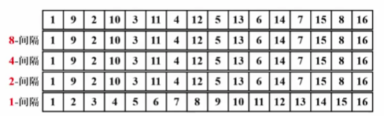

# 排序

## 简单排序

!!! info "预备知识"
    `void XSort(ElementType A[], int N)`

    1. 大多数情况下，为简单起见，讨论从小到大的整数排序
    2. N是正整数
    3. 只讨论基于比较的排序（> = < 有定义）
    4. 只讨论内部排序
    5. 稳定性：任意两个相等的数据，排序前后的相对位置不发生改变
    6. 没有一种排序是任何情况下都表现最好的

* 插入排序

    !!! example "code"
        ```c
        void InsertionSort( ElementType A[], int N )
        { 
            int P, i;
            ElementType Tmp;
            for(P = 1; P < N; P++) 
            {
                Tmp = A[P];     /* 取出未排序序列中的第一个元素*/
                for(i = P; i > 0 && A[i-1] > Tmp; i--)
                    A[i] = A[i-1];  /*依次与已排序序列中元素比较并右移*/
                A[i] = Tmp;     /* 放进合适的位置 */
            }
        }
        ```
    * 最好情况: 输入 A[] 是有序的, $T(N) = O(N)$
    * 最坏情况: 输入 A[] 是逆序的, $T(N) = O(N^2)$

??? note "引申--时间复杂度下界"
    * 对于下标 i < j, 如果 A[i] > A[j], 则称 (i, j) 是一对逆序对 (inversion)
    * 冒泡和插入排序每次交换两个相邻元素都正好消去一个逆序对
        * 插入排序: $T(N, I) = O(N + I)$
        * 其中 I 是原始序列中逆序对的数量
    * 定理:
        * 任意 N 个不同元素组成的序列平均具有 $\frac{N（N-1）}{4}$ 个逆序对
        * 任何仅以交换相邻元素来排序的算法，其平均时间复杂度为 $\Omega (N^2)$ ( $\Omega$ 指的是下界)
    
    > 要提高算法效率，需要
    >   1. 每次消去不止一对逆序对
    >   2. 每次尽量交换相隔较远的元素

## 希尔排序 | Shell Sort

!!! abstract
    * 定义增量序列 $h_t > h_{t-1} > ··· > h_1 = 1 $
    * 对每个 $h_t$ 进行 "$h_t$ -间隔" 排序 
    
    > "$h_t$ -间隔" 有序的序列，在执行 "$h_{t-1}$ -间隔" 排序后，仍然是 "$h_t$ -间隔" 有序的

### 希尔增量序列

* $h_t = \lfloor N / 2\rfloor$ , $h_k = \lfloor h_k+1 / 2 \rfloor$ 
* 最坏情况: 只在 1-sort 排序, $T(N) = O(N^2)$

```c
void Shellsort( ElementType A[ ], int N ) 
{ 
      int  i, j, Increment; 
      ElementType  Tmp; 
      for ( Increment = N / 2; Increment > 0; Increment /= 2 )  
	/*h sequence */
	for ( i = Increment; i < N; i++ ) { /* insertion sort */
	      Tmp = A[ i ]; 
	      for ( j = i; j >= Increment; j - = Increment ) 
		if( Tmp < A[ j - Increment ] ) 
		      A[ j ] = A[ j - Increment ]; 
		else 
		      break; 
		A[ j ] = Tmp; 
	} /* end for-I and for-Increment loops */
}
```

### 更多增量序列

!!! question
    当增量元素不互质时，导致小增量可能不起作用, 如:
    

1. Hibbard 增量序列
      1. $h_k = 2^k - 1$ -- 相邻元素互质
      2. 最坏情况: $T(N) = \Theta (N^{3/2}) $
      3. 猜想: $ T_{avg}(N) =O(N^{5/4}) $
2. Sedgewick 增量序列 --  { 1，5，19，41，109，··· }
      1. $ 9\times 4^i - 9\times 2^i + 1 $ 或 $ 4^i - 3\times 2^i + 1 $ 
      2. 猜想: $ T_{avg}(N) = O(N^{7/6}) $, $ T_{worst}(N) = O(N^{4/3}) $ 

> 当元素数量较大时，采用希尔排序 + Sedgewick 增量序列较为高效

## 堆排序

* 使用堆结构排序
* 算法一: 将元素插入堆中再依次 DeleteMin
    ```c
    void Heap_Sort(ElementType A[], int N)
    {
        int i;
        BuildHeap(A);   /* O(N) */
        for(i = 0; i < N; i++)
        {
            TempA[i] = DeleteMin(A);    /* O(logN) */
        }
        for(i = 0; i < N; i++)  /* O(N) */
        {
            A[i] = TempA[i];
        }
    }
    ```
    * $ T(N) = O(N logN) $
    * 但需要额外的 $O(N)$ 空间，并且复制元素需要时间
* 算法二: 以线性时间建立堆(Percolate), 再循环将堆顶元素与最后一个元素交换再 Percolate
    * 以最大堆为例:
    ```c
    void Heap_Sort(ElementType A[], int N)
    {
        for(i = N/2; i >= 0; i--)   /* BuildHeap */
        {
            PercDown(A, i, N);
        }
        for(i = N-1; i > 0; i--)    /* 相当于 DeleteMax */
        {
            Swap(&A[0], &A[i]);
            PercDown(A, 0, i);
        }
    }
    ```
* 堆排序处理 N 个不同元素的随机排列的平均比较次数为 $ 2NlogN - O(NloglogN) $ 

> 虽然堆排序给出最佳平均时间复杂度，但实际效果不如希尔排序 + Sedgewick 增量

??? example "补全函数"
    ```c
    void Swap( ElementType *a, ElementType *b )
    {
        ElementType t = *a; *a = *b; *b = t;
    }
    
    void PercDown( ElementType A[], int p, int N )
    { /* 改编代码4.24的PercDown( MaxHeap H, int p )    */
    /* 将N个元素的数组中以A[p]为根的子堆调整为最大堆 */
        int Parent, Child;
        ElementType X;

        X = A[p]; /* 取出根结点存放的值 */
        for( Parent=p; (Parent*2+1)<N; Parent=Child ) {
            Child = Parent * 2 + 1;
            if( (Child!=N-1) && (A[Child]<A[Child+1]) )
                Child++;  /* Child指向左右子结点的较大者 */
            if( X >= A[Child] ) break; /* 找到了合适位置 */
            else  /* 下滤X */
                A[Parent] = A[Child];
        }
        A[Parent] = X;
    }
    ```

## 归并排序


<center><font face="JetBrains Mono" color=grey size=18>To Be Continued</font></center>