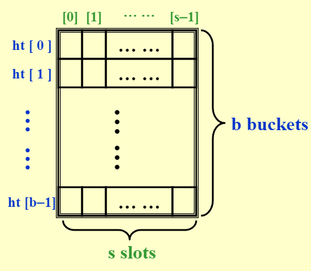
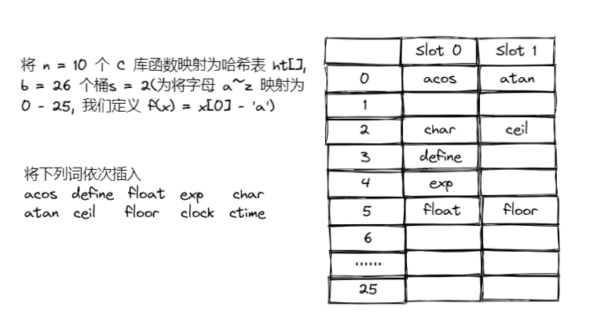
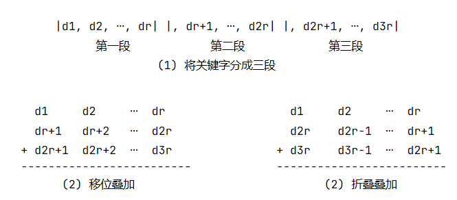
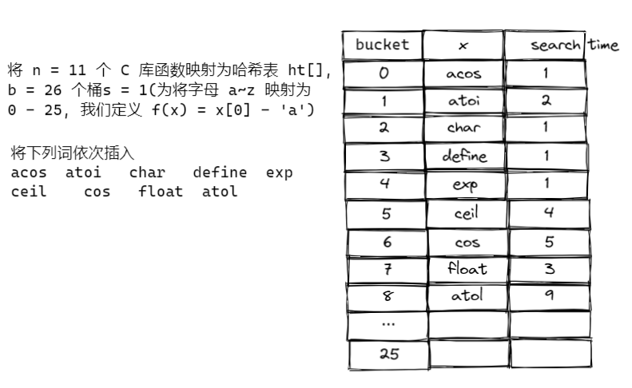

# 哈希 | Hash

!!! abstract
    重点: 设计哈希函数 + 如何解决冲突

## 哈希表 | 散列表

* 哈希表把关键字 (或标识符 | identifier) 值映射到表中一个位置
    - 支持查询、插入、删除等操作
* 对于标识符 $x$ , 定义一个哈希函数 $f(x) = x$ 在哈希表 ht[] 中的位置
    
    * 如图, ht 的大小为 $b$（即 $f(x)$ 值域为 $[0, b-1]$），最多有 s 个槽
    * $T$ = $x$ 可能的不同值的个数
    * $n$ = ht 中不同标识符的个数
    * 标识符密度 (identifier density) = $n/T$
    * 装载密度 (loading density) = $\lambda = n/(sb)$

* 冲突 (collision) -- 当将两个不同的标识符散列到同一个桶中时 (i.e. $i_1 \neq i_2$ 但 $f(i_1) = f(i_2)$ )
* 溢出（overflow）: 当将一个新的标识符散列到一个满的桶时

> 当 s = 1 时，碰撞和溢出将同时发生
> 没有溢出时，$T_{search} = T_{insert} = T_{delete} = O(1)$

??? example 
    

## 哈希函数

!!! abstract "Properties of f()"
    * 函数必须易于计算且尽量减少碰撞的可能性
    * 函数应该是公正的 (unbiased)，即对任意 $x$ 和 $i$ 都有  $Probability(f(x) = i) = 1/b$ . 这种函数称为均匀哈希函数（uniform hash function）

几种函数构造方法: 

* 除留余数法 -- $f(x) = x ~~ \% ~~ TableSize; $ /* if x is an integer*/
    * TableSize 最好选择一个质数 -- good for random integer keys

    ??? example 
        | 关键字  | 内部代码    | key MOD 100   |
        | ------- | ----------- | ------------- |
        | key1    | 511         | 11            |
        | key2    | 512         | 12            |
        | key3    | 411         | 11            |

* 平方取中法 -- 先计算关键字值的平方，然后取平方值的中间几位作为散列地址

    ??? example 
        | 关键字  | 内部代码    | 内部代码平方  | hash(key) |
        | ------- | ----------- | ------------- | --------- |
        | key1    | 511         | 261121        | 11        |
        | key2    | 512         | 262144        | 21        |
        | key3    | 411         | 168921        | 89        |

* 折叠法 -- 将关键字分为位数相同的几部分，然后取这几部分的叠加和（舍去进位）作为散列地址 (用于关键字位数较多，并且关键字中每一位上数字分布大致均匀)

    ??? example 
        

* 数字分析法 -- 当关键字的位数大于地址的位数，对关键字的各位分布进行分析，选出分布均匀的任意几位作为散列地址 (适用于所有关键字都已知的情况下，根据实际应用确定要选取的部分，尽量避免发生冲突)

    ??? example
        比如按学号映射，同届前几位相同，将后四位选为 key

* -- $f(x) = (\sum x[i]) ~~ \% ~~ TableSize; $ /* if x is a string*/

    ??? example
        $x = "abc" \Rightarrow \sum x[i] = 'a' + 'b' + 'c'$

* $f(x) = (x[0] + x[1] * 27 + x[2] * 27^2 ) ~~ \% ~~ TableSize; $ // 变成 27 进制
* $f(x) = (\sum x[N-i-1] * 32^i) ~~ \% ~~ TableSize$ ( *32 可以变为移位运算 )

    ??? example
        ```c
        Index Hash3(const char *x, int TableSize)
        {
            unsigned int HashVal = 0;
            while(*x != '\0')
            {
                HashVal = (HashVal << 5) + *x++;
            }
            return HashVal % TableSize;
        }
        ```

## 解决冲突

### 分离链接 | Separate Chaining

* 将散列到相同值的元素保存在一个列表（链表）中

??? example "code"
    ```c
    struct  ListNode; 
    typedef  struct  ListNode  *Position; 
    struct  HashTbl; 
    typedef  struct  HashTbl  *HashTable; 
    struct  ListNode { 
        ElementType  Element; 
        Position  Next; 
    }; 
    typedef  Position  List; 
    /* List *TheList will be an array of lists, allocated later */ 
    /* The lists use headers (for simplicity), */ 
    /* though this wastes space */ 
    struct  HashTbl { 
        int  TableSize; 
        List  *TheLists; 
    }; 
    ```

    ??? example "Create an empty table"
        ```c
        HashTable  InitializeTable( int TableSize ) 
        {   HashTable  H; 
            int  i; 
            if ( TableSize < MinTableSize ) 
            { 
                Error( "Table size too small" );  
                return NULL;  
            } 
            H = malloc( sizeof( struct HashTbl ) );  /* Allocate table */
            if ( H == NULL )    
                FatalError( "Out of space!!!" ); 
            H->TableSize = NextPrime( TableSize );  /* Better be prime */
            H->TheLists = malloc( sizeof( List ) * H->TableSize );  /*Array of lists*/
            if ( H->TheLists == NULL )   
                FatalError( "Out of space!!!" ); 
            for( i = 0; i < H->TableSize; i++ ) 
            {   /* Allocate list headers */
                H->TheLists[ i ] = malloc( sizeof( struct ListNode ) ); /* Slow! */
                if ( H->TheLists[ i ] == NULL )  
                    FatalError( "Out of space!!!" ); 
                else    
                    H->TheLists[ i ]->Next = NULL;
            } 
            return  H; 
        } 
        ```

    ??? example "Find a key from a hash table"
        ```c
        Position  Find ( ElementType Key, HashTable H ) 
        { 
            Position P; 
            List L; 

            L = H->TheLists[ Hash( Key, H->TableSize ) ]; 

            P = L->Next; 
            while( P != NULL && P->Element != Key )  /* Probably need strcmp */ 
                P = P->Next; 
            return P; 
        } 
        ```

    ??? example "Insert a key into a hash table"
        ```c
        void  Insert ( ElementType Key, HashTable H ) 
        { 
            Position   Pos, NewCell; 
            List  L; 
            Pos = Find( Key, H ); 
            if ( Pos == NULL ) 
            {   /* Key is not found, then insert */
                NewCell = malloc( sizeof( struct ListNode ) ); 
                if ( NewCell == NULL )     
                    FatalError( "Out of space!!!" ); 
                else 
                { 
                    L = H->TheLists[ Hash( Key, H->TableSize ) ]; 
                    NewCell->Next = L->Next; 
                    NewCell->Element = Key; /* Probably need strcpy! */ 
                    L->Next = NewCell; 
                } 
            } 
        } 
        ```
    > Tips: 将 TableSize 的大小设置为预期 keys 的数量几乎一样 (i.e. 使得装载密度 $\lambda \approx 1 $)

### 开放地址 | Open Adressing

* 当有冲突发生时，选择下一个位置，直到找到空的为止
* 即有多个哈希函数 $h_0(x), h_1(x), \cdots$，其中 $h_i(x) = (\mathrm{hash}(x)+f(i)) ~~ \% ~~ TableSize$
    * 其中 $f(i)$ 为增量函数，有多种选取的方式
* 通常情况下 $\lambda < 0.5$ , 如果大于 0.5 就会引发大量的冲突

```c 
void insert(int key) {
    index = hash(key);
    int i = 0;  // the counter of probing
    while (collision at index) {
        index = (hash(key) + f(i)) % TableSize;
        if (table is full) 
            break;
        else 
            i++;
    }
    if (table is full) 
        Error("No space left");
    else 
        insert key at index;
}
```

1. 线性探测 | Linear Probing 
   * 增量函数 $f(i) = i$ -- 会导致初次聚集（primary clustering），即一旦发生了冲突，那么后面的元素都会聚集在一起，搜索次数会变得越来越大
   * 使用线性探测的探测次数对于插入和不成功查找来说约为$\dfrac{1}{2}\left(1+\dfrac{1}{(1-\lambda)^2}\right)$
   *  对于成功的查找来说则需要 $\dfrac{1}{2}\left(1+\dfrac{1}{1-\lambda}\right)$ 次
    
    ??? example
        
        Average search time = 27 / 9 = 3

2. 二次探测 | Quadratic Probing 
   * 增量函数 $f(i) = i^2$ -- 避免了 primary clustering, 但是导致有可能有空位但就是找不到
   * 若使用平方探测（或二次探测）, 且表的大小是素数，那么当表至少有一半是空的时候，总能插入一个新的元素


#### 双重哈希


#### 再哈希


<center><font face="JetBrains Mono" color=grey size=18>To Be Continued</font></center>