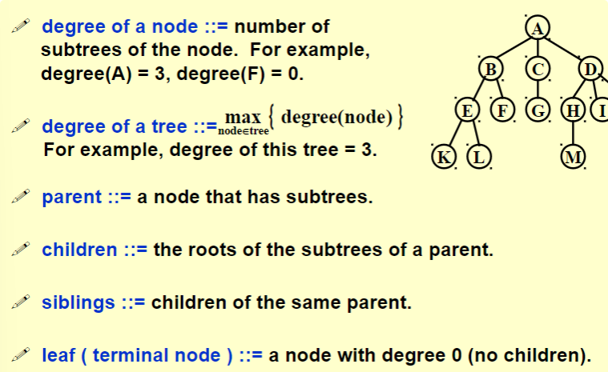
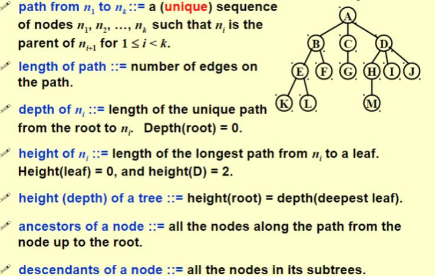
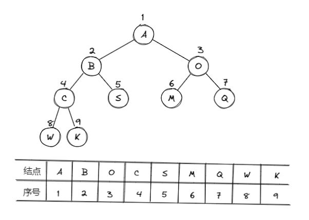

# 树 | Tree

## 树的定义

* 树：n(n $\ge$ 20)个结点构成的有限集合；
* 当n = 0时，称为空树；
* 对于任一棵非空树(n $>$ 0)，它具备以下性质：
  * 树中有一个称为“根”的特殊结点，用r表示；
  * 其余结点可分为m(m $>$ 0)个互不相交的有限集 T~1~ , T~2~ , ···, T~m~ , 其中每个集合本身又是一棵树，称为原来树的“子树”

### 一些基本术语

1. 结点的度(Degree): 结点的子树个数
2. 树的度：树的所有结点中最大的度数
3. 叶结点(Leaf): 度为0的结点
4. 父结点(Parent): 有子树的结点是其子树的根结点的父节点
5. 子结点(Child): 若A结点是B结点的父结点，则称B结点是A结点的子结点；子结点也称孩子结点
6. 兄弟结点(Sibiling): 具有同一父结点的各结点彼此是兄弟结点
7. 路径和路径长度：从结点 n~1~ 到 n~k~ 的路径为一个结点序列 n~1~ , n~2~ ,···, n~k~ , n~i~ 是 n~i+1~ 的父结点。路径所包含边的个数为路径的长度
8. 祖先结点(Ancestor): 沿树根到某一结点路径上的所有结点都是这个结点的祖先结点。
9. 子孙结点(Descendant): 某一结点的子树中的所有结点是这个结点的子孙。
10. 结点的层次(Level): 规定根结点在1层，其他任一结点的层数是其父节点的层数加1
11. 树的深度(Depth): 树中所有结点中最大层次是这棵树的深度

??? quote
     
     

### 二叉树的定义

* 二叉树(binary tree): 通常指有根二叉树。每个结点至多有两个子结点的树。通常将子结点确定一个顺序，称左子结点和右子结点
* 特殊二叉树
    1. 完整二叉树(full/proper binary tree): 每个结点的子结点均为0或2个
     $$leaves = nodes-\frac{nodes-1}{degree}$$ 
    2. 完美二叉树(即满二叉树，perfect binary tree): 所有叶结点深度均相同的二叉树——深度为k(k $\ge$ -1)且有 2^k+1^ - 1 个结点
    3. 完全二叉树(complete binary tree): 仅最深两层结点的度可以小于2，且最深一层的结点都集中在该层最左边的连续位置上 || 所有结点的编号都与满二叉树中的编号相同的二叉树
    4. 斜二叉树(skewed binary tree): 没有任何左/右结点的树，称为右/左斜二叉树

### 二叉树的几个重要性质

1. 一个二叉树第i层的最大结点数为: 2^i-1^ , i $\ge$ 1
2. 深度为k的二叉树有最大结点总数为: 2^k^ - 1 , k $\ge$ 1
3. 对任何非空二叉树，若 n~0~ 表示叶结点的个数、n~2~ 是度为2的非叶结点个数，那么两者满足关系 n~0~ = n~2~ + 1
   
## 二叉树的抽象数据类型

* **类型名称** : 二叉树
* **数据对象集** : 一个有穷的结点集合。若不为空，则由根节点和其左、右二叉子树组成

* **操作集** : BT $\in$ BinTree，Item $\in$ ElementType, 重要操作有：
!!! note
    1. Boolean IsEmpty( BinTree BT ): 判断BT是否为空<br>
    2. void Traversal( BinTree BT ): 遍历，按某顺序访问每个结点<br>
    3. BinTree CreateBinTree( ): 创建一个二叉树<br>

## 二叉树的存储结构

### 顺序存储结构

1. 完全二叉树: 从上到下、从左至右顺序存储n个结点的完全二叉树的结点父子关系；
!!! example
     <br>
     完全二叉树的叶子结点数: $n_0 = \frac{n+1}{2}$ <br>
           1. 当n为偶数时，$n_0 = \frac{n}{2}$ <br>
           2. 当n为奇数时，$n_0 = \frac{n+1}{2}$

* 非根节点(序号i > 1)的父结点的序号是 $\lfloor \frac{i}{2} \rfloor $ (不超过 i/2 的最大整数)；
    * 结点(序号为i)的左孩子结点的序号是 2i (2i $\le$ n，否则没有左孩子)
    * 结点(序号为i)的右孩子结点的序号是 2i+1 (2i+1 $\le$ n，否则没有右孩子)
2. 一般二叉树: 也可以采用上述结构，但会造成空间浪费
??? example
    

    * 链表存储(每个结点的结构可以如下表示)
        !!! note
            ```c
                typedef struct TreeNode *BinTree;
                typedef BinTree Position;
                struct TreeNode{
                    ElementType Data;
                    BinTree Left;
                    BinTree Right;
                }
            ``` 

## 二叉树的遍历

### 先序遍历 | PreOrder

* 遍历过程
    1. 访问根节点
    2. 先序遍历左子树
    3. 先序遍历右子树
    ??? example
        <br>
        print的顺序 $\Rightarrow$ A B D F E C G H I

??? note "递归算法"
    ```c
      void PreOrderTraversal( BinTree BT)
      {
          if( BT ){
              printf("%d", BT->Data);
              PreOrderTraversal(BT->Left);
              PreOrderTraversal(BT->Right);
          }
      }
    ```

### 中序遍历 | InOrder

* 遍历过程
    1. 中序遍历其左子树
    2. 访问根节点
    3. 中序遍历其右子树
    ??? example
        <br>
        print的顺序 $\Rightarrow$ D B E F A G H C I

??? note "递归算法"
    ```c
      void InOrderTraversal( BInTree BT)
      {
          if( BT ){
              PreOrderTraversal(BT->Left);
              printf("%d", BT->Data);
              PreOrderTraversal(BT->Right);
          }
      }
    ```
??? note "非递归算法"
    ```c
      void InOrderTraversal(BinTree BT)
      {
          BinTree T = BT;
          Stack S = CreatStack(MaxSize);	/*创建并初始化堆栈S*/
          while(T || !IsEmpty(S))
          {
              while(T)					/*一直向左并将沿途结点压入堆栈*/
              {
                  Push(S, T);
                  T = T->Left;
              }
              if(!IsEmpty(S))
              {
                  T = Pop(S);				/*结点弹出堆栈*/
                  printf("%5d", T->Data);	/*（访问）打印结点*/
                  T = T->Right;			/*转向右子树*/
              }
          }
      }
    ```

### 后序遍历 | PostOrder

* 遍历过程
    1. 后序遍历其左子树
    2. 后序遍历其右子树
    3. 访问根节点
    ??? example
        <br>
        print的顺序 $\Rightarrow$ D E F B H G I C A

??? note "递归算法"
    ```c
      void PostOrderTraversal( BInTree BT)
      {
          if( BT ){
              PreOrderTraversal(BT->Left);
              PreOrderTraversal(BT->Right);
              printf("%d", BT->Data);
          }
      }
    ```


<center><font face="JetBrains Mono" size=6 color=grey size=18>To Be Continued</font></center>
