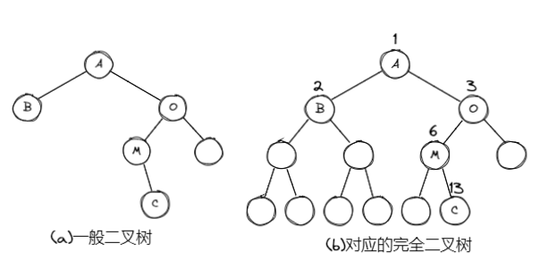
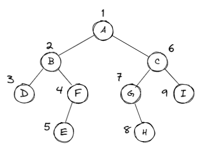
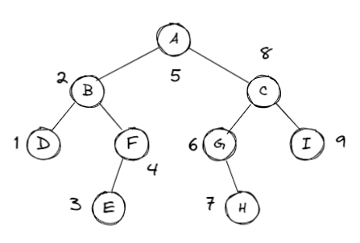
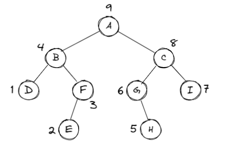
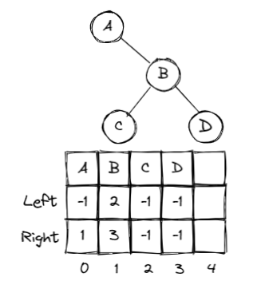
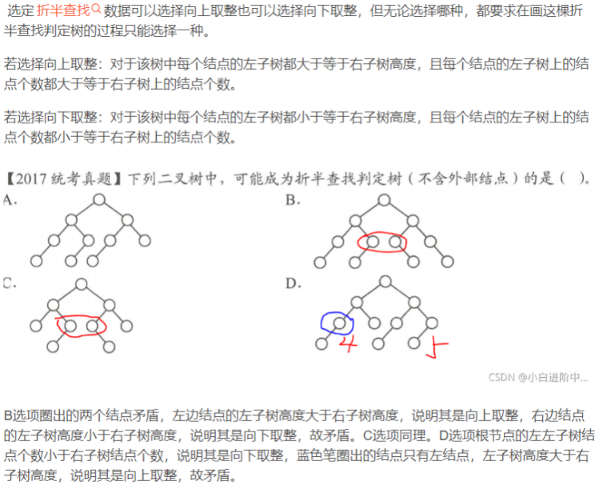

# 树 | Tree

## 树的定义

* 树：n(n $\ge$ 20)个结点构成的有限集合；
* 当n = 0时，称为空树；
* 对于任一棵非空树(n $>$ 0)，它具备以下性质：
  * 树中有一个称为“根”的特殊结点，用r表示；
  * 其余结点可分为m(m $>$ 0)个互不相交的有限集 T~1~ , T~2~ , ···, T~m~ , 其中每个集合本身又是一棵树，称为原来树的“子树”

### 一些基本术语

1. 结点的度(Degree): 结点的子树个数
2. 树的度：树的所有结点中最大的度数
3. 叶结点(Leaf): 度为0的结点
4. 父结点(Parent): 有子树的结点是其子树的根结点的父节点
5. 子结点(Child): 若A结点是B结点的父结点，则称B结点是A结点的子结点；子结点也称孩子结点
6. 兄弟结点(Sibiling): 具有同一父结点的各结点彼此是兄弟结点
7. 路径和路径长度：从结点 n~1~ 到 n~k~ 的路径为一个结点序列 n~1~ , n~2~ ,···, n~k~ , n~i~ 是 n~i+1~ 的父结点。路径所包含边的个数为路径的长度
8. 祖先结点(Ancestor): 沿树根到某一结点路径上的所有结点都是这个结点的祖先结点。
9. 子孙结点(Descendant): 某一结点的子树中的所有结点是这个结点的子孙。
10. 结点的层次(Level): 规定根结点在1层，其他任一结点的层数是其父节点的层数加1
11. 树的深度(Depth): 树中所有结点中最大层次是这棵树的深度

??? quote
     
     

### 二叉树的定义

* 二叉树(binary tree): 通常指有根二叉树。每个结点至多有两个子结点的树。通常将子结点确定一个顺序，称左子结点和右子结点
* 特殊二叉树
    1. 完整二叉树(full/proper binary tree): 每个结点的子结点均为0或2个
     $$leaves = nodes-\frac{nodes-1}{degree}$$ 
    2. 完美二叉树(即满二叉树，perfect binary tree): 所有叶结点深度均相同的二叉树——深度为k(k $\ge$ -1)且有 2^k+1^ - 1 个结点
    3. 完全二叉树(complete binary tree): 仅最深两层结点的度可以小于2，且最深一层的结点都集中在该层最左边的连续位置上 || 所有结点的编号都与满二叉树中的编号相同的二叉树
    4. 斜二叉树(skewed binary tree): 没有任何左/右结点的树，称为右/左斜二叉树

### 二叉树的几个重要性质

1. 一个二叉树第i层的最大结点数为: 2^i-1^ , i $\ge$ 1
2. 深度为k的二叉树有最大结点总数为: 2^k^ - 1 , k $\ge$ 1
3. 对任何非空二叉树，若 n~0~ 表示叶结点的个数、n~2~ 是度为2的非叶结点个数，那么两者满足关系 n~0~ = n~2~ + 1
   
## 二叉树的抽象数据类型

* **类型名称** : 二叉树
* **数据对象集** : 一个有穷的结点集合。若不为空，则由根节点和其左、右二叉子树组成

* **操作集** : BT $\in$ BinTree，Item $\in$ ElementType, 重要操作有：
!!! note
    1. Boolean IsEmpty( BinTree BT ): 判断BT是否为空<br>
    2. void Traversal( BinTree BT ): 遍历，按某顺序访问每个结点<br>
    3. BinTree CreateBinTree( ): 创建一个二叉树<br>

## 二叉树的存储结构

### 顺序存储结构

1. 完全二叉树: 从上到下、从左至右顺序存储n个结点的完全二叉树的结点父子关系；
!!! example
     <br>
     完全二叉树的叶子结点数: $n_0 = \frac{n+1}{2}$ <br>
           1. 当n为偶数时，$n_0 = \frac{n}{2}$ <br>
           2. 当n为奇数时，$n_0 = \frac{n+1}{2}$

* 非根节点(序号i > 1)的父结点的序号是 $\lfloor \frac{i}{2} \rfloor $ (不超过 i/2 的最大整数)；
    * 结点(序号为i)的左孩子结点的序号是 2i (2i $\le$ n，否则没有左孩子)
    * 结点(序号为i)的右孩子结点的序号是 2i+1 (2i+1 $\le$ n，否则没有右孩子)
  
2. 一般二叉树: 也可以采用上述结构，但会造成空间浪费
??? example
    
* 链表存储(每个结点的结构可以如下表示)

!!! note
    ```c
        typedef struct TreeNode *BinTree;
        typedef BinTree Position;
        struct TreeNode{
            ElementType Data;
            BinTree Left;
            BinTree Right;
        }
    ``` 

## 二叉树的遍历

### 先序遍历 | PreOrder

* 遍历过程
    1. 访问根节点
    2. 先序遍历左子树
    3. 先序遍历右子树
    ??? example
        <br>
        print的顺序 $\Rightarrow$ A B D F E C G H I
??? note "递归算法"
    ```c
      void PreOrderTraversal( BinTree BT)
      {
          if( BT ){
              printf("%d", BT->Data);
              PreOrderTraversal(BT->Left);
              PreOrderTraversal(BT->Right);
          }
      }
    ```

### 中序遍历 | InOrder

* 遍历过程
    1. 中序遍历其左子树
    2. 访问根节点
    3. 中序遍历其右子树
    ??? example
        <br>
        print的顺序 $\Rightarrow$ D B E F A G H C I
??? note "递归算法"
    ```c
      void InOrderTraversal( BInTree BT)
      {
          if( BT ){
              PreOrderTraversal(BT->Left);
              printf("%d", BT->Data);
              PreOrderTraversal(BT->Right);
          }
      }
    ```
??? note "非递归算法"
    ```c
      void InOrderTraversal(BinTree BT)
      {
          BinTree T = BT;
          Stack S = CreatStack(MaxSize);	/*创建并初始化堆栈S*/
          while(T || !IsEmpty(S))
          {
              while(T)					/*一直向左并将沿途结点压入堆栈*/
              {
                  Push(S, T);
                  T = T->Left;
              }
              if(!IsEmpty(S))
              {
                  T = Pop(S);				/*结点弹出堆栈*/
                  printf("%5d", T->Data);	/*（访问）打印结点*/
                  T = T->Right;			/*转向右子树*/
              }
          }
      }
    ```

### 后序遍历 | PostOrder

* 遍历过程
    1. 后序遍历其左子树
    2. 后序遍历其右子树
    3. 访问根节点
    ??? example
        <br>
        print的顺序 $\Rightarrow$ D E F B H G I C A
??? note "递归算法"
    ```c
      void PostOrderTraversal( BInTree BT)
      {
          if( BT ){
              PreOrderTraversal(BT->Left);
              PreOrderTraversal(BT->Right);
              printf("%d", BT->Data);
          }
      }
    ```

### 层序遍历 | LevelOrder

* 层序基本过程:
    1. 根节点入队
    2. 从队列中取出一个元素
    3. 访问该元素所指结点
    4. 若该元素所指结点的左、右孩子结点非空，则将其左、右孩子的指针入队

??? example "层序遍历的队列实现"
    ```c
    void LevelOrderTraversal(BinTree BT)
    {
        Queue Q;
        BinTree T;
        if(!BT)	return;				/*若是空树则直接返回*/
        Q = CreatQueue(MaxSize);	/*创建并初始化队列Q*/
        AddQ(Q, BT);
        while(!IsEmptyQ(Q))
        {
            T = DeleteQ(Q);
            printf("%d\n", T->Data);	/*访问取出队列的结点*/
            if(T->Left)		
                AddQ(Q, T->Left);
            if(T->Right)
                AddQ(Q, T->Right);
        }
    }
    ```

## 建树及同构判别

### 二叉树表示

* 结构数组表示二叉树: 静态链表



??? example "code"
    ```c title="二叉树表示"
    #define MaxTree 10
    #define ElementType char
    #define Tree int
    #define Null -1
    struct TreeNode
    {
        ElementType Element;
        Tree Left;
        Tree Right;
    }T1[MaxTree], T2[MaxTree];
    ```

### 程序框架搭建

```c title="Pseudocode: main_function"
    int main()
    {
        建二叉树1;
        建二叉树2;
        判断是否同构并输出;

        return 0;
    }
```
??? example "code"
    ```c title="main"
    int main()
    {
        Tree R1, R2;
        
        R1 = BuildTree(T1);
        R2 = BuildTree(T2);
        if(Isomorphic(R1, R2))
            printf("Yes\n");
        else
            printf("No\n");
        
        return 0;
    }
    ```
    <br>
    ```c title="BuildTree"
    Tree BulidTree(struct TreeNode T[])
    {
        ……
        scanf("%d\n", &N);
        if(N)
        {
            for(i=0; i<N; i++)
            {
                scanf("%c %c %C\n", &T[i].Element, &cl, &cr);
                if(cl != '-')
                {
                    T[i].Left = cl-'0';
                    check[T[i].Left] = 1;
                }
                else
                {
                    T[i].Left = Null;
                    T[i].Right = cr-'0';
                    check[T[i].Right] = 1;
                }
                for(i=0; i<N; i++)
                    if(!check[i]) 
                        break;
                Root = i;
            }
        }
        return Root;
    }
    ```
    <br>
    ```c title="判断同构"
    int Isomorphic(Tree R1, Tree R2)
    {
        if((R1==Null) && (R2==Null))
            return 1;
        if(((R1==Null) && (R2!=Null)) || ((R1!=Null) && (R2==Null)))
            return 0;
        if(T1[R1].Element != T2[R2].Element)
            return 0;
        if((T1[R1].Left == Null) && (T2[R2].Left == Null))
            return Isomorphic(T1[R1].Right, T2[R2].Right);
        
        if(((T1[R1].Left != Null) && (T2[R2].Left != Null))&&
        ((T1[T1[R1].Left].Element) == (T2[T2[R2].Left].Element)))
            return (Isomorphic(T1[R1].Left,T2[R2].Left ) &&
                    Isomorphic(T1[R1].Right,T2[R2].Right ));
        else
            return (Isomorphic(T1[R1].Left,T2[R2].Right ) &&
                    Isomorphic(T1[R1].Right,T2[R2].Left ));
        
    }
    ```

## 二叉搜索树 | Binary Search Tree(BST)

> 二叉搜索树，也称二叉排序树或二叉查找树

* 一棵二叉树可以为空；如果不为空，满足以下性质：
    1. 非空左子树的所有键值小于其根节点的键值
    2. 非空右子树的所有键值大于其根节点的键值
    3. 左、右子树都是二叉搜索树

### BST的特别函数

#### Find()

> 从BST中查找元素 X, 返回其所在结点的地址

1. 查找从根结点开始，如果树为空，返回 NULL
2. 若搜索树非空，则将根结点关键字和 X 进行比较，并进行不同处理:
      1. 若 X 小于根结点键值，只需在左子树中继续搜索
      2. 若大于，则在右子树中继续搜素
      3. 若相等，搜索完成，返回指向此结点的指针
??? example "code"
    ```c
    Position Find( ElementType X, BinTree BST )
    {
        if( !BST)	return NULL;
        if( X > BST->Data )
            return Find( X, BST->Right );	/*尾递归*/
        else if( X < BST->Data)
            return Find( X, BST->Left );	/*尾递归*/
        else
            return BST;
    }
    ```
    <br>
    由于非递归函数执行效率高，可将“尾递归”函数改为迭代函数
    <br>
    ```c
    Position IterFind( ElementType X, BinTree BST)
    {
        while( BST )
        {
            if( X > BST->Data )
                BST = BST->Right;
            else if( X < BST->Data )
                BST = BST->Left;
            else
                return BST;
        }
        return NULL;
    }
    ```

#### FindMin()

* 从BST中查找并返回最小元素所在结点的地址
* 最小元素一定在树的最左分支的端结点上

!!! note "code" 
    ```c
    Position FindMin( BinTree BST)
    {
        if( !BST )
            return NULL;
        else if( !BST->Left)
            return BST;
        else
            return FindMin( BST->Left );
    }
    ```

#### FindMax()

* 从二叉搜索树BST中查找并返回最大元素所在结点的地址
* 最大元素一定在树的最右分支的端结点上

!!! note "code" 
    ```c
    Position FindMax( BinTree BST)
    {
        if( BST )
            while(BST->Right)
                BST = BST->Right;
            return BST;
    }
    ```

#### Insert()

* 插入X(可以采用与Find类似的方法)

!!! note "code" 
    ```c
    BinTree Insert( ElementType X, BinTree BST)
    {
        if( !BST )
        {
            BST = malloc(sizeof(struct TreeNode));
            BSt->Data = X;
            BST->Left = BST->Right = NULL;
        }
        else
        {
            if( X < BST->Data )
                BST->Left = Insert( X, BST->Left);
            else if( X > BST->Data)
                BST->Right = Insert( X, BST->Right);
        }
        return BST;
    }
    ```

#### Delete()

* 考虑三种情况
    1. 要删除的结点是叶结点：直接删除，并再修改其父结点指针——置为NULL
    2. 要删除的结点只有一个孩子结点：将其父结点的指针指向要删除结点的孩子结点
    3. 要删除的结点有左右两颗子树：用另一结点替代被删除结点——右子树的最小元素 或者 左子树的最大元素

!!! note "code"
    ```c
    BinTree Delete( ELementType X, BinTree BST)
    {
        Position Tmp;
        if( !BST )
            printf("要删除的元素未找到");
        else if( X < BST->Data )
            BST->Left = Delete( X, BST->Left);/*左子树递归删除*/
        else if( X > BST->Right )
            BST->Right = Delete( X, BST->Right);/*右子树递归删除*/
        else
            if( BST->Left && BST->Right )
            {
                Tmp = FindMin( BST->Right );
                            /*在右子树中找到最小元素填充删除结点*/
                BST->Data = Tmp->Data;
                BST->Right = Delete( BST->Data, BST->Right);
            }
            else	/*被删除结点有一个或无子结点*/
            {
                Tmp = BST;
                if( !BST->Left)	/*有右孩子或无*/
                    BST = BST->Right;
                else if( !BST->Right)/*有左孩子或无*/
                    BST = BST->Left;
                free( Tmp );
            }
        return BST;
    }
    ```

## 线索二叉树 | Threaded binary tree

* Rule 1: 若结点的左子树为空，将其空左儿子指向中序遍历前驱(上一个遍历的结点)
* Rule 2: 空右儿子指向中序遍历的后继(若前驱/后继均无，则引出为 NULL)
* Rule 3: 线索二叉树必须有一个头节点且其左儿子指向第一个结点

```c
typedef  struct  ThreadedTreeNode  *PtrTo  ThreadedNode;
typedef  struct  PtrToThreadedNode  ThreadedTree;
typedef  struct  ThreadedTreeNode {
    int     LeftThread;   /* if it is TRUE, then Left */
    ThreadedTree  Left;      /* is a thread, not a child ptr.   */ 
    ElementTypeElement;intRightThread; /* if it is TRUE, then Right */
    ThreadedTree  Right;    /* is a thread, not a child ptr.   */
}
```
!!! quote
    [CSDN-线索二叉树](https://blog.csdn.net/qq_46104786/article/details/121361566?spm=1001.2101.3001.6650.1&utm_medium=distribute.pc_relevant.none-task-blog-2%7Edefault%7ECTRLIST%7ERate-1-121361566-blog-70183267.pc_relevant_aa&depth_1-utm_source=distribute.pc_relevant.none-task-blog-2%7Edefault%7ECTRLIST%7ERate-1-121361566-blog-70183267.pc_relevant_aa&utm_relevant_index=2)

## 优先队列 | Priority Queues

!!! abstract
    特殊的"队列"，取出元素的顺序是按照元素的优先级(关键字)大小，而不是元素进入队列的先后顺序

### 若采用数组或链表实现

* 数组: 
    * 插入 —— 元素总是插入尾部          ~ $\Theta (1)$ 
    * 删除 —— 
        * 查找最大(或最小)关键字        ~ $\Theta (n)$ 
        * 从数组中删去需要移动的元素    ~ $O(n)$ 
* 链表:
    * 插入 —— 元素总是插入链表头部      ~ $\Theta (1)$ 
    * 删除 ——
        * 查找最大(或最小)关键字        ~ $\Theta (n)$ 
        * 删去结点                      ~ $\Theta (1)$ 
* 有序数组:
    * 插入 —— 
        * 找到合适的位置                ~ $O(n)$ 或 $O(log_2 n)$ 
        * 移动与元素并插入              ~ $O(n)$ 
    * 删除 —— 删去最后一个元素          ~ $\Theta (1)$
* 有序链表: 
    * 插入 —— 
        * 找到合适的位置                ~ $O(n)$ 
        * 插入元素                      ~ $\Theta (1)$ 
    * 删除 —— 删除首元素或最后元素      ~ $\Theta (1)$ 

### D-堆 | D-heap

* D-heap 是指每个结点有 d 个儿子
    * 若D-堆使用数组存储，且一个结点的下标为 i 
    * 其父结点的位置是 $\lceil (i + d - 2)/d \rceil $  
    * 其第一个儿子位于 $ (i - 2)d + 2 $ 
    * 最后一个儿子位于 $ (i - 1)d + 1 $ 

??? example "一道PTA例题"
    


<center><font face="JetBrains Mono" size=6 color=grey size=18>To Be Continued</font></center>
