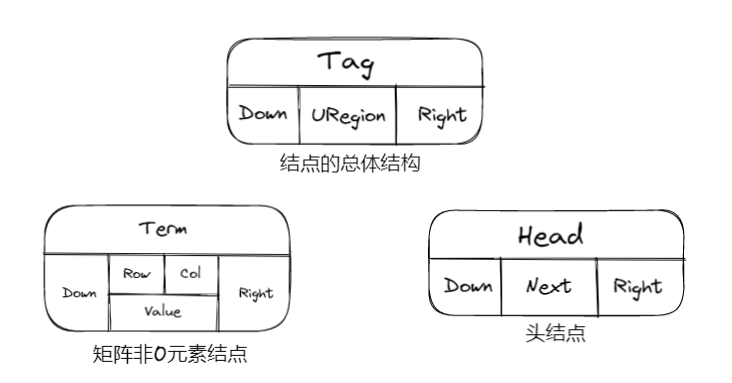

# 线性表&栈&队列

## 线性表 | Lists

### 线性表的抽象数据类型描述

1.  `类型名称` : 线性表 | List
2.  `数据对象集` :  线性表是n( $\ge$ 20)个元素构成的有序序列
3.  `操作集` : 线性表 L $\epsilon$ List，整数 i 表示位置，元素 X $\epsilon$ ElementType.

### 线性表的顺序存储实现

#### 线性表的数组存储实现

* 主要操作实现

??? example "初始化(建立空的顺序表)"
    ```c
    List MakeEmpty()
    {
        List Ptrl;
        Ptrl = (List)malloc(sizeof(struct LNode));
        Ptrl->Last = -1;
        return Ptrl;
    }
    ```

??? example "查找"
    ```c
    int Find(ElementType X, List Ptrl)
    {
        int i = 0;
        while(i <= Ptrl->Last && Ptrl->Data[i] != X)
        {
            i++;
        }
        if(i > Ptrl->Last)
            return -1;
        else
            return i;
    }
    ```

??? example "在第i(1 <= i <= n+1)个位置上插入新元素X"
    ```c
    void Insert(ElementType X, int i, List L)
    {
        int j;
        if(Ptrl->Last == MAXSIZE-1)
        {
            printf("表满");
            return ;
        }
        if(i < 1 || i > Ptrl->Last+2 )
        {
            printf("位置不合法");
            return;
        }
        for(j = Ptrl->Last; j >= i - 1; j--)
        {
            Ptrl->Data[j+1] = Ptrl->Data[j];
        }
        Ptrl->Data[i-1] = X;
        Ptrl->Last++;
        return;   
    }
    ```

??? example "删除"
    ```c
    void Delete( int i, List Ptrl )
    {
        int j;
        if(i < 1 || i > Ptrl->Last+1)
        {
            printf("不存在");
            return;
        }
        for(j = i; i <= Ptrl->Last; j++)
        {
            Ptrl->Data[j-1] = Ptrl->Data[j];
        }
        Ptrl->Last--;
        return E;
    }
    ```

#### 线性表的链表存储实现

* 不要求逻辑上相邻的两个元素在物理上也相邻
* 通过修改”链“建立起数据元素之间逻辑关系

!!! tip
	插入、删除不需要移动数据元素，只需要修改”链“

??? example “链表结构”
    ```c
    typedef struct LNode *List;
    struct LNode{
        ElementType Data;
        List Next;
    };
    struct LNode L;
    List Ptrl;
    ```

* 主要操作:

??? example "求表长"
    ```c
    int Length(List Ptrl)
    {
        List p = Ptrl;
        int j = 0;
        while(p)
        {
            p = p->Next;
            j ++;
        }
        return j;
    }
    ```

??? example "查找"
    ```c
    /*（1）按序号查找*/
    List FindKth(int K, List Ptrl)
    {
    List p = Ptrl;
        while(p != NULL && i < k)
        {
            p = p->Next;
            i++;
        }
        if(i == K)
            return p;
        else
            return NULL;
    }
    /*（2）按值查找*/
    List Find(ElementType X, List Ptrl)
    {
        List p = Ptrl;
        while(p != NULL && p->Data != X)
        {
            p = p->Next;
        }
        return p;
    }
    ```

??? example "在第i-1(1 <= i <= n+1)个结点后插入一个值为X的新结点"
    ```c
    List Insert(ElementType X, List Ptrl)
    {
        List p, s;
        if(i == 1)
        {
            s = (List)malloc(sizeof(struct LNode));
            s->Data = X;
            s->Next = Ptrl;
            return s;
        }
        p = Findkth(i-1, Ptrl);
        if(p == NULL)
        {
            printf("参数i错误");
            return NULL;
        }
        else
        {
            s = (List)malloc(sizeof(struct LNode));
            s->Data = X;
            s->Next = p->Next;
            p->Next = s;
            return Ptrl;
        }
    }
    ```

??? example "删除第i个结点（1 <= i <= n）"
    ```c
    List Delete(int i, List Ptrl)
    {
        List p, s;
        if(i == 1)
        {
            s = Ptrl;
            if( Ptrl != NULL)
                Ptrl = Ptrl->Next;
            else
                return NULL;
            free(s);
            return Ptrl;
        }
        p = FindKth(i-1, Ptrl);
        if( p == NULL)
        {
            printf("第%d个结点不存在"，i-1);
            return NULL;
        }
        else if(p->Next == NULL)
        {
            printf("第%d个结点不存在"，i);
            return NULL;
        }
        else
        {
            s = p->Next;
            p->Next = s->Next;
            free(s);
            return Ptrl;
            
        }
    }
    ```

### 广义表

* 广义表是线性表的推广
* 对于线性表来说，n 个元素都是基本的单元素
* 广义表中，这些元素不仅可以是单元素还可以是另一个广义表

??? example "广义表结构"
    ```c
    typedef struct GNode *Glist;
    struct GNode{
        int Tag;    /* 标志域，0表示结点是单元素，1表示是广义表*/
        union{      /* 子表指针域Sublist与单元素数据域Data复用，即共用存储空间*/
            ElementType Data;
            GList SubList;
        }URegion;
        GList Next; /* 指向后继结点 */
    }
    ```

### 多重链表

!!! note
    链表中的结点可能同时隶属于多个链

* 多重链表中结点的指针域会有多个，如前面的例子包含了Next和Sublist两个指针域；
* 但包含两个指针域的链表并不一定是多重链表，比如双向链表

!!! example
    * 用一个标识域Tag来区分头结点和非0元素结点:<br>
    * 头结点的标识值为“Head”，矩阵非0元素结点的标识值为“Term”<br>
    
	
??? example "线性表的定义与操作-顺序表"
    ```c 
    typedef int Position;
    typedef struct LNode *List;
    struct LNode {
        ElementType Data[MAXSIZE];
        Position Last;
    };
    /* 初始化 */
    List MakeEmpty()
    {
        List L;

        L = (List)malloc(sizeof(struct LNode));
        L->Last = -1;

        return L;
    }
    /* 查找 */
    #define ERROR -1

    Position Find( List L, ElementType X )
    {
        Position i = 0;

        while( i <= L->Last && L->Data[i]!= X )
            i++;
        if ( i > L->Last )  return ERROR; /* 如果没找到，返回错误信息 */
        else  return i;  /* 找到后返回的是存储位置 */
    }
    /* 插入 */
    /*注意:在插入位置参数P上与课程视频有所不同，课程视频中i是序列位序（从1开始），这里P是存储下标位置（从0开始），两者差1*/
    bool Insert( List L, ElementType X, Position P ) 
    { /* 在L的指定位置P前插入一个新元素X */
        Position i;

        if ( L->Last == MAXSIZE-1) {
            /* 表空间已满，不能插入 */
            printf("表满"); 
            return false; 
        }  
        if ( P<0 || P>L->Last+1 ) { /* 检查插入位置的合法性 */
            printf("位置不合法");
            return false; 
        } 
        for( i=L->Last; i>=P; i-- )
            L->Data[i+1] = L->Data[i]; /* 将位置P及以后的元素顺序向后移动 */
        L->Data[P] = X;  /* 新元素插入 */
        L->Last++;       /* Last仍指向最后元素 */
        return true; 
    } 
    /* 删除 */
    /*注意:在删除位置参数P上与课程视频有所不同，课程视频中i是序列位序（从1开始），这里P是存储下标位置（从0开始），两者差1*/
    bool Delete( List L, Position P )
    { /* 从L中删除指定位置P的元素 */
        Position i;

        if( P<0 || P>L->Last ) { /* 检查空表及删除位置的合法性 */
            printf("位置%d不存在元素", P ); 
            return false; 
        }
        for( i=P+1; i<=L->Last; i++ )
            L->Data[i-1] = L->Data[i]; /* 将位置P+1及以后的元素顺序向前移动 */
        L->Last--; /* Last仍指向最后元素 */
        return true;   
    }
    ```
??? example "线性表的定义与操作-链式表"
    ```c
    typedef struct LNode *PtrToLNode;
    struct LNode {
        ElementType Data;
        PtrToLNode Next;
    };
    typedef PtrToLNode Position;
    typedef PtrToLNode List;

    /* 查找 */
    #define ERROR NULL

    Position Find( List L, ElementType X )
    {
        Position p = L; /* p指向L的第1个结点 */

        while ( p && p->Data!=X )
            p = p->Next;

        /* 下列语句可以用 return p; 替换 */
        if ( p )
            return p;
        else
            return ERROR;
    }

    /* 带头结点的插入 */
    /*注意:在插入位置参数P上与课程视频有所不同，课程视频中i是序列位序（从1开始），这里P是链表结点指针，在P之前插入新结点 */
    bool Insert( List L, ElementType X, Position P )
    { /* 这里默认L有头结点 */
        Position tmp, pre;

        /* 查找P的前一个结点 */        
        for ( pre=L; pre&&pre->Next!=P; pre=pre->Next ) ;            
        if ( pre==NULL ) { /* P所指的结点不在L中 */
            printf("插入位置参数错误\n");
            return false;
        }
        else { /* 找到了P的前一个结点pre */
            /* 在P前插入新结点 */
            tmp = (Position)malloc(sizeof(struct LNode)); /* 申请、填装结点 */
            tmp->Data = X; 
            tmp->Next = P;
            pre->Next = tmp;
            return true;
        }
    }

    /* 带头结点的删除 */
    /*注意:在删除位置参数P上与课程视频有所不同，课程视频中i是序列位序（从1开始），这里P是拟删除结点指针 */
    bool Delete( List L, Position P )
    { /* 这里默认L有头结点 */
        Position pre;

        /* 查找P的前一个结点 */        
        for ( pre=L; pre&&pre->Next!=P; pre=pre->Next ) ;            
        if ( pre==NULL || P==NULL) { /* P所指的结点不在L中 */
            printf("删除位置参数错误\n");
            return false;
        }
        else { /* 找到了P的前一个结点pre */
            /* 将P位置的结点删除 */
            pre->Next = P->Next;
            free(P);
            return true;
        }
    }
    ```

## 栈 | Stacks

<center><font face="JetBrains Mono" size=6 color=grey size=36>To Be Continued</font></center>

## 队列 | Queues

<center><font face="JetBrains Mono" size=6 color=grey size=36>To Be Continued</font></center>