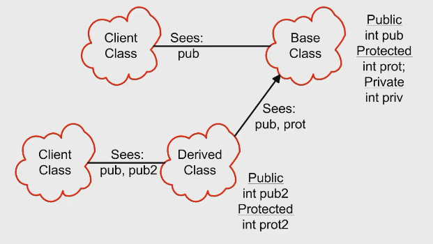
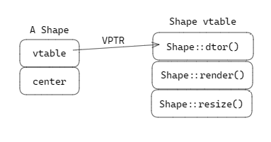
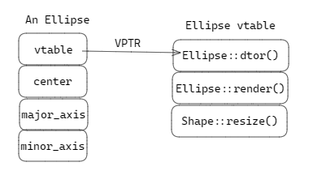
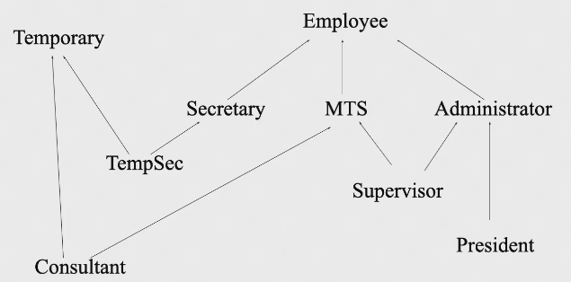
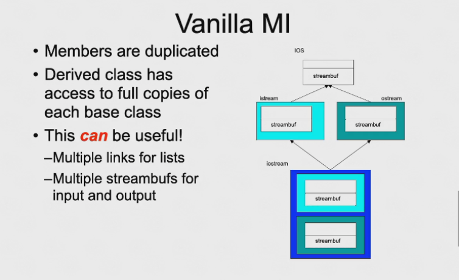

# Inheritance & Polymorphism | 继承与多态

## Inheritance | 继承

??? tip "放在 Reuse (重用) 中来讲"
    === "Description"
        * Reusing the interface | 重用接口
            * Inheritance is to take the existing class, clone it, and then make additions and modifications to the clone
    === "Mermaid"
        ```mermaid
        classDiagram
        Shape <-- Circle
            Circle : draw()
            Circle : erase()
        Shape <-- Line
            Line : draw()
            Line : erase()
        Shape <-- Square
            Square : draw()
            Square : erase()
        Shape : draw()
        Shape : erase()
        ```

!!! abstract "What is Inheritance"
    * Language implementions technique
    * Also an important component of the OOP design methodology
    * Allows sharing of design for
        * Member variables
        * Member functions
        * Interfaces
    * Key technology in C++ 

* The ablitity to define the behavior or implementation of one class as a superset of another class ()
* Inheritance allows us to define one class as an extension of another
* Advantages of inheritance
    * Avoids code duplication
    * Code reuse
    * Easier maintenance
    * Extentibility

??? example "code"
    === "Employee.h & cpp"
        ```c++
        // Define an Employee class
        class Employee {
        public:
            Employee(const std::string& name, const std::string& ssn);
            const std::string& get_name() const;
            void print() const;
            void print(const std::string& msg) const;
        protected:
            std::string m_name;
            std::string m_ssn;
        };
        Employee::Employee(const std::string& name, const std::string& ssn)
            : m_name(name), m_ssn(ssn) 
        {
            // Initializer list sets up the values
        }
        // Employee member functions
        inline const std::string& Employee::get_name() const 
        {
            return m_name;
        }
        inline void Employee::print() const 
        {
            std::cout << m_name << endl;
            std::cout << m_ssn << endl;
        }
        inline void Employee::print(const std::string& msg) const 
        {
            std::cout << msg << endl;
            print();
        }
        ```
    === "Manager.h & cpp"
        ```c++
        class Manager : public Employee {
        public:
            Manager(const std::string& name, const std::string& ssn, const std::string& title);
            const std::string& title_name() const;
            void std::string& get_title() const;
            void print() const;
        protected:
            std::string m_title;
        };
        Manager::Manager(const std::string& name, const std::string& ssn, const std::string& title)
            : Employee(name, ssn), m_title(title) 
        {
            // Initializer list sets up the values
        }
        // Manager member functions
        inline const std::string& Manager::get_title() const 
        {
            return m_title;
        }
        inline void Manager::print() const 
        {
            Employee::print();
            std::cout << m_title << endl;
        }
        ```
    === "main.cpp"
        ```c++
        #include "Employee.h"
        #include "Manager.h"
        int main() {
            Employee e("John", "123-45-6789");
            Manager m("Mary", "987-65-4321", "VP");
            e.print();      // 正确
            m.print();      // 正确
            e.print("Employee");    // 正确
            m.print("Manager");     // 错误
            return 0;
        }
        ```
    === "info"
        * 继承的变量，最好使用继承的函数来操作
        * 父类的东西在子类中都存在，但子类无法直接使用父类中的 `private variable`，但是可以通过 `public function` 来操作
        * <u>`name hide` (C++ 中特有的)，父类中重载的函数，如果在子类中重写了其中的一个那么父类的重载函数在子类中都不存在了 (如 main.cpp 中的 `m.print("Manager")` 就是错误的)</u>
        * <u>父类的 `protected variable` 在子类中相当于子类的 `private variable`</u>
        * <u>子类的地址中，第一部分存的是父类的变量，第二部分才是自己的，故一般先初始化父类对象</u>
        * <u>当用子类来看作一个父类的对象，只对子类地址前面的部分操作就是对父类的操作</u>
        * Scpoes and access in C++
            

* `class B: public A` 只有 `public A` 才是 OOP 语义上的继承
* <u>`class B: A` 默认 `class B: private A` -> `A` 中的 `public` 和 `protected` 都变成 `private`</u>
* <u>`class B: protected A` -> `A` 中的 `public` 和 `protected` 都变成 `protected`</u>

## Polymorphism | 多态性

> 从继承引申出来的概念

* Public Inheritance should imply substitution
    * If B *isa* A (表达一种继承关系), you can use a B anywhere an A can be used
        * If B *isa* A, then everything that is true for A is also true for B
    * Be careful if the substition is not valid

### Up-casting | 向上造型
    
* Is to regard an object of the derived class as an object of the base class
* It is to say: Students are human beings. You are students. So you are human beings.


* Upcasting is the act of <u>converting from a Derived reference or pointer to a Base class reference or pointer</u>


??? example "Upcasting examples"    
    ```c++
    Manager peter("Peter", "123-45-6789", "VP");
    Employee* e = &peter;   // Upcasting
    Employee& e = peter;    // Upcasting
    ```

    * Lose type information about the object: `ep->print(cout); //prints base class version`

??? example "code"
    === "code"
        ```c++
        #include <iostream>
        using namespace std;
        class A
        {
        public:
            int i;
            A(){ i = 10; cout << "A()" << i << endl; }
            void f() { cout << "A::f()" << endl; }
        };
        class B : public A
        {
        public:
            int i;
            B(){ i = 20; cout << "B()" << i << endl; }
            void f() { cout << "B::f()" << endl; }
        };
        int main()
        {
            B b;
            A *p = &b;  // Upcasting
            b.f();
            p->f(); 
            cout << sizeof(*p) << endl;   
            int *pi = (int*)p;  // Downcasting
            cout << pi[0] << "," << pi[1] << endl;
            cout << p->i << endl;
            cout << b.i << endl;
        }
        ```
    === "output"
        ```output
        A()10   # 先初始化父类
        B()20   # 再初始化子类
        B::f()  # 调用子类的函数
        A::f()  # 调用父类的函数
        4       # sizeof 发生在编译时期，此时 *p 是 A 类型，故为 4
        10,20   # pi[0] 是 A 类型的 i，pi[1] 是 B 类型的 i
        10      # p 是 A 类型，故 p->i 是 A 类型的 i
        20      # b 是 B 类型，故 b.i 是 B 类型的 i
        ```
    === "info"
        === "Qeustion"
            * 针对 `b.f()` 和 `p->f()`
            * A 和 B 中有相同函数，但是调用的是哪个函数，取决于指针的类型
            * 当使用 `p->f()` 时，`p` 是 `A` 类型的，故调用的是 `A` 中的 `f()`，而不是 `B` 中的 `f()`
            * 当使用 `b.f()` 时，`b` 是 `B` 类型的，故调用的是 `B` 中的 `f()`
        === "Solution"
            * 在 A 中的 `f()` 前加上 `virtual` 关键字，这样就可以实现多态性 (即 `virtual void f() { cout << "A::f()" << endl; }`)
            * 加了 `virtual` 关键字后， A 和 B 中的相同函数是 `override` 的关系，即 B 中的 `f()` 覆盖了 A 中的 `f()`

* Polymorphism is based on `Upcast` and `Dynamic Binding`
    * Upcast: take an object of the derived class as an object of the base one
    * Dynamic Binding (Binding -> which function to be called): 
        * Static Binding: call the function as the code
        * Dynamic Binding: call the function of the object

    ??? example 
        ```c++
        void render(Shape* p)
        {
            p->render();    // calls correct render function
        }   // for given Shape!
        void func()
        {
            Ellipse ell(10, 20);
            ell.render();   // static -- Ellipse::render()

            Circle cir(10);
            cir.render();   // static -- Circle::render()

            render(&ell);   // dynamic -- Ellipse::render()
            render(&cir);   // dynamic -- Circle::render()
        }
        ```

        * 在 C++ 中，当使用基类的引用或指针调用一个 `virtual function` 时，发生动态绑定
        * 上述代码中 `Shape* p` 被称为 `polymorphic variable`， 多态变量有两种类型
            * Static type: 声明类型 -> 即 `Shape *`
            * Dynamic type: 实际类型 -> 运行时刻才知道，即 `Ellipse` 或 `Circle`

        ??? quote
            [C++中的动态类型与动态绑定、虚函数、运行时多态](https://blog.csdn.net/iicy266/article/details/11906509)

#### Virtual functions

* Non-virtual functions
    * Compiler generates `static`, or direct call to stated type
    * Faster to execute
* Virtual functions
    * Can be *transparently* overriden in a derived class
    * Objects carry a pack of their virtual functions
    * Compiler checks pack and *dynamically* calls the right function
    * If compiler knows the functions at compile time, it will generate a static call
* Calls up the chain （如何在子类中调用父类函数）—— use `Base::f()` 
    * No need to copy the old stuff!

    ??? example "code"
        ``` c++
        void Derived::f()
        {
            Base::f();  // call to base class
        }
        ```

!!! question "How virtuals work in C++"
    === "父类中"
        === "code"
            ```c++
            class Shape{
            public:
                Shape();
                virtual ~Shape();
                virtual void render();
                void move(const XYPos&);
                virtual void resize();
            protected:
                XYPos center;
            };
            ```
        === "分布"
            
    === "子类中"
        === "code"
            ```c++
            class Ellipse: public Shape{
            public:
                Ellipse (float majr, float minr);
                virtual void render();
            protected:
                float major_axis;
                float minor_axis;
            }
            ```
        === "分布"
            
    === "Explanation"
        * 任何一个有 `virtual` 类的对象，在对象里面第一个成员是一个指针( `VPTR`，8 个字节(对 64 位 OS) )，这个指针指向一个表 ( `vtable` )
        * `vtable` 中存放这个类中所有 `virtual` 函数的地址
        * `vtable` 是静态的，
    === "Prove"
        === "code"
            ```c++
            #include <iostream>
            using namespace std;
            class A
            {
            public:
                int i;
                A(){ i = 10; cout << "A()" << i << endl; }
                virtual void f() { cout << "A::f()" << endl; }
            };
            class B : public A
            {
            public:
                int i;
                B(){ i = 20; cout << "B()" << i << endl; }
                void f() { cout << "B::f()" << endl; }
            };
            int main()
            {
                B b;
                A *p = &b;  // Upcasting

                long long **vp = (long long**)p;
                void (*pf)() = (void (*)())(*(*vp));
                cout << "------" << endl;
                pf();
            }
            ```
        === "Output"
            ```
            A()10
            B()20
            ------
            B::f()
            ```
            
            * `p` 指向 `VPTR`, `*p` 指向 `vtable`
            * `**p` 表示 `vtable` 中的第一个元素即 `(*f)()`

!!! bug "引申"
    === "code"
        ```c++
        ...
        class A
        {
        public:
            int i;
            A(){ i = 10; cout << "A()" << i << endl; f(); }
            virtual void f() { cout << "A::f()" << endl; }
            void g() {this->f();}
        };
        ...
        int main()
        {
            B b;
            A *p = &b;
            p->g();
        }
        ```
    === "Output"
        ```
        A()10
        A::f()
        B()20
        B::f()
        ```

    * 此时 `A()` 中调用的 `f()` 是 A 中的 `f()`
    * `g()` 中调用的 `f()` 是 B 中的 `f()`
    * 在构造函数中 "看起来 virtual 不起作用了"
        * Actually `VPTR` 是由编译器在构造函数刚开始的时候被写入，`vtable` 是在链接时分配好地址
        * 父类的构造函数在执行时会把父类 的 `VPTR` 填入 (即 A 的构造函数中 `f()` 还是动态绑定)
        * 子类的构造函数发生时再把子类的 `VPTR` 写入

* What happens if
    
    ```c++
    Ellipse elly(10F, 20F);
    Circle circ(30F);
    elly = circ;
    ```

    * Area of `circ` is <u>sliced off</u> (Only the part of `circ` that fits in `elly` gets copied)
    * 但 `VPTR` 并未改变 -> `VPTR` 构造出后就不会再改变 (除非暴力修改)

* Virtuals and reference arguments
  
    ```c++
    void func(Ellipse& elly)
    {
        elly.render();  // 动态绑定
    }
    ...
    Circle circ(10F);
    func(circ);
    ```
    
    * References act like pointers

* Virtual destructors
    * Make destructors virtual if they might be inherited

    === "code"
        ```c++
        Shape *p = new Ellipse(10.0F, 20.0F);
        ···
        delete p;   // 先析构（调用 destructor）再回收内存
        ```
    === "Explanation"
        * `delete p;` 做的两件事情
            1. `p->destructor();` -> 存在绑定问题, 若 p 的静态类型（Shape）的析构函数不是 `virtual` 则只在此处执行静态绑定，只执行 `Shape` 类的析构(但实际 p 指向的对象是 `Ellipse`, 此时 `Ellipse` 的析构未做)；但若是 `virtual` 编译器会在此处动态绑定，才会做有效的析构
            2. `free` 
        * [Note] : 除非保证自己的类不会被继承，就将类的析构函数设置为 `virtual` -> 这个类就会有 `VPTR` 和 `vtable`
        * 那么其实 c++ 的每个类都应该有 `vtable` -> 通过 `VPTR` 和 `vtable` 的关系，我们建立了一种对象和类之间的关联 —— 可以实现 RTTI (Run Time Type Identification) | 但 c++ 暂不支持 RTTI 

    * Want `Ellipse::~Ellipse()` to be called
        * Must declare `Shape::~Shape()` virtual
        * It will call `Shape::~Shape()` automatically
    * If `Shape::~Shape` is not virtual, only `Shape::~Shape()` will be invoked

#### Overriding

* overriding redefines the body of a virtual function
    * 指子类和父类有同名函数（函数名称相同、参数表也相同，且父类中声明 `virtual`）

    ``` c++
    class Base
    {
    public:
        virtual void f();
    }
    class Derived : public Base
    {
    public:
        virtual void f();
        // override Base::f()
    }
    ```

    * 父类中有 `virtual`, 子类可以不加 `virtual`. 但习惯上还是加上 `virtual`，以免子类的继承者忘记加上 `virtual` 导致无法动态绑定 (貌似并不需要，测试了一下，不加 `virtual` 也可以动态绑定)

???+ info "Overloading vs. Overriding"
    * Overloading
        * 在一个层级上，均在子类 or 父类 or free 函数中有同名函数（函数名称相同，参数表不同）
    * Overriding
        * 指子类和父类有同名函数（函数名称相同、参数表也相同，且<u>父类中声明 `virtual`</u>）
        * 返回类型也要求相同，但可以是父类返回类型的子类型

!!! note "Name"
    父类中发生重载，比如父类中有多个 <u>`virtual`</u> 的函数 `func()`, 而子类只 override 了其中的一个。那么其余的重载函数便不在子类存在了 | Name Hiding

    ???+ example "code"
        ``` c++
        class Expr
        {
        public:
            virtual Expr* new_expr();
            virtual Expr& clone();
            virtual Expr  self();
        };
        class Binary : public Expr
        {
        public:
            virtual Binary* new_expr(); // OK
            virtual Binary& clone();    // OK
            virtual Binary  self();     // Error
        };
        ```
        
        * 父类返回类型是 pointer or reference 的时候，子类可以是父类返回类型的子类型
        * 但父类返回类型是对象本身的时候，子类返回类型不能是子类的（会被 sliced off）

    ??? quote
        [CSDN - c++ Why name hiding](https://blog.csdn.net/wangdingqiaoit/article/details/46502399)

!!! tip "Tips"
    * Never redefine an inherited non-virtual function
        * Non-virtual functions are statically bound
        * No dynamic dispatch

    * Never redefine an inherited default parameter value
        * 默认参数只是出现在头文件中，不是静态绑定（若在子类中修改，结果不一定符合预期）

        ??? example 
            ``` c++
            class Base
            {
            public:
                virtual void f(int x = 0);
            };
            class Derived : public Base
            {
            public:
                void f(int x = 1);  
            };
            ···
            void func(Base& b)
            {
                b.f();  // output 0
            }
            int main()
            {
                Derived d;
                func(d);
            }
            ```
            
            * 虽然预期是传进去子类，应该打印 1，但由于编译器在编译 `func` 的时候见到的是静态绑定的 `Base` 类型，还是会打印 0

#### Abstract base classes

* An *abstract base class* has pure virtual functions | 纯虚函数
    * Only interface defined
    * No function body given
* *Abstract base classes cannot be instantiated* | 不能被实例化
    * Must derive a new class/classes
    * Must supply definitions for all pure virtuals before class can be instantiated

=== "code"
    ``` c++
    class XYPos { ··· }; // x, y point
    class Shape
    {
    public:
        Shape();
        virtual void draw() = 0;  // pure virtual fucntion
        void move(const XYPos&);
        virtual void resize();
    protected:
        XYPos center;
    };
    class Circle : public Shape
    {
    public:
        virtual void draw();     // override
        ···
    };
    class Rectangle : public Shape
    {
    public:
        virtual void draw();     // override
        ···
    };
    ```

=== "explanation"
    * `virtual function() = 0;` 即可将此函数标记为 纯虚函数 | pure virtual function
    * 一旦一个类中有一个纯虚函数，这个类就称为抽象类（不能用于制造对象）
    * `Shape` 的存在是为了让 `Circle` 和 `Rectangle` 继承，提供一个共同的接口

* Why use
    * Modeling
    * Force correct behavior
    * Define interface without defining implementation
* When use
    * Not enough information is available
    * When designing for interf inheritance
* <u>Protocol/Interface classes</u> are <u>abstract base classes</u> with
    * All non-static member functions are pure virtual except for the destructor
    * Virtual destructor with empty body
    * No non-static member variables, inherited or otherwise
        * May contain static members
    * 即继承子类实现接口的规范的公开函数，但接口并不提供任何函数的实现

## Multiple Inheritance



> C++ 是唯一支持多继承的语言

=== "code"
    ```c++
    class Employee
    {
    protected:
        string name;
        EmpID id;
    }
    class MTS : public Employee
    {
    protected:
        Degrees degree_info;
    };
    class Consultant : public MTS, public Temporary
    {
        ···
    };
    ```

=== "explanation"
    * `Consultant` picks up the attributes of both `MTS` and `Temporary`
        * `name, id, employer, degree_info`
    * 注意继承父类用逗号隔开，且每一个父类前面都要加 `public` 表示继承多个父类的 `public`
    * 多态继承的出现是为了解决 C++ 没有单根结构的问题

??? bug "多继承的问题"
    

    1. 对于父类 A, 其有两个子类 B 和 C, D 有同时继承 B 和 C
    2. 此时若 A 中有一变量 i，D 调用 i 时，会出现二义性，即不知道是调用 B 中的 i 还是 C 中的 i

    * 为了解决此问题，C++ 提出虚继承（virtual public），比如 B 和 C 虚继承 A，那么将不会把 A 中的变量链接到 B 和 C 中而是 B 指向一个 A，C 指向一个 A，这样 D 中的 B 和 C 会指向同一个 A，就不会出现二义性了
    * 后来提出的 `模板` 是更好的解决方案 —— 不要使用多继承\

    ??? quote
        [虚继承和虚基类](https://zhuanlan.zhihu.com/p/342271992)