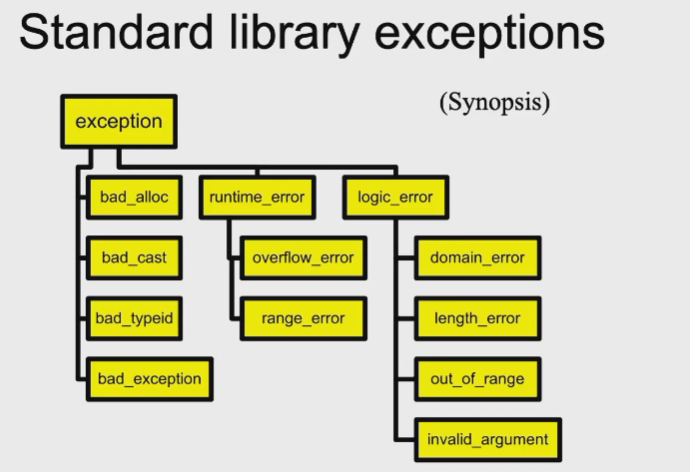

# Exceptions | 异常

??? example "Vector"
    === "code"
        ```c++
        template <class T>
        class Vector
        {
        private:
            T *elem;
            int sz;
        public:
            Vector(int s = 0) : sz(s) ... 
            ~Vector() { delete[] elem; }
            T &operator[](int i);
            int size() const { return sz; }
        };
        ```
    
    === "problem"
        * `T &operator[](int i);` 是可能发生越界的，如何处理：
        * Choice: 

            1. Return random memory object --- `return elem[i];`
            2. Return a special error value

                ```c++
                if(i < 0 || i >= size())
                {
                    // WRONG - T 不一定有这种构造函数，且原本就可能有这样正常的内容
                    T *error_marker = new T("some magic value");
                    return *error_marker;
                }
                return elem[i];
                ```

                * But this throws the baby out with the bath!
                * `x = v[2] + v[4]; //Not safe code`

            3. Just die!

                ``` c++
                if(i < 0 || i >= size())
                {
                    exit(22);
                }
                return elem[i];
                ```

            4. Die gracefully (with autopsy)

                ``` c++
                assert(i >= 0 && i < size());
                return elem[i];
                ```

                * `assert` 做接口检查，在调用函数时会检查传入参数是否合法，若不合法则直接退出程序

* When to use exceptions?
    * Many times, you don't know what should be done
    * Solution: turf the problem to the caller | 将问题向上报
        * Make caller responsible for handling the problem

## `throw` | 抛出异常

* How to raise an exception --- `throw`
  
    ``` c++
    template <class T>
    T &Vector<T>::operator[](int i)
    {
        if(i < 0 || i >= size())
        {
            // throw is a keyword
            // exception is raised at this point
            throw << something >>
        }
        return elem[i];
    }
    ```

* What do you throw?
    * What do you have? <-- Data
    * Define a class to represent the error

    ``` c++
    class VectorIndexError
    {
    public:
        VectorIndexError(int i) : m_badValue(i) {}
        ~VectorIndexError() {}
        void diagnostic() 
        {
            cerr << "index " << m_badValue << " is out of range" << endl;
        }
    private:
        int m_badValue;
    };
    ```

* How to raise it?

    ``` c++
    template <class T>
    T &Vector<T>::operator[](int i)
    {
        if(i < 0 || i >= size())
        {
            // VectorIndexError e(i);
            // throw e;
            throw VectorIndexError(i);
        }
        return elem[i];
    }
    ```

* What about your caller
  
    1. Case 1) Don't care --- Code never even suspects a problem
        
        ``` c++
        int func()
        {
            Vector<int> v(12);
            v[3] = 5;
            int i = v[42];  // Out of range
            // Control never gets here
            return i;
        }
        ```
    
    2. Case 2) Care deeply

        ``` c++
        void outer()
        {
            try
            {
                func(); // func() throws an exception
                func2();// won't be called
            }
            catch(VectorIndexError &e)
            {
                e.diagnostic();
                //This exception does not propagate
            }
            cout << "Control is here after exception";
        }
        ```

    3. Case 3) Mildly interested

        ``` c++
        void outer()
        {
            string err("exception caught");
            try
            {
                func(); // func() throws an exception
            }
            catch(VectorIndexError)
            {
                cout << err;
                throw;  // propagate the exception
            }
        }
        ```
    
    4. Case 4) Doesn't care about the particulars ( `...` means "catch **All** exceptions" )

        ``` c++
        void outer()
        {
            try
            {
                func(); // func() throws an exception
            }
            catch(...)
            {
                // ... catches ALL exceptions!!
                cout << "exception caught";
            }
        }
        ```

???+ note "Review"
    * Throw statement raises the exception
        * Control propagates back to first handler for that exception
        * Propagation follows the **call** chain
        * Objects on **stack** are properly destroyed
    * `throw exp`;
        * throws value for matching
    * `throw`;
        * **reraises** the exception being handled
        * valid only within a handler

## Exception Handlers

* Try block

    ``` c++
    try
    {
        // code that might throw an exception
    }
    catch ...
    {
        // code that handles the exception
    }
    catch ...
    {
        // code that handles the exception
    }
    ```

    * Establishes any number of handlers
    * Not needed if you don't use any handlers
    * Shows where you expect to handle exceptions
    * Costs cycles

* Exception handlers
    * Select exception by type
    * Can re-raise exception
    * Two forms
        * `catch (Type)`
        * `catch (...)`
    * Take a single argument (like a formal parameter)

* Selecting a handler
    * Can have any number of handlers
    * Handlers are checked in order of appearance
    1. Check for exact match
    2. Apply base class conversions (Reference and pointer types, only)
    3. Ellipses(...) matches any exception

* Inheritance can be used to structure exceptions
    
    ??? example "using inheritance"
        * Hierachy of exception types

        === "code - handlers"
            ``` c++
            class MathErr
            {
                ...
                virtual void diagnostic();
            };
            class OverflowErr : public MathErr { ... }
            class UnderflowErr : public MathErr { ... }
            class ZeroDivideErr : public MathErr { ... }
            ```
        
        === "using handlers"
            ``` c++
            try
            {
                // code to exercise math options
                throw UnderflowErr();
            }
            catch(ZeroDivideErr &e)
            {
                // handle divide by zero
            }
            catch(MathErr &e)
            {
                // handle other math errors
            }
            catch(...)
            {
                // handle all other exceptions
            }
            ```

            * 异常应由窄到宽进行处理，即先处理子类异常，再处理父类异常，最后处理所有异常

* Exception and new
    * new does NOT return 0 on failure
    * new raises a bad_alloc exception on failure

    ``` c++
    void func()
    {
        try
        {
            while(1)
            {
                char *p = new char[10000000];
            }
        }
        catch(bad_alloc &e)
        {
            cerr << "out of memory" << endl;
        }
    }
    ```

??? info "补充"
    

* Exception specifications
    * <u>Declare which exceptions a function might throw</u>
    * Part of function prototypes

    ``` c++
    void func() throw (OverflowErr)
    {
        ...
    }
    ```

    * Not checked at compile time
    * At run time, if an exception not in the list propagates out, the `unexpected` exception is raised

## Failure in Ctors & Dtors

### Failure in Ctors

* No return value is possible
* Use an "uninitialized" flag
* Defer work to an Init() function
* Better to throw an exception

* If a constructor can't complete, throw an exception
    * Dtors for objects whose ctor didn't complete won't be called
    * Clean up allocated resources before throwing

???+ success "Suggest - Two stages construction"
    * Do normal work in ctor
        * Initialize all member objects
        * Initialize all primitive members
        * Initialize all pointers to 0
        * <u>NEVER request any resources</u>
            * File / Network connection / Memory
    * Do additional work in Init() function
        * Request resources
        * Do any other work that might fail

### Failure in Dtors

Destructors are called when:

* Normal call: object exists from scope
* During exceptions: stack unwinding invokes dtors on objects as scope is existed

* Throwing an exception in a dtor that is itself being called as the result of an exception will invoke `std::terminate()`
    * Allowing exceptions to escape from dtors should be avoided

??? bug "catch"
    * `catch` exceptions by reference or pointer
    * `catch(BUG *e)` --- we need `delete e` in the handler
    * `catch(BUG &e)` --- we need care when to destruct `e`

