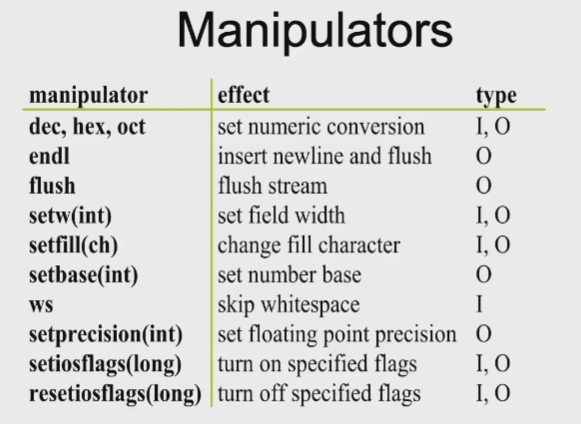
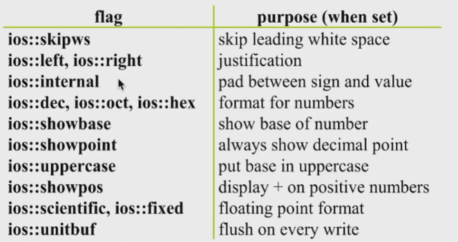
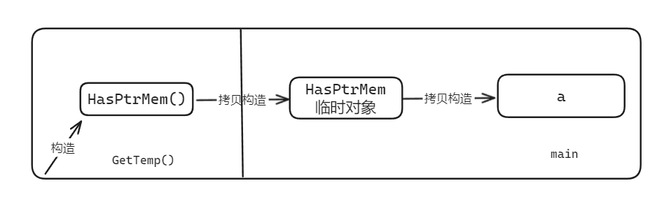
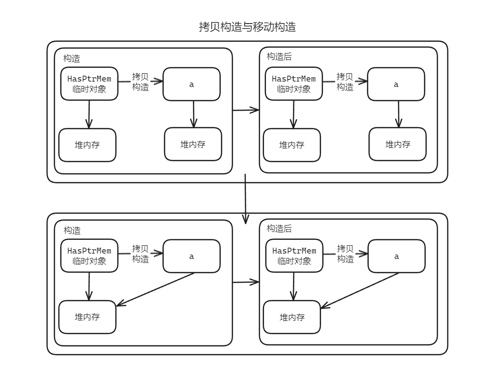

# Streams & 继承构造函数

## Streams

!!! abstract "Why streams"
    * Original C I/O used printf, scanf
    * Streams invented for C++
        * C I/O libraries still work
    * Advantages of streams
        * Better type safety
        * Extensible
        * More object-oriented
    * Disadvantages 
        * More verbose
        * Often slower

> `cin, cout` 速度会比 `scanf, printf` 慢

### Stream naming conventions

|                  | Input         | Output        | Header      |
| ---------------- | ------------- | ------------- | ----------- |
| Generic          | istream       | ostream       | <iostream>  |
| File             | ifstream      | ofstream      | <fstream>   |
| C string(legacy) | istrstream    | ostrstream    | <strstream> |
| C string         | istringstream | ostringstream | <sstream>   |

* `cin` 是 `istream`
* `istringstream` 是在字符串上建立一个流

### Stream operations

* Extractors
    * Read a value from the stream
    * Overload the `>>` operator
* Inserters
    * Insert a value into a stream
    * Overload the `<<` operator
* Manipulators
    * Change the stream state

### Kinds of streams

* Text streams
    * Deal in ASCII text
    * Perform some character translation
        * e.g. : newline -> actual OS file representation
    * Include
        * Files
        * Character buffers
* Binary streams
    * Binary data
    * No translation

> 文本流和二进制流（在 Linux 中，读文本文件里面自动把 0D0A 组合变成一个 0D）

!!! note "Predefined streams"
    * `cin` --- standard input
    * `cout` --- standard output
    * `cerr` --- unbuffered error (debugging) output
    * `clog` --- buffered error (debugging) output

### Defining a stream extractor

* <u>Has to be a 2-argument free function</u>
    * First argument is an `istream&`
    * Second argument is a *reference* to the a value

    ```c++
    istream& operator>>(istream& is, T& t)
    {
        // spefic code to read obj
        return is;
    }
    ```

* Return an `istream&` for chaining
    
    ```c++
    cin >> a >> b >> c;
    ((cin >> a) >> b) >> c;
    ```

??? info "Other input operators"
    * `int get()`

        * Return the next character in the stream
        * Returns EOF if no more characters
        * Example: copy input to output

        ``` c++
        int ch;
        while ((ch = cin.get()) != EOF)
            cout.put(ch);
        ```
    
    * `istream& get(char& ch)`
        * Puts the next character into argument
        * Similar to `int get()`
    * `get(char *buf, int limit, char delim = '\n')`
        * read up to `limit` characters, or to `delim`
        * Appends a null character to `buf`
        * Does not consume the delimiter
    * `getline(char *buf, int limit, char delim = '\n')`
        * Similar to `get()`, but consumes the delimiter
    * `ignore(int limit = 1, int delim = EOF)`
        * Skip over limit characters or to delim
        * Skip over delimiter if found
    * `ing gcount()`
        * return number of characters just read
    * `void putback(char)`
        * pushes a single character back into the stream
    * `char peek()`
        * examine next character without reading it
        * `switch(cin.peek()) { ... }`

??? info "Other output operators"
    * `put(char)`
        * prints a single character
        * Example: 
            * `cout.put('a')`
            * `cerr.put('!')`
    * `flush()`
        * Force output of stream contents
        * Example: 
            * `cout << "Hello";`
            * `cout.flush();`

### Manipulators

#### Formatting using manipulators

* Manipulators modify the state of the stream
    * `#include <iomanip>`
    * Effects hold(usually)
* Example:

    ```c++
    int n;
    cout << "Enter a number in hex: " << flush;
    cin >> hex >> n;
    ```

    * `hex` 表示从此处起，读入的东西都是十六进制的，直到其他符号恢复或程序结束

??? note "List"
    * Manipulators    
    
    
    
    * Stream flags control formatting

    

    * 全部设置直接用 `or` 即可，不同 `flag` 占据不同 bit 位

??? example
    === "code"
        ```c++
        #include <iostream>
        #include <iomanip>
        int main()
        {
            cout << setprecision(2) << 1000.243 << endl;
            cout << setw(20) << "OK!" ;
            return 0;
        }
        ```

    === "output"
        ```bash
        1e+03
                       OK!
        ```

???+ note "define your own manipulators"
    ```c++
    //skelton for an output stream manipulator
    ostream& manipulator(ostream& os)
    {
        //do something to os
        return os;
    }
    ostream& tab(ostream& os)
    {
        return os << '\t';
    }
    cout << "Hello" << tab << "World" << endl;
    ```

???+ example "Working with flags"
    === "code"
        ```c++
        #include <iostream>
        #include <iomanip>
        using namespace std;
        int main()
        {
            cout.setf(ios::showpos | ios::scientific);
            cout << 123 << " " << 456.78 << endl;
            cout << resetiosflags(ios::showpos) << 123;
            return 0;
        }
        ```
    
    === "output"
        ```bash
        +123 +4.567800e+02
        123
        ```

### Stream error states


> 读完会回到 EOF

### Working with streams

* Error state is set after each operation
* Conversion to `void *` returns 0 if problem
* Can clear an error state using `clear() // Reset error state to good()`
* Checking status
    * `good()` --- Returns `true` if in valid state
    * `eof()` --- Returns `true` if at EOF
    * `fail()` --- Returns `true` if minor failure or bad
    * `bad()` --- Returns `true` if in bad state

??? example
    ```c++
    int n;
    cout << "Enter a value for n, then [Enter]: " << flush;
    while(cin.good())
    {
        cin >> n;
        if(cin) // input was OK
        {
            cin.ignore(INT_MAX, '\n');  // flush newline
            break;
        }
        if(cin.fail()) // input was bad
        {
            cin.clear(); // clear error state
            cin.ignore(INT_MAX, '\n'); // skip garbage
            cout << "Invalid input; please re-enter: " << flush;
        }
    }
    ```

    * `if(cin)` 中 `cin` 返回的是 `good()` 的值
    * `fail` 一般是类型不匹配，`bad` 一般表示流坏掉了

??? info "File streams"
    ```c++
        ofstream out(argv[2]);
        if(!out)
        {
            cerr << "Cannot open " << argv[2] << endl;
            exit(2);
        }
        char c;
        while(in >> c)
        {
            out << c;
        }
    }
    ```

??? info "More stream operations"
    * `open(const char *, int flags, int)`
        
        * Open a specific file

        ```c++
        ifstream in;
        in.open("file.txt", ios::in);
        if(!in)
        {
            cerr << "Cannot open file.txt" << endl;
        ···
        ```

    * `close()` --- closes stream

## 继承构造函数

* 类具有可派生性，派生类自动获得基类的成员变量和接口（虚函数和纯虚函数）
* 基类的构造函数也没有被继承，因此

```c++
class A
{
public:
    A(int i) { }
};

class B : public A
{
public:
    B(int i) : A(i), d(i) { }
private:
    int d;
};
```

* B 的构造函数起到了传递参数给 A 的构造函数的作用 ： 透传
* 如果 A 具有不止一个构造函数，B 往往要设计对应的多个透传

### `using` 声明

* 派生类用 `using` 声明来使基类的成员函数成为自己的
    * 解决 `name hiding` 问题：非虚函数被 `using` 后成为派生类的函数
    * 解决构造函数重载问题

=== "code"
    ```c++
    class Base
    {
    public:
        void f(double)
        {
            cout << "double\n";
        }
    };
    class Dereived : Base // 不是 public 继承
    {
    public: 
        using Base:f;
        void f(int)
        {
            cout << "int\n";
        }
    };
    int main()
    {
        Derived d;
        d.f(4);
        d.f(4.5);
        return 0;
    }
    ```

=== "explanation"
    * 因为没有 `public` 继承，在子类中父类的 `f(double)` 并不存在。就算使用 `public` 继承，由于重载，子类中还是只有一个 `f(int)`
    * 因为 `using` 的存在，子类中有了父类的 `f(double)`

#### 隐式声明

```c++
class A
{
    A(int i) { cout << "int\n"; }
    A(double d, int i) { }
    A(float f, char *s) { }
};

class B : A
{
public:
    using A::A;
};

int main()
{
    B b(2);
}
```

* 继承构造函数是隐式声明的，如果没有用到就不产生代码
* 隐式声明的好处就是不用到的就不产生实际代码，比如上述程序只会产生 `A(int i)` 代码
* `using A::A` 表示把所有 A 都派生掉（`using` 不用给出参数表）

???+ note "默认参数"
    * 如果基类的函数具有默认参数值，`using` 的派生类无法得到默认参数值，就必须转为多个重载的函数

        ```c++
        class A
        {
        public:
            A(int a = 3, double b = 2.4) { }
        };
        ```
    
    * 实际上可以被看做是：

        ```c++
        A(int, double);
        A(int);
        A();
        ```

    * 那么，被 `using` 后就会产生相应的多个函数
    * 即，默认参数无法被派生

* 多继承且多处继承构造函数时，可能出现的重载冲突只能通过主动定义派生类的构造函数来解决
* 不能声明继承构造函数的情况：
    * 基类的构造函数时私有的
    * 派生类是从基类中虚继承的
* 一旦声明了继承构造函数，就不会再生成自动默认构造函数
* <u>自己主动定义的构造优先级大于继承的</u>

### 委派构造函数

* 如果重载的多个版本的构造函数内要做相同的事情
    * 显然代码复制是不良设计的突出表现
    * 在构造函数内调用某个函数的问题是它发生在初始化之后

```c++
class Info
{
public:
    Info() { Init(); }  // 目标
    Info(int i) : Info() { type = i;}   // 委派
    Info(char e) : Info() { name = e;}  // 委派
};
```

---

目标构造函数的执行先于委派构造函数
构造函数不能同时委派和初始化列表 | 在构造函数内赋值不是最好的选择
* 委派关系可以形成链接, 但要防止出现循环链接

```c++
class Info
{
public:
    Info() : Info(0, 'a') { } // 委派
    Info(int i) : Info(i, 'a') { } // 委派
    Info(char e) : Info(0, e) { } // 委派
private:
    Info(int i, char e) : type(i), name(e) { } // 目标
};
```

### 浅拷贝 VS 深拷贝

* 浅拷贝：编译器自动产生的拷贝构造函数，会执行 member-wise copy

> 当有成员变量是指针时，这种拷贝是有害的, 所以必须编写自己的拷贝构造函数来实现深拷贝

??? example
    ```c++
    class C
    {
        C():i(new int(0)) 
        { 
            cout << "none argument constructor called" << endl;
        }
        // 增加此拷贝构造函数，根据传入的 c，new 一个新的 int 给 i 变量
        C(const C& c):i(new int(*c.i))
        {
            cout << "copy constructor called" << endl;
        }
        ~C()
        {
            delete i;
            cout << "destructor called" << endl;
        }
        int* i;
    };
    ```

### 移动语义

* 但拷贝函数中为指针成员分配新的内存再进行内容拷贝的方法有时候不是必须的

=== "code"
    ```c++
    class HasPtrMem
    {
    public:
        HasPtrMem() : d(new int(0))
        {
            cout << "Construct: " << ++n_cstr << endl;
        }
        HasPtrMem(const HasPtrMem& h) 
        {
            cout << "Copy construct: " << ++n_cptr << endl;
        }
        ~HasPtrMem()
        {
            cout << "Destruct: " << ++n_dstr << endl;
        }
    private:
        int *d;
        static int n_cstr;
        static int n_dstr;
        static int n_cptr;
    };
    int HasPtrMem::n_cstr = 0;
    int HasPtrMem::n_dstr = 0;
    int HasPtrMem::n_cptr = 0;

    HasPtrMem GetTemp()
    {
        return HasPtrMem(); // Ⅰ
    }
    int main()
    {
        HasPtrMem a = GetTemp(); // Ⅱ
        return 0;
    }
    ```

=== "explanation"
    * 构造函数被调用 1 次，是在Ⅰ处，第一次调用拷贝构造函数是在 `GetTemp` return 的时候，将Ⅰ生成的变量拷贝构造出一个临时值，来当作 `GetTemp` 的返回值
    * 第二次拷贝构造函数是在Ⅱ处
    * 同时就有了于此对应的三次析构函数调用
    * 例子中用的是一个 int 类型的指针，而如果该指针指向的是非常大的堆内存数据的话，那没拷贝过程就会非常耗时，而且由于整个行为是透明且正确的，分析问题时也不易察觉

    

#### 移动构造函数

* 通过移动构造函数可以解决上述问题（移动构造就是不复制任何的内存）

???+ note "拷贝构造 vs 移动构造"
    

=== "code"
    ```c++
    HasPtrMem(const HasPtrMem& h)
    {
        cout << "Copy construct: " << ++n_cptr << endl;
    }
    HasPteMem(HasPtrMem&& h) : d(h.d)
    {
        h.d = nullptr;  // Ⅲ 注意对之前的 h 赋空指针
        cout << "Move construct: " << ++n_mvtr << endl;
    }
    ```

=== "explanation"
    * 通过指针赋值的方式，将 d 的内存直接“偷”过来，避免了拷贝构造函数的调用
    * 注意Ⅲ，这里需要对之前的 h 赋空指针，因为在移动构造函数完成后，临时对象会被立即析构，如果不改变 d, 那临时对象被析构时，因偷来的 d 和原本的 d 指向同一块内存，会被释放，成为悬挂指针，导致错误
    * 为什么不用函数参数里带个指针或引用当返回结果？ --- 代码编写效率及可读性差

* 移动构造函数何时被触发？
    * 一旦用到的是个临时变量，那移动构造语义就可以得到执行

    ??? question
        * 在 C++ 中如何判断产生了临时对象？如何将其用于移动构造函数？是否只有临时变量可以用于移动构造？
        * Answer:
            1. 如何判断产生了临时对象？ --- 临时对象是指在表达式求值过程中产生的对象，它的生命周期仅仅是表达式的求值过程，表达式求值结束后，临时对象就会被销毁
            2. 如何将其用于移动构造函数？ --- 临时对象的生命周期结束后，会调用析构函数，而在析构函数中，会调用移动构造函数
            3. 是否只有临时变量可以用于移动构造？ --- 不是，只要是将要被销毁的对象，都可以用于移动构造

#### 左值、右值和右值引用

> 之前提过一点 [跳转页最下面](../Lec07/#value-classes)

* 在赋值表达式中，出现在等号左边的就是“左值”，而在等号右边的，就是“右值”
* 可以取地址的、有名字的就是左值，反之就是右值
* 在 C++11 中，右值是由两个概念构成的，一个是将亡值（xvalue, eXpiring, Value）, 另一个则是纯右值（prvalue, Pure Rvalue）

!!! note "纯右值 vs 将亡值"
    * 纯右值是 C++98 标准中右值的概念，讲的是用于辨识临时变量和一些不跟对象关联的值。比如非引用返回的函数返回的临时变量值就是一个纯右值。
        * 一些运算表达式，比如 `1 + 2` 产生的临时变量值也是纯右值
        * 而不跟对象关联的字面量值，比如：`1`, ` `a` `, `true` 也是纯右值
        * 此外，类型转换函数的返回值，lambda 表达式等，也都是右值
    * 将亡值则是 C++11 新增的跟右值引用相关的表达式，这样表达式通常是将要被移动的对象（移为他用），比如返回右值引用 `T&&` 的函数返回值，`std::move` 的返回值，或者转换为 `T&&` 的类型转换函数的返回值等

##### 右值引用

* 右值引用就是对一个右值进行引用的类型。由于右值通常不具有名字，我们也只能通过引用的方式找到它的存在。通常情况下，我们只能从右值表达式获得其引用
    * 比如：`T&& a = ReturnRvalue();`
    * 在这个表达式中，假设 `ReturnRvalue()` 返回一个右值，那么我们就声明了一个名为 `a` 的右值引用，其值等于 `ReturnRvalue()` 的返回的临时变量的值
* 右值引用和左值引用都属于引用类型。无论是声明一个左值引用还是右值引用，都必须<u>立即进行初始化</u>。因引用类型本身并不拥有所绑定对象的内存，只是一个别名而已。（左值引用是具名变量值的别名，右值引用是 不具名/匿名 变量的别名）

???+ info "example"
    * `T&& a = ReturnRvalue();` 
        * `ReturnRvalue()` 函数返回的右值在表达式语句结束后，其生命也就终结了（通常我们也称其具有表达式生命期），而通过右值引用的声明，该右值的生命周期将同右值引用类型变量 `a` 的生命期一样
    * 故相比 `T  b = ReturnRvalue();`
        * 右值引用变量声明就会少一次对象的析构及一次对象的构造。因为 `a` 直接绑定了 `ReturnRvalue()` 返回的临时值，而 `b` 只是由临时值构造的，而临时值在表达式结束后会析构因此就会多一次析构和构造的开销
        * 能够声明右值引用 `a` 的前提是 `ReturnRvalue()` 返回的是一个右值。通常情况下，右值引用是不能够绑定到任何左值的。
  
???+ info "More"
    === "question"
        相对的，在 C++98 标准中就已经出现的左值引用是否可以绑定到右值（由右值进行初始化）呢？比如：

        ```c++
        T& e = ReturnRvalue();
        const T& f = ReturnRvalue();
        ```

        * `e` 的初始化会导致编译时错误，而 `f` 不会

    === "explanation"

        ```c++
        T& e = ReturnRvalue();
        const T& f = ReturnRvalue();
        ```

        * 常量左值引用在 C++98 标准中开始就是个“万能”的引用类型
        * 可以接受非常量左值、常量左值、右值对其进行初始化
        * 而且在使用右值对其初始化时，常量左值引用还可以像右值引用一样将右值的生命期延长
        * 相比于右值引用所引用的右值，常量左值所应用的右值在其生命期中是只读权限
        * 相对的，非常量左值只能接受非常量左值对其初始化

#### `std::move()`

* 在 C++11 中，<utility> 中提供了函数 `std::move()`，可以<u>将一个左值强制转化为右值引用</u>，继而我们可以通过右值引用使用该值，用于移动语义
* 被转化的左值，其生命期并未随左右值的转化而改变
* **在编写移动构造函数时**，应总是使用 `std::move()` 转换拥有形如堆内存、文件句柄等资源的成员为右值。这样一来，如果成员支持移动构造的话，就可以实现其移动语义（即使成员无移动构造函数，也会调用拷贝构造，因为不会引起大的问题）

> 移动语义一定是要改变临时变量的值

* `Moveable c(move(a));` 
    * 这里的 `a` 本来是一个左值变量，通过 `std::move` 将其转换为右值
    * 这样一来，`a.i` 就被 `c` 的移动构造函数设置为指针空值。由于 `a` 的生命期实际要到所在函数结束才结束，那么随后对表达式 `*a.i` 进行运算时，就会发生严重的运行时错误

* 在 C++11 中，拷贝/移动构造函数有以下 3 个版本：

    ```c++
    T Object(T&)
    T Object(const T&)
    T Object(T&&)
    ```

    * 其中常量左值引用的版本是一个拷贝构造函数版本，右值引用参数是一个移动构造函数版本
    * 默认情况下，编译器会为程序员隐式生成一个移动构造函数，但如果声明了自己定义的拷贝构造函数、拷贝赋值函数、移动构造函数、析构函数中的一个或者多个，编译器都不会再生成默认版本
    * 所以在 C++11 中，<u>拷贝构造函数、拷贝赋值函数、移动构造函数和移动赋值函数必须同时提供，或同时不提供，只声明其中一个的话，类都仅能实现一种语义</u>

### Perfact Forwarding | 完美转发

* 完美转发，是指在模板函数中，完全依照模板的参数类型将参数传递给模板中调用的另一个函数

```c++
template <typename T>
void IamForwarding(T t)
{
    IrunCodeActually(t);
}
```

* 因为使用最基本类型转发，会在传参的时候产生一次额外的临时对象拷贝
* 所以通常需要的是一个引用类型，就不会有拷贝的开销。其次需要考虑函数对类型的接受能力，因为目标函数可能需要既接受左值引用，又接受右值引用，如果转发函数只能接受其中的一部分，也不完美

=== "考虑类型"

    ```c++
    typedef const A T;
    typedef T& TR;
    TR& v = 1;
    ```

    * 在 C++11 中引入了一条所谓”引用折叠“的新语言规则
    
    | TR 的类型定义 | 声明 v 的类型 | v 的实际类型 |
    | ------------- | ------------- | ------------ |
    | T&            | TR            | A&           |
    | T&            | TR&           | A&           |
    | T&            | TR&&          | A&           |
    | T&&           | TR            | A&&          |
    | T&&           | TR&           | A&           |

=== "转发函数为"
    ```c++
    template <typename T>
    void IamForwarding(T&& t)
    {
        IrunCodeActually(static_cast<T&&>(t));
    }
    ```
    
    * 对于传入的右值引用

        ```c++
        void IamForwarding(X&& && t)
        {
            IrunCodeActually(static_cast<X&& &&>(t));
        }
        ```

    * 折叠后是

        ```c++
        void IamForwarding(X&& t)
        {
            IrunCodeActually(static_cast<X&&>(t));
        }
        ```

