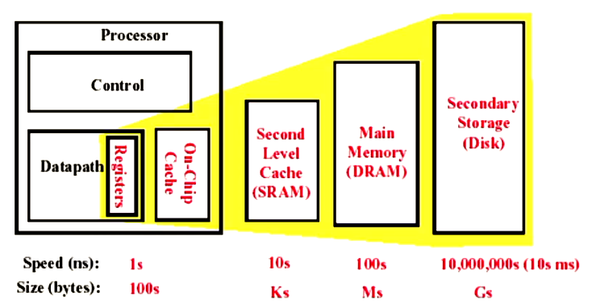

## Three classes of computers with different concerns in memory hierarchy

* Desktop computers:
    * Are primarily running one application for single user
    * Are concerned more with average latency from the memory hierarchy
* Server computers
    * May typically have hundreds of users running potentially dozens of applications simultaneously
    * Are concerned about memory bandwith
* Embedded computers
    * Real-time applications
        * worst-case performance vs Best case performance
    * Are concerned more about power and battery life
        * Hardware vs Software
    * Running single app & use simple OS
        * The protection role of the memory hierarchy is often diminished
    * Main memory is very small
        * often no disk storage

## Enhance speed of memory

* Component character of hardware:
    * Smaller hardware is faster and more expensive
    * Bigger memories are lower and cheaper

The goal:
* There are speed of smallest memory and capacity of biggest memory
* To provide cost almost as low as the cheapest level of memory and speed almost as fast as the fastest level

## The method enhance speed of memory

* By taking advantage of the principle of locality:
    * most programs do not access all code or data uniformly
    * Temporal locality(Locality in Time):
        * If an item is referenced, the same item will tend to be referenced again soon
        * Keep most recently accessed data items closer to the processor
    * Spatial locality(Locality in Space):
        * If an item is referenced, items nearby will tend to be referenced soon
        * Move recently accessed groups of contiguous words(block) closer to the processor

> 后续的所有优化都基于 Locality in Time & Locality in Space

* The method
    * Hierarchies bases on memories of different speeds and size
    * The more closely CPU the level is, the faster the one is
    * The more closely CPU the level is, the smaller the one is
    * The more closely CPU the level is, the more expensive one is

## Memory Hierarchy of a Modern Computer System

By taking advantage of the principle of locality:
* Present the user with as much memory as is available in the cheapest technology
* Provide access at the speed offered by the fastest technology   

## 36 terms of Cache
 |      36 terms of Cache    |                   |                |
 | ------------------------- | ----------------- | -------------- |
 |Cache                      | full associative  | write allocate |
 |Virtual memory             | dirty bit         | unified cache  |
 |Memory stall cycles        | block             | block offset   |
 |misses per instruction     | direct mapped     | write back     |
 |Valid bit                  | data cache        | locality       |
 |Block address              | hit time          | address trace  |
 |Write through              | cache miss        | set            |
 |Instruction cache          | page fault        | miss rate      |
 |random replacement         | index field       | cache hit      |
 |Average memory access time | page              | tag field      |
 |n-way set associative      | no-write allocate | miss penalty   |
 |Least-recently used        | write buffer      | write stall    |

## What is Cache

* Small, fast storage used to improve average access time to slow memory
* In computer architecture, almost everything is a cache
    * Registers “a cache” on variables –software managed
    * First-level cache a cache on second-level cache
    * Second-level cache a cache on memory
    * Memory a cache on disk (virtual memory)
    * TLB a cache on page table
    * Branch-prediction a cache on prediction information ?

??? question
    > How do know if a data is in cache?
    > Moreover, if it is, how do we find it?

### Four Questions for Cache Designers

* Caching is a general concept used in processors, operating systems, file systems, and applications. There are Four Questions for Cache/Memory Hierarchy Designers
    * Q1 (Block placement):  Where can a block be placed in **the upper level/mainmemory** ? 
        * Fully Associative, Set Associative, Direct Mapped
    * Q2 (Block identification): How is a block found if it is in **the upper level/main memory** ?
        * Tag/Block
    * Q3 (Block replacement): Which block should be replaced on a **Cache/main memory** miss?
        * Random, LRU, FIFO
    * Q4 (Write strategy): What happens on a write?
        * Write Back or Write Through (with Write Buffer)

#### Q1: Block placement

* Direct Mapped
    * Block can only go in one place in the cache (Usually address MOD Number of blocks in chche)
* Fully Associative
    * Block can go anywhere in the cache
* Set Associative
    * Block can go in one of a set of places in the cache
    * A set is a group of blocks in the cache (Block address MOD Number of sets in the cache)
    * If sets have n blocks, then the cache is n-way set associative
