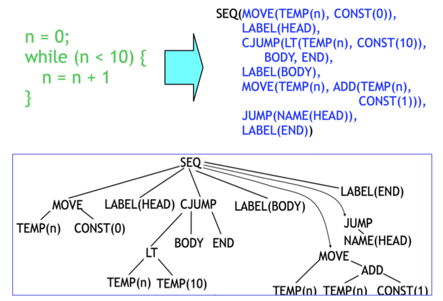
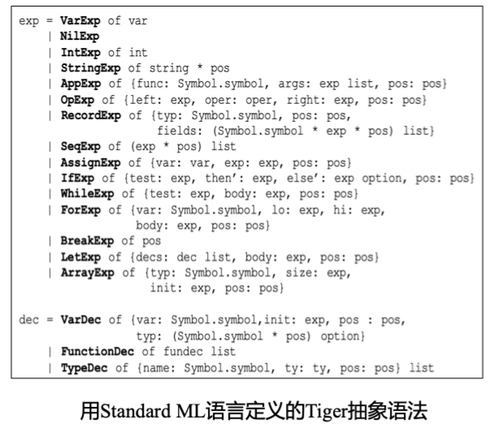
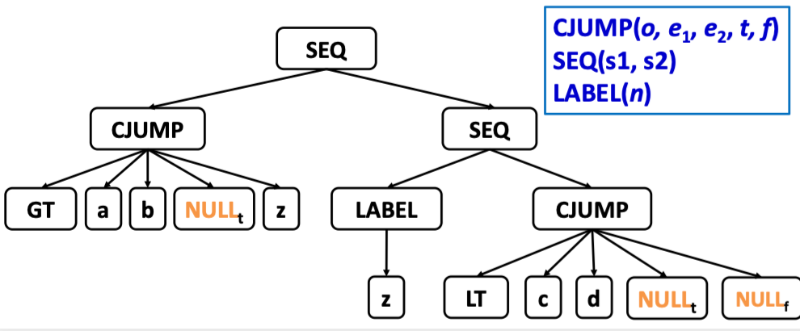
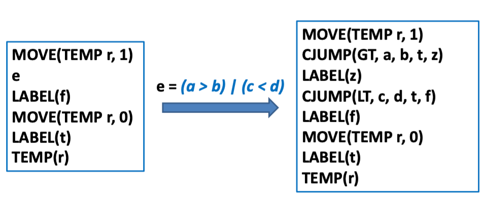
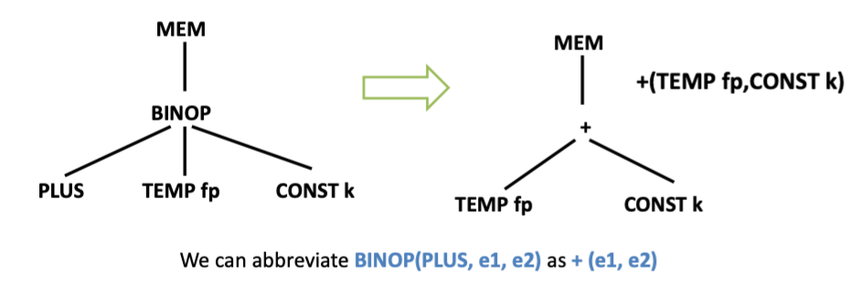
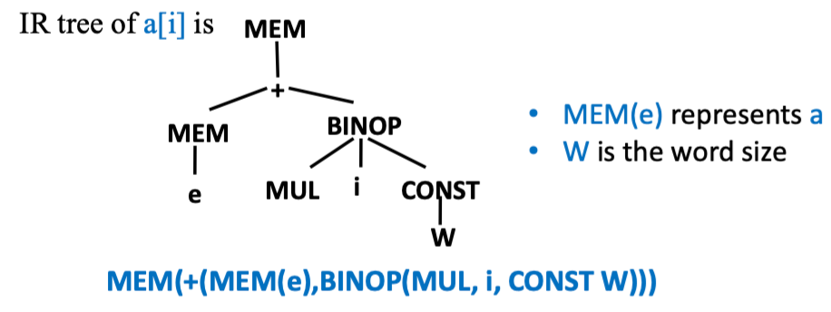
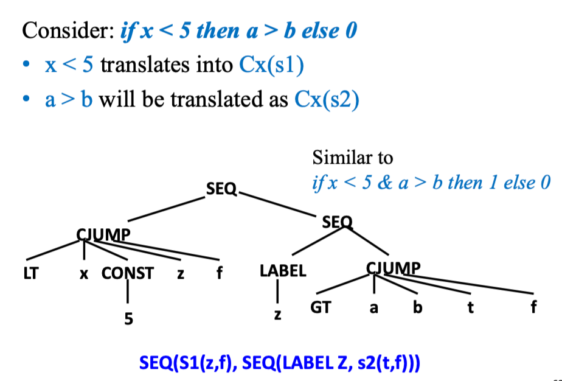
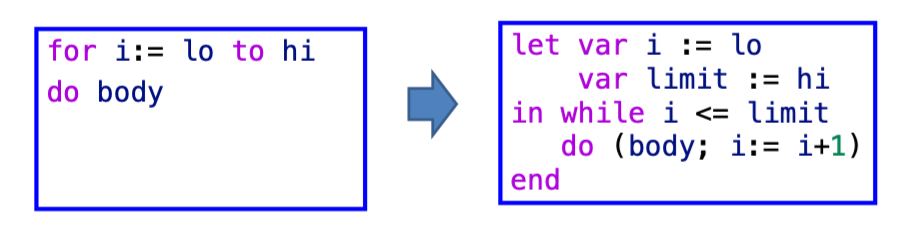
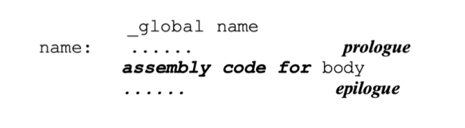
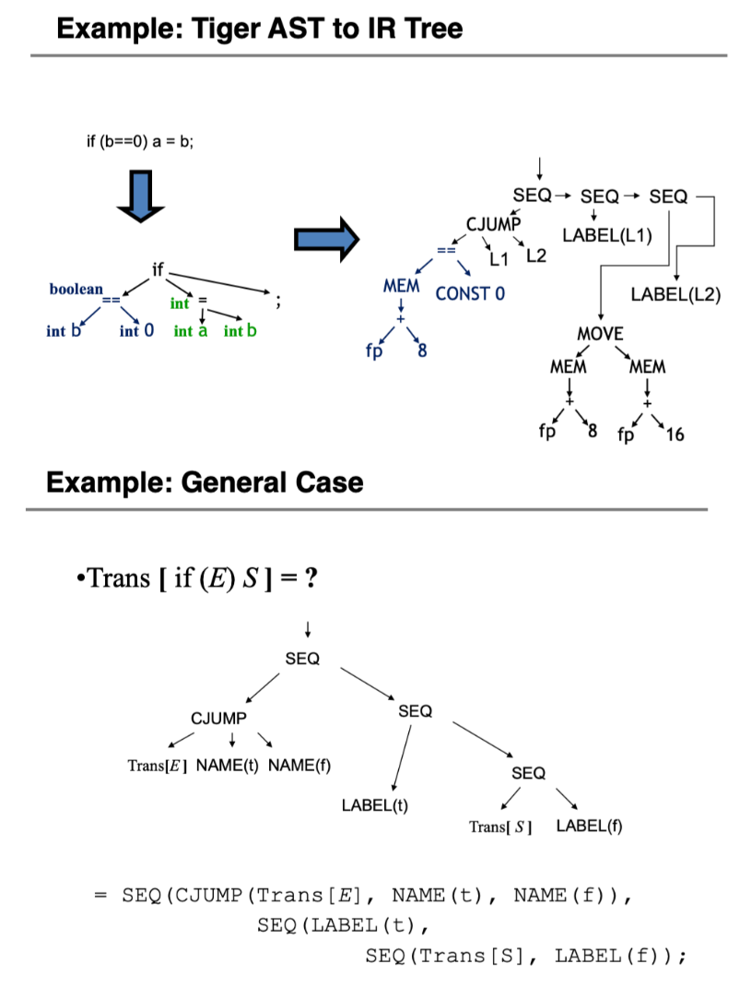

# Translating into Intermediate Code

## 中间表示概述

!!! abstract
    - 中间表示（IR）
        - 一种抽象的机器语言
        - 能够表达目标机器的操作
        - 不过多涉及机器特定的细节
    - 设计目标
        - 可移植的编译器，适用于不同的源语言和不同的目标机器
    - IR 应该简洁
        - 语法树的大块部分必须转换为 IR
        - IR 的组合必须聚合成“真实”的机器指令

为什么需要中间表示 (IR): 如果直接翻译成机器代码，会妨碍模块化 (modularity) 和可移植性 (portability)。

### (不要求掌握) IR分类

**1) 根据抽象层次：**

TODO

**2) 根据结构特征：**

TODO

### 三地址码 | Three-Address Code

!!! abstract
    - 目标：
        - 接近大多数目标机器的执行模型 (机器码)
        - 支持大多数目标机器提供的数据类型和操作
        - 提供有限度的、高于机器码的抽象表达能力，更容易表达出大多数(命令式) 高级语言的特性
    - 特征：
        - 以指令为单位
        - 每条指令只有有限数量的操作码

三地址码的一般形式：$x = y ~ op ~ z$

- 每个“指令”最多 1 个运算符，最多 3 个操作数
- E.g., `x + y * z` 翻译为三地址语句序列：`t1 = y * z`, `t2 = x + t1`

??? note
    | 序号 | 指令类型 | 指令形式 |
    | :---: | :---: | :---: |
    | 1 | 赋值指令 | `x = y op z`; `x = op y` |
    | 2 | 复制跳转 | `x = y` |
    | 3 | 条件跳转 ｜ `if x  relop y goto n` |
    | 4 | 无条件跳转 | `goto n` |
    | 5 | 参数传递 | `param x` |
    | 6 | 过程调用 | `call p, n` |
    | 7 | 过程返回 | `return x` |
    | ... | ... | ... |

    “地址”可以具有如下形式之一：

    - 源程序中的 **名字** (name)
    - **常量** (constant)
    - 编译器生成的 **临时变量** (temporary)

??? example
    !!! code inline "High-Level Language"
        ```c
        read x ;  { input an integer }
        if 0 < x then { don’t compute if x <= 0 } 
            fact:=1;
        repeat 
            fact:=fact*x;
            x:=x-1
        until x=0;
        write fact { output factorial of x }
        end
        ```

    !!! code "Three-Address Code"
        ```c
        read x 
        t1=x>0 
        if_false t1 goto L1 
        fact=1 
        label   L2 
        t2 = fact * x 
        fact = t2 
        t3 = x - 1 
        x = t3 
        t4= x= =0 
        if_false t4 goto L2 
        write fact 
        label   L1 
        halt
        ```

- 整个三地址指令序列实现为链表数组的形式：
- 最常见的实现方式是将三地址代码表示为四元组 (quadruples)：
    - 一个字段用于操作
    - 三个字段用于地址
对于那些需要少于三个地址的指令，其中一个或多个地址字段会被赋 null 或 "empty" 值

??? code "example code"
    ```
    t1 = x > 0           -> (gt, x, 0, t1)
    if_false t1 goto L1  -> (if_false, t1, L1, _)
    fact = 1             -> (assign, 1, fact, _)
    label L2             -> (label, L2, _, _)
    ```

> 其他实现方式包括：三元组，间接三元组。

#### 静态单赋值 (SSA)（不考）

TODO

## IR Tree 中间表示

Tiger 仅仅使用一个 IR —— the Intermediate Representation (IR) Tree。

```
AST => IR Tree => assembly => machine code
```

!!! note "A Low Level Tree Representation"
    

**1) IR Tree: Expressions:**

> 表达式代表对某个值的计算，可能还有副作用

| Expression | Meaning |
| :---: | :---: |
| `CONST(i)` | 常量 `i` |
| `NAME(n)` | 符号常数 n（例如标签，`goto .L` 中 `.L` 就是 NAME） |
| `TEMP(t)` | 临时变量 `t` (虚拟寄存器、不考虑寄存器个数) |
| `BINOP(op, e1, e2)` | 二元操作符 `op` |
| `MEM(e)` | 以地址 `e` 开始的 `wordSize` 字节内存的内容。当 `MEM` 作为 `MOVE` 操作的左子节点时，它的意思是"存储"，但在其他任何地方，它的意思是"读取"。 |
| `CALL(f, args)` | 过程调用：将函数 `f` 应用于参数列表 `l` |
| `ESEQ(s, e)` | 先计算 `stm s`,再根据 `stm s` 计算 `exp e`, 得出结果 |

> 其中，`MEM` 表达式，如 x86 中的 `[rax] = 100`, `rbx = [rax]`

???+ important "关于 ESEQ"
    `ESEQ(s, e)`: The statement s is evaluated for side effects, then e is evaluated for a result.

    - 假设 `s` 是 `statement a=5`, `e` 是 `expression a+5`
    - `Statement` (如 `a=5` ) 不返回值,但是有副作用
    - `ESEQ(a=5, a + 5)` 最终的结果是10

    关于 Side Effects: 副作用指更新内存单元或临时寄存器的内容

**2) IR Tree: The Statements:**

> Statements performs side-effects and control flow - no return value!

| Statements | Meaning |
| :---: | :---: |
| `MOVE(TEMP t, e)` | 计算 `e` 并将其移动到临时变量 `t` 中 |
| `MOVE(MEM(e1), e2)` | 计算 `e1` 得到地址 `a` ，再计算 `e2` 放入地址 `a` 中 |
| `EXP(e)` | 计算表达式 `e`，并忽略结果 |
| `JUMP(e, labs)` | 将控制权（跳转）转移到地址 `e`。目标 `e` 可以是一个直接的标签，如`NAME(lab)`，也可以是通过其他类型的表达式计算出的地址 |
| `CJUMP(o, e1, e2, t, f)` | 按顺序评估 `e1, e2`，得到值 `a` 和 `b`。然后使用关系运算符 `o` 比较 `a` 和 `b`。如果结果为真，则跳转到 `t`；否则跳转到 `f` |
| `SEQ(s1, s2)` | 执行语句 `s1`，接着执行 `s2` |
| `LABEL(n)` | 定义名称 `n` 的常量值为当前机器代码地址 |

??? example
    === "IR Tree"
        
    === "IR Tree VS. X86-64 Instructions"
        | Intel syntax | IR equivalent |
        | :---: | :---: |
        | 17 | CONST(17) |
        | rax | TEMP(rax) |
        | [rax] | MEM(TEMP(rax)) |
        | [rax + rbx * 8] | MEM(ADD(TEMP(rax), MUL(CONST(4), TEMP(rbx)))) |

        > 以上并非 “IR Tree 翻译到机器指令的规则”

## IR Tree 的生成

!!! think "Review: The Tiger Language"
    - 一个 tiger 程序由 Expressions 和 Declarations (Variable, Function, Type) 组成, 无 Statement

    

### Kinds of Expressions

- **三种 Tiger AST Expressions:**

1. Expressions with return values
2. Expressions that return no value (such as while expressions)
3. Expressions with Boolean values, such as `a > b` (a conditional jump)

- **Mapping Tiger AST Expressions to IR Tree**:
    - **Ex**: expressions that compute values **(Tree expression)**
    - **Nx**: expressions that compute no values **(Tree statement)**
    - **Cx**: **conditional jump**, a Tree statement that may jump to a *true-label* or *false-label*

对于 `a > b | c < d`, 可以表示为：

```
Temp_label z = Temp_newlabel ( );
T_stm s1 = T_Seq(T_Cjump(T_gt,a,b,  NULL_t, z), 
                T_Seq (T_Label (z), 
                    T_Cjump (T_lt,c,d, NULL_t, NULL_f )));
```



由于我们到很久之后才能知道 true 值和 false 值对应的跳转地址，因此在语句中使用 `NULL` 代替

- 其中 `NULL_t` 的位置记录在 *true patch list* （真值标号回填表）中
- `NULL_f` 的位置记录在 *false patch list* (假值标号回填表)
- `z` 表示第一个的 false label, 是判断语句 `c < d` 对应的位置

??? code "patch_list"
    ```c
    typedef struct patchList_ * patchList;
    struct patchList_ { Temp_label *head; patchList tail; }; 
    static patchList patchList(Temp_label *head, patchList tail);
    ```

进而完成 `a > b | c < d` 到 `Tr_exp` 的翻译：

```c linenums="1" hl_lines="2 3 5"
patchList trues = PatchList(
  &s1->u.SEQ.left->u.CJUMP.true,
    PatchList(&s1->u.SEQ.right->u.SEQ.right->u.CJUMP.true, NULL));
patchList falses = PatchList(
  &s1->u.SEQ.right->u.SEQ.right->U.CJUMP.false, NULL);

Tr_exp e1 = Tr_Cx (trues, falses, s1);
```

??? info "填充待填标号"
    ```c
    // 遍历所有位置并填充为 label
    void doPatch (patchList tList, Temp_label label) {
    for ( ; tList; tList = tList->tail)
        *(tList->head) = label;
    }

    // 合并 patch
    patchList joinPatch (patchList first, patchList second) {
        if (!first) return second;
        for (; first->tail; first = first->tail);
        first->tail = second; 
        return first;
    }
    ```

    调用 `doPatch(e>u.cx.trues, trueLabel)`, `doPatch(e>u.cx.false, falseLabe;)` 将真/假值标号填到 patch list 中所有待填的位置

但其实还有问题：**Need utility functions for conversion among Ex, Nx, and Cx expressions**

- 表达式、语句和条件：在各种情况下，需要将其中一种转换为另一种
- 例如：对于 `flag := a > b`，我们需要对 `flag` 赋值，但是 `a > b` 是 `Cx` 类型的表达式，只有 `Ex` 才有返回值。

- **unEx, unNx, unCx**: Utility functions for conversions among Ex, Nx, and Cx
    - `Tr_exp` means the input expression can be of any kind

```c
static T_exp unEx(Tr_exp e); 
static T_stm unNx(Tr_exp e); 
static struct Cx unCx(Tr_exp e); 
```

由此，可将 `flag := a > b | c < d` 转为

```c
e = Tr_Cx(trues, falses, stm)
MOVE(TEMP(flag), unEx(e))
```

> 为什么需要 unEx, unNx, unCx 这几个辅助函数?
> 
> - 需要考虑到 a>b 被使用的“上下文”
> - IR 翻译是 context-dependent 问题(难以用 CFG 刻画, 但是可以用属性文法、semantic actions 等方式)

??? code "unEx 的实现"
    === "code"
        ```c
        static T_exp unEx(Tr_exp e) { 
            switch (e->kind) {
                case Tr_ex:
                    return e->u.ex;
                case Tr_cx: {
                    Temp_temp r = Temp_newtemp( );
                    Temp_label t = Temp_newlabel( ), f= Temp_newlabel( ); 
                    doPatch(e->u.cx.trues, t); 
                    doPatch(e->u.cx.falses, f);
                    return T_Eseq(T_move(T_Temp(r),T_Const(1)), 
                            T_Eseq(e->u.cx.stm, T_Eseq(T_Label(f), 
                                T_Eseq(T_Move(T_Temp(r), T_Const(0)), 
                                    T_Eseq(T_Label(t), T_Temp(r))))));
                }
                case Tr_nx:
                    return T_Eseq(e->u.nx, T_Const(0));
            } 
            assert(0); 
        }
        ```
    === "Cx -> Ex"
        首先将 Cx 转化为：

        ```c
        if Cx
            return 1
        else
            return 0
        ```

        再转化为：

        ```
        MOVE(TEMP r, 1)
        e
        LABEL(f)
        MOVE(TEMP r, 0)
        LABEL(t)
        TEMP(r)
        ```

将 `e` 处替换掉可以得到最后翻译成的 `e := a > b | c < d`



### Translation of Expressions

#### Simple Variables

- 在当前过程的堆栈帧中声明的一个简单变量 `v`
- 访问本地变量 `v`，偏移量为 `k`（帧指针为 `fp`）

```
MEM(BINOP(PLUS, TEMP fp, CONST k))
```



> 对于 Tiger, 所有变量都有相同的大小 (word size)

#### Array Variables

在 Tiger 和 ML 中，数组变量表现得像指针一样，没有像 C 语言那样的命名数组常量。

new array values are created (and initialized) by the construct $t_a[n]$ of $i$

- $t_a$ 是一种数组类型的名称
- $n$ 是元素的数量
- $i$ 是每个元素的初始值

```c
let
    type intArray = array of int
    var a := intArray[12] of 0
    var b := intArray[12] of 7
in a := b
end
```

- `a` 最终指向与变量 `b` 相同的 12 个 `7`
- 最初为 `a` 分配的 12 个 `0` 被丢弃。

Tiger **record** values are also pointers.

- `Record` 赋值类似数组赋值，是指针赋值，不拷贝所有 field

[How to translate array accesses, e.g., arr[2], arr[x]?](#subscripting-and-field-selection)

#### Structured L-values

- **R-value**: 在赋值操作符右边出现的表达式 (表示不可被赋值的位置)
- **L-value**: 可以出现在赋值语句左边的表达式结果:
    - 表示一个可以被赋值的位置
    - 也可以出现在赋值语句的右边 (在这种情况下，意味着该位置的内容)

- An integer or pointer value is a “scalar” (It has only one component)
    - **All the variables and L-values in Tiger are scalar**
    - A Tiger array or record variable is really a pointer
- In C or Pascal there are structured L-values
    - Structs in C, arrays and records in Pascal
    - They are not scalar.

对于结构化左值，一次地址计算应为：`MEM(+(TEMP fp, CONST k), S)`

```
T_exp T_Mem(T_exp, int size);
->
Mem(+(TEMP fp,CONST kn), S)
```

- `S` 表示要获取或存储的对象的大小

#### Subscripting and Field Selection | 下标和域选择

要计算 `a[i]` 的地址：

```
(i - l) * s + a
```

- `l` 表示索引范围的下限 
- `s`：每个数组元素的大小 (以字节为单位) 
- `a`：数组元素的基地址

- 如果 `a` 是全局变量，并且其地址在编译时为常量，则可以再编译时进行计算 `a - s × l` 的运算。
- 若要计算记录 `a` 中字段 `f` 的地址，即 `offset(f) + a`

??? note
    - 在 Tiger language 中，所有的 record 和 array 值实际上都是指向记录和数组结构的 **指针**，没有结构化的左值
    - 数组的 "base address" 实际上是一个指针变量的内容，所以需要使用 `MEM` 操作
    - 在 IR Tree 中，`MEM` 既表示存储（当用作 `MOVE` 操作的左子节点时），也表示读取（在其他地方使用时）

!!! example
    

- 从技术角度讲，左值应表示为一个地址（不包含顶部的 MEM 节点）, 但左值可以有以下用途：
    - 将左值转换为右值：从该地址获取
    - 给左值赋值：向该地址存储
    - 故可以将左值表示为一个 `MEM` 节点

#### Arithmetic

在 Tiger 中：

- 每个算术运算符对应一个树形运算符, 例如，`BINOP(o, e1, e2)`
- 没有单目运算符
    - 单目负可以实现为与零的减法
    - 单目补码 (取反) 可以实现为与全 1 的异或
- 不支持浮点数运算

#### Conditionals

- 比较运算符的结果将是一个 `Cx` 表达式
    - 一个语句 (`T_stm) s`，它会在条件为真时跳转到真目标，为假时跳转到假目标。
- 条件表达式可以轻松地与 Tiger 操作符 `&` 和 `|` 结合使用
- E.g., `x < 5` 可以翻译为：

```
stm = CJUMP (LT, x, CONST(5), NULL_t, NULL_f)
trues = {t}
falses = {f}
```

对于处理 `if`

```
if e1 then e2 else e3
```

!!! note inline "方法"
    最直接的方法：

    - 把 `e1` 视为 `Cx` 表达式 -> 对 `e1` 应用 `unCx`
    - `e2` 和 `e3` 视为 `Ex` 表达式 -> 分别对 `e2` 和 `e3` 应用 `unEx`
    - 为条件语句创建两个标签 `t` 和 `f` 
    - 分配一个临时变量 `r`
    - 在标签 `t` 之后，将 `e2` 赋值给 `r`
    - 在标签 `f` 之后，将 `e3` 赋值给 `r`
    - 两个分支最后都跳转到新创建的 `join` 汇合标签

```
unCx(e1) 
LABEL t 
r = unEx(e2) 
JUMP join 
LABEL f 
r = unEx(e3) 
JUMP join 
...
LABEL join 
...
```

如上翻译正确但是不高效

- 如果 `e2` 和 `e3` 都是 statements（不返回值的表达式），使用 `unEx` 没有问题，但最好能专门识别这种情况。
- 如果 `e2` 或 `e3` 是 `Cx` 表达式，`unEx` 会产生一团复杂的跳转和标签, 需要专门识别这种情况

??? code
    ```c
    case Tr_cx: {
      Temp_temp r = Temp_newtemp( );
      Temp_label t = Temp_newlabel( ), f= Temp_newlabel( );
      doPatch(e->u.cx.trues, t);
      doPatch(e->u.cx.falses, f);
      return T_Eseq(T_move(T_Temp(r),T_Const(1)),
               T_Eseq(e->u.cx.stm, 
		  		       T_Eseq(T_Label(f),
                   T_Eseq(T_Move(T_Temp(r), T_Const(0)),
                     T_Eseq(T_Label(t), T_Temp(r))))));
    }
    ```

??? example
    

#### While Loops

一个 `While` 循环的一般结构是：

```c
test:
    if not(condition) goto done
        body
    goto test
done:
    ...
```

- 如果中断语句出现在主体内部（而不是嵌套在任何内部的 `while` 语句中），此时翻译结果仅仅是跳转到 `done` 标签
- 如果有嵌套的话，如何知道 `done` 标签？
    - Solution: 中断语句的翻译（`transExp` 函数）需要新增一个形式参数 `break`，该参数设置为最近的包含循环的 `done` 标签。

#### For Loops



一种直接的翻译方法是将语句的抽象语法转化为所显示的 `let/while` 表达式的抽象语法。

- 但如果 `limit = maxint`, 此时 `i+1` 会溢出、 `i <= limit` 恒成立. 
- 解决这个问题的方法是将测试放在循环的底部，其中对 `i < limit` 的测试位于增加 i 值之前。然后，在进入循环之前还需要另外一个测试来检查是否有 `lo <= hi`。

```c
if lo > hi goto done
i := lo
limit := hi
test:
	body
	if i >= limit goto done
	i := i+1
	goto test
done:
    ...
```

#### Function Call

翻译函数调用 f(a1,...,an) 较为简单，只是需要将 static link 作为隐含的额外参数添加：

```c
CALL(NAME lf,  [sl, e1, e2, …, en]) 
```

- `lf` 是 `f` 的 label
- `s1` 是 static link —— 指向调用 f 的函数的帧指针

> - 为了计算 `sl`，需要知道 `f` 的 level 以及调用 `f` 的函数的 level。

**但这个只是传了 frame pointer, lambda lifting 是把所有参数直接传过去了**

### Translation of declarations

- **Variable declaration**
    - 需要确定帧中的 offset，然后将右侧表达式 **移动** 到帧中的合适位置。
- **Type declaration**
    - 不需要产生任何 IR 代码
- **Function declaration**



#### Variable Definition

- 在语义分析中，`transDec` 函数更新 `let` 表达式主体的值 `t` 和类型环境。
- 对于 IR translation，`transDec` 应该返回一个额外的结果，即变量的初始化。
    - 将初始化转化为赋值表达式。
    - 这些必须放在 `let` 主体之前。
- 如果 `transDec` 应用于函数和类型声明，结果将是一个“无操作”表达式，如 `Ex(CONST(0))`

#### Function Definition

函数转化为 "汇编语言段", 具有三个部分:

- Prologue | 入口
- Body | 函数体
- Epilogue | 出口


**Prologue** 包括：

**(1)** 伪指令以标记函数的开始（特定汇编语言所需）
**(2)** 函数名称的标签定义
**(3)** 调整堆栈指针的指令（以便分配新栈帧）
**(4)** 将“逃逸”参数（包括静态链接）保存到栈帧中的指令，并将非逃逸参数移动到新的临时寄存器
**(5)** 存储指令以保存函数内部使用的任何被调用者保存的寄存器（包括返回地址寄存器）

随后是 **Body** (Tiger 的函数体是一个 expression)：

**(6)** 转换后的表达式

最后是 **Epilogue**:

**(7)** 一个将返回值（函数结果）移动到寄存器的指令
**(8)** 用于恢复被调用者保存的寄存器的加载指令
**(9)** 重置堆栈指针的指令（为了释放帧）
**(10)** 返回指令（跳转到返回地址）
**(11)** 根据需要的伪指令，宣告函数结束

其中 (1), (3), (9), (11) 需要具体的栈帧大小，而栈帧的大小要等到 **寄存器分配** 后确认多少局部变量不能放到寄存器而必须存放在栈帧中

??? example
    