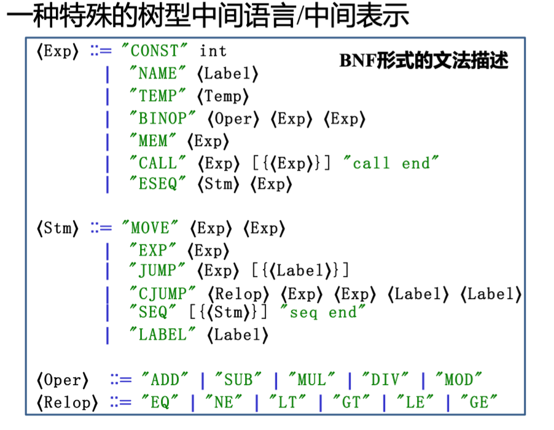

# Translating into Intermediate Code

## 中间表示概述

!!! abstract
    - 中间表示（IR）
        - 一种抽象的机器语言
        - 能够表达目标机器的操作
        - 不过多涉及机器特定的细节
    - 设计目标
        - 可移植的编译器，适用于不同的源语言和不同的目标机器
    - IR 应该简洁
        - 语法树的大块部分必须转换为 IR
        - IR 的组合必须聚合成“真实”的机器指令

为什么需要中间表示 (IR): 如果直接翻译成机器代码，会妨碍模块化 (modularity) 和可移植性 (portability)。

### (不要求掌握) IR分类

**1) 根据抽象层次：**

TODO

**2) 根据结构特征：**

TODO

### 三地址码 | Three-Address Code

!!! abstract
    - 目标：
        - 接近大多数目标机器的执行模型 (机器码)
        - 支持大多数目标机器提供的数据类型和操作
        - 提供有限度的、高于机器码的抽象表达能力，更容易表达出大多数(命令式) 高级语言的特性
    - 特征：
        - 以指令为单位
        - 每条指令只有有限数量的操作码

三地址码的一般形式：$x = y ~ op ~ z$

- 每个“指令”最多 1 个运算符，最多 3 个操作数
- E.g., `x + y * z` 翻译为三地址语句序列：`t1 = y * z`, `t2 = x + t1`

??? note
    | 序号 | 指令类型 | 指令形式 |
    | :---: | :---: | :---: |
    | 1 | 赋值指令 | `x = y op z`; `x = op y` |
    | 2 | 复制跳转 | `x = y` |
    | 3 | 条件跳转 ｜ `if x  relop y goto n` |
    | 4 | 无条件跳转 | `goto n` |
    | 5 | 参数传递 | `param x` |
    | 6 | 过程调用 | `call p, n` |
    | 7 | 过程返回 | `return x` |
    | ... | ... | ... |

    “地址”可以具有如下形式之一：

    - 源程序中的 **名字** (name)
    - **常量** (constant)
    - 编译器生成的 **临时变量** (temporary)

??? example
    !!! code inline "High-Level Language"
        ```c
        read x ;  { input an integer }
        if 0 < x then { don’t compute if x <= 0 } 
            fact:=1;
        repeat 
            fact:=fact*x;
            x:=x-1
        until x=0;
        write fact { output factorial of x }
        end
        ```

    !!! code "Three-Address Code"
        ```c
        read x 
        t1=x>0 
        if_false t1 goto L1 
        fact=1 
        label   L2 
        t2 = fact * x 
        fact = t2 
        t3 = x - 1 
        x = t3 
        t4= x= =0 
        if_false t4 goto L2 
        write fact 
        label   L1 
        halt
        ```

- 整个三地址指令序列实现为链表数组的形式：
- 最常见的实现方式是将三地址代码表示为四元组 (quadruples)：
    - 一个字段用于操作
    - 三个字段用于地址
对于那些需要少于三个地址的指令，其中一个或多个地址字段会被赋 null 或 "empty" 值

??? code "example code"
    ```
    t1 = x > 0           -> (gt, x, 0, t1)
    if_false t1 goto L1  -> (if_false, t1, L1, _)
    fact = 1             -> (assign, 1, fact, _)
    label L2             -> (label, L2, _, _)
    ```

> 其他实现方式包括：三元组，间接三元组。

#### 静态单赋值 (SSA)（不考）

TODO

## IR Tree 中间表示

Tiger 仅仅使用一个 IR —— the Intermediate Representation (IR) Tree。

```
AST => IR Tree => assembly => machine code
```

!!! note "A Low Level Tree Representation"
    

## IR Tree 的生成