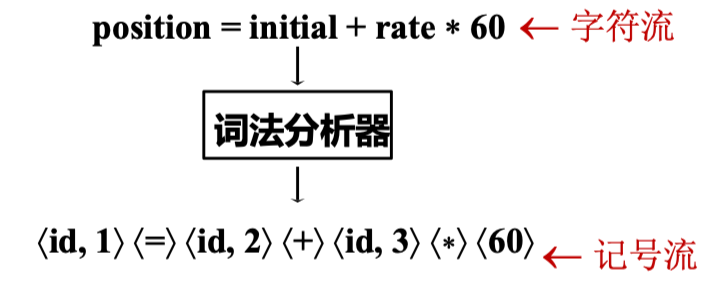
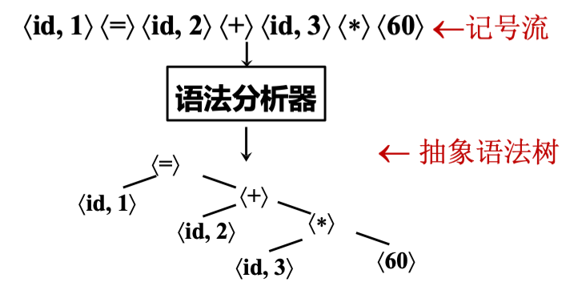
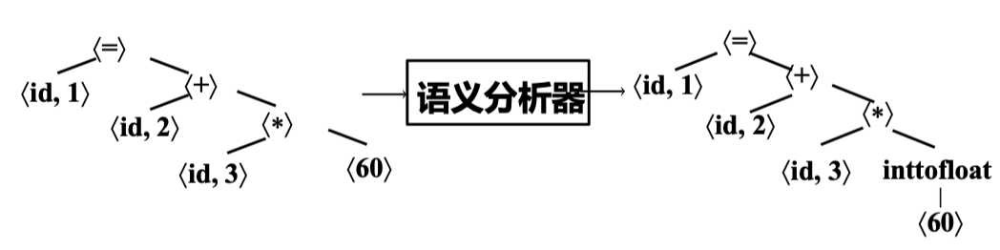
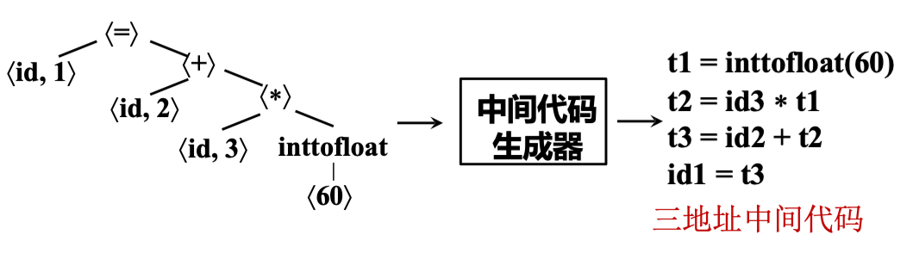
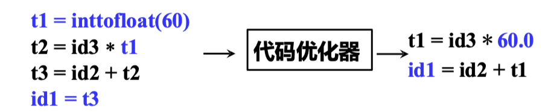
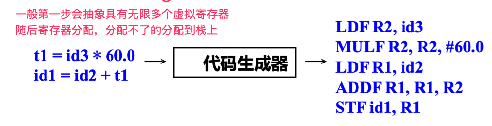
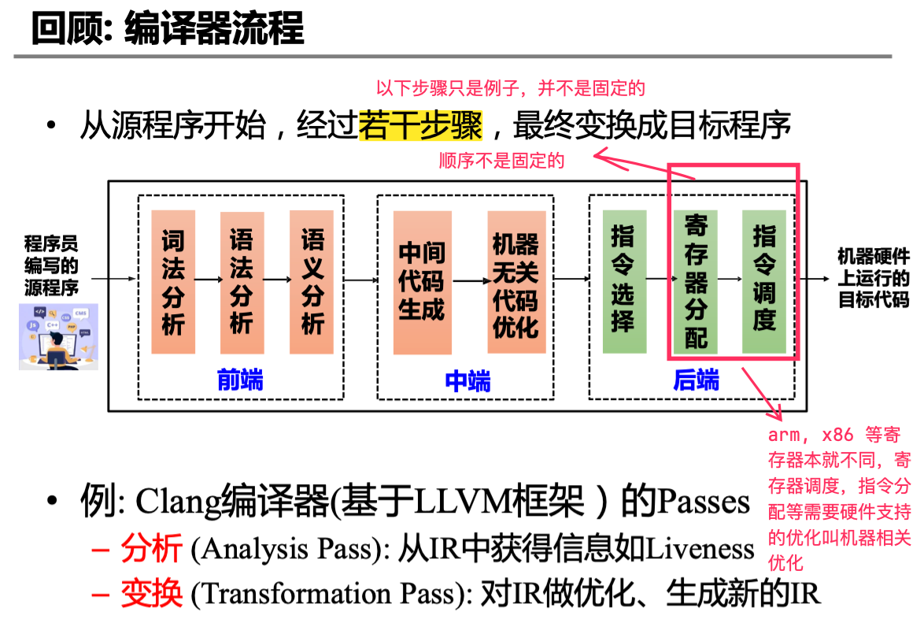
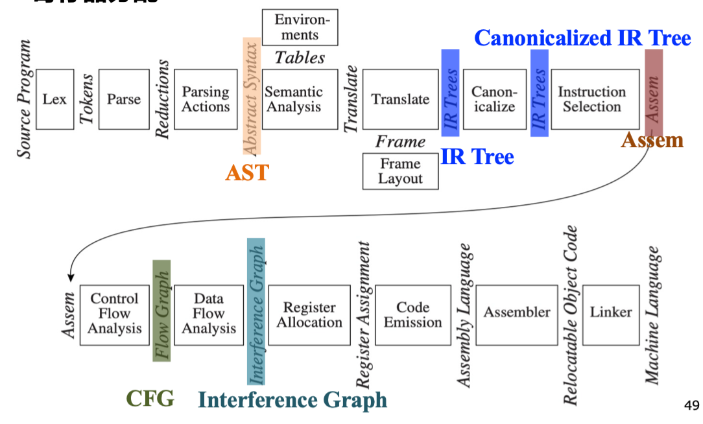

# Introduction

## 编程语言及设计

A programming language is a notation for describing computations to people and to machines.

不同的编程语言范型 (Paradigm): 

- 过程式 (Procedural): C, Pascal, Fortran...
- 函数式 (Functional): Lisp, Haskell, ML...
- 逻辑式 (Logic): Prolog, Datalog...
- 面向对象 (Object-Oriented): C++, Java, Python, Smalltalk...

编程语言 = 语法 + 语义

- 语法：What sequences of characters are valid programs? (通常由上下文无关文法定义)
- 语义：What is the behavior of a valid program? 
    - 操作语义：How can we execute a program?
    - 公理语义：What can we prove about a program?
    - 指称语义：What math function does a program compute?

## 编译器及形式

编译器：Translate from the syntax of one language to another but preserve the semantics. 

- 编译器是一个程序，读入源程序并将其翻译成语义等价的目标程序 (可以是可执行的机器语言程序也可以是汇编或其他语言程序)
- 解释器：在一种语言的机器上，直接执行用另一种语言写的程序的过程，称为解释

!!! note "编译器的其他形式"
    - 交叉编译器 (Cross compiler): 从一种平台上的语言翻译到另一种平台上的语言
    - 增量编译器 (Incremental compiler): 增量地编译源程序(只编译修改的部分)
    - 即时编译器 (Just-in-time compiler): 在运行时对IR中每个被调用的方法进行编译，得到目标机器的本地代码，如 Java VM 中的即时编译器
    - 预先编译器 (Ahead-of-time compiler): 在程序执行前将IR翻译成本地码，如ART中的AOT

    > JIT 和 AOT 都是面向解释型语言的

## 编译器的阶段

一个编译过程可以概括为程序员输入编写的源程序，经过前端、中端和后端生成机器硬件上运行的目标代码：

- 前端：词法分析、语法分析、语义分析
- 中端：中间代码生成、机器无关代码优化
- 后端：指令选择、寄存器分配、指令调度、机器相关代码优化

> - Symbol Table 符号表
>       - 记录程序中变量、函数等对象的各种属性
>       - 符号表可由编译器的各个步骤使用
> - Error Handler 错误处理
>       - 语法错误: 如算术表达式的括号不配对
>       - 语义错误: 如算符作用于不相容的运算对象

- 前端：
    - 词法分析 | Lexing/Scanning/Lexical Analysis
        - 将程序字符流分解为记号 (Token)序列
        - e.g.  
    - 语法分析 | Parsing/Syntax Analysis
        - 将记号序列解析为语法结构
        - e.g.  
    - 语义分析(Semantic Analysis)
        - 收集标识符的类型等属性信息
        - e.g.  
- 中端：
    - 中间代码生成 | Intermediate Code Generation
        - 中间代码/中间表示: 源语言与目标语言之间的桥梁
        - e.g.  
    - (基于中间表示的)优化 (与机器无关的代码优化)
        - 基于中间表示进行分析与变换，降低执行时间，减少资源消耗等
        - e.g.  
- 后端：
    - 目标代码生成
        - 把中间表示形式翻译到目标语言 (指令选择、寄存器分配、指令调度)
        - e.g.  

## 案例：Tiger 编程器

Tiger 编译器的流程如下：

- AST(抽象语法树): 语法分析 + “Parsing Actions”生成
- IR Tree: 语义分析后按一定规则生成(树型中间表示)
- Tiger 生成 IR Tree 后会再对其做变换得到 Canonicalized IR Tree (方便生成汇编)
- 随后经过 Assem 指令选择器生成抽象汇编代码 (一种特殊的汇编代码，如假设了无限数量的虚拟寄存器)
- CFG(Control Flow Graph) 控制流图: 方便进行数据流分析– 如活跃变量分析(Liveness Analysis)
- Interference Graph: 从活跃变量分析的结果构造，用于指导寄存器分配