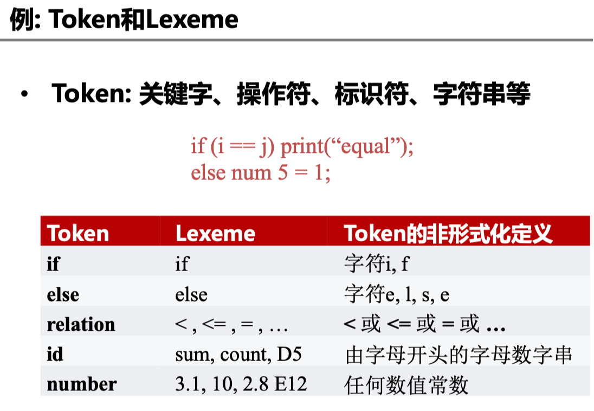
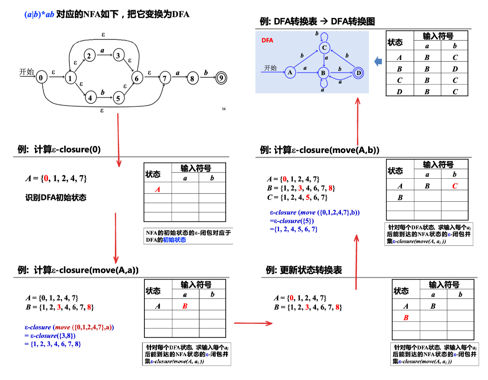

# 词法分析

## 词法分析概述

- 程序以字符串的形式传递给编译器

```c
if (i == j)
    z = 0;
else
    z = 1;
```

->

```
\tif(i == j)\n\t\tz = 0;\n\telse\n\t\tz = 1;
```

词法分析：将输入字符串识别为有意义的子串

- Partition input string into substrings (lexeme[^1])
- Classify them according to their role (tokens)

??? example
    

[^1]: 词素, a member (string) of the set (token) such as "else", "if"

Tokens 是指程序设计语言中具有独立含义的最小词法单位，包含单词、标点符号、操作符、分隔符等。如一些典型测试语言的一些 token 类型为：

| Type | EXamples |
| ---- | -------- |
| ID   | foo n14 last |
| Num  | 73 0 00 012 |
| REAL | 6.1 .5 10. 1e-1 |
| IF   | if     |
| COMMA | , |
| NOTEQ | != |
| LPAREN | ( |
| RPAREN | ) |

另外一些 tokens 如 IF, VOID, RETURN 称作 reserved words，在大多数语言中不能成为 identifiers（即上图中的 ID）

Examples of nontokens are

```
comment                     /* try again */
preprocessor directive      #include <stdio.h>
preprocessor directive      #define NUMS 5, 6
macro                       NUMS
blanks, tabs and newlines
```

在一些需要宏预处理器 (macro preprocessor) 的语言中，由预处理器处理源程序的字符流生成另外的字符流，然后由送入词法分析器（Lexical Analyzer）。这种宏预处理过程也可以与词法分析器集成在一起。

> 辅助任务：过滤注释、空格, etc.

## 正则表达式

> 形式化地描述词法

- 字母表 (alphabet): 符号的有限集合
    - 字母，数字，标点符号...
- 串 (string, word): 字母表中符号的有穷序列
    - 串 s 的长度，常记作 |s|，表示串中符号的个数
    - 空串 (empty string) 用 $\epsilon$ 表示

??? bug "区别"
    - $\epsilon$ 表示空串
    - $\emptyset$ 表示空集
    - $\{\epsilon\}$ 是非空集合

!!! note "串上的运算"
    - 连接 (concatenation): y 附加到 x 后形成的串记作 xy
        - 例如，如果 x=dog 且 y=house，那么 xy=doghouse
    - 幂运算 (串 s 的 n 次幂：将 n 个 s 连接起来)
    
    $$\begin{cases}
        &s^0 = \epsilon \\
        &s^n = s^{n-1}s, \text{ for } n \ge 1
    \end{cases}$$

### 形式语言

语言: 字母表 $\sum$ 上的串的集合

- e.g. $\{\epsilon, 0, 00, 000, \dots \}$, $\{\epsilon\}$, $\emptyset$
- 句子：属于语言的串

语言的运算：（优先级：幂 > 连接 > 并）


在书写正则表达式时，我们有时省略 `·` 和 $\epsilon$ ，并规定 `*` 优先级高于 `·` 高于 `|` 。还有一些缩写形式：

- $[abcd]$ 表示 $\{a | b | c | d\}$
- $[b-gM-Qkr]$ 表示 $\[bcdefgMNOPQkr]$
- $T?$ 表示 $T | \epsilon$, 即 $T$ 或空串

还有一些其他的符号：

- `.` ： 除换行符外的任意单个字符
- `"a.+*"` : 引号中的字符串匹配自身

??? example
    给定语言 $L = \{a, b\}$, $M = \{cc, dd\}$

    | 运算 | 描述 | 结果 |
    | --- | --- | --- |
    | 并    | $L \cup M = \{s \| s \in L 或 s \in M \}$ | $L \cup M = \{a, b, cc, dd\}$ |
    | 连接 | $LM = \{st \| s \in L 且 t \in M\}$ | $LM = \{acc, add, bcc, bdd\}$ |
    | 幂 | $L^0 = \{\epsilon\}$, $L^i = L^{i-1}L$ | $L^2 = \{aa, ab, ba, bb\}$ |
    | 闭包 | $L^* = \bigcup_{i=0}^{\infty}L^i$ | $L^* = \{\epsilon, a, b, aa, ab, ba, bb, \dots\}$ |
    | 正闭包 | $L^+ = \bigcup_{i=1}^{\infty}L^i$ | $L^+ = \{a, b, aa, ab, ba, bb, \dots\}$ |


### 正则表达式 | RE

正则表达式 (regular expression) $r$ 定义正则语言，记为 $L(r)$

1. $\epsilon$ 是一个 *RE*, $L(\epsilon) = \{\epsilon\}$
2. 如果 $a \in \sum$，那么 $a$ 是一个 *RE*, $L(a) = \{a\}$
3. 假设 $r$ 和 $s$ 都是 *RE*, 分别表示语言 $L(r)$ 和 $L(s)$
      - $r | s$ 是 *RE*, $L(r|s) = L(r) \cup L(s)$
      - $rs$ 是 *RE*, $L(rs) = L(r)L(s)$
      - $r^*$ 是 *RE*, $L(r^*) = (L(r))^*$
      - $(r)$ 是 *RE*, $L((r)) = L(r)$
      - 优先级：闭包* > 连接 > 选择|

??? note "正则表达式的一些定律"
    | 定律 | 描述 |
    | --- | --- |
    | $r \| s = s \| r$ | 选择运算的交换律 |
    | $(r \| s) \| t = r \| (s \| t)$ | 选择运算的结合律 |
    | $r(st) = (rs)t$ | 连接运算的结合律 |
    | $r(s \| t) = rs \| rt$ | 连接运算对选择运算的分配律 |
    | $\epsilon r = r\epsilon = r$ | 闭包运算的幺元 |
    | $r^* = (r \| \epsilon)^*$ | 闭包中一定含 $\epsilon$ |
    | $r^{**} = r^*$ | 闭包运算的幂等律 |

### 正则定义, 词法分析

正则定义 (regular definition): 

- 对于比较复杂的语言，为了构造简洁的正则式，可先构造简单的正则式，再将这些正则式组合起来，形成一个与该语言匹配的正则序列
- 正则定义是具有如下形式的定义序列：

$$\begin{align*}
    &d_1 \rightarrow r_1 \\
    &d_2 \rightarrow r_2 \\
    &\dots \\
    &d_n \rightarrow r_n
\end{align*}$$

1. 各个 $d_i$ 是不同的标识符，称为定义名
2. 每个 $r_i$ 都是 $\sum \cup \{d_1, d_2, \dots, d_{i-1} \}$ 上的正则表达式

> 给一些 *RE* 命名，并在之后的 *RE* 中像使用字母表中的符号一样使用这些名字

??? example
    - 整数的正则定义: 
        - $\text{digit} \rightarrow 0|1|2|3|4|5|6|7|8|9$ 或简记为 $[0-9]$
        - $\text{number} \rightarrow \text{digit (digit)}^*$ 或 $\text{digit}^+$
    - C 语言的标识符 (字母、数字和下划线组成的串) 的正则定义
        - $\text{digit} \rightarrow [0-9]$
        - $\text{letter}\_ \rightarrow [A-Za-z\_]$
        - $\text{id} \rightarrow \text{letter}\_(\text{letter}\_ | \text{digit})^*$

词法分析：字符流到 Token-lexeme 对

1. Select a set of tokens
      - Number, Keyword, Identifier, ...
2. Write a R.E. for the lexemes of each token
       - Number = digit<sup>+</sup>
       - Keyword = 'if' | 'else' | $\dots$
       - Identifier = letter (letter | digit)<sup>*</sup>
       - LeftPar = '('
       - $\dots$

!!! bug "正则规则的二义性"
    给定 `if8`, 它是单个标识符，还是两个 token (`if` 和 `8`) 的组合？

为解决这个问题，引出两种 rule：
1. 最长匹配 Longest Match: The longest initial substring of the input that can match any regular expression is taken as the next token.
2. 规则优先 Rule Priority: 
      - For a particular longest initial substring, the first regular expression that can match determines its token-type. 
      - This means that the order of writing down the regular-expression rules has significance.

因此，按最长匹配，识别为 `if8` 。 按规则优先 `if` 优先于 `identifier`，所以 `if8` 是一个 `if` token 和一个 `identifier` token 的组合。

## 有穷自动机 | Finite Automata

> 判定一个串匹配某个正则表达式，并形式化地描述这个匹配过程

有穷自动机 (Finite Automaton, FA) 是一个五元组 $M = (S, \sum, move, s_0, F)$

1. $S$ : 有穷状态集合
2. $\sum$ : 输入字符集合 / 字母表
3. $move(s,a)$ : 转换函数，表示从状态 $s$ 出发，读入输入 $a$ 时转化到的状态
4. $s_0$ : 初始状态，$s_0 \in S$
5. $F$ : 终止状态集合，$F \subseteq S$

有穷自动机的表示：

1. 转换图 (Transition Diagram)：用图形表示有穷自动机


2. 转换表 (Transition Table)：用表格表示有穷自动机


!!! success "有穷自动机接收的串"
    给定输入串 $x$，如果存在一个对应于串 $x$ 的从 **初始状态** 到某个 **终止状态** 的转换序列，则称串 $x$ 被该 $FA$ **接收**

    

!!! success "有穷自动机接收（定义）的语言"
    - 由一个有穷自动机 $M$ 接收的所有串构成的集合，称为该 $FA$ 接收（或定义）的语言，记为 $L(M)$
    - 以上一个图为例，$L(M)$ =  所有以 $abb$ 结尾的字母表 $\{a, b\}$ 上的串的集合

状态转换: Epsilon Moves

- $\epsilon - \text{moves}$: 一种特殊的状态转换方式 (自动机可以不读入任何输入，而从状态 A 转移到状态 B)
- e.g. 

### 非确定有穷自动机 | NFA

> 非确定有穷自动机 (Nondeterministic finite automata, NFA) 

$$M = (S, \sum, move, s_0, F)$$

1. $\sum$ : 输入字符集合 / 字母表, 假设 $\epsilon \notin \sum$
2. $move$: $S \times (\sum \cup \{\epsilon\}) \rightarrow P(S)$. $move(s, a)$ 表示从状态 $s$ 出发，沿着标记为 $a$ 的边所能到达的 **状态集合**

- 在状态 $s$ 时读入a, 可能迁移到 **多个不同的状态**
- 可能有 $\epsilon - \text{moves}$ (不读入任何输入而迁移到其他状态)

### 确定有穷自动机 | DFA

> 确定性有穷自动机 (Deterministic finite automata, DFA)

$$M = (S, \sum, move, s_0, F)$$

1. $\sum$ : 输入字符集合 / 字母表, 假设 $\epsilon \notin \sum$
2. $move$: $S \times \sum \rightarrow S$. $\delta (s, a)$ 表示从状态 $s$ 出发，沿着标记为 $a$ 的边所能到达的 **状态**

- 在状态 $s$ 时读入a, 只能迁移到 **一个确定的状态**
- 没有 $\epsilon - \text{moves}$

!!! info "NFA vs. DFA vs. RE"
    - DFA 和 NFA 主要差异在转换函数
    - DFA 和 NFA 的等价性:
        - 对任何NFA $N$ ，存在定义同一语言的DFA $D$
        - 对任何DFA $D$ ，存在定义同一语言的NFA $N$
    - RE $\Leftrightarrow$ DFA $\Leftrightarrow$ NFA: 
        - 对任何 NFA, 存在定义同一(正则)语言的 DFA
        - 对任何 DFA, 存在定义同一(正则)语言的 NFA <br>

!!! success "词法分析: 如何构造 $FA$, 来识别用 *RE* 刻画的 Token?"

### 识别字符串

构造 NFA 识别字符串：


构造 DFA 识别字符串

- 输入：以文件结束符 `eof` 结尾的字符串 $x$
- DFA $D$: 开始状态 $s_0$，接收状态集 $F$，转换函数 $move$
- 输出：如果 $D$ 接收 $x$，则回答 “yes”，否则回答 “no”

```
s = s_0;
c = nextChar();
while (c != eof) {
    s = move(s, c);
    c = nextChar();
}
if s in F then return "yes"
else return "no"
```

- `nextChar()` 返回 $x$ 的下一个字符
- `move(s, c)` 返回从状态 $s$ 读入字符 $c$ 后能到达的状态

## 词法分析器自动生成

!!! success "从 RE 到 FA"
    1. $RE \rightarrow NFA$
    2. $NFA \rightarrow DFA$ (子集构造法)
    3. $DFA$ 简化

### RE -> NFA

- 输入: 正则表达式 $r$
- 输出: 定义它的 NFA, 记为 $N(r)$

- Thompson 算法: 基于对 RE 的结构做归纳
    - 对基本的 RE 直接构造：$\epsilon, a$
    - 对复合的 RE 递归构造: $st, s|t, s^*$
    - $N(r)$ **仅一个接受状态，且没有出边**

<b>1) 处理 epsilon 和 a</b>

直接构造：识别 $\epsilon$ 和字母表中一个符号 $a$ 的 NFA


<b>2) 处理 s|t</b>

递归构造：选择 $s | t$


<b>3) 处理 st</b>

递归构造：连接 $st$


<b>4) 处理 s<sup>*</sup></b>

递归构造：闭包 $s^*$


??? example
    

### NFA -> DFA (子集构造法)

1) 子集构造法 (subset construction) 原则:

- DFA 的每个状态是 NFA 的状态集合的一个子集
- 读了输入 $a_i$ 后 NFA 能到达的所有状态：$s_1, s_2, \dots, s_k$, 则 DFA 到达一个状态，对应于 NFA 的状态集合 $\{s_1, s_2, \dots, s_k\}$ 的子集

**2) 定义 NFA 状态(集)上的一些操作：**

| 操作 | 描述 |
| --- | --- |
| $\epsilon - closure(s)$ | NFA 状态 $s$ 的 $\epsilon$ -闭包, $s$ 经 $\epsilon$ 转换所能到达的状态集合 |
| $\epsilon - closure(T)$ | $T$ 中所有状态的 $\epsilon$ -闭包的并集，即 $\bigcup_{s \in T} \epsilon-closure(s)$

> $T$ 是 NFA 的状态集合的子集

**3) 子集构造法的步骤：**

1. NFA 的初始状态的 $\epsilon$ -闭包对应于 DFA 的初始状态
2. 针对每个 DFA 状态 (对应 NFA 状态子集 $A$ ), 求输入每个 $a_i$ 后能到达的 NFA 状态的 $\epsilon$ -闭包并集

$$S = \epsilon-closure(move(A, a_i))$$

- 该集合 $S$ 对应 DFA 中的一个已有状态或一个要新加的状态
- 由此逐步构造 DFA 的状态转换表，直到不动点

??? example
    

### DFA 简化

DFA 状态数量的最小化:

1. 一个正则语言可对应于多个识别此语言的 DFA
2. 通过 DFA 的最小化可得到状态数量最少的 DFA (不计同构，这样的 DFA 是唯一的)

!!! note "可区分的状态 (Distinguishable States)"
    如果存在串 $x$，使得从 $s$, $t$ 出发，一个到达 **接受状态**，一个到达 **非接受状态**，那么 $x$ 就区分了 $s$ 和 $t$

    

#### DFA 最小化算法

- (推论) DFA状态等价的条件:
    - **一致性条件** : $s$, $t$ 同为终态或非终态
    - **蔓延性条件** : 对所有输入符号, $s$, $t$ 必须转换到等价的状态集中，同时具有传递性
- DFA 简化算法
    - 划分部分: 根据以上条件迭代式划分等价类,
    - 构造部分: 从划分得到的等价类中选取代表，并重建 DFA

**1) DFA最小化算法 (划分部分)**

1. 初始化分：划分为接受状态组和非接受状态组 $\prod = \{S - F, F\}$
2. 迭代，继续划分

<!-- $$\begin{align}
    \textcolor{blue}{\text{for}} &(\prod \text{中的每个元素/集合 G}) \{ \\
        &\text{细分 G，使得 G 中的 s、t 仍然在同一组中} iff \text{对任意输入 a, s, t 都到达} \prod \text{中的同一组;} \\
        &\prod_{\text{new}} = \text{将} \prod \text{中的 G 替换为细分得到的小组} \\
        \}
\end{align}$$ -->


3. 如果 $\prod_{\text{new}}$ == $\prod$ 相等，停止迭代，令 $\prod_{\text{final}} = \prod$；否则，更新 $\prod = \prod_{\text{new}}$，转到步骤 2

**2) DFA最小化算法 (构造部分)**

在 $\prod_{\text{final}}$ 中选择一个状态作代表，作为最小化 DFA 中的状态

- 开始状态：包含原开始状态的组的代表
- 接受状态：包含了原接受状态的组的代表（这个组一定只包含接受状态）
- 转换关系构造为：如果 $s$ 是 $G$ 的代表，而原 DFA 中 $s$ 在 $a$ 上的转换到达 $t$, 且 $t$ 所在组的代表为 $r$，那么最小化 DFA 中有从 $s$ 到 $r$ 的在 $a$ 上的转换

???+ example "DFA 的化简"
    

<!-- ## Lex工具 -->

???+ info "More"
    - 计算 $\epsilon-closure(T)$ : 实际上是一个图搜索过程 (如果只考虑 $\epsilon$ 边) <br>
    - NFA -> DFA (子集构造法)：整个算法实际上是一个搜索过程<br>
    
    > $D$ states 中的一个状态未加标记表示还没有搜索过它的各个后继

??? example "一些习题"
    [习题](https://www.yuque.com/xianyuxuan/coding/cp_1#rUa36)