# Parsing (Top-Down Parsing)

!!! abstract
    - 本节主要介绍语法分析 (Parsing) 和上下文无关文法 (Context-Free Grammar, CFG) 的基本概念
    - 和 自顶向下的语法分析方法

## 上下文无关文法 | Context-Free Grammar

!!! note
    CFG 是一种形式文法，用于描述上下文无关语言 (Context-Free Language) 的语法结构.

### CFG 简介

!!! question "问题: 如何形式化定义编程语言的语法？"

> 语法分析的目的是教会计算机判断输入合法性

例：简单计算器程序

```c
1 + 2 - 3 +     非法
1 + 2 - a       非法
1 + (2 - 3)     合法
1 2 + - 3       非法
```

!!! note "如何判定输入合法性 & 生成语法树"
    - 首先规定好合法的基本单元 (Token) —— 词法分析
    - 其次要理解算术表达式的构成
        - 大表达式可拆分为子表达式
        - 拆解过程是递归的，直至看到基本单元

    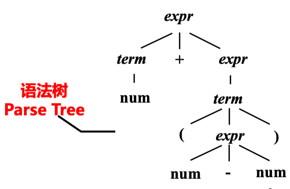

!!! info "如何构造编程语言的语法分析器"
    - 用 CFG 定义一个编程语言的语法
    - 基于 CFG 构建解析器:
        - Top-Down Parsing | 自顶向下的语法分析
        - Bottom-Up Parsing | 自底向上的语法分析
    - More about parsing:
        - Automatic paraser generation
        - Error recovery

#### CFG 的定义

上下文无关文法: 描述语言的语法结构

$$G = (T, N, P, S)$$

- $T$: 终结符集合 (Terminals), 组成串的基本符号 (Token)
    - 例：$T = \{\text{num}, +, -, (, )\}$
- $N$: 非终结符集合 (Non-terminals), 表示串的集合的语法变量 (在程序语言中通常对应于某个程序构造)
    - 例：$N = \{\text{expr}, \text{term}, \text{stmt}\}$
- $P$: 产生式集合 (Productions), $A \rightarrow a$, $A \in N$, $a \in (T \cup N)^*$
    - 头(左)部 $A$ 是一个非终结符，右部 $a$ 是一个符号串
    - 描述了一个将终结符和非终结符组合成串的方法
    - e.g. $E \rightarrow E + E$, $E \rightarrow (E)$, $E \rightarrow \text{id}$
- $S$: 开始符号 (Start symbol), $S \in N$
    - 某个被指定的非终结符号
    - 它对应的串的集合就是文法的语言

> - $T \cap N = \emptyset$
> - $T \cup N$ : 文法符号集

!!! note "EOF Marker"
    - `$`: end of file (EOF)
    - To indicate that `$` must come after a complete $S$ -phrase
        -  add a new start symbol $S'$ and a new production $S' \rightarrow S\$$

#### 产生式的缩写

对一组有相同左部的 $\alpha$ 产生式

$$\alpha \rightarrow \beta_1, \dots, \alpha \rightarrow \beta_n$$

可以简记为：

$$\alpha \rightarrow \beta_1 \vert \dots \vert \beta_n$$

- 读作：$\alpha$ 定义为 $\beta_1$ 或 $\dots$ 或 $\beta_n$
- $\beta_1, \dots, \beta_n$ 称为 $\alpha$ 的候选式 (Candidate)

### 推导和归约

!!! question "问题：给定文法，如何判定输入串属于文法规定的语言?"

!!! note "推导 (Derivations) 和归约 (Reductions)"
    $$\text{给定文法}~ G=(T, N, P, S)$$

    - 直接推导：把产生式看成重写规则，把符号串中的非终结符用其产生式右部的串来代替
        - 如果 $A \rightarrow \gamma \in P$, 且 $\alpha, \beta \in (T \cup N)^*$, 称串 $\alpha A \beta$ 直接推导出 $\alpha \gamma \beta$, 并记作 $\alpha A \beta \Rightarrow \alpha \gamma \beta$
    - 直接归约：如果 $\alpha A \beta \Rightarrow \alpha \gamma \beta$, 则称 $\alpha \gamma \beta$ 直接归约到 $\alpha A \beta$
    - 多步推导：如果 $\alpha_0 \Rightarrow \alpha_1$, $\alpha_1 \Rightarrow \alpha_2$, $\dots$, $\alpha_{n-1} \Rightarrow \alpha_n$, 则可以记作 $\alpha_0 \Rightarrow \alpha_1 \Rightarrow \dots \Rightarrow \alpha_n$, 称符号串 $\alpha_0$ 经过 n 步推导得到 $\alpha_n$，可简记为 $\alpha_0 \Rightarrow^n \alpha_n$
        - $\Rightarrow^+$ 表示“经过正数步推导”
        - $\Rightarrow^*$ 表示“经过零步或多步推导”

**1)** 最左推导 (Left-most Derivation)：每步代换 **最左边的非终结符**

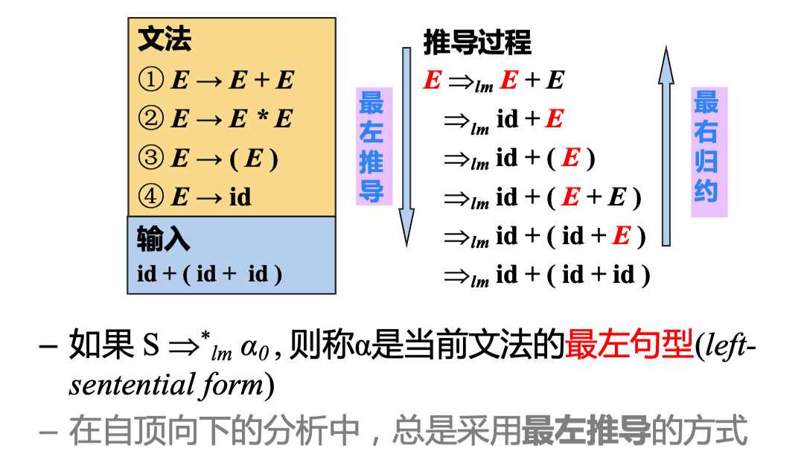

**2)** 最右推导 (Right-most Derivation)：每步代换 **最右边的非终结符**

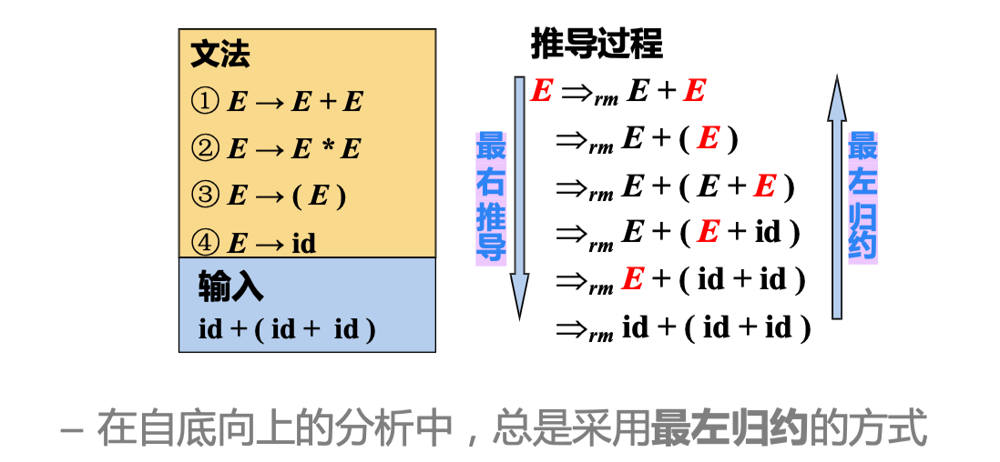

**3)** 句型、句子和语言

- 句型 (Sentence Form)：对开始符号为 $S$ 的文法 $G$, 如果 $S \Rightarrow^* \alpha$, $\alpha \infty (T \cup N)^*$, 则称 $\alpha$ 为 $G$ 的一个句型
    - 句型中既可以包含终结符，又可以包含非终结符，也能是空串
- 句子 (Sentence)：如果 $S \Rightarrow^* w$, $w \in T^*$, 则称 $w$ 为 $G$ 的一个句子
    - 句子是<u><b>不含非终结符</b></u>的句型
- 语言 (Language)：由文法 $G$ 推导出的所有句子构成的集合，记为 $L(G)$
  
$$L(G) = \{w \vert S \Rightarrow^* w, w \in T^*\}$$


??? example "例: 文法定义的句型和句子"
    - 考虑文法：$E \rightarrow E + E \vert E * E \vert (E) \vert \text{id}$
    - 存在一下推导序列：

    $$E \Rightarrow -E \Rightarrow -(E) \Rightarrow -(E + E) \Rightarrow -(\text{id} + E) \Rightarrow -(\text{id} + \text{id})$$

    - $-(\text{id} + \text{id})$ 是文法的句子
    - $-(\text{id} + E)$ 是文法的句型

**4)** 输入串的判定

!!! question "问题：给定文法，如何判定输入串属于文法规定的语言?"

根据文法规则

- 从生成语言的角度 (句子的推导 (派生)) 出发，，从开始符号可以推导出该词串
- 从识别语言的角度 (句子的归约) 出发，从词串可以归约出开始符号

??? example
    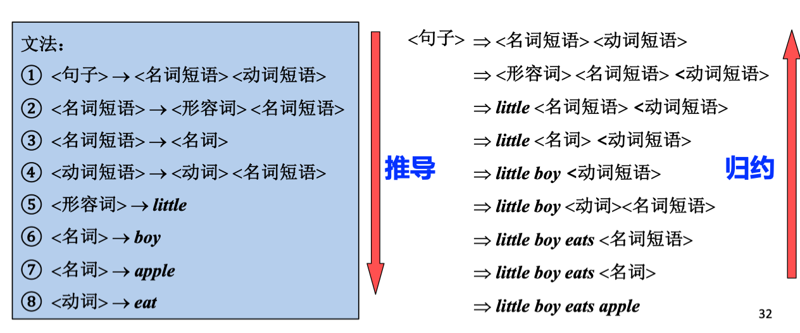

### RE 与 CFG

!!! question "问题：为什么词法和语法分析用不同形式语言?"

<b><u>比较语法分析和词法分析</u></b>

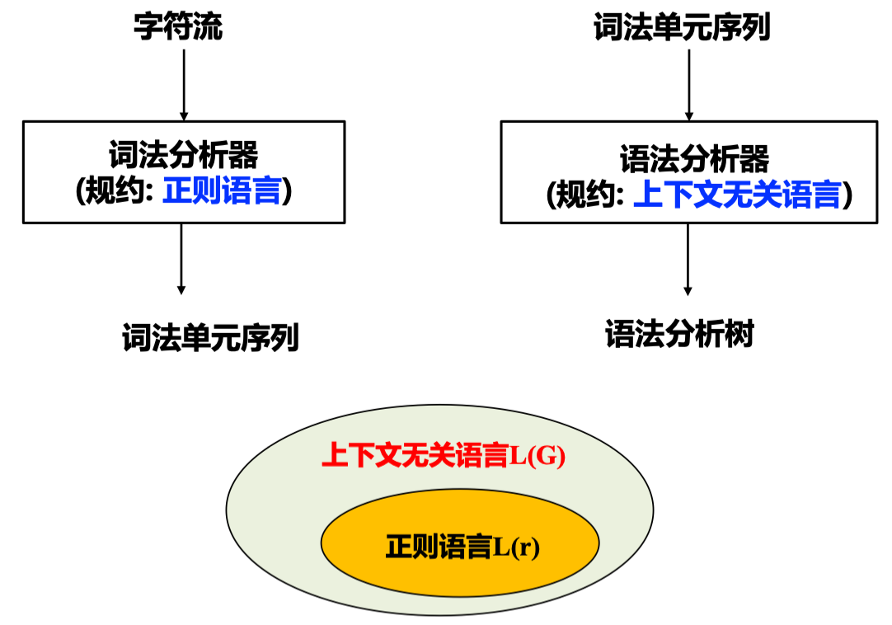

回顾 [形式语言](./lexical.md/#_4), [正则语言(由正则表达式刻画)](./lexical.md/#re), [上下文无关语言](#cfg_1)

正则文法 (正则语言的形式文法刻画) 的定义:

$$G = (N, T, P, S)$$

- $N$: 非终结符集合
- $T$: 终结符集合
- $P$: 产生式 (Production) $\alpha \rightarrow \beta$ 集合
    - 右线性文法：$\alpha \rightarrow \beta$ 形如 $A \rightarrow \alpha B$ 或 $A \rightarrow \alpha$，其中 $A, B \in N$, $\alpha \in T \cup \epsilon$
    - 左线性文法：$\alpha \rightarrow \beta$ 形如 $A \rightarrow B \alpha$ 或 $A \rightarrow \alpha$
- $S$: 开始符号, $S \in N$

> 正则语言：右线性文法/左线性文法产生的所有句子的集合

- 故从文法角度考虑，正则语言和上下无关语言对 $\alpha \rightarrow \beta$ 形式的限制不同：
    - 上下无关文法：$\alpha$ 是一个非终结符号，右部是一个符号串
    - 正则文法：右线性 $A \rightarrow \alpha B$ 或 $A \rightarrow \alpha$，左线性 $A \rightarrow B \alpha$ 或 $A \rightarrow \alpha$
    - 上下文无关语言涵盖了正则语言，即每个正则语言都是一个上下文无关语言，反之不成立
- 从实用角度, 正则语言表达能力有限，难以刻画编程语言的语法
    - 如: 不能用于描述配对或嵌套的结构
        - 例：配对括号串的集合，如不能表达 $(^n)^n, ~n\ge 1$
        - 原因：有穷自动机无法记录访问同一状态的次数

??? question "为什么词法分析用正则表达式，不用正则文法？"
    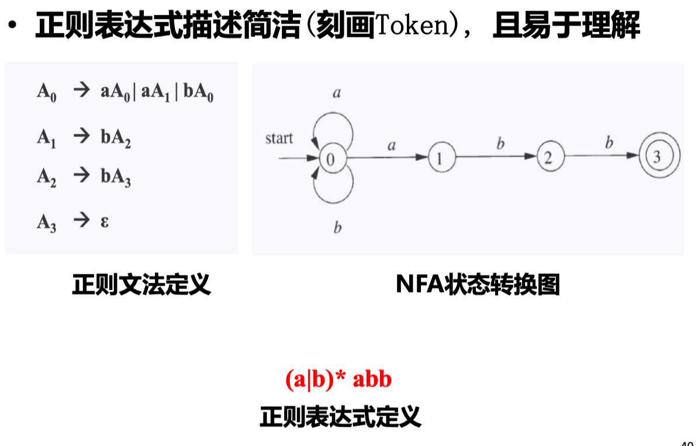

!!! note "分离词法分析和语法分析"
    - 为什么用正则语言定义词法
        - 词法规则非常简单，不必用上下文无关文法
        - 对于 Token，正则表达式描述简洁且易于理解– 从正则表达式构造出的词法分析器效率高
    - 分离词法分析和语法分析的好处
        - 简化设计、提升性能
        - 编译器的可移植性加强
        - 便于编译器前端的模块划分

??? info "引申: 形式文法的分类"
    形式语言的文法分为 4 类：

    $$\text{文法} ~ G = (T, N, P, S)$$

    - 0 型文法 (短语结构文法): 递归可枚举语言
        - $\alpha \rightarrow \beta$, $\alpha, \beta \in (T \cup N)^*$, $\vert \alpha \vert \ge 1$
    - 1 型文法 (上下文有关文法)
        - $\vert \alpha \vert \le \vert \beta \vert$, 但 $S \rightarrow \epsilon$ 可以例外
    - 2 型文法 (上下文无关文法)
        - $A \rightarrow B$, $A \in N$, $B \in (T \cup N)^*$
    - 3 型文法 (正则文法)

??? info "引申: CFG 只能表达“语法”吗？"
    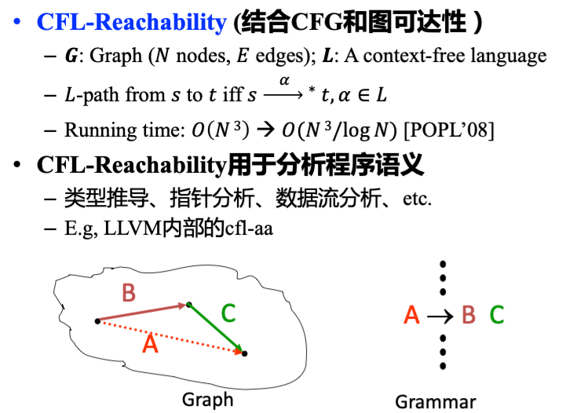

## 语法分析概述 | Parsing

### CFG 的 Parse Tree

> 先不考虑抽象语法树 (Abstract Syntax Tree)

回顾 [推导和归约](#_2) 中输入串的判定

分析树 (Parse Tree) 可以看作是推导的图形化表示，其具有下面的性质：

- 根节点为文法的初始符号
- 每个叶子节点是一个终结符
- 每个内部节点是一个非终结符
- 每一个父节点和他的子节点构成一条产生式
    
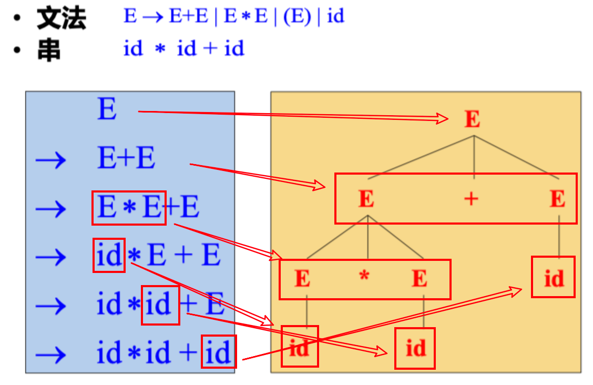

可以将语法分析看作搜索问题，语法分析的核心问题就是：对于一个终结符号串 $x$, 设法从 $S$ 推导出 $x$ 或者从 $x$ 归约出 $S$

- 自顶向下 (Top-down) 分析
    - 从开始符号 $S$ 出发，尝试根据产生式规则推导 (derive) 出 $x$
    - Parse Tree 的构造方法：从根部开始
- 自底向上(Bottom-up) 分析
    - 尝试根据产生式规则归约 (reduce) 到文法的开始符号 $S$ 
    - Parse Tree 的构造方法: 从叶子开始

> - If there are no restrictions on the form of grammar used, parsing CFL requires $O(n^3)$ time
> - Subsets of CFLs typically require $O(n)$ time
>       - Predictive parsing using $LL(1)$ grammars 
>       - Shift-Reduce parsing using $LR(1)$ grammars

### 设计编程语言的文法

为了高效语法分析，可能对文法做处理/限制

- 消除二义性 (Resolving Ambiguities)
    - 二义性：可以为一个句子生成多棵不同的分析树
- 消除左递归 (Elimination of left recursions)
    - Avoid infinite loop in top-down parsing 
- 提左公因子 (Left-factoring)
    - Avoid backtracking in top-down parsing 

> 其中，“消除左递归” 和 “提左公因子” 常限于自顶向下分析

#### 二义性文法 (Ambiguous Grammar)

- 如果文法的某些句子存在不止一棵分析树，则该文法是二义的
- “给定 CFG 是否无二义性?” 是不可判定问题[^1]
- 但能给出一组充分条件， 满足这组充分条件的文法是无二义性的
    - 满足，肯定无二义性
    - 不满足，也未必就是有二义性的

??? example
    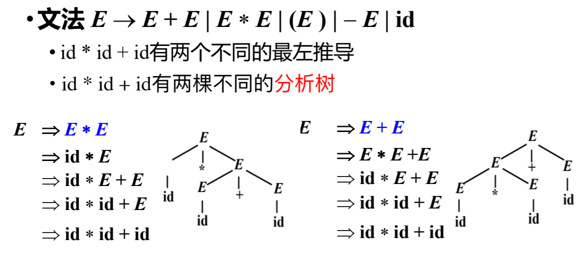

!!! note "二义性的影响"
    编程语言的语法应该是无二义的。否则会导致一个程序有多种解释，如：

    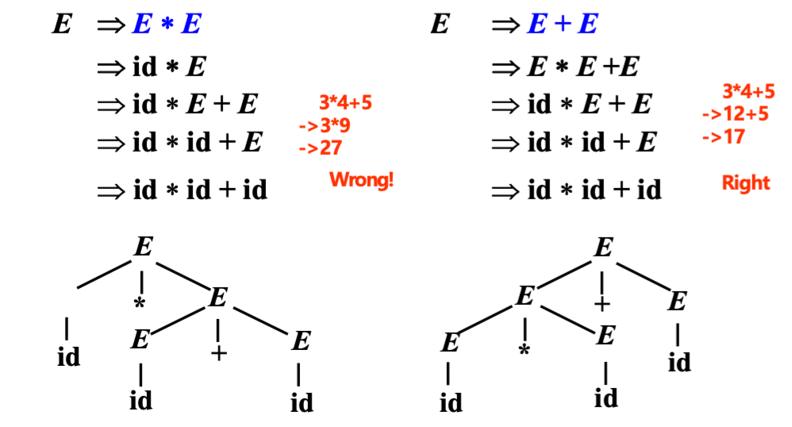

#### 消除二义性

- 二义性的根源：多种 “正确” 推导处于文法同一层
- 消除二义性的惯用技术: **分层**
    - 改造文法，对于引发二义性的多种推导处于文法同一层的情况，将真正想要的推导提取出来，放到更深的层次
    - 最左推导中，更深层的非终结符总是会被优先替换
    - 确保只有一种最左推导，消除二义性

如：

```
E   -> E + E
    |  E * E
    |  (E)
    |  id
```

`+` 和 `*` 操作都是左结合的，并且在运算中有不同的优先级，但是在这个文法中没有得到体现

所以消除二义性需要：

- 规定符号的优先级
- 规定符号的结合性

=== "初始"
    ```
    E   -> E + E
        |  E * E
        |  (E)
        |  id
    ```
=== "修改后"
    ```
    E   -> E + T | T
    T   -> T * F | F
    F   -> (E) | id
    ```

    `+`, `*` 都是左结合的，且 `*` 的优先级高于 `+`

- 运算优先级
    - 根据算符不同的优先级，引入新的非终结符
    - 越接近开始符号 S 的文法符号优先级越低
- 运算结合性
    - 递归非终结符在终结符左边，运算就左结合
    - 如 $A \rightarrow A \beta$, $A$ 在终结符 (如 `*`) 左侧出现 (即终结符在 $\beta$ 中)

在 Yacc (Parser 自动生成器) 等工具中，我们可以直接指定优先级、结合性而无需自己重写文法。

```yacc
%left '+'
%left '*'
%right `-`
```

??? example "练习: 文法的二义性"
    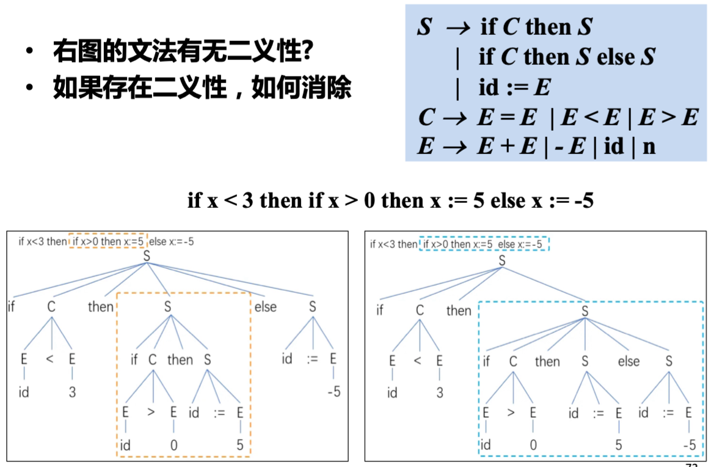

??? info "通常的符号约定"
    > 仅供参考

    - 终结符 (Terminals, T)
        - 字母表中排在前面的小写字母，如 $a、b、c$
        - 运算符，如 +、* 等
        - 标点符号，如括号、逗号等
        - 数字 0、1、. . . 、9
        - 粗体字符串，如 **id**, **if** 等
    - 非终结符 (Nonterminals， N)
        - 字母表中排在前面的大写字母，如 $A、B、 C$
        - 字母 $S$. 通常表示开始符号
        - 小写、斜体的名字，如 *expr*, *stmt* 等
        - 代表程序构造的大写字母。如 $E$ (表达式), $T$ (项)
    - 字母表中排在后面的大写字母 (如 $X, Y, Z$)表示文法符号（即终结符或非终结符）
    - 字母表中排在后面的小写字母 (主要是 $u, v, \dots z$) 表示终结符号串（包括空串）
    - 小写希腊字母，如 $\alpha, \beta, \gamma$ 表示文法符号串（包括空串）
    - 除非特别说明，第一个产生式的左部就是开始符号

??? example "练习: 分析树构造"
    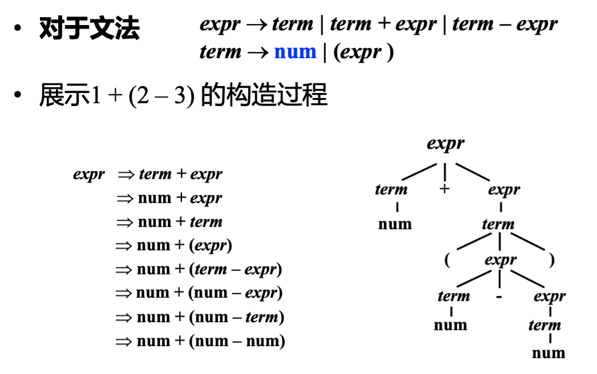

## 自顶向下的语法分析 | Top-Down Parsing

!!! abstract "自顶向下的语法分析"
    - 从文法开始符号 $S$ 出发，推导出串 $w$
        - 从顶部向底部方向构造 Parse Tree (从上至下，从左至右)
    - 每一步推导需要做 **两个选择**
        1. 替换当前句型中的哪个非终结符？
              - 自顶向下分析总是选择每个句型的 **最左非终结符** 进行替换!
        2. 用该非终结符的哪个产生式替换？
              - 

### 允许回溯的递归下降分析

> 自顶向下分析的通用形式: 递归下降分析

!!! note "递归下降分析 (Recursive-Descent Parsing)"
    - 由一组 **过程/函数** 组成，每个过程对应一个 **非终结符**
    - 从开始符号 $S$ 对应的过程开始，（递归）调用其他过程
    - 如果 $S$ 对应的过程恰好扫描了整个输入串，则分析成功

!!! example "例子"
    === "question"
        已知文法 $S \rightarrow cAd$, $A \rightarrow ab \vert b$

        如何为 $S$ 和 $A$ 构造其对应的过程？
    === "!!分析!!"
        利用非终结符 $A$ 的文法规则 $A \rightarrow X_1 \dots X_k$, 定义识别 $A$ 的过程

        - 如果 $X_i$ 是非终结符：调用相应非终结符对应的过程
        - 如果 $X_i$ 是终结符 $a$ ：匹配输入串中对应的终结符 $a$
        
        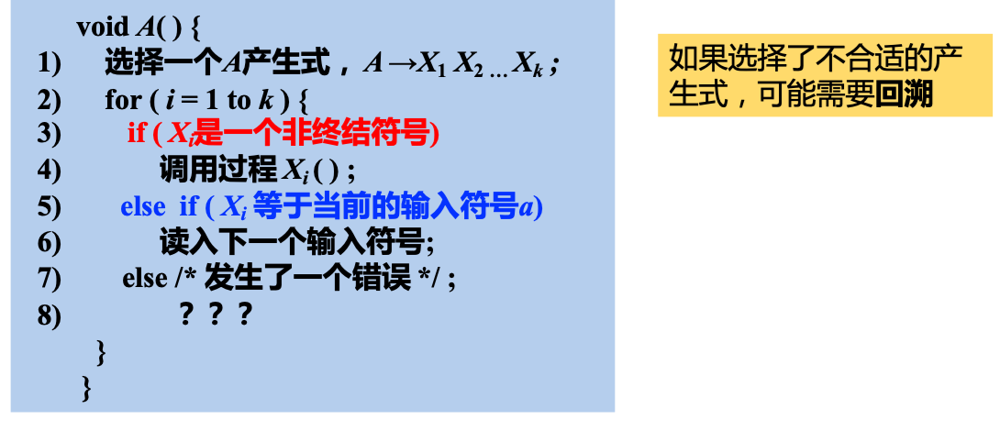
    === "具体实例"
        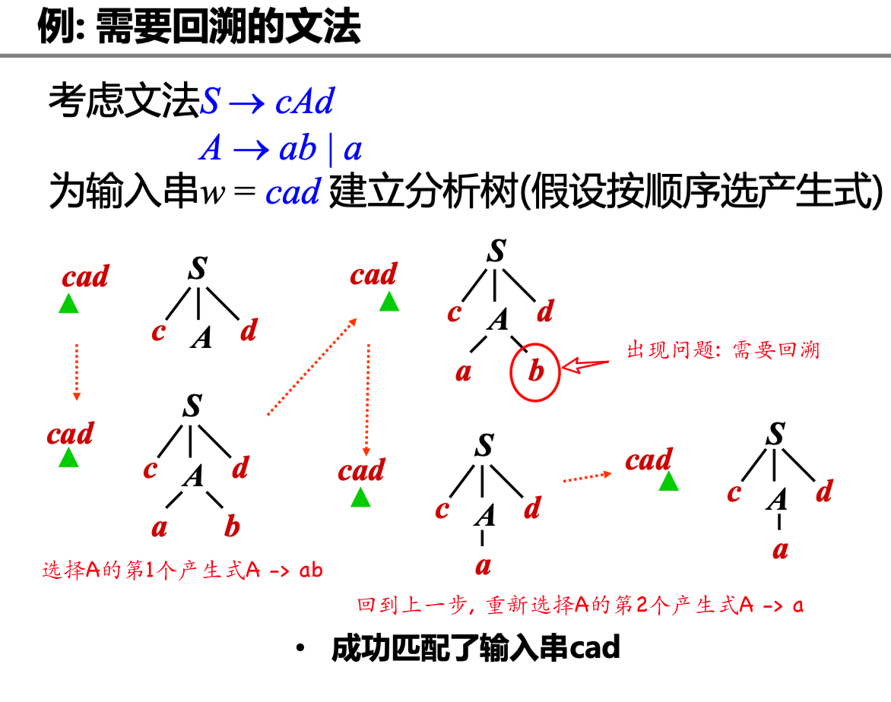

但是上述通用递归下降带来了新的问题：**回溯**

复杂的回溯会导致代价太高：

- 非终结符有可能有多个产生式，由于信息缺失，无法准确预测选择哪一个
- 考虑到往往需要对多个非终结符进行推导展开，因此尝试的路径可能呈指数级爆炸

其分析过程类似于 NFA， 那么是否可以构造一个类似 DFA 的分析方法 -> LL(1) 分析

### LL(1) 和预测分析法

首先给出几个定义：

!!! note "预测分析法 (Predictive Parsing)"
    此方法接受 LL(k) 文法

    - 第一个 L 表示从左到右扫描输入串 (Left-to-right)
    - 第二个 L 表示最左推导 (Leftmost derivation)
    - k 表示向前看 k 个 Token 来确定产生式 (k 常取 1)

    LL(1) 即指每次为最左边的非终结符选择产生式时，向前看 1 个输入符号，预测要使用的产生式
    
    !!! question "文法加什么限制可以保证没有回溯？"
        TODO

!!! note "First 集"
    给定一个四元组 $G = (N, T, P, S)$, $\alpha \in (T \cup N)^*$

    $$
    \text{First}(\alpha) = \{a \vert \alpha \Rightarrow^* a \dots, a \in T \}
    $$

    表示可从 $\alpha$ 推导得到的串的 **首个终结符的集合**

    !!! example
        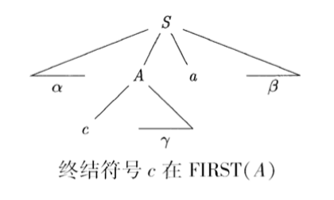

    !!! info "龙书中关于 First 集的定义"
        $$
        \text{First}(\alpha) = \{a \vert \alpha \Rightarrow^* a \dots, a \in T \} \cup \{\epsilon \vert \alpha \Rightarrow^* \epsilon \}
        $$

!!! note "Follow 集"
    给定一个四元组 $G = (N, T, P, S)$, $A \in N$

    $$
    \text{Follow}(A) = \{a \vert S \Rightarrow^* \dots A a \dots, a \in T \}
    $$

    从 $S$ 出发, 可能在推导过程中跟在 $A$ 右边的终结符号集

    !!! example
        例如：$S \rightarrow \alpha A a \beta$, 终结符号 $a \in \text{Follow}(A)$
        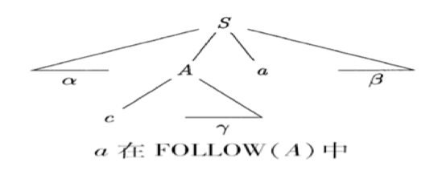

#### LL(1) 文法的定义

文法 $G$ 的任何两个产生式 $A \rightarrow \alpha \vert \beta$ 都满足下列条件：

1. $\text{First}(\alpha) \cap \text{First}(\beta) = \emptyset$

> 即 $\alpha$ 和 $\beta$ 推导不出以同一个单词为首的串

??? example
    - 假设下一个输入是 $b$, 且 $\text{First}(\alpha)$ 和 $\text{First}(\beta)$ 不相交。
    - 若 $b \in \text{First}(\alpha)$, 则选择 $A \rightarrow \alpha$; 若 $b \in \text{First}(\beta)$, 则选择 $A \rightarrow \beta$

2. 若 $\beta \Rightarrow^* \epsilon$, 那么 $\alpha \nRightarrow^* \epsilon$, 且 $\text{First}(\alpha) \cap \text{Follow}(A) = \emptyset$

!!! tip "龙书中的不同"
    龙书中关于第二个条件的定义无需前面的设定，因为龙书中 First 集的定义包含了空串, 两者 First set 交集为空已经包含了 $\alpha$ 和 $\beta$ 不能同时推导出空串的情况

> 即 $\alpha$ 和 $\beta$ 不能同时推导出空串；$\text{First}(\alpha)$ 和 $\text{Follow}(A)$ 不能有交集

以上两条可以保证产生式选择的唯一性

??? example
    假设下一个输入是 $b$, 且 $\beta \Rightarrow^* \epsilon$

    - 如果 $b \in \text{First}(\alpha)$, 选择 $A \rightarrow \alpha$ (属于条件一)
    - 如果 $b \in \text{Follow}(A)$, 选择 $A \rightarrow \beta$，因为 $A$ 最终推导出空串且后面跟着 $b$ (属于条件二)

#### 实现 LL(1) 预测分析

##### 计算 First, Follow 集

由于 First, Follow 集涉及空串，这里引入 Nullable 概念

!!! note "Nullable 集的归纳定义"
    如果 $X$ 可以推导出空串（即 $X$ 是 Nullable）, **iff**

    - Base case: $X \rightarrow \epsilon$, 那么 $X$ 显然是 Nullable
    - Inductive case: 
        - $X \rightarrow Y_1 \dots Y_n$
        - 其中 $Y_1, \dots, Y_n$ 都是非终结符，且全属于 Nullable 集，那么 $X$ 也是 Nullable

    ??? warning "龙书"
        - 虎书的 First 集合不包含 $\epsilon$
        - 龙书不含 nullable 集，而是直接在 First 集中包含 $\epsilon$
        - 因此在下面的计算中，X is nullable 等价于 $\epsilon \in \text{First}(X)$

    ??? info "根据归纳定义计算 Nullable 集"
        ```c
        /* Nullable: a set of nonterminals */ 
        Nullable <- {};
        while (Nullable still changes) 
            for (each production X -> a) 
                switch (a) 
                case epsilon:
                    Nullable ∪= {X}; 
                    break;
                case Y1 … Yn:
                    if (Y1 in Nullable && … && Yn in Nullable)
                        Nullable ∪= {X}; 
                    break;
        ```

!!! note "First 集的归纳定义"
    $$
    \text{First}(\alpha) = \{a \vert \alpha \Rightarrow^* a \dots, a \in T \}
    $$

    - Base case: If $X$ is a terminal -> $\text{First}(X) = \{X\}$
    - Inductive case: If $X \rightarrow Y_1 \dots Y_n$, 
        - then $\text{First}(X) \cup = \text{First}(Y_1)$
        - If $Y_1$ is nullable, then $\text{First}(X) \cup = \text{First}(Y_2)$
        - If $Y_1$ and $Y_2$ are both nullable, then $\text{First}(X) \cup = \text{First}(Y_3)$
        - ...
    
    ??? warning "龙书"
        - 由于龙书的 First 集合包含 $\epsilon$, 为了和虎书的 nullable 一致性
        - 在计算 $X \rightarrow Y_1 \dots Y_n$ 时，只有当 $Y_1, \dots, Y_n$ 都包含 $\epsilon$ 时，才将 $\epsilon$ 加入 $\text{First}(X)$

        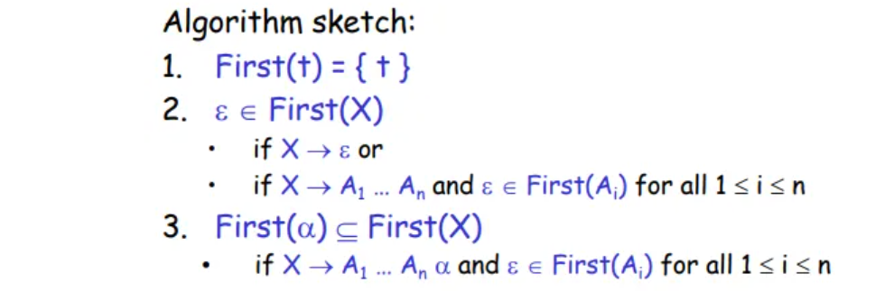

!!! note "Follow 集的归纳定义"
    $$
    \text{Follow}(A) = \{a \vert S \Rightarrow^* \dots A a \dots, a \in T \}
    $$

    - Base case: $\text{Follow}(A) = \{\}$
    - Inductive case: 假设存在产生式 $B \rightarrow s1 A s2$ for any s1 and s2
        - $\text{Follow}(A) \cup = \text{First}(s2)$
        - If $s2$ is nullable, then $\text{Follow}(A) \cup = \text{Follow}(B)$

???+ example "计算 Nullable, First, Follow 集（虎书）"
    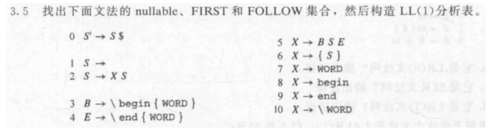

    === "Nullable"
        - 根据产生式 1，$S \rightarrow $ 可得 $S$ 是 Nullable (属于 Base case)
        - 无 Inductive case

        |      | nullable | FIRST | FOLLOW |
        | ---- | -------- | ----- | ------ |
        | S'   | no       |       |        |
        | S    | yes      |       |        |
        | B    | no       |       |        |
        | E    | no       |       |        |
        | X    | no       |       |        |

    === "First"
        - 根据产生式 1, 3, 4, 6, 7, 8, 9, 10

        得到：

        |      | nullable | FIRST               | FOLLOW |
        | ---- | -------- | ------------------- | ------ |
        | S'   | no       |                     |        |
        | S    | yes      |           |        |
        | B    | no       | \                   |        |
        | E    | no       | \                   |        |
        | X    | no       | {, WORD, begin, end, \ |        |

        - 根据产生式 0: 
            - $\text{First}(S') \cup = \text{First}(S)$
            - 由于 $S$ 是 Nullable, $\text{First}(S') \cup = \text{First}(\$)$
        - 根据产生式 2: 
            - $\text{First}(S) \cup = \text{First}(X)$
            - $X$ 不是 Nullable，结束
        - 根据产生式 5: 
            - $\text{First}(X) \cup = \text{First}(B)$
            - $B$ 不是 Nullable，结束
        - 得到:

        |      | nullable | FIRST                                 | FOLLOW |
        | ---- | -------- | ------------------------------------- | ------ |
        | S'   | no       | {, WORD, begin, end, \, $ |        |
        | S    | yes      | {, WORD, begin, end, \    |        |
        | B    | no       | \                                     |        |
        | E    | no       | \                                     |        |
        | X    | no       | {, WORD, begin, end, \                |        |

    === "Follow"
        - 根据产生式 0: $\text{Follow}(S) \cup = \text{First}(\$)$
        - 根据产生式 2: 
            - $\text{Follow}(X) \cup = \text{First}(S)$
            - 由于 $S$ 是 Nullable, $\text{Follow}(X) \cup = \text{Follow}(S)$
        - 根据产生式 5: 
            - $\text{Follow}(B) \cup = \text{First}(SE)$
            - $\text{Follow}(S) \cup = \text{First}(E)$
            - $\text{Follow}(E) \cup = \text{Follow}(X)$
        - 根据产生式 6: 
            - $\text{Follow}(S) \cup = \text{First}(\})$

        得到：

        |      | nullable | FIRST                                 | FOLLOW                       |
        | ---- | -------- | ------------------------------------- | ---------------------------- |
        | S'   | no       | {, WORD, begin, end, \, $ |                              |
        | S    | yes      | {, WORD, begin, end, \    | \, $, }                      |
        | B    | no       | \                                     | {, WORD, begin, end, \       |
        | E    | no       | \                                     | {, WORD, begin, end, \, $, } |
        | X    | no       | {, WORD, begin, end, \                | {, WORD, begin, end, \, $, } |

??? info "优化 Nullable, First, Follow 的计算"
    

##### 构造预测分析表

预测分析表是指表驱动分析程序所需要的二维表 M

- 表的每一行 A 对应一个非终结符
- 表的每一列 a 对应某个终结符或输入结束符 $
- 表中的项 M[A, a] 表示：针对非终结符 A，当其下一个输入 Token 是 a 时，可以选择的产生式集合

!!! success "构造预测分析表"
    对文法 $G$ 的每个产生式 $X \rightarrow \gamma$

    - If $t \in \text{First}(\gamma)$: enter $X \rightarrow \gamma$ into $M[X, t]$
    - If $\gamma$ is Nullable and $t \in \text{Follow}(X)$: enter $X \rightarrow \gamma$ into $M[X, t]$

???+ example "构造预测分析表"
    由上面的 First, Follow 集计算结果，构造预测分析表

    |      | nullable | FIRST                                 | FOLLOW                       |
        | ---- | -------- | ------------------------------------- | ---------------------------- |
        | S'   | no       | {, WORD, begin, end, \, $ |                              |
        | S    | yes      | {, WORD, begin, end, \    | \, $, }                      |
        | B    | no       | \                                     | {, WORD, begin, end, \       |
        | E    | no       | \                                     | {, WORD, begin, end, \, $, } |
        | X    | no       | {, WORD, begin, end, \                | {, WORD, begin, end, \, $, } |

    === "产生式 0"
        $S' \rightarrow S \$$
        
        因为 $\text{First}(S\$)$ = `$, {, WORD, begin, end, \`, 所以填入 $S' \rightarrow S \$$

        |      | $        | {        | WORD     | begin    | end      | \        | }    |
        | ---- | -------- | -------- | -------- | -------- | -------- | -------- | ---- |
        | S'   | 0 S'->S$ | 0 S'->S$ | 0 S'->S$ | 0 S'->S$ | 0 S'->S$ | 0 S'->S$ |      |
        | S    |          |          |          |          |          |          |      |
        | B    |          |          |          |          |          |          |      |
        | E    |          |          |          |          |          |          |      |
        | X    |          |          |          |          |          |          |      |

    === "产生式 1"
        $S \rightarrow $

        相当于 $\gamma$ is nullable, $\text{Follow}(S)$ = `\, $, }`, 所以填入 $S \rightarrow $

        |      | $        | {        | WORD     | begin    | end      | \        | }      |
        | ---- | -------- | -------- | -------- | -------- | -------- | -------- | ------ |
        | S'   | 0 S'->S$ | 0 S'->S$ | 0 S'->S$ | 0 S'->S$ | 0 S'->S$ | 0 S'->S$ |        |
        | S    | 1 S ->   |          |          |          |          | 1 S ->   | 1 S -> |
        | B    |          |          |          |          |          |          |        |
        | E    |          |          |          |          |          |          |        |
        | X    |          |          |          |          |          |          |        |
    === "最终预测表"
        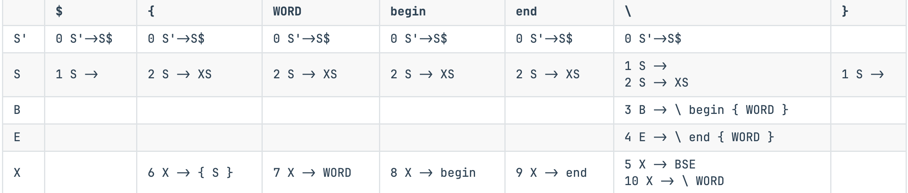

!!! note "LL(1) 文法"
    - If a predictive parsing table constructed this way contains **no duplicate entries**, the grammar is called LL(1)!
    
    > 上述构造的预测分析表中，因为不满足每个单元格只有一个产生式的条件，所以不是 LL(1) 文法
    
    - Left-to-right parse, left-most derivation, 1 symbol lookahead

##### 预测分析

LL(1) 分析的实现可以分为：

- 递归下降 LL(1) 分析：
    - 递归下降分析: 非终结符对应子过程
- 非递归 LL(1) 分析：
    - 使用显式的栈，而不是递归调用来完成分析 (类似模拟下推自动机PDA)

!!! note "LL(1) 的递归下降实现"
    - 递归下降语法分析程序由一组过程组成
    - 每个非终结符号对应于一个过程
    - 可以通过向前看一个输入符号来唯一地选择产生式


#### 消除左递归、提左公因子


#### 错误恢复


[^1]: [David G. Cantor. 1962. On The Ambiguity Problem of Backus Systems. J. ACM 9, 4 (Oct. 1962), 477–479.](https://dl.acm.org/doi/10.1145/321138.321145)

<!-- [^2]:  -->