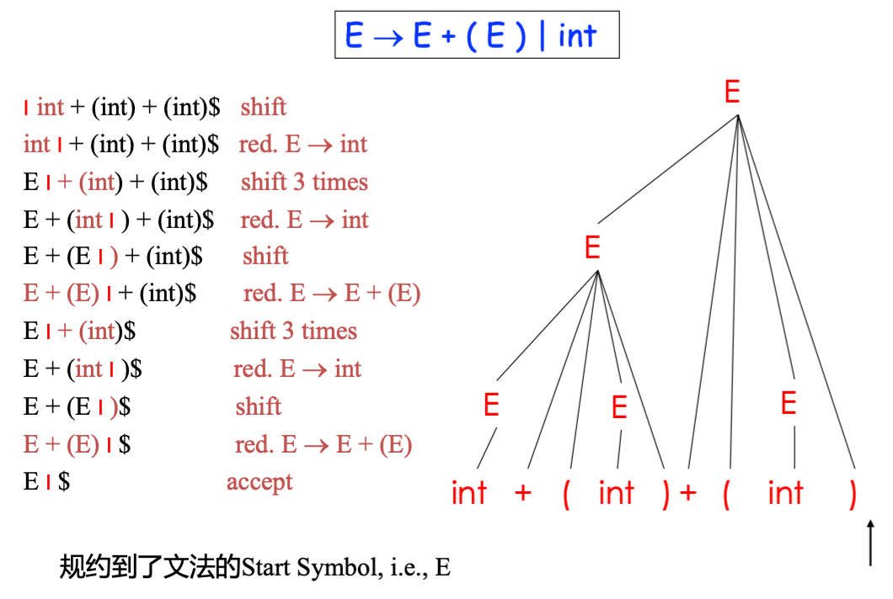
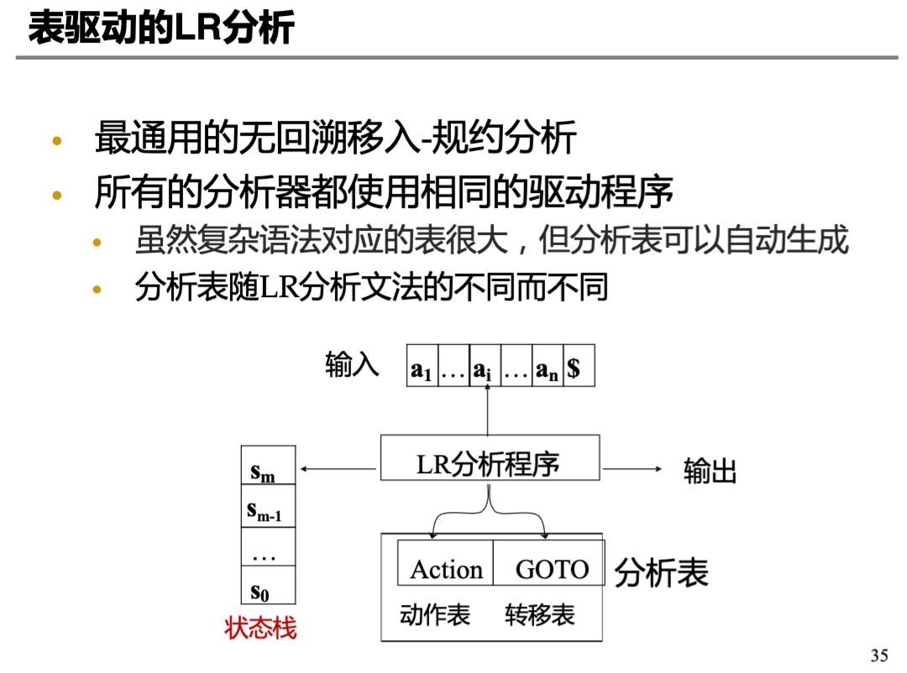
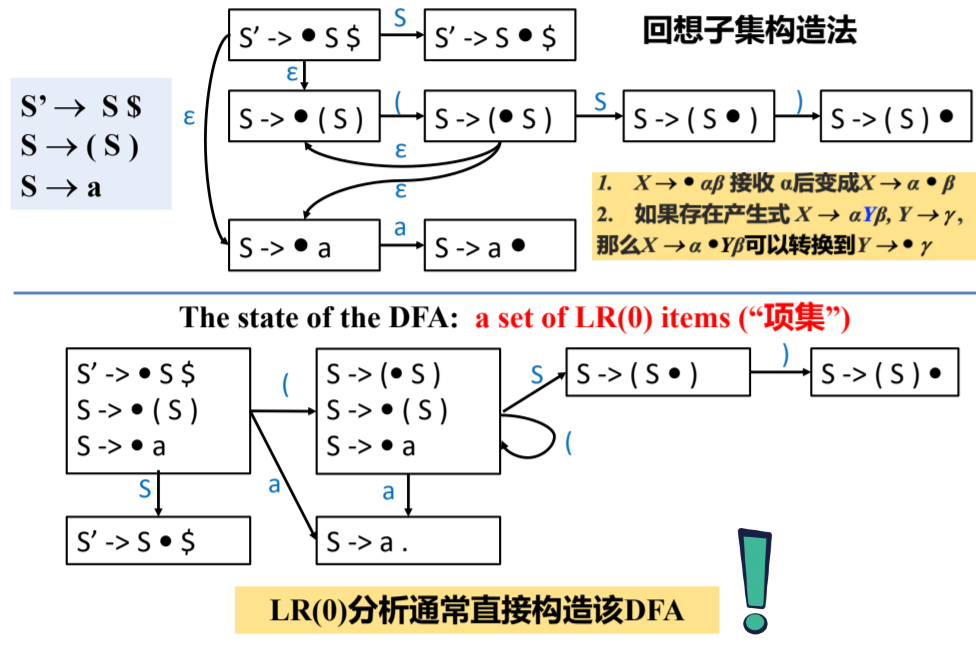
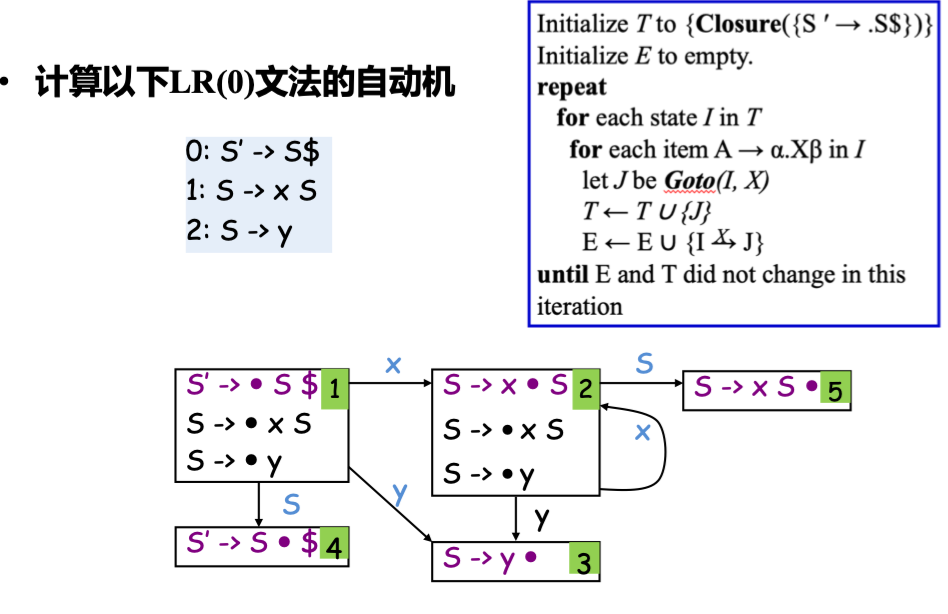
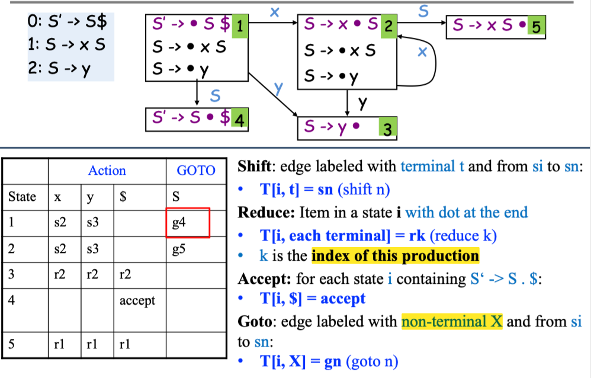

# Parsing (Bottom-Up Parsing)

!!! note "Bottom-Up Parsing"
    - 表达力: Every LL(k) grammar is also LR(k) 
    - 被 Parser 自动生成器广泛采用 (Yacc, Bison, etc)

LR(k) parsing: 

- L: left-to-right scan of input
- R: rightmost derivation in reverse
- k: k tokens of lookahead (当 k被省略的时候, 假设为1)

!!! abstract "The Idea of Bottom-Up Parsing"
    - 自底向上的语法分析过程可以看成是从串 $w$ 归约为文法开始符号 $S$ 的过程
    - 归约步骤：一个与某产生式体相匹配的特定子串被替换为该产生式头部的非终结符号
    - 问题化为：
        - 何时归约 (归约哪些符号串) ？
        - 归约到哪个非终结符号？

## Shift-Reduce | 移入-规约

!!! abstract "Idea"
    将输入串切分成两个子串：

    - Right substring (a string of **terminals**): 还没被 parser 处理的部分
    - Left substring (a string of **terminals and non-terminals**): 已经被 parser 处理的部分

左右子串使用一个特殊符号 `｜` 分隔 (`｜` 不是字符串的一部分)，初始化时，`｜` 在最左边。

??? example
    

    - 相当于最右推导的逆过程：

    $$
    \textcolor{black}{E} \Rightarrow \textcolor{black}{E} + (\textcolor{red}{E}) \Rightarrow \textcolor{red}{E} + (\textcolor{black}{int}) \Rightarrow \textcolor{black}{E} + (\textcolor{red}{E}) + (\textcolor{black}{int}) \Rightarrow \textcolor{red}{E} + (\textcolor{black}{int}) + (\textcolor{black}{int}) \Rightarrow \textcolor{black}{int} + (\textcolor{black}{int}) + (\textcolor{black}{int})
    $$

    - 如例子所示，LR 分析其实就是最右推导的逆过程，限制了规约方式

!!! note "最右句型"
    - 最右句型：最右推导过程中出现的句型
    - LR 分析的每一步都是最右句型

LR 分析的一般模式是 **基于栈的 shift-reduce**

考虑 $\alpha \vert \beta$

LR 分析有两个 component，四个 action

- Two components:
    - Stack: 保存左子串 $\alpha$ (terminals and non-terminals)
    - Input Stream: 保存右子串 $\beta$ (terminals)
- Four actions:
    - **Shift:** 将下一个输入 token (terminal) 推入栈顶
    - **Reduce:** 
        - Top of stack should match RHS (Right-Hand-Side) of rule (e.g., X -> A B C)
        - pop the RHS from the top of stack (e.g., pop C B A)
        - push the LHS onto the stack (e.g., push X)
    - **Error:**
    - **Accept:** shift $ and can reduce what remains on stack to the start symbol!

那么该何时 shift, 何时 reduce 呢？



!!! success "LR 文法的关系"
    $$
    \text{LR(0)} \subset \text{SLR} \subset \text{LALR} \subset \text{LR(1)}
    $$

    即一个文法是 LR(0) 文法，那么它一定是 SLR ，以此类推

## LR(0) 分析

### LR(0) 文法的 NFA

> 具体操作和计算中不会计算 NFA，只是为了理解 LR(0) 文法的生成过程

#### 语法分析思路

LR(0) 文法就是自底向上分析：不断凑出产生式的 RHS, 然后规约为 LHS，直到规约为开始符号

???+ example
    假设下一次将会用到的产生式是：$X \rightarrow \alpha \beta$, 那么在使用它归约前，栈顶 (右侧是栈顶) 可能包含三种情况：

    1. $\dots$
    2. $\dots \alpha$
    3. $\dots \alpha \beta$

    即凑出 RHS 的进度不同

如何针对不同进度的 RHS 进行规约呢？

<u>可以维护一个状态，记录当前匹配的进度</u>

!!! success "项/Item"
    项/Item: 一个产生式加上在其中某处的一个点 `·`

    - 例如产生式 $A \rightarrow \cdot XYZ$ 有四个 Item
        - $A \rightarrow \cdot XYZ$
        - $A \rightarrow X \cdot YZ$
        - $A \rightarrow XY \cdot Z$
        - $A \rightarrow XYZ \cdot$
        - 其中 `·` 表示当前匹配的进度
        - 例如：$A \rightarrow \cdot XYZ$ 表示当前匹配/归约到了 RHS 的开头
        - $A \rightarrow X \cdot YZ$ 已经匹配/归约到了 $X$，期望在接下来的输入中经过扫描/归约得到 $YZ$，然后把 $XYZ$ 归约到 A
        - $A \rightarrow XYZ \cdot$ 表示已经匹配/归约到了 $XYZ$, 可以把 $XYZ$ 归约为 $A$
    - Item 起的作用类似于有穷自动机的状态

!!! success "状态跳转"
    - 状态跳转：一个 Item 读入一个 token 后，可以跳转到另一个 Item
    - 例如：$A \rightarrow \cdot XYZ$ 可以跳转到 $A \rightarrow X \cdot YZ$

- 由于文法产生式是有限的，且每个产生式右部的长度也是有限的，即 Item 的数量是有限的
- 有穷自动机，也被称为 LR(0) 自动机

有了 Item 和状态跳转理论，我们可以进一步描述 LR(0) 语法分析思路：

例：

$$
\begin{align*}
    &S \rightarrow b B B \\
    &S \rightarrow \cdot b B B \leftarrow \text{移进状态} \\
    &S \rightarrow b \cdot B B \leftarrow \text{待约状态} \\
    &S \rightarrow b B \cdot B \leftarrow \text{待约状态} \\
    &S \rightarrow b B B \cdot \leftarrow \text{规约状态}
\end{align*}
$$

LR 分析器基于这样一些状态来构造自动机进行 RHS 的识别

#### LR(0) 的 NFA

为 LR(0) 中的 NFA 定义以下概念：

**1) 起始&终结状态**

- 文法 $G$ 中增加一个新的开始符号 $S'$，并加入产生式 $S' \rightarrow S\$$
- 按 $S' \rightarrow S\$$ 归约，表示将输入符号串归约为开始符号 $S$

> 加入 $S'$ 是为了方便表示起始和终结状态

**2) 状态迁移**

- LR(0) Item 之间会有转换关系，如

1. $X \rightarrow \cdot \alpha \beta$ 接收到 $\alpha$ 后，转移到 $X \rightarrow \alpha \cdot \beta$

$$
X \rightarrow \cdot \alpha \beta \stackrel{\alpha}{\rightarrow} X \rightarrow \alpha \cdot \beta
$$

2. 如果存在产生式 $X \rightarrow \alpha Y \beta$, $Y \rightarrow \gamma$, 那么 $X \rightarrow \alpha \cdot Y \beta$ 可以转移到 $Y \rightarrow \cdot \gamma$

$$
X \rightarrow \alpha \cdot Y \beta \stackrel{\epsilon}{\rightarrow} Y \rightarrow \cdot \gamma
$$

> 含义是如果希望看到由 $Y \beta$ 推导出的串，那么要先看到 $Y

??? example "NFA & NFA->DFA"
    

### LR(0) 文法的 DFA 和分析表

!!! warning
    从这里开始，LR 自动机均指 DFA

下面进入 LR(0) 自动机构造：

#### 项集闭包 CLOSURE

```
Closure(I) =
    repeat
        for each item [A -> alpha · X beta] in I
            for each production X -> gamma
                add [X -> · gamma] to I
    until I is unchanged
```

- $I$: a set of items (即项集)
- $X: a symbol (terminal or non-terminal)

> 类似 NFA 转 DFA 过程中的 $\epsilon$-Closure

??? example 
    对于文法：

    $$
    \begin{align*}
        &0: &S' \rightarrow S \$ \\
        &1: &S \rightarrow x S \\
        &2: &S \rightarrow y
    \end{align*}
    $$

    计算项集1: $\text{Closure}(\{[S' \rightarrow \cdot S \$]\})$

    $$
    \textcolor{green}{1} \text{Closure}(\{[S' -> \cdot S \$]\}) =
    \begin{align*}
        &S' \rightarrow \cdot S \$ \\
        &S \rightarrow \cdot x S \\
        &S \rightarrow \cdot y
    \end{align*}
    $$

#### Goto (状态转移函数)

```
Goto(I, X) =
    set J to empty
    for each item [A -> alpha · X beta] in I
        add [A -> alpha X · beta] to J
    return Closure(J)
```

> GOTO($I$, $X$) 定义为 $I$ 中所有形如 $[A \rightarrow \alpha \cdot X \beta]$ 的项所对应的项 $[A \rightarrow \alpha X \cdot \beta]$ 的集合的闭包

??? example
    对于文法：

    $$
    \begin{align*}
        &0: &S' \rightarrow S \$ \\
        &1: &S \rightarrow x S \\
        &2: &S \rightarrow y
    \end{align*}
    $$

    项集2 = Goto(项集1, x) = $\text{Closure}(\{S \rightarrow x \cdot S\})$

    $$
    \textcolor{green}{2} \text{Goto}(\text{项集1}, x) =
    \begin{align*}
        $\text{Closure}(\{S \rightarrow x \cdot S\}) = \\
        &S \rightarrow x \cdot S \\
        &S \rightarrow \cdot x S \\
        &S \rightarrow \cdot y
    \end{align*}
    $$

#### LR(0) 自动机的构造

??? abstract
    大致思想就是从起始项集开始，对里面的每个项进行 goto 尝试，构造出新的项集 (转移到的生成式的 Closure 闭包)，一直递归下去，直到没有新的项集产生

- $I$: a set of items (即项集)
- $X$: a symbol (terminal or non-terminal)
- $T$: the set of states in the DFA
- $S$: the set of (**shift** or **goto**) edges in the DFA
- $\text{edge}(I, J, X)$: 表示从状态 $I$ 经过输入 $X$ 转移到状态 $J$

```
Initialize T to {Closure({[S' -> · S $]})}
Initialize E to empty
repeat
    for each state I in T
        for each item A -> alpha · X beta in I
            let J = Goto(I, X)
            if J is not in T
                add J to T
            add edge (I, J, X) to E
until E and T is unchanged
```

> 包含 $S' \rightarrow S \cdot \$$ 的项集是 LR(0) 自动机的终止状态

??? example
    

#### DFA 到分析表

要产生 LR parser, 我们需要创建 Action 和 GOTO 表

!!! note "Shift"
    **Shift**: 输入的 token 是一个 <u>terminal</u>

    例如表中 T[i, t] = sn 表示 state i 读入terminal t 后，转移到 state n

!!! note "Reduce"
    **Reduce**: state i 包含的项中有一个形如 $A \rightarrow \alpha \cdot$ 的项 (点在最右边)

    例如表中 T[i, **each terminal**] = rk 表示 state i 归约为产生式 k (<u>k 表示产生式的编号</u>)

!!! note "Accept"
    **Accept**: state i 包含的项中有一个形如 $S' \rightarrow S \cdot \$$ 的项

    例如表中 T[i, $] = a$ 表示 state i 接受 $\$$ 符号至此完成分析

!!! note "GOTO"
    **GOTO**: 输入的 token 是一个 <u>non-terminal</u>

    例如表中 T[i, X] = gn 表示 state i 读入 non-terminal X 后，转移到 state n

??? example 
    

## SLR 分析


## LR(1) 分析


## LALR 分析