# Parsing (Bottom-Up Parsing)

!!! note "Bottom-Up Parsing"
    - 表达力: Every LL(k) grammar is also LR(k) 
    - 被 Parser 自动生成器广泛采用 (Yacc, Bison, etc)

LR(k) parsing: 

- L: left-to-right scan of input
- R: rightmost derivation in reverse
- k: k tokens of lookahead (当 k被省略的时候, 假设为1)

!!! abstract "The Idea of Bottom-Up Parsing"
    - 自底向上的语法分析过程可以看成是从串 $w$ 归约为文法开始符号 $S$ 的过程
    - 归约步骤：一个与某产生式体相匹配的特定子串被替换为该产生式头部的非终结符号
    - 问题化为：
        - 何时归约 (归约哪些符号串) ？
        - 归约到哪个非终结符号？

## Shift-Reduce | 移入-规约

!!! abstract "Idea"
    将输入串切分成两个子串：

    - Right substring (a string of **terminals**): 还没被 parser 处理的部分
    - Left substring (a string of **terminals and non-terminals**): 已经被 parser 处理的部分

左右子串使用一个特殊符号 `｜` 分隔 (`｜` 不是字符串的一部分)，初始化时，`｜` 在最左边。

??? example
    

    - 相当于最右推导的逆过程：

    $$
    \textcolor{black}{E} \Rightarrow \textcolor{black}{E} + (\textcolor{red}{E}) \Rightarrow \textcolor{red}{E} + (\textcolor{black}{int}) \Rightarrow \textcolor{black}{E} + (\textcolor{red}{E}) + (\textcolor{black}{int}) \Rightarrow \textcolor{red}{E} + (\textcolor{black}{int}) + (\textcolor{black}{int}) \Rightarrow \textcolor{black}{int} + (\textcolor{black}{int}) + (\textcolor{black}{int})
    $$

    - 如例子所示，LR 分析其实就是最右推导的逆过程，限制了规约方式

!!! note "最右句型"
    - 最右句型：最右推导过程中出现的句型
    - LR 分析的每一步都是最右句型

LR 分析的一般模式是 **基于栈的 shift-reduce**

考虑 $\alpha \vert \beta$

LR 分析有两个 component，四个 action

- Two components:
    - Stack: 保存左子串 $\alpha$ (terminals and non-terminals)
    - Input Stream: 保存右子串 $\beta$ (terminals)
- Four actions:
    - **Shift:** 将下一个输入 token (terminal) 推入栈顶
    - **Reduce:** 
        - Top of stack should match RHS (Right-Hand-Side) of rule (e.g., X -> A B C)
        - pop the RHS from the top of stack (e.g., pop C B A)
        - push the LHS onto the stack (e.g., push X)
    - **Error:**
    - **Accept:** shift $ and can reduce what remains on stack to the start symbol!

那么该何时 shift, 何时 reduce 呢？


!!! success "LR 文法的关系"
    $$
    \text{LR(0)} \subset \text{SLR} \subset \text{LALR} \subset \text{LR(1)}
    $$

    即一个文法是 LR(0) 文法，那么它一定是 SLR ，以此类推

## LR(0) 分析

### LR(0) 文法的 NFA

> 具体操作和计算中不会计算 NFA，只是为了理解 LR(0) 文法的生成过程

#### 语法分析思路

LR(0) 文法就是自底向上分析：不断凑出产生式的 RHS, 然后规约为 LHS，直到规约为开始符号

???+ example
    假设下一次将会用到的产生式是：$X \rightarrow \alpha \beta$, 那么在使用它归约前，栈顶 (右侧是栈顶) 可能包含三种情况：

    1. $\dots$
    2. $\dots \alpha$
    3. $\dots \alpha \beta$

    即凑出 RHS 的进度不同

如何针对不同进度的 RHS 进行规约呢？

<u>可以维护一个状态，记录当前匹配的进度</u>

!!! success "项/Item"
    项/Item: 一个产生式加上在其中某处的一个点 `·`

    - 例如产生式 $A \rightarrow \cdot XYZ$ 有四个 Item
        - $A \rightarrow \cdot XYZ$
        - $A \rightarrow X \cdot YZ$
        - $A \rightarrow XY \cdot Z$
        - $A \rightarrow XYZ \cdot$
        - 其中 `·` 表示当前匹配的进度
        - 例如：$A \rightarrow \cdot XYZ$ 表示当前匹配/归约到了 RHS 的开头
        - $A \rightarrow X \cdot YZ$ 已经匹配/归约到了 $X$，期望在接下来的输入中经过扫描/归约得到 $YZ$，然后把 $XYZ$ 归约到 A
        - $A \rightarrow XYZ \cdot$ 表示已经匹配/归约到了 $XYZ$, 可以把 $XYZ$ 归约为 $A$
    - Item 起的作用类似于有穷自动机的状态

!!! success "状态跳转"
    - 状态跳转：一个 Item 读入一个 token 后，可以跳转到另一个 Item
    - 例如：$A \rightarrow \cdot XYZ$ 可以跳转到 $A \rightarrow X \cdot YZ$

- 由于文法产生式是有限的，且每个产生式右部的长度也是有限的，即 Item 的数量是有限的
- 有穷自动机，也被称为 LR(0) 自动机

有了 Item 和状态跳转理论，我们可以进一步描述 LR(0) 语法分析思路：

例：

$$
\begin{align*}
    &S \rightarrow b B B \\
    &S \rightarrow \cdot b B B \leftarrow \text{移进状态} \\
    &S \rightarrow b \cdot B B \leftarrow \text{待约状态} \\
    &S \rightarrow b B \cdot B \leftarrow \text{待约状态} \\
    &S \rightarrow b B B \cdot \leftarrow \text{规约状态}
\end{align*}
$$

LR 分析器基于这样一些状态来构造自动机进行 RHS 的识别

#### LR(0) 的 NFA

为 LR(0) 中的 NFA 定义以下概念：

**1) 起始&终结状态**

- 文法 $G$ 中增加一个新的开始符号 $S'$，并加入产生式 $S' \rightarrow S\$$
- 按 $S' \rightarrow S\$$ 归约，表示将输入符号串归约为开始符号 $S$

> 加入 $S'$ 是为了方便表示起始和终结状态

**2) 状态迁移**

- LR(0) Item 之间会有转换关系，如

1. $X \rightarrow \cdot \alpha \beta$ 接收到 $\alpha$ 后，转移到 $X \rightarrow \alpha \cdot \beta$

$$
X \rightarrow \cdot \alpha \beta \stackrel{\alpha}{\rightarrow} X \rightarrow \alpha \cdot \beta
$$

2. 如果存在产生式 $X \rightarrow \alpha Y \beta$, $Y \rightarrow \gamma$, 那么 $X \rightarrow \alpha \cdot Y \beta$ 可以转移到 $Y \rightarrow \cdot \gamma$

$$
X \rightarrow \alpha \cdot Y \beta \stackrel{\epsilon}{\rightarrow} Y \rightarrow \cdot \gamma
$$

> 含义是如果希望看到由 $Y \beta$ 推导出的串，那么要先看到 $Y

??? example "NFA & NFA->DFA"
    

### LR(0) 文法的 DFA 和分析表

!!! warning
    从这里开始，LR 自动机均指 DFA

下面进入 LR(0) 自动机构造：

#### 项集闭包 CLOSURE

```
Closure(I) =
    repeat
        for each item [A -> alpha · X beta] in I
            for each production X -> gamma
                add [X -> · gamma] to I
    until I is unchanged
```

- $I$: a set of items (即项集)
- $X$: a symbol (terminal or non-terminal)

> 类似 NFA 转 DFA 过程中的 $\epsilon$-Closure

??? example 
    对于文法：

    $$
    \begin{align*}
        &0: &S' \rightarrow S \$ \\
        &1: &S \rightarrow x S \\
        &2: &S \rightarrow y
    \end{align*}
    $$

    计算项集1: $\text{Closure}(\{[S' \rightarrow \cdot S \$]\})$

    $$
    \textcolor{green}{1}~~ \text{Closure}(\{[S' -> \cdot S \$]\}) =
    \begin{align*}
        &S' \rightarrow \cdot S \$ \\
        &S \rightarrow \cdot x S \\
        &S \rightarrow \cdot y
    \end{align*}
    $$

#### Goto (状态转移函数)

```
Goto(I, X) =
    set J to empty
    for each item [A -> alpha · X beta] in I
        add [A -> alpha X · beta] to J
    return Closure(J)
```

> GOTO($I$, $X$) 定义为 $I$ 中所有形如 $[A \rightarrow \alpha \cdot X \beta]$ 的项所对应的项 $[A \rightarrow \alpha X \cdot \beta]$ 的集合的闭包

??? example
    对于文法：

    $$
    \begin{align*}
        &0: &S' \rightarrow S \$ \\
        &1: &S \rightarrow x S \\
        &2: &S \rightarrow y
    \end{align*}
    $$

    项集2 = Goto(项集1, x) = $\text{Closure}(\{S \rightarrow x \cdot S\})$

    $$
    \textcolor{green}{2}~~ \text{Goto}(\text{项集1}, x) =
    \text{Closure}(\{S \rightarrow x \cdot S\}) =
    \begin{align*}
        &S \rightarrow x \cdot S \\
        &S \rightarrow \cdot x S \\
        &S \rightarrow \cdot y
    \end{align*}
    $$

#### LR(0) 自动机的构造

??? abstract
    大致思想就是从起始项集开始，对里面的每个项进行 goto 尝试，构造出新的项集 (转移到的生成式的 Closure 闭包)，一直递归下去，直到没有新的项集产生

- $I$: a set of items (即项集)
- $X$: a symbol (terminal or non-terminal)
- $T$: the set of states in the DFA
- $S$: the set of (**shift** or **goto**) edges in the DFA
- $\text{edge}(I, J, X)$: 表示从状态 $I$ 经过输入 $X$ 转移到状态 $J$

```
Initialize T to {Closure({[S' -> · S $]})}
Initialize E to empty
repeat
    for each state I in T
        for each item A -> alpha · X beta in I
            let J = Goto(I, X)
            if J is not in T
                add J to T
            add edge (I, J, X) to E
until E and T is unchanged
```

> 包含 $S' \rightarrow S \cdot \$$ 的项集是 LR(0) 自动机的终止状态

??? example
    

#### DFA 到分析表

要产生 LR parser, 我们需要创建 Action 和 GOTO 表

!!! note "Shift"
    **Shift**: 输入的 token 是一个 <u>terminal</u>

    例如表中 T[i, t] = sn 表示 state i 读入terminal t 后，转移到 state n

!!! note "Reduce"
    **Reduce**: state i 包含的项中有一个形如 $A \rightarrow \alpha \cdot$ 的项 (点在最右边)

    例如表中 T[i, **each terminal**] = rk 表示 state i 归约为产生式 k (<u>k 表示产生式的编号</u>)

!!! note "Accept"
    **Accept**: state i 包含的项中有一个形如 $S' \rightarrow S \cdot \$$ 的项

    例如表中 T[i, $] = a$ 表示 state i 接受 $\$$ 符号至此完成分析

!!! note "GOTO"
    **GOTO**: 输入的 token 是一个 <u>non-terminal</u>

    例如表中 T[i, X] = gn 表示 state i 读入 non-terminal X 后，转移到 state n

??? example 
    

#### LR 语法分析算法

- 使用栈 Stack, 栈中存放 LR 自动机的状态

- **Shift(n)**:
    - Advance input one token
    - Push state n on the stack
- **Reduce(k)**:
    - Pop stack as many times as the number of symbols in the RHS of production k
    - 假如 $X$ 是 production k 的 LHS, 那么将 $X$ 的 GOTO 值压入栈
- **Accept**: Stop parsing and report success
- **Error**: Stop parsing and report failure

> - This is a general algorithm and can be used by other LR parsing
> For LR(0), we do not need to look up input symbol to know whether we should shift or reduce

??? note "pseudo code"
    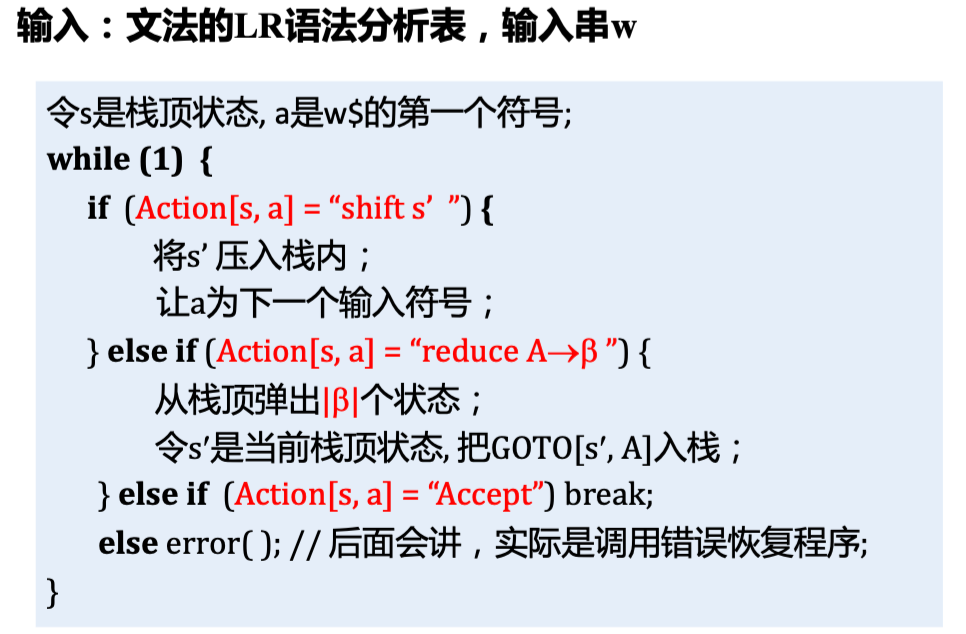

??? example "完整的 LR(0) 语法分析"
    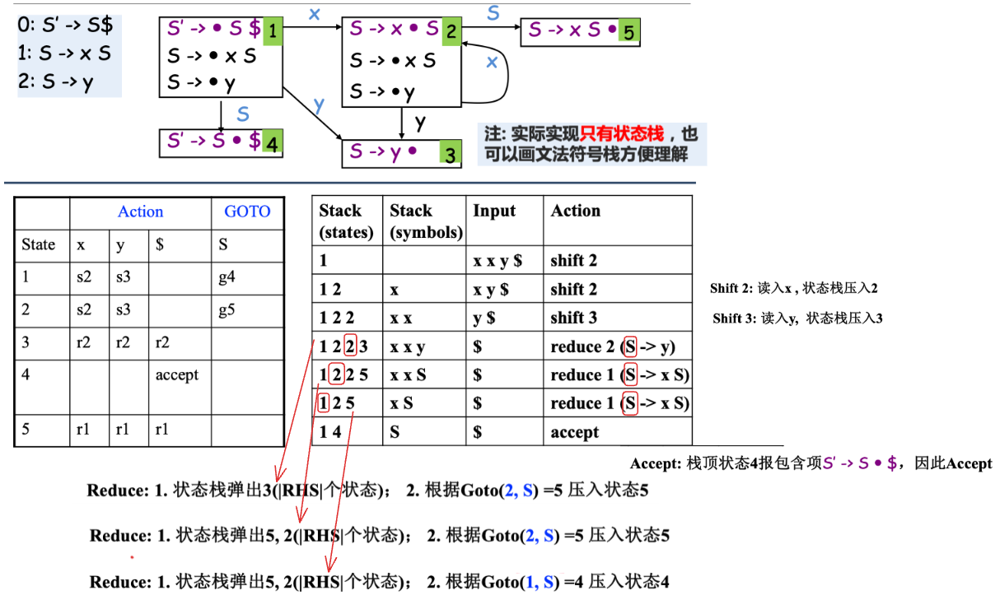

??? info "关于LR(0)中的 0"
    为什么说 LR(0) 没有 Lookahead?

    - LR(0) Item 中没有 lookahead terminal 等信息
    - "是否归约、选择哪个产生式规约" 仅由栈顶状态决定

LR(0) 的局限就是对于某些文法，会盲目地进行归约，从而导致 shift-reduce conflict

??? example
    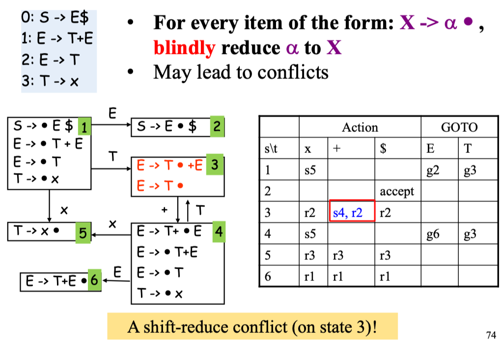

## SLR 分析

SLR(1) 就是使用更多的信息来指导归约操作

因为 "LR 分析相当于最右推导的逆过程"，那么每一次归约操作应该满足：$t \in \text{Follow}(E)$

- $E$ 表示用来归约的产生式的 LHS
- $t$ 表示下一个 token

对于 SLR(1), Put reduce actions into the table <u>only</u> where indicated by the FOLLOW set

!!! success "Attention!"
    SLR(1) Parsing 相当于 LR(0) 就仅在 Reduce 时不同:
    
    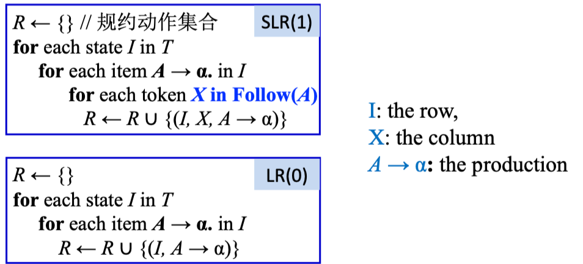

??? example
    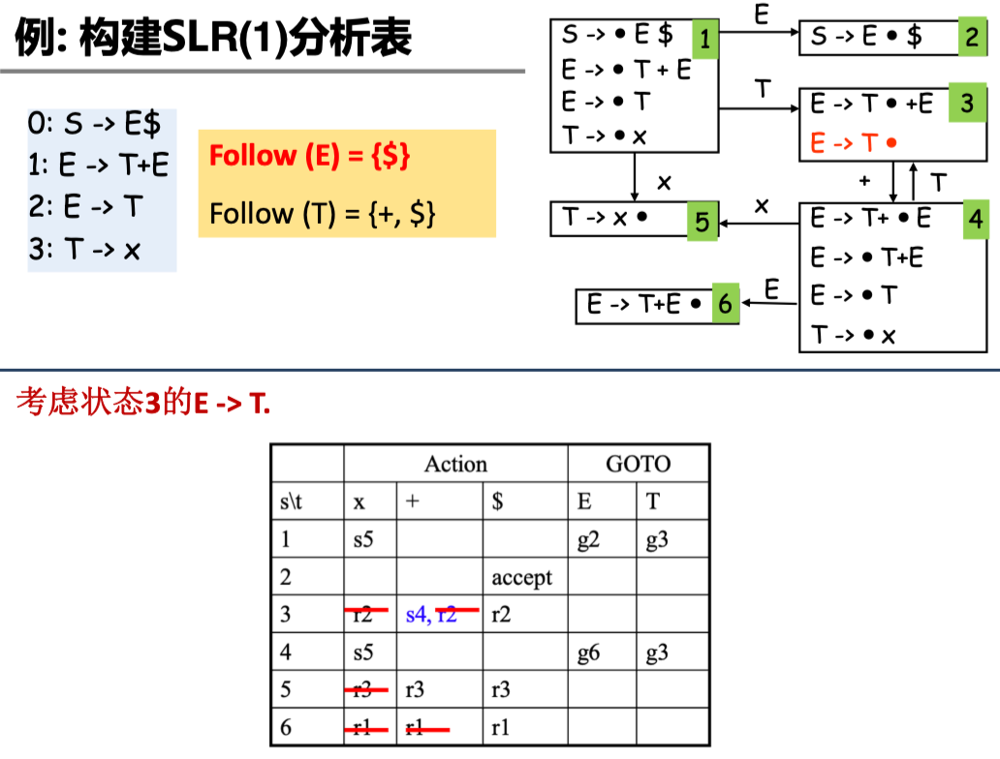

SLR 解决冲突的方法是：只有下一个输入符号在某个句型中可以跟着 $A$ 之后 (即 $x\in \text{Follow}(A)$), 才能进行 $A \rightarrow \alpha$ 归约

但仍然存在问题：

- LR 分析过程是最右推导的逆，那么每一步推导都应该是最右句型
- 如果 $\beta A x$ 不是任何最右句型的前缀，那么尽管 $x \in \text{Follow}(A)$, 也不应该进行 $A \rightarrow \beta$ 的归约

## LR(1) 分析

LR(1) 项中包含更多信息来消除一些归约动作，不仅用到 FOLLOW 集，还用到了 FIRST 集

> 实际的做法相当于 "分裂" 一些 LR(0) 状态，精确指明何时应该归约

!!! success "LR(1) 的 Item"
    LR(1) 项的形式是形如：$A \rightarrow \alpha \cdot \beta, \color{red}{a}$

    - $\color{red}{a}$ 称为向前看符号，可以是终结符号或者 $\$$
    - 向前看符号 (串) 的长度即为 $LR(k)$ 中的 $k$

!!! note "Closure 闭包"
    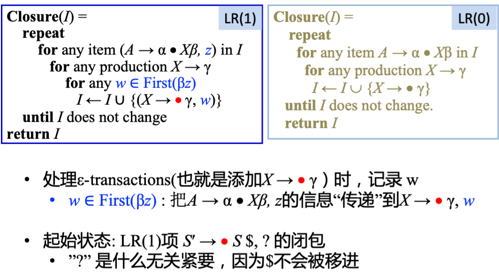

!!! note "Goto 转移"
    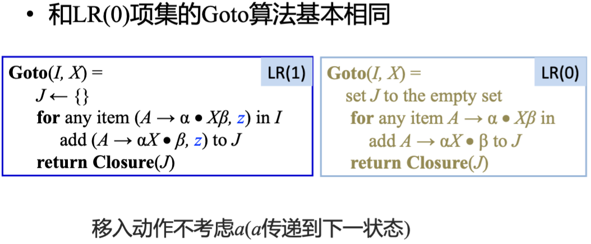

!!! note "Reduce Action"
    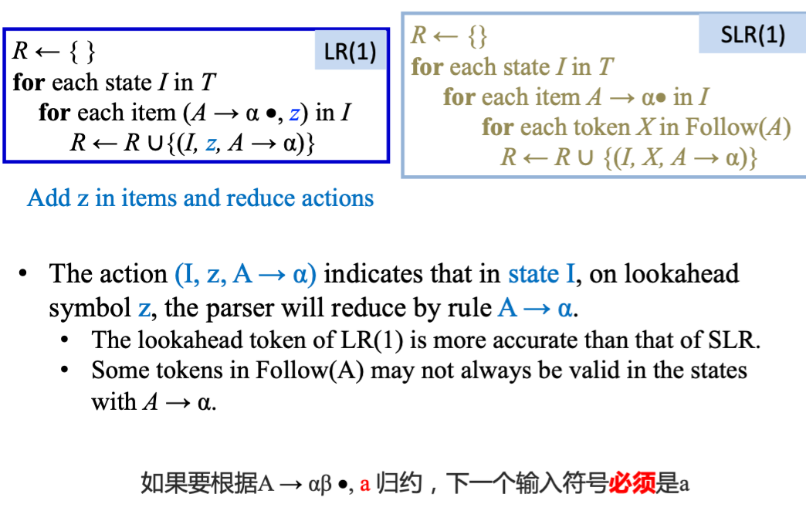

??? example
    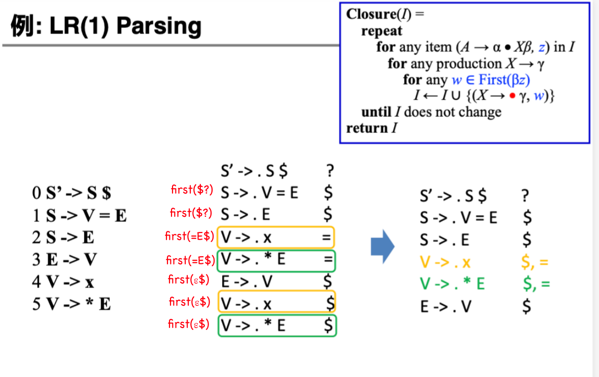
    
    由此可以得到 LR(1) 的分析表<br>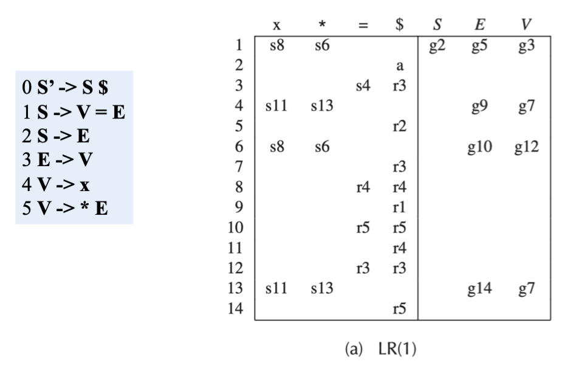

    > 同时也可以看到 LR(1) Parsing 的局限就是其 parsing table 会非常大，导致不适用于实际应用

## LALR 分析

一些状态在 LR(1) 中只不过是 lookahead symbol 不同, 比如下图中的项集 6 和 13

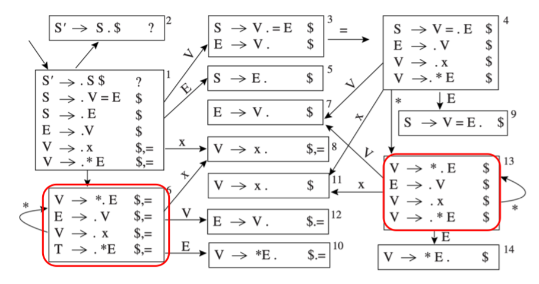

LALR(1) 相较于 LR(1) 就是对于任意的两个项集，如果他们只有 lookahead symbol 不同，那么就合并这两个项集

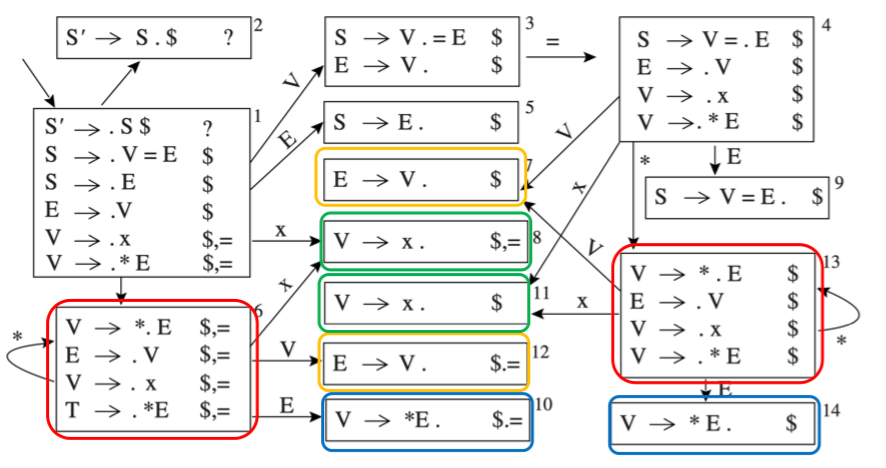

下面介绍如何从 LR(1) 过渡到 LALR(1)

首先引入 core 概念，core 是一个项集中去掉 lookahead symbol 的部分

- 例如 $A \rightarrow \alpha \cdot \beta, a$ 的 core 是 $A \rightarrow \alpha \cdot \beta$

构造 LALR(1) Parsing DFA 就是：

Repeat until all states have distinct cores:

- 选择有相同 core 的不同状态
- 通过创建一个新的包含所有 item 的状态来合并这些状态
- 令之前的前一状态指向新状态；新状态指向所有合并前的状态的继承者

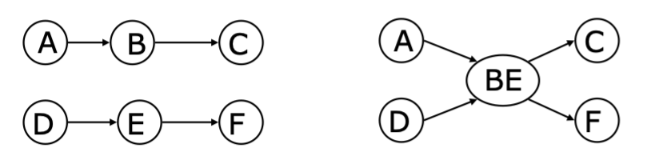

??? example
    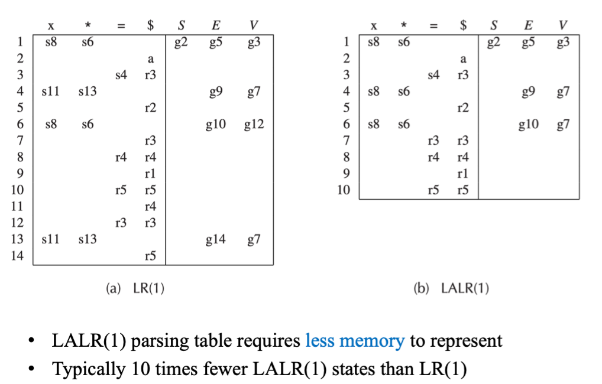

## Yacc

> - 语法分析的生成器 Yacc (Yet Another Compiler Compiler)
> - 基于 LALR(1)，用 BNF (Backus-Naur Form) 描述文法
> - Yacc 的 GNU 版本是 Bison

Lex 和 Yacc 一起使用，Lex 用于词法分析 (.l 文件)，Yacc 用于语法分析 (.y 文件)

- 源文件经过 `yylex()` 函数分析后，返回 token，然后传递给 `yyparse()` 函数进行语法分析

### Yacc 源程序的结构

```yacc
声明
%%
翻译规则
%%
辅助性 C 语言例程
```

- 声明部分：放置 C 语言的声明 (如宏定义、全局变量等)，以及词法单元的声明
- 翻译规则部分：指明产生式及相关的语义动作
- 辅助性 C 语言例程：
    - 被直接拷贝到生成的 C 语言源程序中
    - 可在语义动作中调用
    - 包括 `yylex()`，这个函数返回词法单元，可以由 Lex 生成

### Yacc 使用

```txt title="文法"
exp -> exp addop term | term
addop -> + | -
term -> term mulop factor | factor
mulop -> *
factor -> ( exp ) | number
```

```yacc title="yacc 文件"
%{
#include <stdio.h>
#include <ctype.h>
int yylex(void);
int yyerror(char *s);
%}

%token NUMBER
%%
command: exp { printf("%d\n", $1); };
exp: exp '+' term { $$ = $1 + $3; }
    | exp '-' term { $$ = $1 - $3; }
    | term { $$ = $1; }
;
term: term '*' factor { $$ = $1 * $3; }
    | factor { $$ = $1; }
;
factor: '(' exp ')' { $$ = $2; }
    | NUMBER { $$ = $1; }
;
```

!!! note "Rules"
    - `Rule {Action Code}`
    - Action Code 会在使用这个规则归约后执行

其中对于语义动作： $\$\$ = \$1 + \$3$, $\$\$$ 表示和产生式头相关的属性值，$\$i$ 表示产生式体中第 $i$ 个符号的属性值

??? info
    [lex与yacc/flex与bison入门](https://blog.csdn.net/weixin_44007632/article/details/108666375)

??? info "Yacc 文件格式中的几个问题"
    - **消除二义性**: 为算符指定优先级与结合律

    ??? example
        ```yacc
        %left '+' '-'
        %left '*' '/'
        %right UMINUS /* 一元减号 */
        %right '^' /* 指数运算 */
        ```
    
    - **冲突解决**
        - 归约/归约冲突：选择 Yacc 说明中<u>先出现的产生式</u>
        - 移进/归约冲突：<u>移近优先</u>
        - 更通用的方法: 改写文法以消除冲突 (例如, 消除二义性的同时也可能减少了冲突)

## 错误恢复

> 这部分了解就行了

!!! bug "Motivation"
    希望一次编译尽量报出所有错误而不是第一个错误就停止

Error recovery techniques：

- Local error recovery
    - Adjust the parse stack and the input at the point where the  error was detected in a way that will allow parsing to resume.
- Global error repair
    - Find the smallest set of insertions and deletions that would turn the source string into a syntactically correct string

### Local Error Recovery

!!! abstract
    - 使用错误产生式来完成语法错误恢复
        - 错误产生式 $A \rightarrow \text{error} \alpha$
        - 例如：$\textit{stmt} \rightarrow \text{error};$
    - 定义哪些非终结符号有错误恢复动作
        - 比如：表达式、语句、块、函数定义等非终结符号
    - 当语法分析器遇到错误时
        - 不断弹出栈中状态，直到栈顶状态包含项 $A \rightarrow \cdot \text{error} \alpha$
        - 分析器将 *error* 移入栈中
        - 如果 $\alpha$ 为空，分析器直接执行归约，并调用相关的语义动作；否则 **跳过** 一些符号，找到可以归约为 $\alpha$ 的串为止

一个在 Yacc 中的 local recovery mechanism:

- Use a special **error** (terminal) symbol to control the recovery process

例如对于下面文法，加入了 `error` symbol

```
exp -> ID
    | exp + exp
    | (exps)
    | (error)
exps -> exp
    | exps; exp
    | error ; exp
```

如果在表达式中间遇到语法错误，解析器应跳到下一个分号 (semicolon) 或右括号 (right parenthesis)，然后继续解析

> 像分号和右括号被叫做 **synchronization tokens**

具体操作的时候，`error` 被看作 terminal symbol,当 LR Parser 遇到 error state 时，会执行下面的操作：

1. Pop the stack (if necessary) until a state is reached in which the action for the ***error* token is shift.**
2. Shift **the *error* token.**
3. Discard input symbols (if necessary) until a lookahead is reached that has a **nonerror action** in the current state.
4. Resume normal parsing.

??? example 
    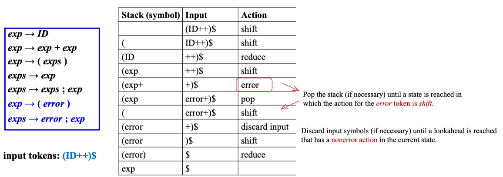

### Global Error Recovery

- Global error repair : **finds the smallest set** of insertions and deletions that would turn the source string into a syntactically correct string, even if the insertions and deletions are not at a point where an LL or LR parser would first report an error.
- **Burke-Fisher error repair**: single-token insertion, deletion, or replacement at every point that **occurs no earlier than K tokens before the point** where the parser reported the error. 
    - The LL($k$) or LR($k$) (or LALR, etc.) grammar is not modified at all (no *error* productions)
    - Nor are the parsing tables modified