# Semantic Analysis | Activation Record

## 过渡知识

### 属性文法 | Attribute Grammar

!!! warning
    龙书对此讲解十分详细，本课基于虎书了解概念即可，基本思想 **就是给一些语义规则赋予一些含义**

- 属性文法：上下文无关文法 + 属性 + 属性计算规则
    - **属性**：描述文法符号的语义特征，如变量的类型、值等。例，非终结符 $E$ 的属性 $E\text{.val}$ 表示 $E$ 的值
    - 属性计算规则 (语义规则)：与产生式相关联、反映文法符号属性之间关系的规则，比如“如何计算 $E\text{.val}$”
- 属性计算规则: 仅表明属性间“抽象”关系，不涉及具体实现细节，如计算次序等

> 用属性描述语义信息，用语义规则描述属性之间的关系，将语义规则与语法规则相结合

属性文法的潜在应用大体分为两类（但由于各种局限性，属性文法并未得到普及）

- **"推导类"** 应用：类似程序分析
    - 表达式的类型、值、执行代价等
- **“生成类”** 应用：类似程序合成
    - 抽象语法树生成
    - 中间代码甚至汇编生成

??? info "属性文法的实现"
    可通过 Parser 生成器支持的“语义动作” (Semantic action) 实现计算, 并应用于抽象语法树生成等场景

> 本课只需要关注 Yacc, Bison 中的 Semantic Action，以及怎么生成 AST 这些具体应用即可

### Semantic Action

每个终结符和非终结符都可以与自己的语义值 (semantic value) 的类型相关联 (给每一个符号绑定一个语义值，比如类型，数学值等)

!!! example "CFG and its Semantic Action"
    Suppose that we want to “evaluate” the values of an expression：

    ```bison
    E -> E1 + T {E.val = E1.val + T.val}
    E -> E1 - T {E.val = E1.val - T.val}
    E -> T      {E.val = T.val}
    T -> (E)    {T.val = E.val}
    T -> num    {T.val = num.val}
    ```

- 在递归下降分析中：
    - 语义动作指代 parsing 函数的返回值，或这些函数的 side effect, 又或者两者皆有
    - For each terminal and nonterminal symbol, we associate a type of semantic values representing phrases derived from that symbol.
  
    !!! example
        `T -> T * F ` 对应的 semantic action:

        ```c
        int a = T();
        eat(TIMES);
        int b = F();
        return a * b;
        ```

- 又比如在 Yacc 中加入 Semantic Action, 从而可以一边解析一边计算表达式的值
    - `{...}`: semantic action, 可以是任意合法的 C 代码
    - `$i`: the semantic values of the i-th RHS symbol
    - `$$`: the semantic value of the LHS nonterminal symbol
    - `%union`: difference possible types for semantic values to carry
    - `<variant>`: declares the type of each terminal and nonterminal

    ??? example
        ```yacc
        %{ ... %}
        %union {
            int num;
            string id;
        }
        %token <num> INT
        %token <id> ID
        %type <num> exp
        ...
        %left UMINUS
        %%
        exp : INT {$$ = $1;}
            | exp '+' exp {$$ = $1 + $3;}
            | exp '-' exp {$$ = $1 - $3;}
            | exp '*' exp {$$ = $1 * $3;}
            | MINUS exp %prec UMINUS {$$ = -$2;}
        ```

??? info "Semantic Actions in Yacc-Generated Parsers"
    - Yacc 生成的 parser 会保留一个与状态栈平行的值栈，用于存储语义值
    - 当 parser 规约一个产生式时，会执行相应的 semantic action，将计算结果压入值栈
    - 当 parser 从符号栈中弹出 $Y_k, \dots Y_1$ 并弹入 $A$ 时, 也会从语义值栈中弹出 $k$ 个值, 并推入 semantic action 的结果

### Abstract Parse Tree

考虑之前的 semantic action, 其实可以用 Yacc 和相应的 semantic action 写出一个完整的编译器

- 但是这样的编译器难以阅读和维护；
- 并且必须完全按照程序解析的顺序分析程序

由此，希望 separate issues of syntax (parsing) from issues of semantics (type-checking and translation to machine code)

其中一个解决方案是：将语法树的构造与语义动作分离，即先构造语法树，再对语法树进行语义分析

!!! note "Why we need AST"
    - 对于先前的语法树，他对输入的每一个 token 都有一个叶子节点，且每一个 parse 过程中的规约语法都有一个内部节点
    - 这样的语法树被称为 concrete parse tree，它包含了所有的细节
    - 但是这样的语法树不便于直接使用
        - redundant and useless tokens for later phases
        - depends too much on the grammar
    
    ??? example
        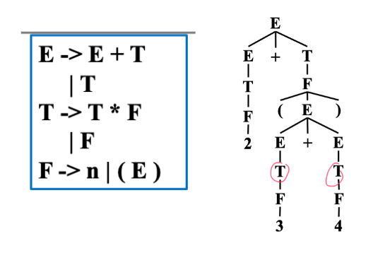

        例如图中的 $T$ 可能只是之前为了消除二义性，临时加的新的 nonterminal，对于后续的语义分析是没有意义的

AST 所做的是在 parser 和编译器的后续阶段之间建立一个 clean interface (具体操作是 parser 使用 concrete syntax 为抽象语法建立语法树)

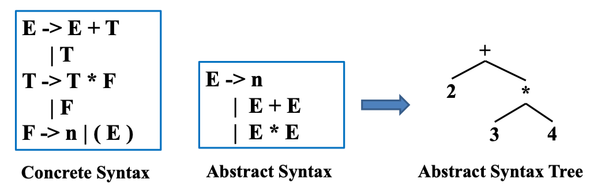

> The semantic analysis phase takes this abstract syntax tree. 

AST 的构造可以手写，也可以通过 parser generator 生成

??? info "manmade AST"
    A typedef for each nonterminal, a union-variant for each production.

    ??? example
        对于文法：

        ```
        E  -> n
            | E + E
            | E * E
        ```

        使用如下数据结构表示 AST:

        ```c
        typedef struct A_exp_ *A_exp;
        struct A_exp_ {
            enum {A_numExp, A_plusExp, A_timesExp} kind; 
            union {
                int num; 
                struct {A_exp left; A_exp right;} plus; 
                struct {A_exp left; A_exp right;} times; 
            } u; 
        };

        A_exp A_NumExp(int num);
        A_exp A_PlusExp(A_exp left, A_exp right); 
        A_exp A_TimesExp(A_exp left, A_exp right);
        ```

        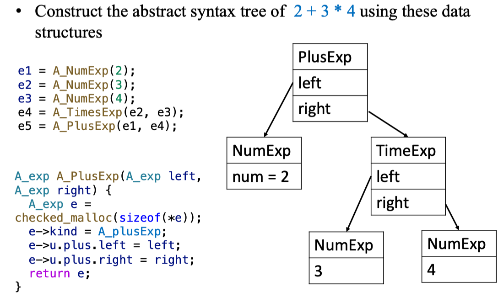

???+ info "Building AST Automatically"
    ```yacc
        %{ ... %}
        %union {
            int num;
            string id;
        }
        %token <num> INT
        %token <id> ID
        %type <num> exp
        ...
        %left UMINUS
        %%
        exp : INT {$$ = $1;}
            | exp '+' exp {$$ = $1 + $3;}
            | exp '-' exp {$$ = $1 - $3;}
            | exp '*' exp {$$ = $1 * $3;}
            | MINUS exp %prec UMINUS {$$ = -$2;}
    ```

??? info "Applications of AST Traversals"
    - Pretty print
    - Desugaring
    - Inlining
    - High-level optimizations (e.g., 删除公共子表达式)
    - Symbolic execution!(e.g., Clang Static Analyzer)
    - Semantic analysis , e.g., type checking
    - Translation to intermediate representations
    - ...

<!-- ### Positions

- 在 one-pass 编译器中，词法分析，解析和语义分析是同时进行的
- 如果出现了一个 type error 需要报错，那么词法分析器的 current position 是错误位置的合理近似位置
- 在 one-pass 编译器中，词法分析器维护了一个 `current position` 全局变量
-  -->

### Tiger Language

- Simple control constructs:
    - if-then, if-then-else
    - while-loops, for-loops
    - function calls
- Two basic types: int and string
    - Facility to define record and array types
    - Facility to define mutually-recursive types
- Supports nested functions, mutually recursive functions

**1) Let-In-End Expressions**

- A Tiger program is expression (无 statement)

```
let
    <type declarations>
    <variable declarations>
    <function declarations>
in
    <sequence of expressions, separated by ;>
end
```

- Scope extends to end of expression sequence

**2) Type Declarations**

- Array lengths are not specified until creation

```
type t1 = int
type t2 = string
type rec1 = {f1:int, f2:t2}
type intArray = array of int
```

**3) Variable Declarations**

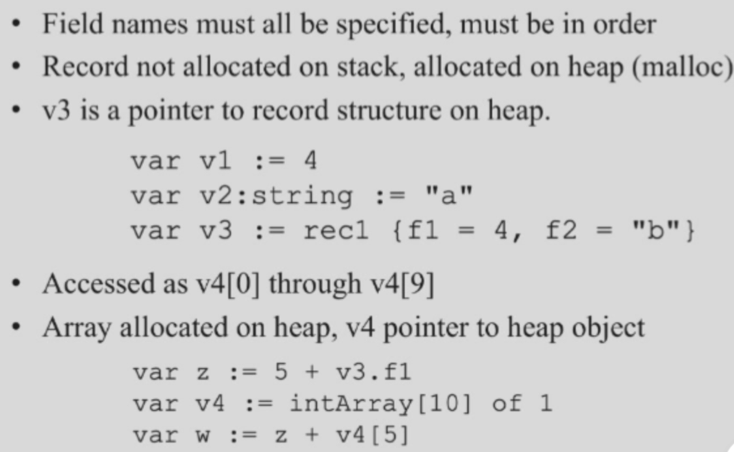

**4) Function Declarations**

- Parameters are passed by value:

```
function add1(x:int):int = x+1;
function changeRec(r:rec1) =
    (r.f1 := r.f1 + 10; r.f2 := "hello")
```

- Function declarations can be nested
    - Nested functions can access local variables or parameters of outer functions

```
function f1(y:int):int =
let
    var z := 0
    var w := 0
    function f2():int = z + w * y
in
    f2()
end
```

**5) Mutual Recursion**

Functions and types can be mutually recursive

- Mutually-recusive types must be declared consecutively with no intervening variable or function declarations | 互斥类型必须连续声明，中间不得有变量或函数声明
- Each recursion cycle in a type definition must pass through a record or array type | 每个递归循环在类型定义中必须通过记录或数组类型
- Mutually-recursive functions must be declared consecutively with no intervening type or variable declarations | 互斥递归函数必须连续声明，中间不得有类型或变量声明

## Semantic Analysis

对编译器来说，单单词法和语法分析是不足的, 例如：

- Does the dimension of a reference match the declaration? 
- Is an array access out of bound?
- Where should a variable be stored (heap, stack,…) 
- ...

上述问题的限制来源于语法分析的局限性，这些错误是否能检查出是依赖于值的，而不是语法


广义的 Semantic Analysis:

- We need to analyze the semantics of programs
    - Usually, this is done by traversing/analyzing various **program  representations**
    - Examples of representations: AST, control flow graph (CFG), program dependence graph (PDG), value flow graph (VFG), SSA (single static assignment).
- Sample semantic analysis: type checking, code generation, dead code elimination, register allocation, etc

**狭义的 Semantic Analysis**:

> 语法分析检查不到的一些问题，用语义分析可以检查出来

本课程默认的语义分析：

- Determine some static properties of program via AST, e.g., 
    - Scope and visibility of names
        - every variable is declared before use
    - Types of variables, functions, and expression
        - every expression has a proper type
        - function calls conform to definitions
- Translate the AST into some intermediate code

### Symbol Table

> 管理不同符号信息，比如某个变量在哪里可以使用、区分变量作用域

**1) Binding**: give a symbol a meaning | 把一些标志符绑定到有特定含义的属性,使用 $\mapsto$ 表示

E.g.,

| Name/Symbol | Meaning/Attribute |
| :---: | :---: |
| type identifier | type (e.g., int , string) |
| variable identifier | type, value, access info, ... |
| function identifier | argument types, return type, ... |

**2) Environment**: a **set** of bindings | 一组绑定

E.g., {$g \mapsto \text{string}, ~ a \mapsto \text{int}$}

**3) Symbol table**: the implementation of environment

> Semantic analysis: traverse the abstract syntax tree (AST) in certain order while maintaining a symbol table


???+ example
    > 考试可能考画 tiger 语言的符号表

    ```c linenums="1" hl_lines="1 3 4 6"
    function f(a:int, b:int, c:int) =
        (print_int(a+c) ;
        let var j := a+b
            var a := "hello"
        in print(a); print_int(j)
        end;
        print_int(b)
        )
    ```

    - 假设最开始的 environment 是 $\sigma_0$
    - 在第一行，函数定义建立新的 environment $\sigma_1$
        - $\sigma_1 = \sigma_0 + \{a \mapsto \text{int},~ b \mapsto \text{int}, ~ c \mapsto \text{int}\}$
        - 在第二行，标识符 $a, c$ 可以在环境 $\sigma_1$ 中查询到
    - 在第三行，建立新的 environment $\sigma_2$
        - $\sigma_2 = \sigma_1 + \{j \mapsto \text{int}\}$
    - 在第四行，有 $\sigma_3 = \sigma_2 + \{a \mapsto \text{string}\}$
    - 在第六行，As the semantic analysis reaches the end of each scope, the identifier bindings local to that scope are discarded.
        - $\sigma_2, \sigma_3$ 都会被丢弃，environment 恢复为 $\sigma_1$

    !!! warning "约定"
        **Bindings in the right-hand table override those in the left**

        - 例如对上述 $\sigma_3$, $\sigma_2$ 中包含了 $a \mapsto \text{int}$
        - 对于 $\sigma_3$, $\{a \mapsto \text{string}\}$ 会覆盖 $\sigma_2$ 中 $a$ 的 binding

!!! note "Symbol Table 需实现的接口"
    - `insert`: 将名称绑定到相关信息(如类型), 如果名称已在符号表中定义，则 **新的绑定优先于旧的绑定**
    - `lookup`: 在符号表中查找名称，以找到名称绑定的信息
    - `beginScope`: 进入一个新的作用域
    - `endScope`: 退出作用域，将符号表恢复到进入之前的状态


!!! success "下面介绍 Efficient Implementation"

!!! abstract "两种实现风格"
    1. Imperative style (有了新环境就看不到旧环境，但退出作用域的时候还能返回到旧环境)
          - 直到 $\sigma_1$ 变为 $\sigma_2$ 才修改 $\sigma_1$
          - $\sigma_2$ 存在的时候，不可以访问 $\sigma_1$
          - 处理完 $\sigma_2$ 后，我们可以撤销修改，返回到环境 $\sigma_1$
    2. Functional style (每次变化都保存着旧环境)
          - 创建环境 $\sigma_2$ 的同时，保存着 $\sigma_1$ 的原始状态
          - 易于恢复到旧环境，但是需要更多的空间

#### Imperative Symbol Tables

!!! question "Problem 1"
    === "Problem"
        如何做到高效的 lookup?
    === "Solution"
        - 使用 hash table
        - E.g., $\sigma_{new} = \sigma + \{a \mapsto \text{int}\}$
        - 那么就将 `<a, int>` 插入到 hash table 中

!!! question "Problem 2"
    === "Problem"
        如何删除并恢复旧环境?
    === "Solution"
        - 使用带有外部链 (external chaining) 的 hash table
        - E.g.: `hash(a)` -> `<a, int>` -> `<a, string>`
  
        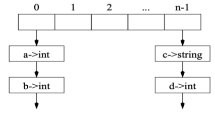

由此，我们可以设计一个 efficient imperative symbol table, 其中包含：

1. **Hash Tables**: an array of buckets
2. **Bucket**: list of entries (each entry maps identifier to binding)

具体的函数设计思想：

=== "Lookup"
    lookup entry for identifier *key* in symbol table:

    - Apply *hash function* to `key` for getting array element `index` 
    - Traverse bucket in `table[index]` to find the binding. (`table[x]`: all entries whose keys hash to `x`)
=== "Insert"
    Insert new element at front of bucket

    - strong update, 要么插入，要么覆盖
    - 考虑 $\sigma + \{a \mapsto \tau 2\}$, 且 $\sigma$ 中已经含有 $\{a \mapsto \tau 1\}$
    - 插入函数会保存 $\{a \mapsto \tau 1\}$，并将 $\{a \mapsto \tau 2\}$ 插入在表的更前面
        - E.g., `hash(a)` -> `<a, τ2>` -> `<a, τ1>`

=== "Restore"
    pop items off items at front of bucket.

    - 考虑 $\sigma + \{a \mapsto \tau 2\}$, 且 $\sigma$ 中已经含有 $\{a \mapsto \tau 1\}$
    - 当在 `a` 的作用域的结尾处完成 `pop(a)` 后，$\sigma$ 就被恢复了
        - E.g. `hash(a)` -> `<a, τ2>` -> `<a, τ1>` 变为 `hash(a)` ->  `<a, τ1>`

    !!! warning
        为了处理不同 scope, 还需其他辅助信息，比如指导 "需要 pop 几次"

#### Functional Symbol Tables

!!! abstract "Basic Idea"
    - 当实现环境 $\sigma_2$ ($\sigma_2 = \sigma_1 + \{a \mapsto \text{int}\}$) 时
    - 创建一个新的表 $\sigma_2$，而不是修改 $\sigma_1$
    - 但删除，回退时，我们可以直接返回到 $\sigma_1$

实现方式是：binary search trees (BSTs)

- Each node contains mapping from identifier (key) to binding. 
- Use string comparison for "less than" ordering.
- 对于节点 $l$, 它的左子树 $L$, 右子树 $R$ 满足：
    - 对于所有 $n \in L$, `key(n) < key(l)`
    - 对于所有 $n \in R$, `key(n) >= key(l)`

>  用先前 efficient impressive 的方式也能实现，但是不够高效

=== "Lookup"
    `O(logn)` for a balanced tree of n nodes

=== "Insert"
     Copy the nodes from the root to the parent of the inserted node

    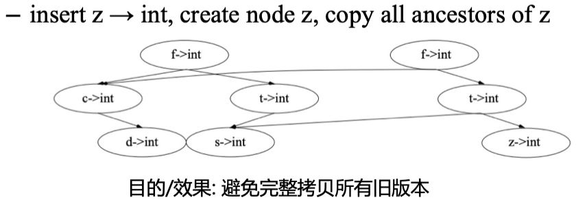

??? info "Summary"
    - Imperative Style : (side effects)
        - When beginning-of-scope entered, entries added to table using side-effects. (old table destroyed)
        - When end-of-scope reached, auxiliary info used to remove previous additions. (old table reconstructed)
    - Functional Style : (no side effects)
        - When beginning-of-scope entered, new environment created by adding to old one, but old table remains intact
        - When end-of-scope reached, retrieve old table.

    > 它们对 `lookup`, `insert`, `beginScope`, `endScope` 等接口的支持，复杂度上各有优势

### Symbols in the Tiger Compiler

实现表的时候存在一个问题：对于判断 `key value = string | (strcmp)`, 我们在查找的时候需要进行大量的字符串比较操作

一种解决方法是：使用 `symbol` 数据结构代替

- 即每个 `symbol` 对象都与整数值相关联
- 相同的字符串映射到同一个 `symbol` 对象
- 于是之前比较 `key value = symbol` 可以变成简单的整数比较

#### Implementation of Symbol Tables

**The interface of symbols and symbol tables:**

- `void*`: 在编译器中为不同目的使用不同的绑定概念, e.g., 
    - Type binding for types
    - value binding for variables and functions

```c
typedef struct S_symbol_ *S_symbol;
S_symbol S_Symbol(string name);
string S_name(S_symbol s);

typedef struct TAB_table_ *S_table;
S_table S_empty(void);
void S_enter(S_table t, S_symbol sym, void *value);
void *S_look(S_table t, S_symbol sym);
void S_beginScope(S_table t);
void S_endScope(S_table t);
```

??? code "mksymbol, S_Symbol, S_name"
    ```c
    static S_symbol mksymbol(string name, S_symbol next) {
        S_symbol s = checked_malloc(sizeof(*s));
        s->name = name;
        s->next = next;
        return s;
    }

    S_symbol S_Symbol(string name) {
        int index = hash(name) % SIZE;
        S_symbol syms = hashtable[index], sym;
        for (sym = syms; sym; sym = sym->next)
            if (strcmp(sym->name, name) == 0)
                return sym;
        sym = mksymbol(name, syms);
        hashtable[index] = sym;
        return sym;
    }

    string S_name(S_symbol s) {
        return s->name;
    }
    ```

- 用 C 语言实现的 Tiger 编译器使用 `destructive update` 的方式来更新 environments
- An imperative table is implemented using a hash table.

??? code "S_empty, S_enter, S_look"
    ```c
    S_table S_empty(void) {
        return TAB_empty();
    }

    void S_enter(S_table t, S_symbol sym, void *value) {
        TAB_enter(t, sym, value);
    }

    void *S_look(S_table t, S_symbol sym) {
        return TAB_look(t, sym);
    }
    ```

For destructive-update environments, 通过下面的方式实现 `beginScope` 和 `endScope`:

- `S_beginScope`: 记住表格的当前状态；
- `S_endScope`:  将表恢复到最近一次 beginScope 的位置。

??? code "S_beginScope, S_endScope"
    ```c
    static struct S_symbol_ marksym = { “<mark>”, 0 };
    void S_beginScope(S_table t) {
        S_enter(t, &marksym, NULL);
    }

    void S_endScope(S_table t) {
        S_symbol s;
        do
            s = TAB_pop(t);
        while (s != &marksym);
    }
    ```

**Auxiliary stack:**

- Showing in what order the symbols were “pushed” into the symbol table. | 显示符号表中符号的顺序
- As each symbol is popped, the head binding in its bucket is removed. ｜ 每次弹出一个符号，就会从 bucket 中删除一个 binding
- `beginScope`: pushes a special marker onto the stack | 将一个特殊的标记推入栈中
- `endScope`: pops symbols off the stack until finds the topmost  marker. | 弹出符号直到找到最顶部的标记

- The auxiliary stack can be integrated into the Binder by having a global variable top showing the most recent Symbol bound in the table. | 可以将 auxiliary stack 集成到 Binder 中，通过一个全局变量 `top` 来显示最近绑定的符号
- Pushing: copy top into the prevtop field of the Binder. | 将 `top` 复制到 `prevtop` 字段中

??? code "Binder"
    ```c
    struct TAB_table_ { 
        binder table[TABSIZE]; 
        void *top;
    };

    static binder Binder(void *key, void *value, binder next, void *prevtop) {
        binder b = checked_malloc(sizeof(*b));
        b->key = key; 
        b->value = value; 
        b->next = next; 
        b->prevtop = prevtop;
        return b;
    }
    ```

### Type Checking

### 类型及其作用

??? info "编程语言中的类型"
    - 变量的类型：
        - 限制了变量在程序执行期间的取值范围
    - 类型化的语言 (typed language)：
        - 变量都被给定类型的语言，如 C/C++、Java、Go
        - 表达式、语句等程序构造的类型都可以静态确定
    - 未类型化的语言 (untyped language)
        - 不限制变量值范围的语言 (no static types, 而非没有类型), 如 LISP、JavaScript 

类型在编程语言中的作用:

- 开发效率：更高层次的编程抽象, e.g.,
    - 多态、代数数据类型、依赖类型… 
    - hoogle利用类型信息搜索API
- 运行性能：类型指导的编译优化, e.g.,
    - 静态类型绑定避免运行时检查
    - 类型信息优化内存布局
- 安全可靠：内存安全乃至功能正确, e.g.,
    - Rust线性类型保障内存安全
    - LiquidHaskell 精化类型保障功能正确

### Tiger 类型系统

??? info "Type Checking 中的关键问题"
    - What are valid type expressions ?
        - 总共有哪些类型，每个类型表达式对应到什么?
        - e.g., int, string, unit, nil, array of int, record ...
    - How to define two types are equivalent ?
        - 比如，两个 record 类型是否相同?
    - What are the typing rules ?
        - 要检查什么，比如形参和实参是否一致?

**1) 首先回顾 Tiger 语言总共有哪些类型：**

- 基本类型：int, string
- 复合类型：record, array | using records and arrays from other types (primitive, record, or array)

??? note "类型的文法定义和声明案例"
    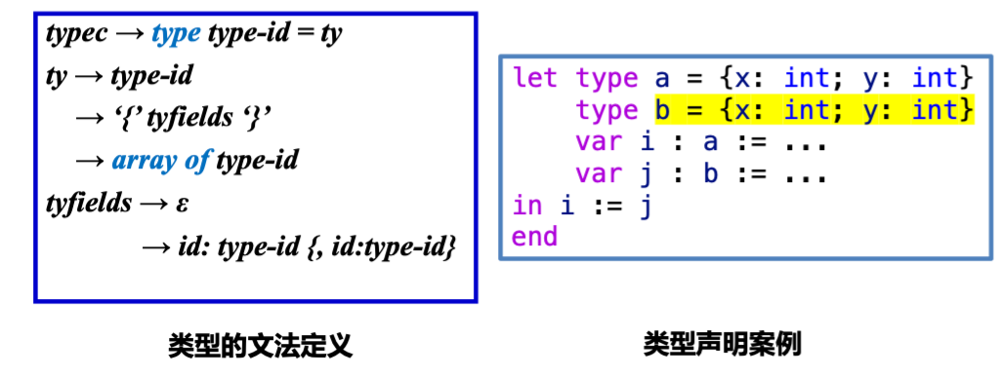

那么如何将 type identifier 和 expression 绑定起来？

- 当处理相互递归类型时：`Ty_Namw(sym, NULL)` 
    - a place-holder for the type-name `sym`

**2) 类型等价 (Type Equivalence)：**

有如下两种等价关系：

- *Name equivalence (NE):* T1 and T2 are equivalent iff T1 and T2 are identical type names defined by the exact same type declaration.
- *Structure equivalence (SE):* T1 and T2 are equivalent iff T1 and T2 are composed of the same constructors applied in the same order.

```c
type a = {x:int, y:int}
type ptr = {x:int, y:int}
function f(a : point) = a
```

<u>Tiger 使用 Name Equivalence</u>，E.g., point and ptr are equivalent under SE but not equivalent under NE

> Type equivalence 影响类型检查，如是否需要在 Typing environment 增加新的类型? 函数的形参和实参类型识别匹配?


!!! warn "类型等价"
    - 要注意每一个 `record type expression` 都创建一个新的、不同的 `record type`
    
    ??? example
        === "Illegal"
            ```c
            let type a = {x:int, y:int}
                type b = {x:int, y:int}
                var i : a := ...
                var j : b := ...
            in i := j
            end
            ```
        === "Legal"
            ```c
            let type a = {x:int, y:int}
                type b = a
                var i : a := ...
                var j : b := ...
            in i := j
            end
            ```

**3) Tiger 的命名空间**

Tiger 有两个独立的命名空间：

- *Types*
- *Variables and functions*

=== "Type"
    ```c
    let type a = int
        var a := 1
    in ...
    end
    ```

    - Both `a` can be used.
=== "Variable and Function"
    ```c
    let function a(b : int) = ...
        var a := 1
    in ...
    end
    ```

    - **variables and functions of the same name cannot both be in scope simultaneously (one will hide the other)** | 变量和函数不能同时存在，一个会隐藏另一个
    - var `a` hides function `a`


### Tiger 类型检查

Tiger 语义分析需要维护 2 个环境:

- *Types* environment: Maps type symbol to type that it stands for `Symbol -> Ty_ty`
- *Variables and functions* environment:
    - Maps variable symbol to its type. 
        - E.g., `Symbol -> Ty_ty`
    - Maps function symbol to parameter and result types.
        - E.g., `Symbol -> struct {Ty_tyList formals; Ty_ty result}`

??? note "预定义环境"
    === "code"
        ```c
        typedef struct E_envent_ *E_envent;
        struct E_enventry_ {
            enum {E_varEntry, E_funEntry} kind; 
            union {
                struct {Ty_ty ty;} var;
                struct {Ty_tyList formals; Ty_ty result;} fun; 
                } u;
        };
        E_enventry E_VarEntry(Ty_ty ty); 
        E_enventry E_FunEntry(Ty_tyList formals, Ty_ty result);

        S_table E_base_tenv(void); /* Ty_ty environment */ 
        S_table E_base_venv(void); /* E_enventry environment */
        ```
    === "Explanation"
        Predefined type and value environments
        
        - Type environment "int" $\mapsto$ `Ty_Int()`, "string" $\mapsto$ `Ty_String()`
        - Value environment contains predefined functions of Tiger

对于语义分析, 既做语义检查又做中间代码 (IR Code) 生成。同时对 expressions 和 declarations 进行检查

> 现在还不用考虑 IR code 生成

??? info "Implementation"
    - The Semant module (semant.h, semant.c) performs semantic analysis including type-checking – of abstract syntax
    - Semantic analysis: four recursive functions over AST

    ??? code "Semantic analysis"
        ```c
        Struct expty transVar (S_table venv, S_table tenv, A_var v); 
        struct expty transExp (S_table venv, S_table tenv, A_exp a);
        void transDec (S_table venv, S_table tenv, A_dec d);
        Ty_ty transTy (S_table tenv, A_ty a);
        ```

1. Type-checking expressions 
2. Type-checking declarations
    - Variable declarations
    - Type declarations
    - Function declarations
    - Recursive type declarations
    - Recursive function declarations

#### Type-checking expressions

```c
Struct expty transExp (S_table venv, S_table tenv, A_exp a);
```

- `transExp`: Type-checking expressions: query && update the environments
- **Input**: 
    - `venv`: value environment
    - `tenv`: type environment
    - `a`: expression to be type-checked
- **Output**:
    - a translated expression and its Tiger-language type

**Rules**:

- **Function call**: the types of formal parameters must be equivalent to the types of actual arguments.
- **If-expression**: `if exp1 then exp2 else exp3`
    - The type of `exp1` must be integer, the types of `exp2` and `exp3` should be equivalent.

> 此处举两个例子，其余见虎书附录

#### Type-checking declarations

**Declarations 会修改 environments**，且在 Tiger 语言中，declaration 只能出现在 `let` 中 (`let` 中的声明可以在 `in` 中使用)

**1) Variable Declarations**

- Processing a variable declaration **without a type constraint:**

```c
var x := exp
```

- Processing a variable declaration **with a type constraint:**
    - 需要检查 constraint 和 initializing expression 的类型是否一致
    - 同时，initializing expressions of type `Ty_Nil` must be constrained by a `Ty_Record` type.

```c
var x: type-id := exp
```

**2) Type Declarations:**

非递归类型声明，如 `type type-id = ty `

- `transTy` 函数将 `ty` 递归转换为 `Ty_ty` 类型

??? info 
    可以直接利用抽象语法树 (AST) 节点上的类型信息 (A_ty) 

    ```c hl_lines="4"
    void transDec (S_table venv, S_table tenv, A_dec d) {
        ...
        case A_typeDec: {
            S_enter(tenv, d->u.type->name, transTy(tenv, d->u.type->ty));
        }
        ...
    }
    ```

    > NOTICE: This program fragment only handles the type-declaration list of length 1!

**3) Function Declarations:**

非递归函数声明，如 `function id (tyfields) ： type-id = exp`

...

**4) Recursive Type Declarations:**

首先考虑如何将声明 `type list = {first:int, res:list}` 转化为 internal type representations？

- 困难在于：需要从 type environment 中找到 `list` 的定义，但是此时 `list` 还没有被定义。
- 解决办法是：**use two passes**
    1. Put all the "headers" in the environment first (即便他们还没有 bodies)
          1. 例如上例中：`type list =` 就是一个 header
          2. Use the special **"name" type** for the header
    2. Call `transTy` on the "body" of the type declaration
          1. 对于上例，record type expression `{first:int, res:list}` 就是 body
          2. The type that `transTy` returns can then be assigned into the ty field within the `Ty_Name` struct.

!!! important "Tiger 语言的重要特性之一"
    Every cycle in a set of mutually recursive type declarations MUST pass through a record or array declaration！| 在一组相互递归的类型声明中，每个循环都必须经过记录或数组声明

    ??? example
        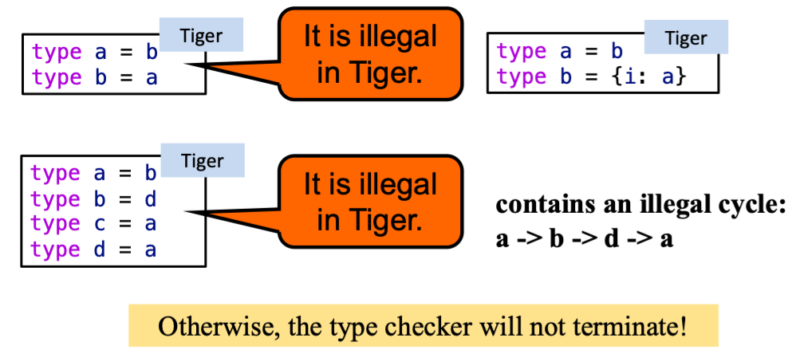

??? info "手动递归函数声明"
    - 手动处理递归函数也是类似.E.g., `f call g, g call f`
    - **Problem**: 在处理函数声明的右侧时，我们可能会遇到 env 中尚未定义的符号
    - **Solution**: 
        - First pass: gathers information about the **header** of each function but leaves the bodies of the functions untouched.
        - Second pass: processes the **bodies** of all functions with the augmented environment.

## Activation Record

!!! important "较简单，可略看"

??? note "Overview of a Morden Processor"
    由四部分组成：

    - ALU 算术逻辑单元：执行算术和逻辑运算
    - Registers 寄存器：存储临时数据 (有限数量但速度快，且用途大多相同，少部分有特殊用途，如 PC, SP)
    - Control: 控制单元，执行指令，控制数据流向 (指令存储在内存中)
    - Memory: 存储数据和指令 (地址空间是程序使用内存的方式)

程序的运行时 **内存布局** 如下：

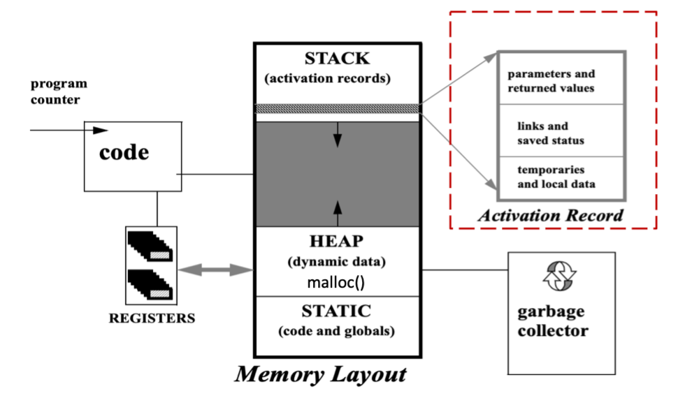

本节聚焦于 **Activation Record**，即活动记录

活动记录在函数 (Function)、过程 (Procedure) 和方法 (Method) 调用中起着重要作用，其实就是函数调用的栈帧

函数和 API、ABI 很相似：

- API (Application Programming Interface): 源程序之间的接口
- ABI (Application Binary Interface): <font color="red">本节的主题就是如何实现 ABI</font> 
    - 二进制程序之间的接口 (甚至可以是不同编译器编译编程语言的程序)
    - Conventions on low-level details：
        - 如何传递参数？
        - 如何返回值？
        - 如何处理寄存器？
        - ...

> - 通常情况下，function 和 method 视为同一种东西。 
> - tiger 将过程和函数区分开来，过程没有返回值，函数有返回值

### Stack Frame

??? note "Function Invocation"
    <u>An invocation of function P is an <B>activation</B> of P</u>
    那么如何保存局部变量？

    - Each invocation has its own instantiation of local variables | 每次调用都有自己的局部变量实例化
    - 函数调用遵循后进先出（LIFO）原则
    - 使用 LIFO 数据结构 —— 一个栈

- **Activation record** Or **stack frame (栈帧)**: a piece of memory on the stack for a function
- 栈帧连接了 caller 和 callee, E.g.,
    - Relevant machine state (saved registers, return address) | 相关机器状态
    - Space for return value | 返回值空间
    - Space for local data | 本地数据空间
    - Pointer to activation for accessing non-local data | 访问非本地数据的激活指针

!!! question "由此引入 **关键问题**：如何布局 Activation record，以便调用者和被调用者能够正常通信？"

#### 活动记录的设计

> 《深入理解计算机系统》中的 Stack Frame 例子

!!! important "Stack Frame 从高地址往低地址增长"

对于 Frame 和 Stack 指针：

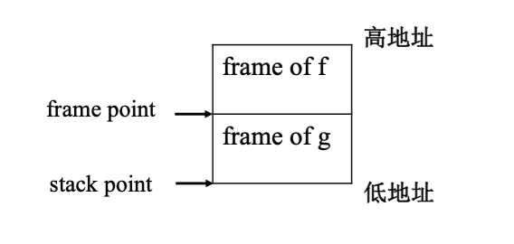

- **Frame Pointer (FP)** (base pointer, 基址寄存器)
    - 指向当前帧的起始位置
    - 编编译代码引用局部变量和参数的方式是使用帧指针的偏移量
    - E.g., x86: `ebp`, `rbp`; ARM: `fp`
- **Stack Pointer (SP)** (top of stack, 栈顶指针)
    - 指向当前帧的栈顶 (最低地址)
    - Referring to the top of the stack
    - E.g., x86: `esp`, `rsp`; ARM: `sp`

??? example "Workflow Of Function Call"
    f(...) 函数调用 g(a1, ..., an) 函数的过程：
    
    - 当 f 调用 g 时:
        - 堆栈指针指向f传递给g的第一个参数
        - g 通过简单地从堆栈指针（SP）减去帧大小来分配一个帧
    - 当进入 g 时：
        - 将旧的帧指针FP保存在帧中的内存中
        - `FP = SP`
    - 当从 g 返回时：
        - `SP = FP`
        - 恢复保存的旧帧指针 (FP)

### Use of Registers

!!! question "How to reduce memory traffic?"

??? think "Recap: Memory Hierarchy"
    - 访问寄存器比访问内存快得多
    
    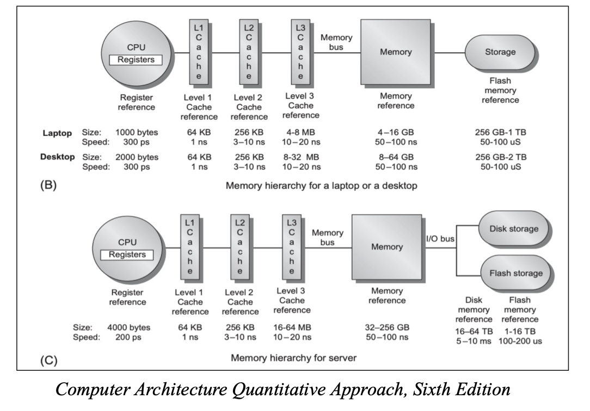

- Problem: **Putting everything in the stack frame can cause the memory traffic**
- Solution: **Hold as much of the frame as possible in registers**
    - (Some) function parameters
    - Function return address
    - Function return value
    - (Some) Local variables
    - (Some) Intermediate results of expressions (temporaries)

#### Using Registers: 参数传递

??? info "Tiger 的参数方式：Call-by-Value"
    - 实际参数的值被传递并作为形式参数的值确立。
    
    > 对形式参数的修改不会影响实际参数。

!!! warning "Problem: passing parameter stack causes memory traffic"
    Solution (现代机器的参数传递约定)：

    - The first k arguments ( k = 4 or 6) are passed in registers 
    - The rest are passed on the stack

虽然通过将部分参数传递到寄存器中可以减少内存流量，但是这种方法也有一些问题 : **extra memory traffic caused by passing arguments in registers!**

Solution: **"Saving" the status of registers**

??? info "More about Register Saving Conventions"
    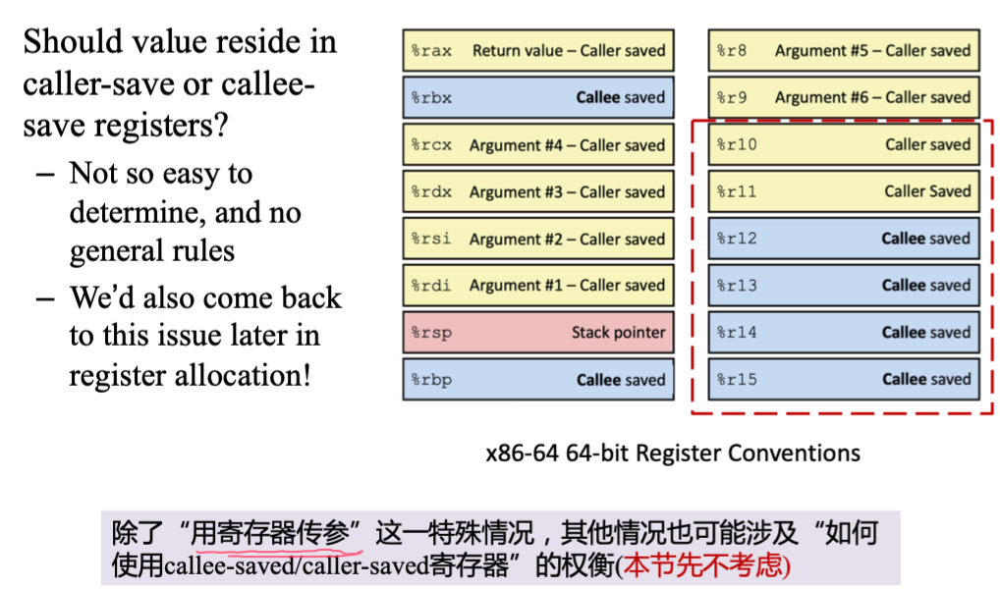

考虑一种场景:

```c linenums="1" hl_lines="1 3 5"
f(int a) {
    int z = ...
    h(z);
    ...
    int t = a + 1;
    ...
}
```

- 假如 `f` 从寄存器 `r1` 中得到参数 `a`，随后通过寄存器 `r1` 将 `z` 传递给 `h`
- 那么 `f` 在调用 `h` 之前需要保存 `r1` 的状态，以便在调用 `h` 之后恢复

如何避免 `extra memory traffic` 呢？

1. 如果在 `f` 中调用 `h` 之前，`a` 已经是一个 `dead variable`，那么就不需要保存 `r1` 的状态 (比如，不存在第五行，**那么就需要对代码预先做分析**)
2. 也可以使用 `global register allocation`: 不同的函数使用不同的寄存器组，这样就不需要保存寄存器状态 (例如，`r1` 可以用于 `f`，`r2` 可以用于 `h`)
3. Leaf procedures (没有调用其他函数的函数) 可以不保存寄存器状态
4. 使用 `register windows` (SPARC)：每个函数调用可以申请一组新的寄存器，这样就不需要保存寄存器状态

#### Using Registers: Others

**1) 对于返回地址：**

- 在现代机器上，调用指令只是将返回地址放到指定的寄存器中；
- nonleaf procedures 必须将其写入堆栈（除非使用了 interprocedural register）, 叶子过程则不需要

**2) 对于返回值：**

- 通常情况下，返回值被 callee 放在指定的寄存器中

**3) 对于 Locals and Tempories:**

- 一些局部变量和临时变量（如表达式的中间结果）可以放在寄存器中，以减少内存流量

> 在寄存器分配一节中详细讨论关于局部变量和临时变量的问题

### Frame-Resident Variables

<!-- !!! question "很多地方都可以用寄存器，还需要在 stack frame 中分配内存空间吗？" -->

A variable **will be allocated in stack frames because:**

- It is *passed by reference*，因此他必须要有一个内存地址
- Its *address is taken*, 例如，通过 `&` 操作符
- It is accessed by a procedure nested inside the current one; | 它通过当前程序中嵌套的程序来访问； 
- 这个值太大，无法放入单个寄存器中；  
- 该变量是一个 **数组**，需要进行地址运算来提取组件；  
- 保存变量的寄存器有特定用途，比如传递参数（如上所述）；  
- 局部变量和临时变量太多，导致“溢出” （将在讨论寄存器分配时详述）

??? note "逃逸情况"
    The variable **escapes**[^1] for any of the reasons:

    - 通过引用传递，因此它必须有一个内存地址；
    - 它的地址被获取，例如，在C语言中是 `&a`；
    - 它被当前函数内部的嵌套过程访问。
    
    ??? example
        **pass-by-reference** (在 Pascal 中支持，但 Tiger 不支持)：

        - 真实的变量位置传递；
        - 对形式参数的引用隐含着访问实际参数值的间接访问。
        - 对形式参数的修改确实会改变实际参数！
    
[^1]: 通俗来讲，当一个对象的指针被多个方法或线程引用时，则称这个指针发生了逃逸。逃逸分析决定一个变量是分配在堆上还是分配在栈上。

### Block Structure

> Tiger 语言嵌套函数的实现

#### Static Link (重点)

使用 **static link** 的动机源自于 **block structure** 的实现

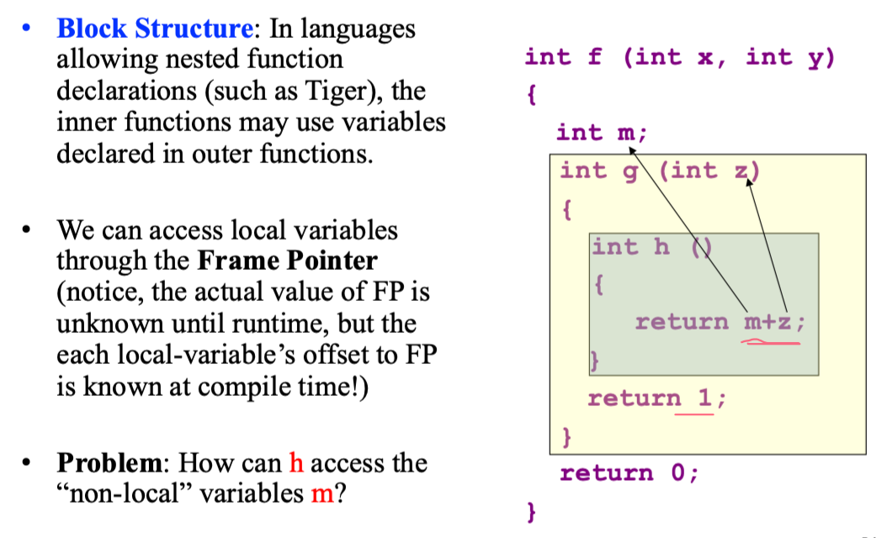

!!! abstract
    Whenever a function g is called, it can be passed a pointer to the frame of the function statically enclosing g; this pointer is the static link. | 每当函数 g 被调用时，可以传入一个指向静态包围 g 的函数帧的指针；这个指针就是静态链接。

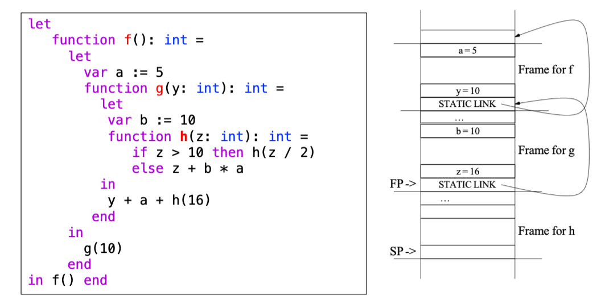

考虑上图，Static Link -> 每当函数 g 被调用时，它会接收到一个指针，该指针指向程序文本中立即包围 g 的 f 函数的最新活动记录｜Whenever g is called, it is passed pointer to most recent activation record of f that **immediately encloses g in program text**

> The static link is a pointer to the activation record of the enclosing procedure

**可以使用 static link 访问 non-local data**:

- 每个函数标有其嵌套深度
- 当深度为 n 的函数访问深度为 m 的变量时，生成代码以向上爬 n-m 层 link，以访问合适的活动记录

??? example
    === "C"
        ```c
        int f (int x, int y)
        {
            int m;
            int g (int z)
            {
                int h ()
                {
                    return m + z;
                }
                return 1;
            }
            return 0;
        }
        ```
    === "static link"
        ```c
        int f(link, int x, int y)
        {
            int m;
            int g(link, int z)
            {
                int h(link)
                {
                    return link->prev->m + link->z;
                }
                return 1;
            }
            return 0;
        }
        ```

??? info "优缺点"
    - 优点：
        - Little extra overhead on parameter passing
    - 缺点：(主要是 climb up link 的开销)
        - 需要为每个变量访问建立一系列间接内存引用
        - 间接引用的数量等于变量声明函数和使用函数之间的嵌套深度差
        - 函数可能深嵌套！

#### Lambda Lifting

!!! abstract
    When f calls g, each variable of f that is actually accessed by g (or by any function nested inside g) is passed to g as an extra argument. This is called lambda lifting. | 当函数f调用函数 g 时，f 中被 g（或 g 内部嵌套的任何函数）实际访问到的每个变量，都会作为额外的参数传递给 g。这被称为 Lambda Lifting。

- 当函数 g 调用 f 时，f（或 f 内部嵌套的任何函数）实际访问的 g 中的每个变量都会作为额外参数传递给 f。
    - 通过将非局部变量视为形式参数来重写程序
- 转换过程从最内层的程序开始，逐渐向外层推进。

??? example
    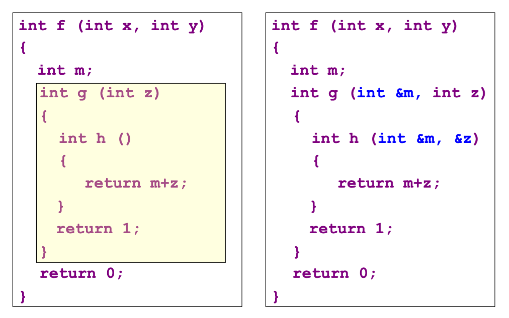

    > 具体实现应该是传地址

#### Display

!!! abstract
    A global array can be maintained, containing – in position i – a pointer to the frame of the most recently entered procedure whose static nesting depth is i. This array is called a display | 可以维护一个全局数组，其中在位置i存储最近进入的、静态嵌套深度为 i 的程序的帧指针。这个数组被称为显示体。

**Display: a global array of pointers to frames**

- 它记录了程序的词法嵌套结构
- 在位置i —> 指向最近进入的、静态嵌套深度为 i 的 procedure 的帧的指针
- 本质上，它指向当前设置的包含可访问变量的活动记录集合

??? example
    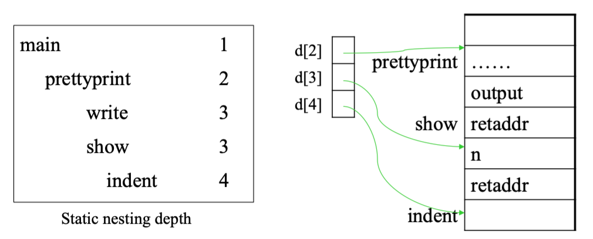

### Stack Frame in Tiger

!!! important "和之前提到的 Stack frame 可能有所不同，考试以这一部分为主"

!!! note inline "A Typical Stack Frame Layout for Tiger"
    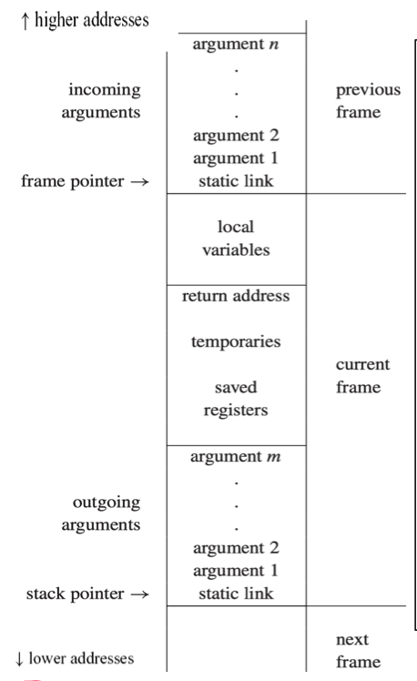

- *incoming arguments*: passed by the caller
- *return address*: where (within the calling function) control should return:
    - created by the CALL instruction
- some *local variables* are in this frame, other local variables are kept in registers
- *saved registers*: make room for other uses of the registers
- *outgoing argument*: pass parameters to other functions
- *static link*
- *Frame point* 为特定寄存器 (如rbp, SP)，其值为栈上的内存地址
    - 该地址的内存中所保存值是 stack link (某个函数的 frame point)

??? example "关于 incoming & outgoing arguments 的例子"
    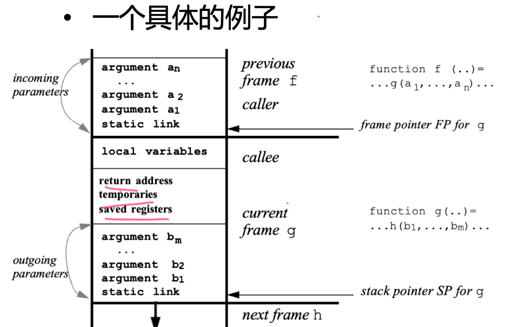

On each procedure call or variable access, a chain of zero or more fetches is required; the length of the chain is just the difference in static nesting depth between the two functions involved. | 在每次函数调用或变量访问时，可能需要零个或多个取值操作；这个操作链的长度正是涉及的两个函数之间静态嵌套深度的差值。

!!! important
    Static links may skip dynamic frames between f and g. They always point to the most recent frame of the routine that statically encloses the current routine. | 静态链接可能会跳过介于 f 和 g 之间的动态帧。它们始终指向当前程序被静态包含的最新帧。

??? info "Limitation of Stack Frame"
    - **Hard to support higher-order function**: 支持高阶函数较为困难, 涉及嵌套函数与函数作为参数及返回值的组合。
    - 在支持高阶函数的语言中，函数返回后可能需要保留局部变量。
    - 但到目前为止，我们假定函数 f 返回后局部变量不会被使用（所以我们使用栈来存储）
    
    | | Pascal; Tiger | C | ML; LISP; Haskell |
    | :--: | :--: | :--: | :--: |
    | Nested functions | Yes | No | Yes |
    | Procedure passed as arguments and results | No | Yes | Yes |

### 关于 Tiger 编译器中 Frame 的补充

TODO