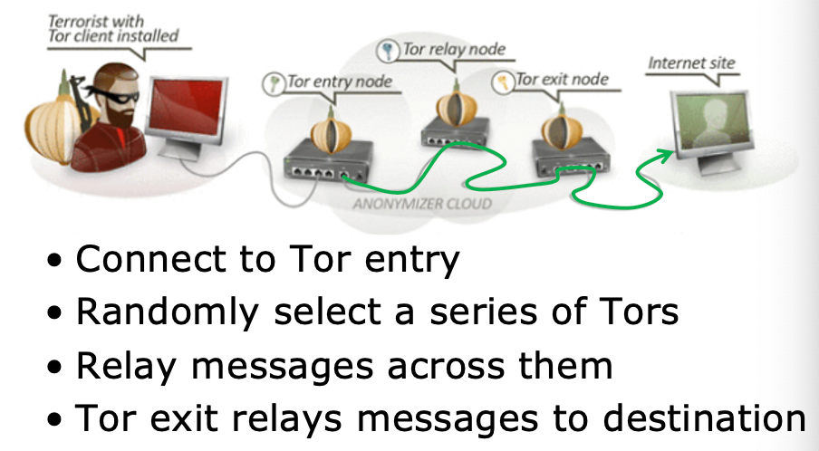
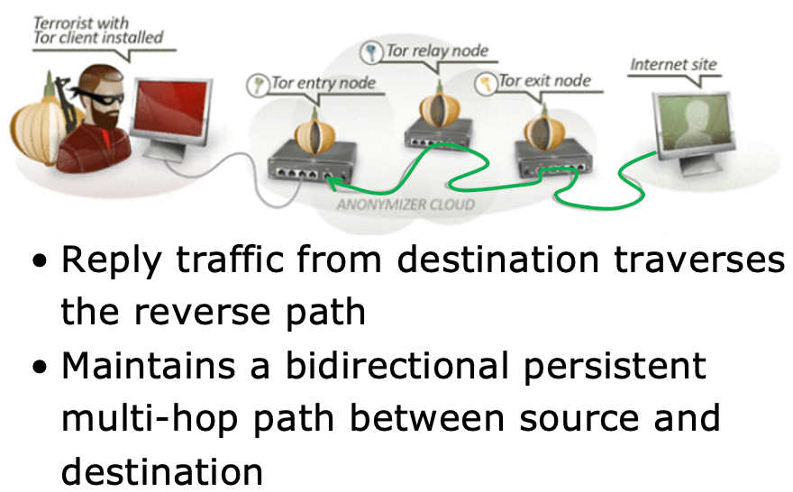
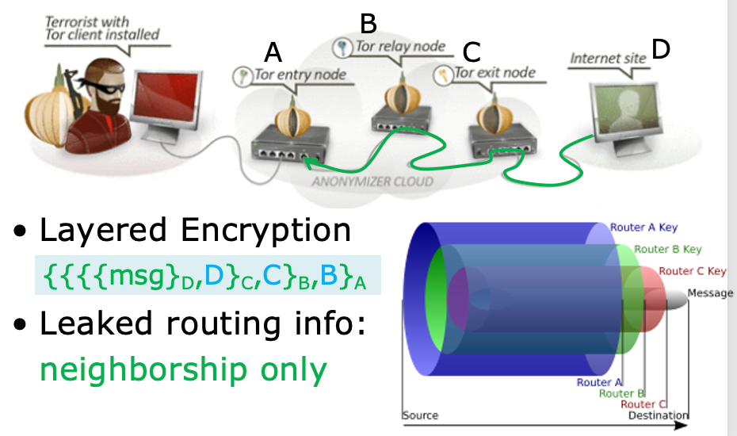
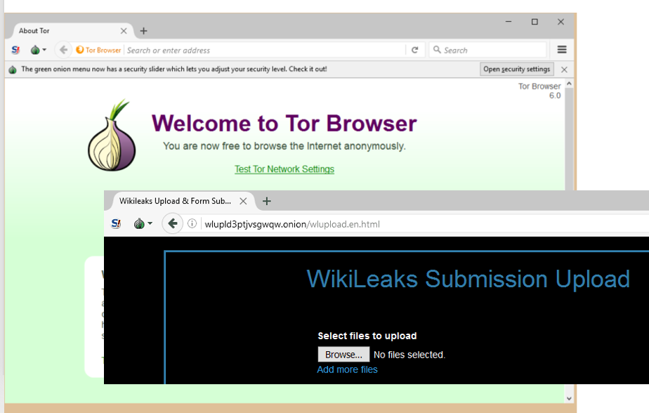
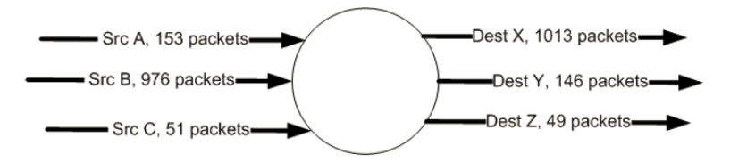
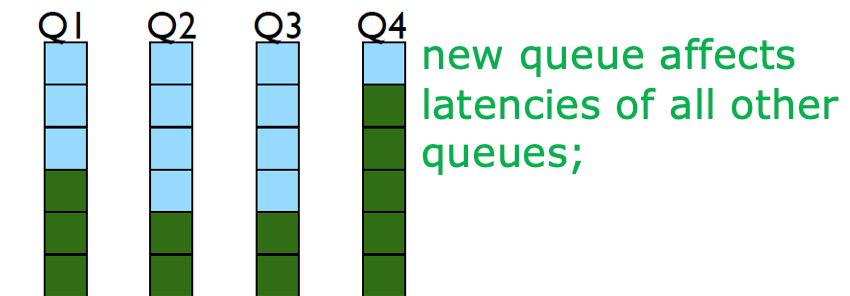
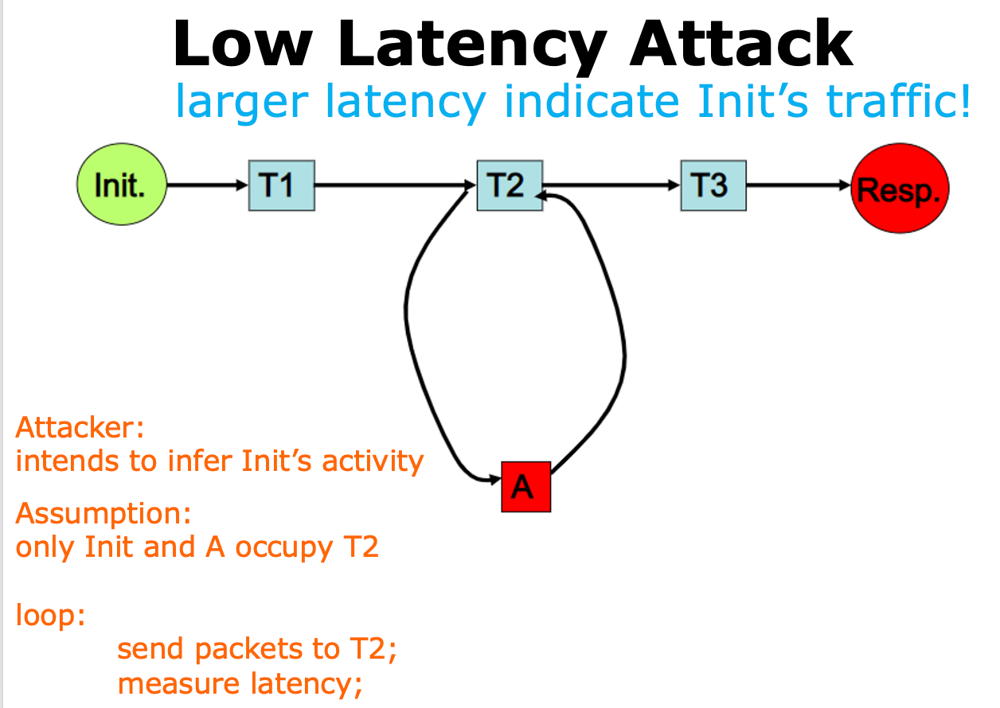

# Anonymous Communication

对于 Internet 中交流的双方 ip1 和 ip2, 如果有一个 attacker snooping on the communication, 尽管它可能不知道两个用户的身份，也无法知道他们被加密的通信内容。但它起码可以使用他们的 ip

> Because, for users to communicate via internet, their devices assigned with IP addresses, which are usually fixed within a communication session or more;
> 
> This can be used to infer critical privacy of users

??? note "Communication anonymity & privacy:"
    - who is communicating?
    - who are you talking to?
    - what type of activities?
    - what type of information?

**1) Why wanted?**

=== "Anonymity for Mortals"
    - Unmonitored access to health and medical information
    - Preservation of democracy: anonymous election/jury
    - Censorship circumvention: anonymous access to otherwise restricted information
=== "Anonymity for Attackers"
    Misbehaviors without getting caught: Terrorism, Darknet, Spam, Pirate...

**2) how to?**

通过加密（如 HTTPS）可以保护访问的内容；

> But even if we don’t know what you communicated, knowing with whom you communicated leaks a lot of information as well

Thus, we can **hide destination address**

But here comes another question: 

- According to routing, need to specify the ip address of destination to ensure packets being directed toward it,
- Then how to deliver packets to destination? $\rightarrow$ **RELAY!**

??? abstract "Relay"
    - Relay (中继) 常指一种网络设备或服务，可以用于 <u>转发</u> 数据包或信息, 以帮助连接不同的子网或网络。
    - 中继可以帮助解决网络通信中的距离限制和协议转换问题，进而扩大网络的覆盖范围和功能。
    - 中继可以分为物理中继和逻辑中继两种类型。
        - 物理中继是指一种网络设备或链路，它用于将数据包从一个物理网络转发到另一个物理网络。比如，网络交换机、路由器、网关等设备。
        - 逻辑中继是指一种软件或服务，它用于将数据包从一个逻辑网络转发到另一个逻辑网络。比如，代理服务器、VPN 网关、DNS 中继等服务。

Here comes **Overlay Communication**

## Overlay Communication

!!! abstract "Overlay Communication"
    - Overlay Communication（覆盖通信）是一种在网络中添加虚拟网络层的技术，用于改进网络性能和扩展网络功能。
    - 通过覆盖通信，可以在现有的网络架构上增加一个虚拟的网络层，这个虚拟层与底层网络相互独立，可以实现更高效、更安全和更灵活的通信方式。​

其中 ip3 是一个 relay node

### Overlay Network

覆盖通信的主要思想是，在应用层和传输层之间添加一个 **中间层**，这个中间层可以通过使用不同的协议、路由和拓扑结构来优化网络通信。

在覆盖通信中，应用程序会将数据包发送到覆盖网络中，然后由覆盖网络负责将数据包传输到目标地址，从而实现更快速、更可靠的通信。

!!! warning "Threat Model"
    这里定义攻击模型：Insider Byzantine Attacker

    - Insider 表示攻击者本身是网络的一部分（ASes, 攻击者可能控制不止一个 ASes）但攻击者没有能力知道整个网络 (limited view of network)
    - Byzantine 表示一种攻击模式，攻击者的的攻击行为是不稳定的（长期、一致的攻击会容易被发现，因此攻击者采取间断式的、不同方式的攻击，就比较难被检测到了）

    攻击者的目标是：在目的 IP 信息隐藏在数据包中的情况下，得知数据包的最终目的地。

由此提出两种攻击行为：

1. Traceforward Attack
      - passive attacker
      - traces messages from sender, thwarts receiver anonymity
      - 被动攻击者跟踪数据包信息
2. Marking Attack
      - active attacker
      - marks messages, discovers marked msg elsewhere
      - 攻击者比较厉害，可以改经过它的数据包，那可以加个标记，然后在其他地方发现就知道是发过来了

## Anonyminzing Proxy

- intermediary between sender & receiver
- Sender relays all traffic through proxy
- Encrypt destination and payload
- Asymmetric technique: receiver not involved (or informed of) anonymity

k: shared key of sender and proxy

1. 如果攻击者在 sender 和 proxy 之间监听，那么 sender 丧失了匿名性
2. 如果攻击者在 proxy 和 receiver 之间监听，那么 receiver 丧失了匿名性
3. 如果有两个攻击者，一个在 sender 和 proxy 之间，一个在 proxy 和 receiver 之间，两者串通比对 ingress 和 egress 的流量，则 sender 和 receiver 都丧失了匿名性
4. 如果 proxy 本身是恶意的，那么 sender 和 receiver 都丧失了匿名性

### what if receiver is attacker

> 需要保护发送者的匿名性

### 优缺点

- Advantages:
    - Easy to configure
    - Require no active participation of receiver, which need not be aware of anonymity service
    - Have been widely deployed on Internet
- Disadvantages:
    - Require trusted third party proxy may release logs, or sell them, or blackmail sender
    - Anonymity largely depends on the (likely unknown) location of attacker

### How to evade attackers?

> dynamic proxy location

Here comes **Crowds Algorithm**

- Basic idea: get lost in a crowd
- Jump from one crowd to another
- Members of a crowd called Jondos
- Algorithm:
    - Relay message to random jondo
    - With probability p, jondo forwards message to another jondo
    - With probability 1-p, jondo delivers message to its intended destination

### How to evade untrusted proxies?

**proxy ++**

多弄一些 proxy, 用于混淆攻击者的视线

Its hard for an attacker to **simultaneously** control too many proxies

Other methods: 

#### Source Routing

!!! abstract
    - specify on-path routers by source
    - allows a sender of a packet to partially or completely specify the route the packet takes through the network.
    - In contrast, in conventional routing, routers in the network determine the path incrementally based on the packet's destination

Source Routing / Path Addressing 允许发送者指定一个包的部分或者全部路由​

源路由技术中，数据包的路由路径是在数据包的头部中指定的，这意味着发送方可以选择数据包的路由路径，而不是让网络中的路由器根据它们的路由表来自动选择。

#### POF-based Source Routing

> POF: Protocol Oblivious Forwarding

传统的网络协议中，router 需要根据特定的协议来解析数据包的头部，然后根据协议的规则来转发数据包。而 POF 采用了新的转发机制（从数据包的源头开始指定全部或部分路由），即不需要了解任何特定协议，只需要根据指定路径进行转发。

=== "新的问题"
    匿名性问题：泄漏了 port sequence
=== "解决策略"
    隐藏非 neighbor 的 port sequence

为了隐藏非 neighbor 的 port sequence， 可以使用 Onion Routing

## Onion Routing

> Use onion router called Tor

=== "request"
    
=== "reply"
    

在洋葱网络中，信息被封装在加密层。

- 类似于洋葱一样，加密数据通过一系列 "Tor node" 路由器节点传输，每个节点只能解密一层，然后将数据传递给下一个节点。
- 当最后一个节点解密数据时，它将数据传递给目标地址，这样就实现了端到端的匿名通信。
- 由此，sender 保持了匿名性， receiver 也保持了匿名性。每个中继节点只知道紧邻的节点

??? info "source-routing based anonymous overlay communication"
    1. 向 directory node 获取节点列表，随机选择节点形成一条 chain
    2. 从 directory node 获取公钥，与 A (Tor entry) 协商密钥;
          1. A 与下一节点 B 协商密钥
          2. ...
          3. 最后节点 (假如是 C) 与目标地址 (D) 协商密钥，建立整条链的连接
    3. 发送 $\{\{\{\{\text{msg}\}_D ~, D\}_C ~, C\}_B ~, B\}_A$, 这样逐层解密才能发送到目标地址
    4. reply 的时候使用同一条反向即可

    > 解密出的数据除了信息外，还包括要 forward 的下一跳地址

???+ example "application: Darknet"
    - Portions of the Internet purposefully not open to public view or hidden networks whose architecture is superimposed on that of Internet.
    - Install Tor
    - Access darknet.onion through it
    
    

### how to deanonymize?

有四种思考策略：

1. tor nodes 互相串通
2. 强行破解密钥
3. Passive monitoring
4. Active attraction: 
      - deploy a Tor router;
      - attract Tor traffic;
      - perform traffic analysis and correlation;

#### Path Selection Attack

- Tor path selection algorithm:
    - weight nodes by selfreported bandwidth; | 通过自报带宽来对节点加权
    - select each node using weighted | 使用权重选择每个节点
    - probability distribution; | 概率分布
- Attack:
    - malicious relay reports very high bw to increase selection probability; | 恶意中继节点虚报非常高的带宽以增加被选中概率
    - if it controls the first hop, de-sender; | 如果控制了第一个 hop, 则 sender 丧失匿名性
    - if it controls the last hop,  de-receiver; | 如果控制了最后一个 hop, 则 receiver 丧失匿名性

#### Counting Attack

- Correlate incoming and outgoing flows by counting the number of packets | 通过计算数据包的数量来对入站和出站流量进行关联

> 在检测时间段，有可能有之前停留在其中的 packert, 所以 dest 会多一些也可能有些正在 process, 所以 dest 会少一些

- 一种抵御策略是：将流量较小的进行扩大，将流量较大的进行缩小，使得流量差异变小
- 但攻击者仍然可以通过采样包之间的时间间隔来进行分析

#### Low Latency Attack

- Tor router assigns each anonymous circuit its own queue | Tor 路由器为每个匿名电路分配一个队列
- Dequeue one packet from each queue in round-robin fashion | 以轮询方式从每个队列中出队一个数据包

节点越多，队列越长，轮询时间越长，延迟越大。

!!! example "Attack Example"
    

    - A 要攻击 Init, intends to infer Init's activity
    - 假设只有 Init 和 A 一起在占用 T2
    - 那么 A 循环给 T2 发包并测试延迟，如果延迟变大，则说明 Init Traffic，即 Init 在活动

#### Cross Site Attack

**Crawling**:

- Deploy Tor routers
- Access darknet
- Crawl transaction information
- Extract Bitcoin accounts of interest

**Correlation**:

- Search the accounts on public websites

## Some Questions

??? question "Why is current Internet communication vulnerable to anonymity or privacy leakage? "
    Because Internet uses IP address to identify a host, and each router on the path from source to destination needs to know about the exact IP address of the destination to make the routing decision. But the IP address itself as well as the communication source and destination can leak some anonymity and privacy, because knowing the existance of communication without the exact contents is enough to infer some information on the user, who is easy to find by its IP address.

??? question "In which scenarios do users require the communication anonymity or privacy as concerned in sub-question a?"
    There are cases where users try to access some medical, voting or other kind of information related to privacy. If one is known to usually access the website of a party or candidate, he is inclined to vote for the candidate, which is a privacy leakage. Also, when an attacker is trying to spy on or modify some data, he is also not willing to be known about his IP address, which can find him easily.

??? question "How to use proxies to secure communication anonymity? What are the possible limitations?"
    - The sender send message to the proxy instead of the destination, and the destination is encrypted and placed in the packet. The proxy will decrypt it and send the corresponding message to the destination. If the attacker sniffs between the sender and proxy, he will not know about the destination, and if it sniffs between the proxy and destination, he will not know about the source.
    - However, if the attacker sniffs both between the sender and proxy, and between the proxy and destination, the anonymity will fail. So will it fail in the case where the proxy itself is malicious.

??? question "How does Onion Routing provide a better guarantee for anonymity?"
    The proxy nodes are randomly selected and each node can only decrypt one layer and will encrypt when it pass to next node. Unless there are enough number of nodes collude with each other, they know nothing about the source or destination.

??? question "How to infer anonymity or privacy of Onion Routing traffic?"
    Each node only knows about the immediately preceding and following node in a relay. The source and destination of messages is obscured by layers of encryption. And because of the layers of encryption and randomization, none of the nodes can know whether the next and last node is the source or destination or not.

