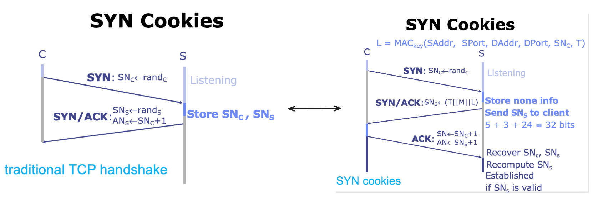
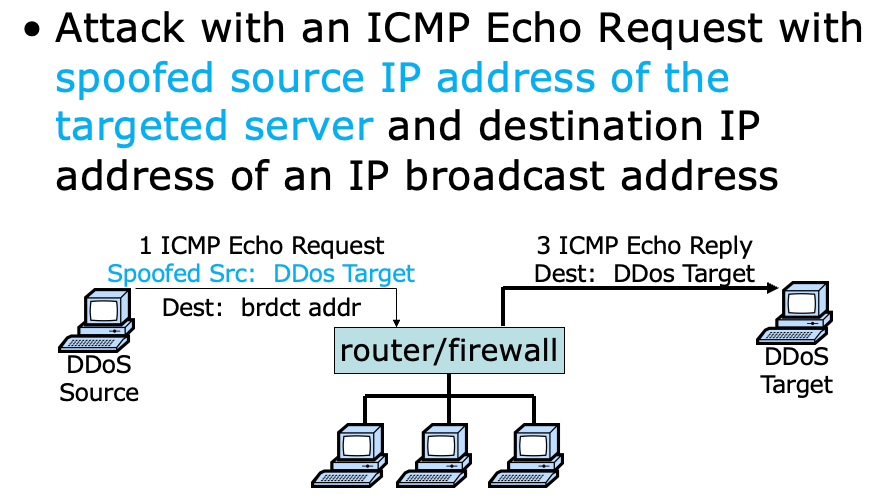
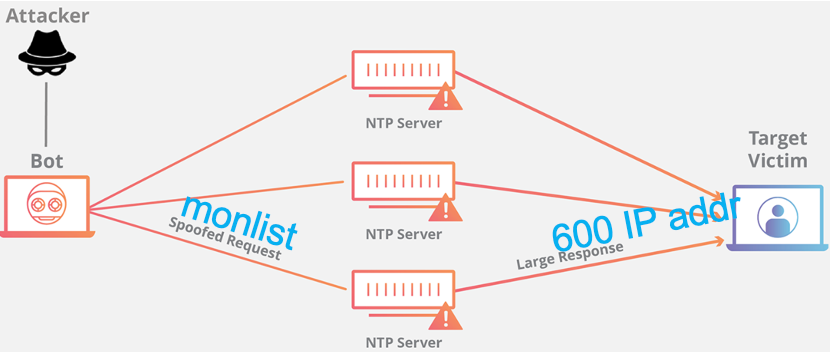
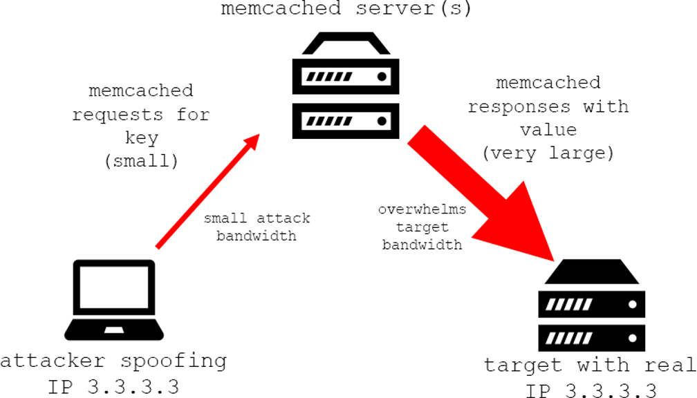
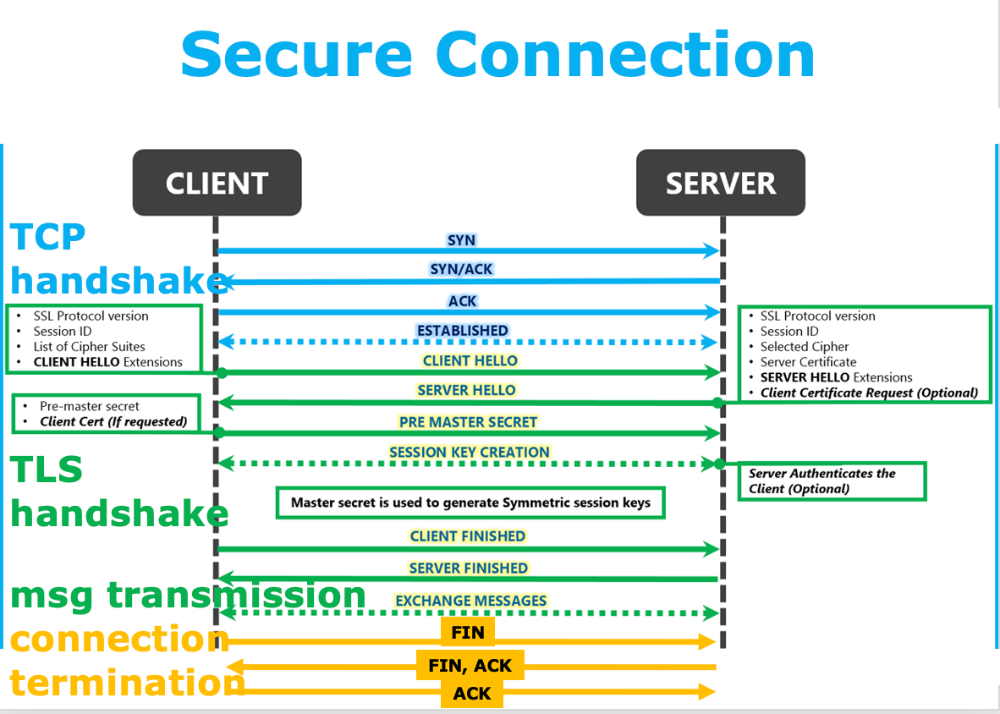

# DDos 

## Dos | Denial of Service

- **DoS** (Denial of Service) 攻击是一种网络攻击，目的是使目标系统或网络资源无法提供服务
- 即控制一个机器，向目标机器发送大量的请求以 overload 目标机器，使其无法处理合理的请求（e.g., 卖当劳派大量自家员工去坑德基点东西，但是不买单且处处刁难，使得坑德基无法正常服务真正的顾客）
- defence: block the attacking device

## DDoS | Distributed Denial of Service

> 在 DoS 攻击中，攻击者使用单个系统向目标系统发送大量请求。在 DDoS 攻击中，攻击者使用多个系统向目标系统发送大量请求。使得仅仅通过阻止攻击者的 IP 地址无法阻止攻击。

### Symmetric DDoS Attack

> the attacker requires a **substantial** amount of traffic to succeed.

#### Ping Flood

???+ abstract "Ping Flood"
    - Ping Flood 是一种网络攻击，它利用了 `ping` 命令来向目标主机发送大量的 `ping` 请求, 使目标主机不断地响应请求，从而导致网络拥塞和服务质量下降、使目标主机过载或崩溃。
    - Ping Flood 攻击通常是 DDoS 的一种形式.

**1) Attack principle:**

> 简言之：saturate the target device’s capacity by sending many ICMP echo request packets

- Exploit the ICMP protocol
- both incoming ICMP Echo Request and outgoing ICMP Echo Reply consume bandwidth;
- overwhelm the target device’s ability to respond to a high number of requests and/or overload the network connection with bogus traffic
- attacker sends a large number of ICMP echo request packets & target server sends an ICMP echo reply packet to each requesting device’s IP address as a response

2) Ping Flood DDoS 形式可以分解为两个重复的步骤:

- The attacker sends many ICMP echo request packets to the targeted server using multiple devices.
- The targeted server then sends an ICMP echo reply packet to each requesting device’s IP address as a response.

**3) 解决方法**

- disable the ICMP functionality of the targeted device (make the device unresponsive to ping requests and traceroute requests)
- 虽然很有效，但后果是所有涉及 ICMP 的网络活动都被禁用，包括网络诊断工具 `ping` 和 `traceroute`。

??? note "more about Ping Flood"
    - 在 Ping Flood 攻击中使用的互联网控制信息协议 (ICMP) 是网络设备用于通信的互
    联网层协议。
    - 网络诊断工具 `traceroute` 和 `ping` 都使用 ICMP 操作。通常情况下， ICMP 回波请求和回波回复信息用于 Ping 网络设备，目的是诊断设备的健康状况和连接性，以及发送者和设备之间的连接。
    - 一个 ICMP 请求需要一些服务器资源来处理每个请求和发送响应。该请求还需要传入
    信息（回音请求）和传出响应（回音响应）的带宽。

    - 历史上，attackers 通常会伪造一个假的ip地址，以掩盖发送设备
    - 在现代僵尸网络攻击中，恶意行为者很少认为有必要掩盖僵尸的 IP, 而是依靠一个由未被欺骗的僵尸组成的大型网络来使目标的容量饱和

#### <u>TCP SYN Flood</u>

???+ abstract "TCP SYN Flood"
    - TCP SYN Flood 是一种 DDoS 攻击，它利用了 TCP 协议的三次握手过程中的漏洞，通过向目标服务器发送大量的 TCP 连接请求，使目标服务器的资源耗尽，无法处理合理的请求。

!!! bug "攻击原理"
    - attacker 使用僵尸网络发送大量的 TCP 连接请求 (向目标服务器发送 TCP SYN 数据包，但不完成 TCP 三次握手过程)
    - 目标服务器收到 SYN 数据包后，会响应一个 SYN+ACK 数据包，等待客户端的 ACK 数据包。但由于 attacker 不会发送 ACK 数据包，因此目标服务器会一直等待，直到超时。
    - 服务器必须维护每个未完成的连接请求的状态，直到超时[^1]或关闭。即服务器会为每一个 SYN 数据包分配一些资源，并将其放入 SYN queue/ SYN backlog 中，等待客户端的 ACK 数据包。但这个队列的容量是有限的 (commonly set as 128 by default on some Linux systems), 一旦队列满了，服务器将不再接受新的连接请求。
        - 假设服务器的 SYN backlog 队列容量为 128，超时时间设置为 3 mins。攻击者每 3 分钟发送 128 个 SYN 数据包，服务器将一直等待，直到超时，而不会接受新的合法请求。

Single machine:

- SYN packets with random source IP addresses
- Fill up backlog queue on server
- No further connections possible

**1) Attack principle:**

- server commits resources (memory) before confirming identify of client (when client responds)

2) TCP SYN Flood 的改进: **IP Spoofing** : Craft SYN packets from randomly forged IP address

- SYN packets with random source IP addresses
- Fill up backlog queue on server
- No further connections possible

> For such random IP addresses, after they receive SYN ACK packets from the server, they may simply discard them as these IP addresses have not sent SYN requests at all

[^1]: Timeout: evict a backlog entry if no ack is received until timeout, e.g., 3 mins 

**3) Solution:**

1. increase backlog queue size
    - **but** attacker can sends more SYN packets!
2. decrease timeout 
    - **but** interrupt normal service requests!
3. **SYN Cookies**
    - Goal: avoid state storage on server until 3-way handshake completes
    - Idea: 
        - server sends **necessary states** to client along with SYN-ACK;
        - client sends these **states** back to server along with ACK;
    - 通过 SYN Cookies, server 可以在未验证每个连接请求之前不为其分配资源，从而免受 TCP SYN Flood 攻击的影响（但持续计算验证 SYN 也很消耗资源）

!!! note "SYN Cookies"
    - 在 client 发送给 server 的 SYN 包后，相比之前的 TCP handshake, server 不再保存 client 的 SN~C~ 包，而是将 client 的信息加密后发送给 client 自己的 SN~S~ 包，其中 SN~S~ = (T || M || L) (Total 32 bits)
        - T: 5-bit timestamp time() logically right-shifted 6 positions; 64-second resolution
        - M: 3-bit MSS (maximum segment size)
        - L: 24-bit keyed hash, L = MAC~key~ (SAddr, SPort, DAddr, DPort, SN~C~, T)
    - server 收到 client 发回的 ack 包后，复原 SN~C~ 和 SN~S~，之后核验 SN~S~ 即可判断是否是合法的 client

    

**4) TCP SYN Flood Backscatter:** 指 server 接收到 Spoofed IP 的 SYN 后发回的 SYN + ACK 包

- backscatter packets can be used for detecting DDoS attacks
- Detection Principle: Since syn flood uses **forged** source IP, then responses to those forged IPs get **no further responses**

### Asymmetric DDoS Attack

> A relatively small number or low levels of resources are required  by an attacker to cause a significantly great number or higher level of target resources to malfunction or fail.

#### Some Typical Examples

**1) Smurf Attack**

???+ abstract "Smurf Attack"
    - 又称 Smurf Dos 攻击，是一种早期的网络攻击方式，利用了 ICMP 协议的 "广播地址" 功能
    - 攻击者伪造目标主机的 IP 地址，向网络中的广播地址发送 ICMP Echo 请求，网络中的所有主机都会响应这个请求，从而使得目标主机被大量的 ICMP Echo 响应包淹没
    - Smurf Attack 通常是 DDos 的一种形式，可以使用多个网络节点进一步增强攻击强度和持续时间

- 特点：
    - Amplify the effect of ping flood
    - Exploit IP broadcast address
    - Forward the single ICMP Echo Request to any other hosts in the same network
    - Each host responds with an ICMP Echo Reply
    - 1 request but many replies
- 解决方法: 
    - Disable IP broadcast addresses on router and firewall (即禁用子网的 broadcast 功能)
    - Reject external packets to broadcast addresses (即拒绝外来的广播地址的请求)

??? example "How a Smurf Attack works:"
    - First the Smurf malware builds a spoofed packet that has its source address set to the real IP address of the targeted victim.
    - The packet is then sent to an IP broadcast address of a router or firewall, which in turn sends requests to every host device address inside the broadcasting network, increasing the number of requests by the number of networked devices on the network.
    - Each device inside the network receives the request from the broadcaster and then responds to the spoofed address of the target with an ICMP Echo Reply packet.
    - The target victim then receives a deluge of ICMP Echo Reply packets, potentially becoming overwhelmed and resulting in denial-of-service to legitimate traffic.

**2) DNS Amplification Attack**

???+ abstract "DNS Amplification Attack"
    - DNS Amplification Attack 是一种 DDoS 攻击，它利用了开放的 DNS 递归解析器来放大攻击流量，使目标服务器被大量的 DNS 响应包淹没
    - 攻击者伪造目标主机的 IP 地址，向开放的 DNS 递归解析器发送大量 DNS 查询请求，递归解析器会返回大量的 DNS 响应包给目标主机，从而使得目标主机被大量的 DNS 响应包淹没
    - 攻击者利用 DNS 查询特性，构造一个较小的查询请求，但会返回一个较大的 DNS 响应包，这种方式可以将攻击流量放大数倍

- 特点：
    - 利用 open DNS resolvers (互联网公开、任何用户均可访问的 DNS resolver)
    - 利用 `ANY` 类型的 DNS 查询，可以获取给定名字的所有类型的信息
    - Attack with an ANY-type DNS query with **spoofed source IP address of the targeted server**
    - Amplify the effect of DNS query
    - 1 request but many reponses

> - EDNS: Extension Mechanisms for DNS sends DNS data in larger UDP packets (e.g. 60 bytes query, 3000 bytes response)
> - Extension mechanism for DNS (EDNS, or EDNS(0)) gives us a mechanism to send DNS data in larger packets over UDP. 

- 解决：
    - reduce the number of open resolvers
    - source IP verification - stop spoofed packets leaving network (这需要 ISP 来实现)

??? note "一个 DNS 扩增"
    > A DNS amplification can be broken down into four steps:
    
    1. The attacker uses a compromised endpoint to send UDP packets with spoofed IP addresses to a DNS recursor. The spoofed address on the packets points to the real IP address of the victim.
    2. Each one of the UDP packets makes a request to a DNS resolver, often passing an argument such as “ANY” in order to receive the largest response possible.
    3. After receiving the requests, the DNS resolver, which is trying to be helpful by responding, sends a large response to the spoofed IP address.
    4. The IP address of the target receives the response and the surrounding network infrastructure becomes overwhelmed with the deluge of traffic, resulting in a denial-of-service.
    
**3) NTP Amplification Attack**

???+ abstract "NTP Amplification Attack"
    - 和 DNS Amplification Attack 类似，NTP Amplification Attack 也是一种 DDoS 攻击，它利用了开放的 NTP 服务器来放大攻击流量，使目标服务器被大量的 NTP 响应包淹没
    - 利用一些 NTP 服务器上启用的 `monlist` 命令，攻击者可以成倍放大攻击流量，该命令在旧设备上默认启用，并使用向 NTP 服务器发出请求的最后 600 个源 IP 地址进行响应。来自内存中有 600 个地址的服务器的 `monlist` 请求将比初始请求大 206 倍。这意味着一个拥有 1GB 互联网流量的攻击者可以进行 200+ GB 的攻击 —> 由此导致的攻击流量大幅增加。

    ??? info "网络时间协议"
        - NTP (Network Time Protocol) 是一种用于同步计算机时钟的协议，它可以使计算机的时钟与全球标准时间同步，以确保计算机的时钟准确无误。
        - NTP 的 `monlist` 命令可以返回 NTP 服务器的监控信息，这个信息包含了最近的 600 个客户端的 IP 地址，这个信息可以被利用来放大攻击流量

- 特点：
    - 利用 NTP servers
    - 利用 `monlist` command
    - spoofed source IP address of the targeted server
    - Amplify the effect of NTP query
    - 1 query but a large reponses

- 解决：
    - reduce the number of NTP servers that support monlist;
    - source IP verification - stop spoofed packets leaving network (这需要 ISP 来实现)

??? note "一个 NTP 扩增"
    > A NTP amplification can be broken down into four steps:
    
    1. The attacker uses a botnet to send UDP packets with **spoofed IP** addresses to a NTP server which has its monlist command enabled. The spoofed IP address on each packet points to the real IP address of the victim.
    2. Each UDP packet makes a request to the NTP server using its monlist command, resulting in a large response.
    3. The server then responds to the spoofed address with the resulting data.
    4. The IP address of the target receives the response and the surrounding network infrastructure becomes overwhelmed with the deluge of traffic, resulting in a denial-of-service.

**4) Memcached Attack**

???+ abstract "Memcached Attack"
    与所有 DDoS 放大攻击类似，利用了开放的 Memcached 服务器来放大攻击流量，使目标服务器被大量的 Memcached 响应包淹没

- Memcached 服务器是一种缓存数据的开源软件，可以用于提高 Web 应用程序的性能和响应速度。
- Memcached 服务使用 UDP，因此发送前并不需要握手（前面几个也一样）。攻击者预先加载一些信息，然后伪装成 victim 向 server 请求。

- 特点:
    - 利用 Memcached servers
    - 利用 memcached request (triggers a response with a large volume of data to target)

- Attack principle:
    - preload large data to Memcached server
    - spoof request to preloaded data from target
- 解决：
    - disable UDP on Memcached server
    - firewall Memcached server
    - source IP verification
    - `flush_all` command to Memcached server

??? note "一个 Memcached 攻击"
    > A Memcached amplification can be broken down into four steps:
    
    1. An attacker implants a large payload* of data on an exposed memcached server.
    2. Next the attacker spoofs an HTTP GET request with the IP address of the targeted victim.
    3. The vulnerable memcached server that receives the request, which is trying to be helpful by responding, sends a large response to the target.
    4. The targeted server or its surrounding infrastructure is unable to process the large amount of data sent from the memcached server, resulting in overload and denial-of-service to legitimate requests.

**5) SSDP Attack**

- 特点:
    - 利用 SSDP (Simple Service Discovery Protocol)
    - 利用 UPnP (Universal Plug and Play) 网络协议

> SSDP 攻击是一种利用 UPnP 协议的漏洞进行攻击的方式。UPnP 是一种网络协议，它允许设备自动发现并配置其他设备，从而实现设备的自动化交互。SSDP 是 UPnP 协议中的一个重要组成部分，它通过 UDP 广播的方式，在网络上发现和识别其他设备

- Attack principle:
    1. the attacker conducts a scan looking for plug-and-play devices that can be utilized as amplification factors
    2. as the attacker discovers networked devices, they create a list of all the devices that respond
    3. the attacker creates a UDP packet with the spoofed IP address of the targeted victim
    4. the attacker then uses a botnet to send a spoofed discovery packet to each plug-and-play device with a request for as much data as possible by setting certain flags, specifically `ssdp:rootdevice` or `ssdp:all`
    5. as a result, each device will send a reply to the targeted victim with an amount of data up to about 30 times larger than the attacker’s request
    6. the target then receives a large volume of traffic from all the devices and becomes overwhelmed, potentially resulting in denial-of-service to legitimate traffic

- 解决：block incoming UDP traffic on port 1900 at the firewall

#### Asymmetric DDoS Attack (Computation Resource)

!!! abstract "computation asymmetry"
    server costs more computation resources than attacker for a service request

**1) SSL/TLS Handshake**

??? info "SSL/TLS"
    - SSL (Secure Sockets Layer) 和 TLS (Transport Layer Security) 是一种用于保护网络通信的协议，它们使用加密技术来确保数据在网络上的安全传输。SSL 是 TLS 的前身，TLS 是 SSL 的升级版。
    - SSL/TLS 协议主要通过公开密钥加密技术 (Public Key Cryptography) 和 对称密钥加密技术 (Symmetric Key Cryptography) 来保护数据的机密性和完整性。
    - SSL/TLS 握手期间，服务器和客户端需要进行多次通信，进行加密解密操作，这些操作会消耗服务器的大量计算资源。攻击者可以利用这一点，通过发送大量的 SSL/TLS 握手请求来耗尽服务器的计算资源

    ???+ note "SSL/TLS Handshake"

        

- Attack principle:
    - Exploit SSL/TLS handshake requests to drain server resources
    - RSA-enc speed $\approx$ 10 $\times$ RSA-dec speed
    - Single machine can bring down 10 web servers

> SSL Flood 或 SSL Renegotiation Attack 会利用服务器端协商安全 TLS 连接所需的处理能力。它要么向服务器发送大量垃圾数据，要么不断要求重新协商连接，从而使服务器资源超出极限，导致服务器脱机。

<ul>
    <li>解决：</li>
        <ul>
            <li>限制来自同一 IP 地址的请求</li>
            <li>使用防火墙过滤器来阻止恶意流量</li>
            <li>使用 SSL 加速器来提高服务器的处理能力</li>
            <li>使用负载均衡器来分散流量</li>
            <li>还可对系统进行优化，以提高其处理能力，如增加 CPU、内存等</li>
        </ul>
</ul>

**2) HTTP Flood**

!!! abstract "HTTP Flood"
    - HTTP Flood 是一种 DDoS 攻击，它利用了 HTTP 协议的漏洞，如 HTTP 请求中的虚假信息、HTTP 请求中的合法信息超过服务器的处理能力等
    - 攻击者通过大量的 HTTP 请求向目标服务器发送大量无效请求，从而耗尽服务器的资源，使目标服务器无法处理合法的请求

!!! warning "No IP Spoofing"
    - 不使用 IP Spoofing
    - 因 HTTP Flood 需要 TLS，TLS 需要保证返回的 source IP 是自己的 IP

- Command attackers to:
    - Complete the real TCP connection
    - Complete the real TLS handshake
    - Get/POST large image or other content

!!! note "HTTP attack"
    === "HTTP GET attack"
        - multiple computers or other devices are coordinated to send multiple requests for **images, files, or some other asset** from a targeted server. 
        - When the target is inundated with incoming requests and responses, denial-of-service will occur to additional requests from legitimate traffic sources.
    === "HTTP POST attack"
        - typically when a form is submitted on a website, the server must handle the incoming request and push the data into a persistence layer, most often a database. 
        - **The process of handling the form data and running the necessary database commands** is relatively intensive compared to the amount of processing power and bandwidth required to **send the POST request.**
        - 这种攻击利用了相对资源消耗的差异，直接向目标服务器发送大量 POST 请求，直到服务器容量饱和并出现拒绝服务。

- 解决：
    - block or rate limit attacking source
    - Rate control against large volume of traffic that occupies a long connection

**3) Fragmented HTTP Flood**

!!! abstract "Fragmented HTTP Flood"
    - 在这个攻击示例中，具有有效 IP 的 BOT 被用来与网络服务器建立有效的 HTTP 连接。然后，HTTP 数据包被机器人分割成小片段，并在超时前尽可能慢地发送到目标。通过这种方法，攻击者可以长时间保持连接活动，而不会向任何防御机制发出警报。
    - 攻击者可以使用一个 BOT 启动多个未被发现的、长时间的和消耗资源的会话。Apache 等常用网络服务器没有有效的超时机制。这是一个 DDoS 安全漏洞，只要利用几个 BOT，就能阻止网络服务；

- 特点：
    - Establish a valid HTTP connection
    - Split HTTP packets into tiny fragments
    - **Send fragments to the target as slowly as it allows before it times out**

> keep a resource-consuming connection active for a long time

- 解决：
    - 限制每个连接的最大持续时间
    - 使用防火墙过滤器来阻止恶意流量
    - 使用负载均衡器来分散流量
    - 对系统进行优化，以提高其处理能力，如增加 CPU、内存等

**4) Payment DDoS**

!!! abstract "Payment DDoS"
    - 攻击者向在线支付系统发送大量虚假支付请求，从而耗尽支付系统的资源，使其无法处理合法的支付请求，给商家和消费者带来经济损失
    - 攻击者常利用大量僵尸网络节点，向支付系统发送大量虚假支付请求，这些请求中包含大量无效信息，如虚假信用卡信息、虚假支付金额等。但是，由于支付系统需要验证每个支付请求，这些无效信息会耗尽支付系统的资源，使其无法处理合法的支付请求

- 特点：
    - low rate at each merchant
    - high rate at acquiring bank
- 解决：商家和支付系统可以使用防欺诈系统来检测和阻止虚假支付请求、使用防火墙过滤器来阻止恶意流量、加强用户身份验证等

#### Asymmetric DDoS Attack (Others)

## Some Questions

??? question "What is the difference between DoS and DDoS?"
    - DoS attack - Denial of Service attack. The attacker overload victim by exhausting its resources (bandwidth, computing resources or queue spaces), making it unable to response for some normal legal requests.
    - DDoS attack - Distributed DoS attack. The attacker use a large amount of devices to perform DoS attack on a victim, in the same way and for the same results. 
    - The difference is that, DDoS attackes are performed by many devices which are usually in different subnets. If DoS attack is performed by a single device, the victim can easily defend it by blocking its IP or subnet, but as for DDoS attack, the attacking devices are widely distributed, so it's kind of hard to defend.

??? question "How does the TCP SYN Flood attack work?"
    When we send a SYN (1st handshake) to the victim, it will allocate some resources to save informations like the SEQ of the coming packet, and this packet will be pushed into SYN queue (SYN backlog). However, the SYN queue is small, normally 128 entries. If the attacker only send SYN but not response to the SYN+ACK (2nd handshake) segment, then the SYN packet will be stored in the queue until the time is exceeded, which is normally 3 minutes. So if the attacker send no less than 128 SYN packet each 3 minutes without responsing to any SYN+ACK packet, the SYN backlog of the victim will always be full and the legal requests of other devices will not be fulfilled, resulting in a Denial of Service.

??? question "How does the solution of SYN Cookies against TCP SYN Flood attacks work?"
    We can see from the principle of TCP SYN Flood that, the weakness is the limitation of SYN queue. The aim of this queue is to store the information of the coming SYN packets, so we can find ways to avoid this kind of storage. Instead, SYN Cookies try to hide the information of the SYN packets into the SYN+ACK packet. As we know, the 3 steps of TCP handshake is to exchange their initial sequence, which is related to time. But if SYN Cookies is used, the sequence of SYN+ACK packet sent by the server is a digest of the data of SYN packet and other information like time. When the ACK (3rd handshake) comes, it can check its acknowledge number and know whether it is legal. In this way, the SYN queue is not needed, so the TCP SYN Flood attack will not work.

??? question "How does the DNS Amplification Attack work? How to defend against it?"
    - DNS Amplification Attack uses open DNS resolvers, which provide an open DNS service for all internet users. The attacker uses a spoofed IP address which is actually the IP address of the victim to send a query to the open DNS resolver, and it will send a response to the victim. There is a kind of DNS request `ANY`, which will return all types of information of a given name, which is a huge amount of data. 
    - Defense: reduce the number of open DNS solvers, or disable the `ANY` request of them, or use techniques like ingress filtering, or disable UDP service of the victim.

??? question "How does Memcached attack work?"
    Memcached attack uses memcached servers, which provide (distributed) cache service for speeding up website accessing. Memcached services also use UDP so there is no need to setup a connection. The attacker pre-load the memcached server with some related information with methods like accessing it, and then send a request to the memcached server with spoofed IP address which is actually the IP address of the victim. The server will then send a very large amount of data to the victim, and the victim will be overwhelmed.

??? question "What is the difference between HTTP Flood and Fragmented HTTP Flood?"
    - HTTP Flood mainly exhausts the server by GET or POST some large contents, and the server will need to take them from or store them into database, which is time consuming; the server may also need to encrypt or decrypt the contents, which will consume the computing resources of the server.
    - Fragmented HTTP Flood trys to split a HTTP segment into many small fragments, and to send it very slowly but not exceed the timeout, so that the server will always keep the connection which is resource consuming.

??? question "Why is Fragmented HTTP Flood relatively more challenging to detect?"
    Because the content, traffic and source are very normal. For other DDoS attacks, there are useless large-scale data or abnormal requests, which is easy to detect. But Fragmented HTTP Flood looks just like a normal user.

??? question "How does Ingress Filtering work?"
    Ingress Filtering asks the source ASes to check each packet before routing them on the public net whether the source IP address is in the subnet of the outcoming AS. If not, this packet should not be routed.

??? question "How does IP Traceback work?"
    - Some information should be added into the packet so that the receiver can check whether the path is valid.
    - The easiest way is to add all the path information into the packet, but it will make the packet too large.
    - Another way is use edge sampling, by using propability, each packet will sample different routers on the way as well as a distance to the sampled router. As a session will normally send many packets, we can restore she whole path.