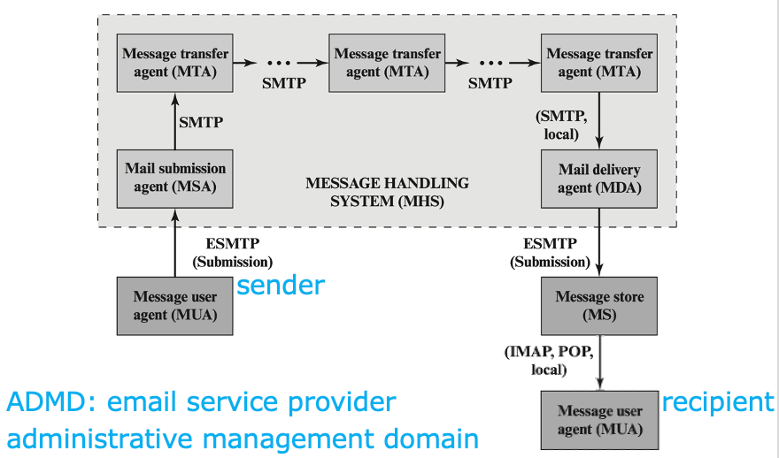
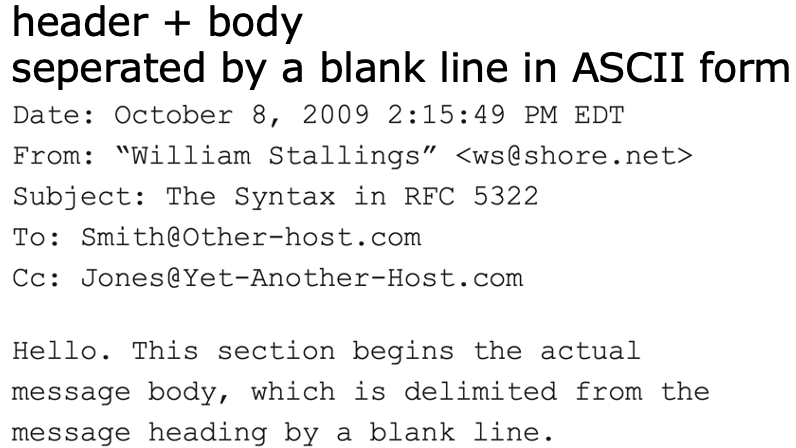
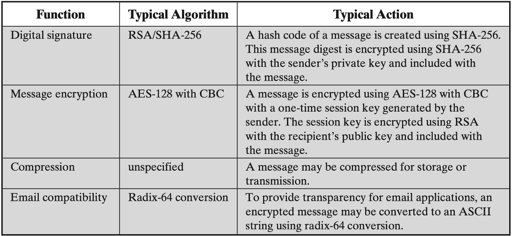
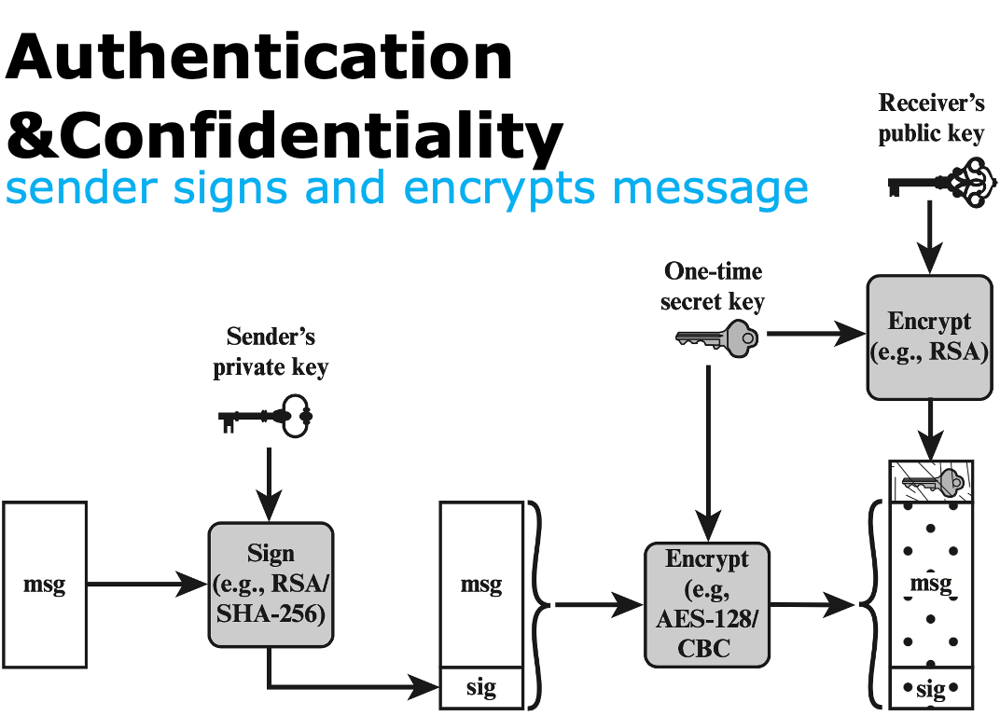
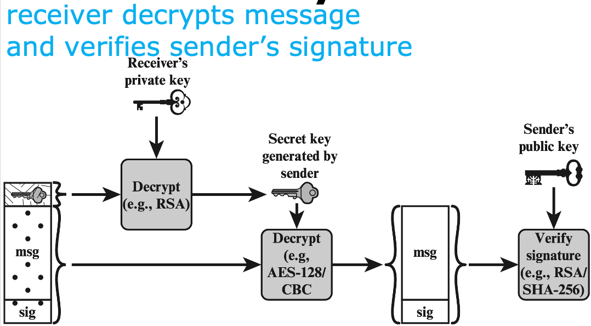
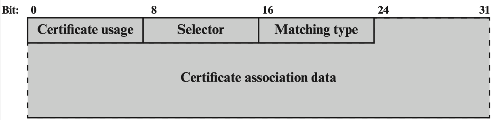
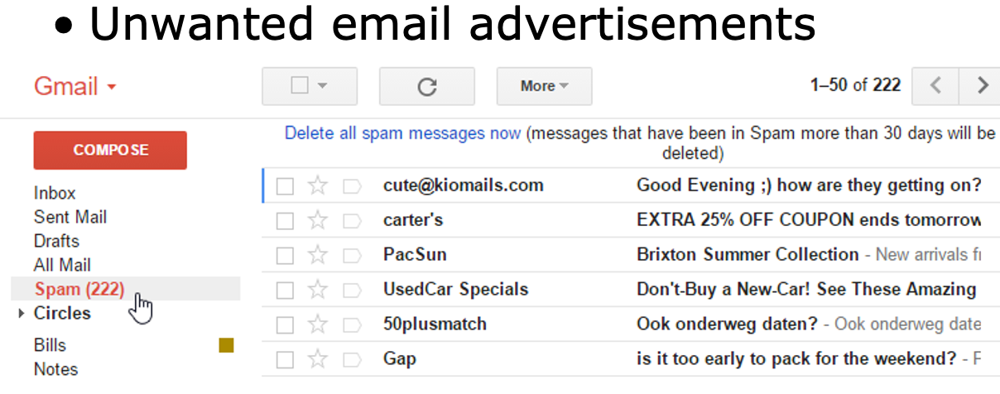
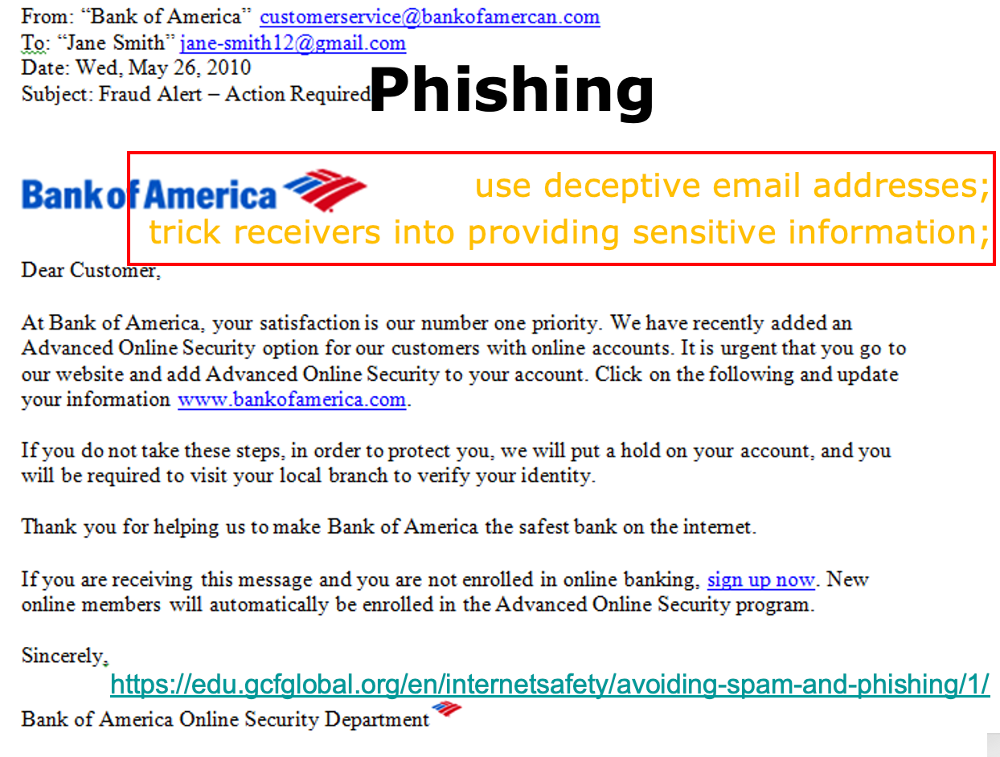
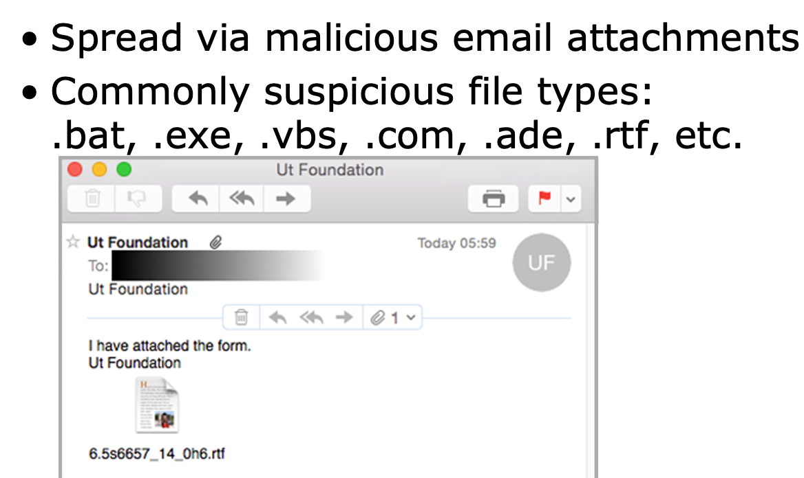

# Email Security

## Email Architecture

???+ note "MUA (Message User Agent)"
    - hosted on a client email program or a local network email server;
    - sender MUA formats a message and performs initial submission into MHS via an MSA (Mail Submission Agent);
    - recipient MUA processes received email for storage and/or display to the recipient user

???+ note "MHS (Message Handling Service)"
    - composed of MTAs (Message Transfer Agents);
    - accepts a message from sender and delivers it to one or more recipients;
    - creates a virtual MUA-to-MUA environment;

**Email Protocol:**

- Type 1: SMTP (Simple Mail Transfer Protocol)
    - move messages through the Internet from source to destination;
- Type 2: IMAP (Internet Message Access Protocol) and POP (Post Office Protocol)
    - transfer messages between mail servers

> POP3 downloads the email from a server to a single computer, then deletes the email from the server. IMAP stores the message on a server and synchronizes the message across multiple devices

??? info "Email Format"
    - RFC 5322
        - view messages as having an envelope and contents;
            - envelope contains whatever information needed to accomplish transmission and delivery;
            - contents compose the object to be delivered to the recipient;
        - RFC 5322 applies only to the contents;
        - the content standard includes a set of header fields that may be used by the mail system to create the envelope; 
    - MIME (Multipurpose Internet Mail Extensions)
        - extend RFC 5322 with enhancements;
        - Define five new header fields to provide information about message content
        - Standardize representations that support multimedia electronic mail
        - Define transfer encodings that enable the conversion of any content format into a form that is protected from alteration by the mail system 

    ??? info "MIME Header"
        - MIME-Version
        - Content-Type
        - Content-Transfer-Encoding
        - Cotent-ID
        - Content-Description

## Email Security Threats

- Authentication-related Threats
    - could result in unauthorized access to an email system 
- Integrity-related Threats
    - could result in unauthorized modification of email content 
- Confidential-related Threats
    - could result in unauthorized disclosure of sensitive information 
- Availability-related Threats
    - could prevent end users from being able to send or receive email 

## S/MIME

Secure / Multipurpose Internet Mail Extension 

- Authentication | 认证
- Confidentiality | 保密
- Compression | 压缩 
- Email compatibility | 兼容

??? info
    

### Authentication

1. the sender creates a message
2. use SHA-256 to generate a 256-bit message digest
3. encrypt the message digest with RSA using the sender’s private key; append the result as well as the signer’s identity to the message
4. the receiver uses RSA with the sender’s public key to decrypt, recover, and verify the message digest

### Confidentiality

1. the sender creates a message and a random 128-bit number as a **content-encryption key** for this message only
2. encrypt the message using the content-encryption key
3. encrypt the content-encryption key with RSA using the receiver’s public key and append it to the message
4. The receiver uses RSA with its private key to decrypt and recover the content-encryption key 
5. use the content-encryption key to decrypt the message

???+ info "Authentication&Confidentiality"
    

    > All processes on the sender: including the process that the sender uses RSA and receiver’s public key to encrypt one-time secret key and append it to the encrypted message;

    

### Content Type

- Data：
    - inner MIME-encoded message content; may be encapsulated in the following types; 
- SignedData：
    - digital signature of a mesasge
- EnvelopedData
    - encrypted data of any type, and encrypted content-encryption keys for one or more recipients;
- CompressedData
    - data compression of a message

## PGP 

Pretty Good Privacy, **same functionality as S/MIME**，free and popular for personal use.

与 S/MIME 不同的是：

- Key Certification 
    - S/MIME uses X.509 certificates issued by CA or delegated authorities; | S/MIME 使用由 CA 或授权机构颁发的 X.509 证书
    - OpenPGP allows **users** to **generate** their **own OpenPGP public and private keys**, and then s**olicit signatures for their public keys from known individuals or organizations**
- Key Distribution 
    - OpenPGP does **not** include **the sender’s public key** with each message;
    - recipient needs to separately obtain **that from TLS-protected websites or OpenPGP public key servers;**
    - no vetting of OpenPGP keys, users **decide whether to trust on their own**

> NIST 800-177 **recommends the use of S/MIME** rather than PGP because of **the greater confidence in the CA system of verifying public keys**

## DANE

> If any of the hundreds of CAs operating on the Internet is compromised, the effects can be widespread.

The attacker can obtain the CA’s private key, get issued certificates under a false name, or introduce new bogus root certificates into a root certificate store. 

- DNS-based Authentication of Named Entities
- allow X.509 certificates to be bound to DNS names using **DNSSEC**

> - The purpose of DANE is to replace reliance on the security of the CA system with reliance on the security provided by **DNSSEC**.
> - Given that the DNS administrator for a domain name is authorized to give identifying information about the zone, it makes sense to allow that administrator to also make an authoritative binding between the domain name and a certificate that might be used by a host at that domain name. 

### TLSA Record

- TLS Authentication Record
- A new DNS record type defined by DANE
- Used for a secure method of authenticating SSL/TLS certificates
- Specify constraints on which CA can vouch for a certificate, or which specific PKIX [Public Key Infrastructure (X.509)] end-entity certificate is valid.  | 指定 CA 可以为证书提供担保的约束条件，或指定特定的 PKIX [Public Key Infrastructure (X.509)] end-entity 证书有效的约束条件。
- Specify that a service certificate or a CA can be directly authenticated in the DNS itself. | 指定可以直接在 DNS 中认证的 service certificate 或者 CA。

??? info "Format"
    

    - format of TLSA as it is transmitted to a requesting entity 
    - Certificate Usage:
        - define four different usage models, to accommodate users who require different forms of authentication 
        - PKIX-TA (CA constraint): Specifies which CA should be trusted to authenticate the certificate for the service
        - PKIX-EE (service certificate constraint): Defines which specific end entity service certificate should be trusted for the service 
        - DANE-TA (trust anchor assertion): Specifies a domain-operated CA to be used as a trust anchor 
        - DANE-EE (domain-issued certificate): Specifies a domain-operated CA to be used as a trust anchor
    - Selector
        - indicate whether the full certificate will be matched or just the value of the public key
    - Matching Type
        - indicate how the match of the certificate is made: exact match, SHA-256 hash match, or SHA-512 hash match
    - Certificate Association Data
        - represent the raw certificate data in hex format

### DANE For SMTP

> DANE (DNS-based Authentication of Named Entities)

- Targeted vulnerabilities:
    - attackers can strip away the TLS capability advertisement and downgrade the connection to not use TLS; 
    - TLS connections are often unauthenticated (e.g., the use of self-signed certificates as well as mismatched certificates is common)
- A domain can use the presence of TLSA as an indicator that encryption must be performed, thus preventing malicious downgrade
- A domain can authenticate the certificate used in the TLS connection setup using a DNSSEC-signed TLSA

### DANE For S/MIME

- Introduce a **SMIMEA DNS record** to associate certificates with DNS domain names
- Help MUAs to deal with domain names as specified in email addresses **in the message body** (rather than domain names specified in the **outer SMTP envelope** – purpose of TLSA) 

### SPF

> SPF (Sender Policy Framework)

- ADMDs (Administrative Management Domains) publish SPF records in DNS specifying which hosts/IP-addresses are permitted to use their names;
- receivers use the published SPF records to test the authorization of sending Mail Transfer Agents (MTAs) using a given “HELO” or “MAIL FROM” identity during a mail transaction;

> An SMTP client, after receiving the greeting message, will normally send an HELO or EHLO command: where the domain given is the fully qualified name (host+domain) of the sending client.

### DKIM

- sign email message by a private key of the administrative domain from which the email originates;
- at the receiving end, the MDA can access the corresponding public key via a DNS and verify the signature, thus authenticating that the message comes from the claimed administrative domain 

> MDA (Mail Delivery Agent) 
>
> - SPF lets receiving servers know the sending sources permitted to send email messages on your domain's behalf.
> - DKIM tells receiving servers that incoming messages purporting to come from your domain/organization must have a digital signature that matches the public key in your DKIM record.

- Difference from **S/MIME and PGP**:
    - S/MIME and PGP use the sender’s private key to sign the content of the message;
    - DKIM uses the private key of the domain where the sender locates;

## What if Email is exploited?

- SPam 
- Phishing 
- Malware 
