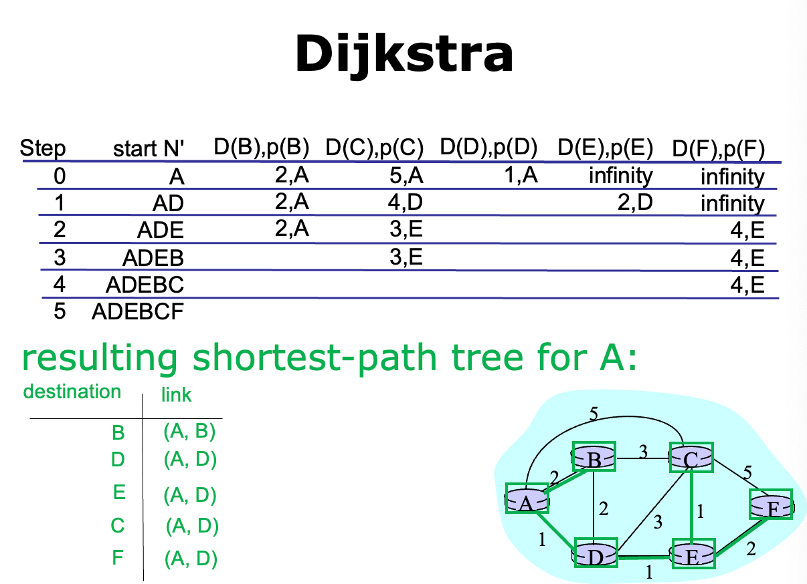
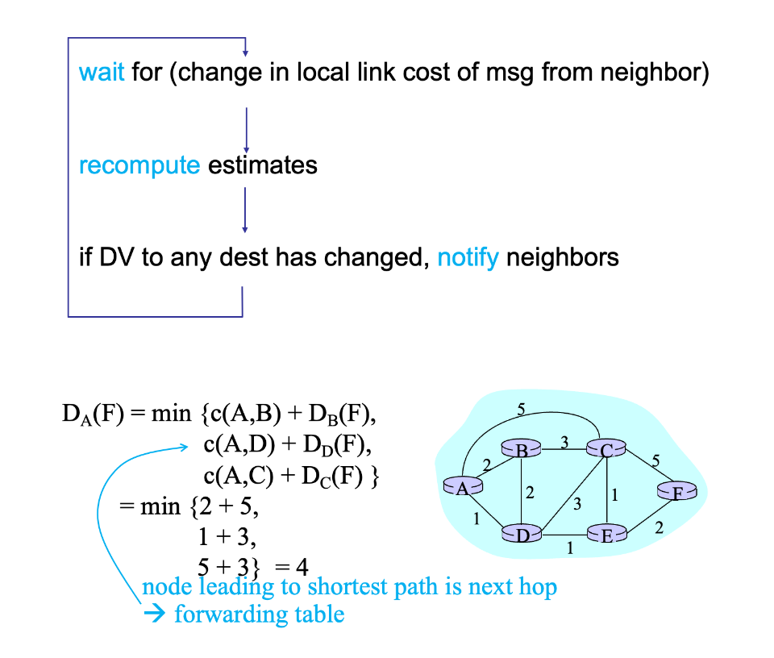
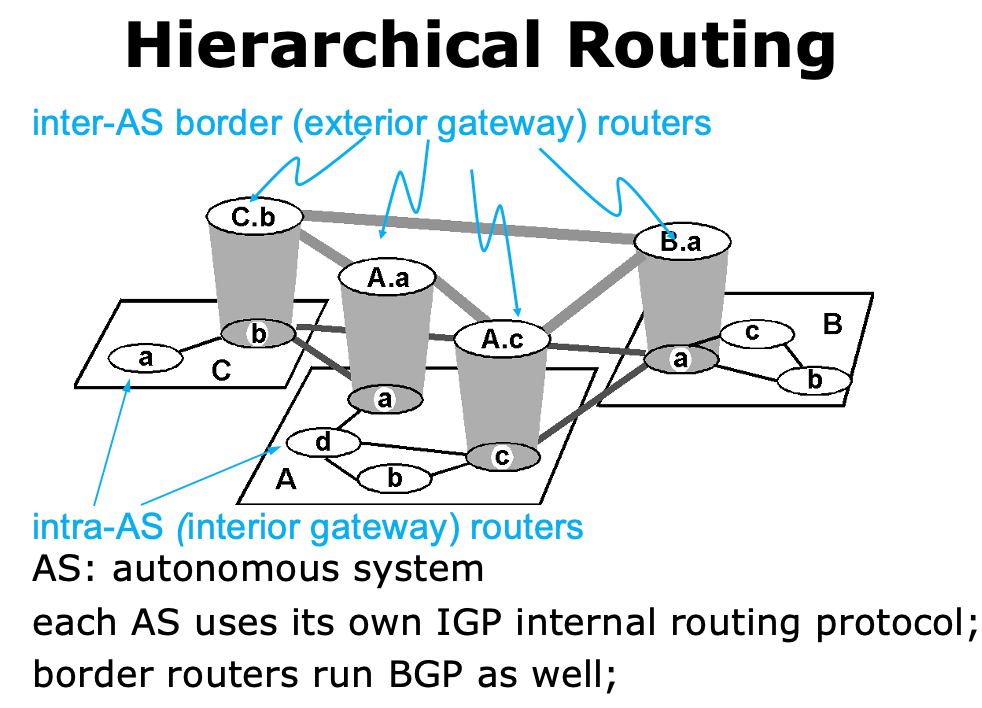
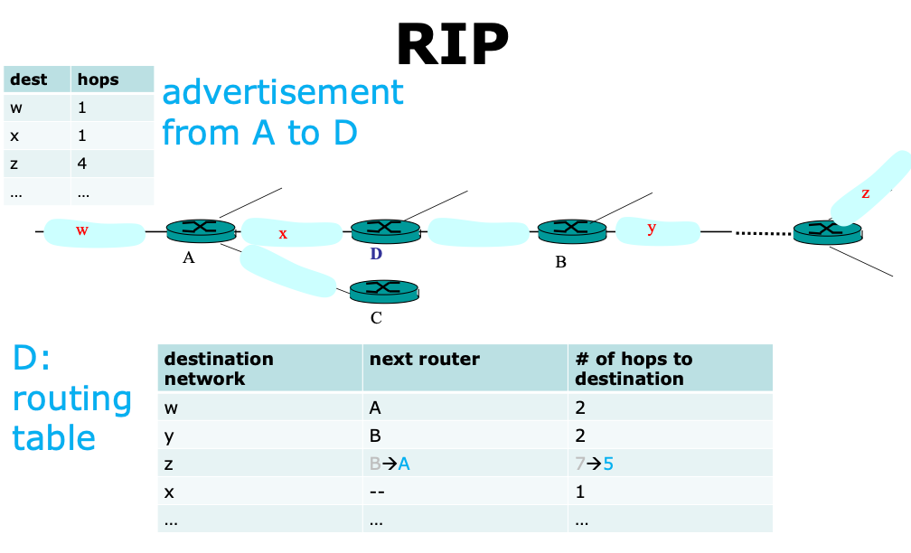
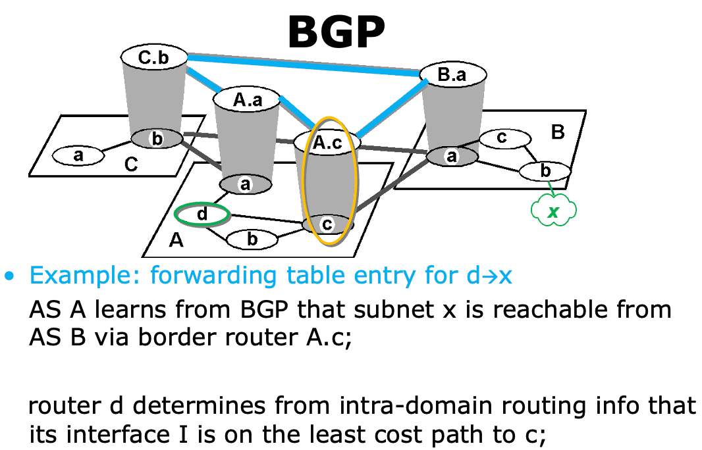
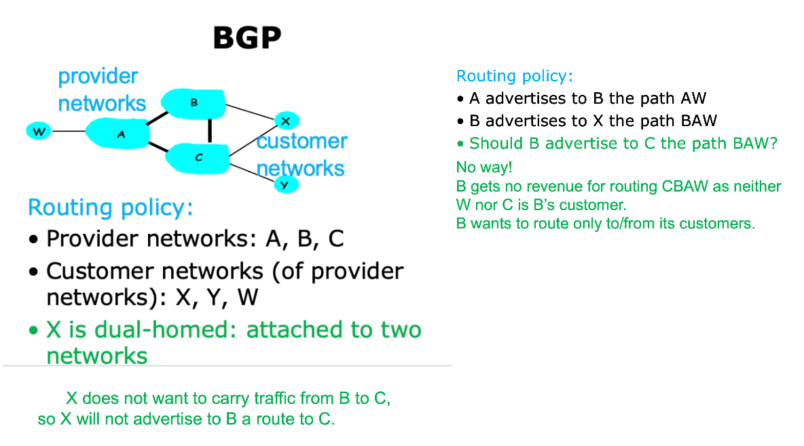
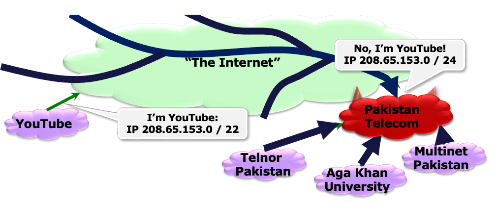
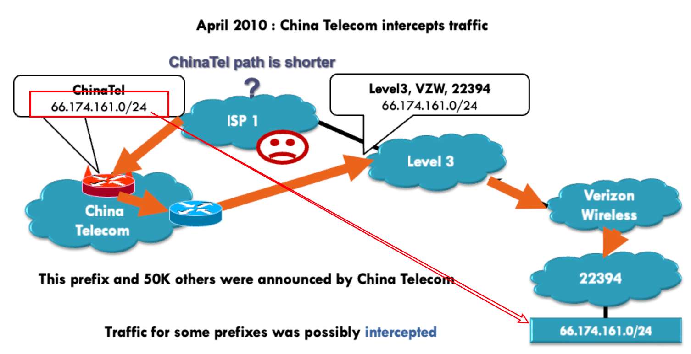
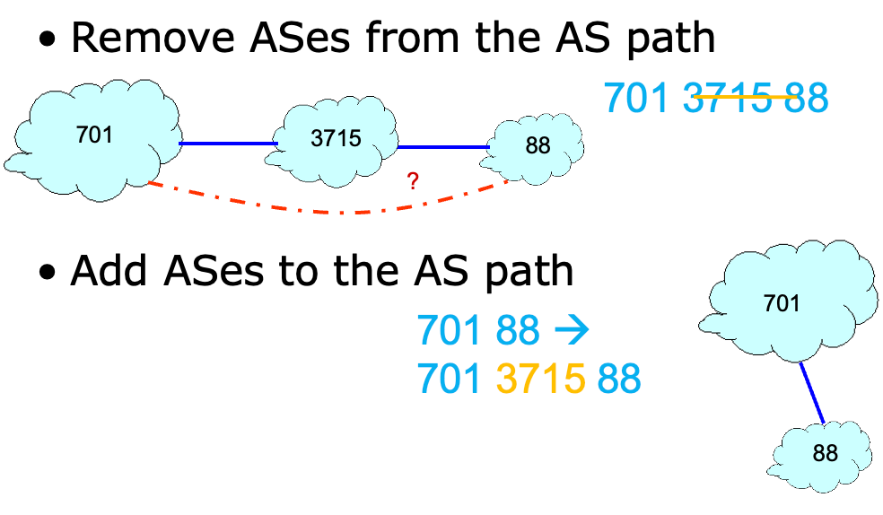

# Secure Routing

!!! bug "routing attacks"
    - distance-vector: announce 0 distance to all other nodes
    - link-state: drop links; claim direct link to other routers
    - BGP: announce arbitrary prefix; alter paths

Deliver Scheme:

- `unicast` delivers a message to a single specific node
- `broadcast` delivers a message to all nodes in the network
- `multicast` delivers a message to a group of nodes
- `anycast` delivers a message to any one out of a group of nodes, typically the one nearest to the source
- `geocast` delivers a message to a group of nodes based on **geographic location**

> Unicast is the dominant form of message delivery on the Internet. 

现在，我们的目标是将信息从一个节点传递到另一个节点，那么如何在它们之间找到一条可行的路径呢？

!!! success "This is the focus of a routing scheme."

Routing Scheme:

> **unicast** -> deliver msg to a single node

根据两个通信实体是否在一个自治系统内，有两种不同的路由选择方案：

- Intra-domain routing: inside an autonomous system (AS)
- Inter-domain routing: between different ASs

## Route Computation

### Link-state Algorithms

!!! abstract
    - 基于 Dijkstra 算法
    - each router knows **complete topology** and **link cost information**
    - independently run routing algorithm to calculate shortest path to each destination;

对于 Dijkstra：

- `c(i, j)`: link cost from `i` to `j` (equals $\infty$ if unknown)
- `D(v)`: current value of cost of path from source to destination `v`
- `p(v)`: predecessor node along path from source to `v`
- `N'`: set of nodes whose least cost path is already known

??? info "pseudo-code of Dijkstra"
    ```c
    // Initialization
    N' = {A}
    for all nodes v
        if v adjacent to A:
            then D(v) = c(A, v)
            else D(v) = infinty
    
    Loop:
        find w not in N' such that D(w) is min:
            add w to N'
            Update D(v) for all v adjacent to w and not in N':
                D(v) = min(D(v), D(w) + c(w, v))
            // new cost to v is either the old cost, or known 
            // shortest path cost to w plus cost from w to v 
    go to Loop until all nodes in N'
    ```

<!-- ??? info "framework of Dijkstra"
    ```c++
    struct edge {
        int v, w;
    };

    vector<edge> e[maxn];
    int dis[maxn], vis[maxn];

    void dijkstra(int n, int s) {
        memset(dis, 63, sizeof(dis));
        dis[s] = 0;
        for (int i = 1; i <= n; i++) {
            int u = 0, mind = 0x3f3f3f3f;
            for (int j = 1; j <= n; j++)
                if (!vis[j] && dis[j] < mind) u = j, mind = dis[j];
            vis[u] = true;
            for (auto ed : e[u]) {
                int v = ed.v, w = ed.w;
                if (dis[v] > dis[u] + w) dis[v] = dis[u] + w;
            }
        }
    }
    ``` -->

??? example
    

??? info "常见 Link-State 算法"
    - OSPF (Open Shortest Path First)
    - IS-IS (Intermediate System to Intermediate System)
    - SPF (Shortest Path First)
    - SPF (Shortest Path First)

- Such link-state algorithms require that each router knows complete topology & link cost information;
- What if a router has no such **global view**, especially in a relatively large network?
- Then comes the **distance-vector algorithms**

### Distance-vector

!!! abstract
    - 也称为 Bellman-Ford 或者 Ford-Fulkerson 算法
    - Each router knows direct neighbors & link costs to neighbors
    - Calculate the shortest path to each destination through an iterative process based on the neighbors' distances to each destination

对于 Distance-vector：

- `Dx(y)`: cost of least-cost path from `x` to `y`
    - `Dx(y) = min{c(x, v) + Dv(y)}` 
    - for all neighbors `v` of `x`

核心思想是：每个节点维护一个距离向量表，记录它到网络中其他节点的距离，然后通过向相邻节点广播自己的距离向量表，与相邻节点交换信息，以更新整个网络中每个节点的距离向量表。



both types of path computation algorithms can be used for intra-domain routing and inter-domain routing

## Hierarchical Routing



- IGP (Interior Gateway Protocol)
    - RIP (Routing Information Protocol)
    - OSPF (Open Shortest Path First)
- BGP (Border Gateway Protocol)

### RIP 

- Distance-vector algorithm
    - Distance metric: number of hops (max = 15 hops)
- Each router exchanges its routing advertisement with its neighbors every 30 seconds
- Failure and Recovery
    - All routes via N invalidated; 
    - updates sent to neighbors, neighbors in turn may send out new advertisements (if tables changed)
    - Use poison reverse to prevent ping-pong loops (16 hops = $\infty$) 

??? example
    

### OSPF 

- LSP (Link-State Packet) 
    - one entry per neighbor router
    - ID of the node that created the LSP
    - a list of direct neighbors, with link cost to each
    - sequence number for this LSP message (SEQ)
    - time-to-live (TTL) for information carried in this LSP
    - Use raw IP packet (protocol ID = 89)
- Build a complete map using link states
    - everyone broadcasts a piece of topology;
    - put all pieces together $\rightarrow$ complete map

??? note "process"
    ```
    Builds and maintains topology map at each node
    Stores and forwards most recent LSP from all other nodes
        decrement TTL of stored LSP; discard info when TTL=0
    Compute routes using Dijkstra’s algorithm
    generates its own LSP periodically with increasing SEQ
    ```

### BGP 

> Border Gateway Protocol, connects other ASes

!!! abstract
    - 核心思想是通过向相邻自治广播路由信息，实现不同自治系统之间的路由交换
    - 每个自治系统会维护一个 BGP 路由表，记录自己的网络拓扑和可达性信息，并将其向相邻的自治系统广播
    - 当一个自治系统收到来自相邻自治系统的路由信息时，会与自己的进行比对并更新自己的路由表

- 类似 Vector Routing
- 可以理解为抽象出两层，一层内部的路由算法，一层是不同自治系统之间的路由算法
- As 的 border routers 扮演 router 的角色, As 的 prefix 扮演 router 的 IP 地址





## routing attacks

- distance-vector: 
    - Announce 0 distance to all other nodes
    - Blackhole traffic
    - Eavesdrop
- link-state: 
    - Can drop links randomly
    - Can claim direct link to any other routers
    - A bit harder to attack than DV
- BGP: 
    - ASes can announce arbitrary prefix
    - ASes can alter path

### Prefix Hijacking

??? question "How does it work?"
    - The first method is to pretend to be a certain prefix. When routers exchanges their messages, they will think that the attacker has this prefix and they renew their routing table. So the traffic towards that prefix will acturally routed to the attacker.
    - The second method is to pretend to be near to a certain prefix. As the routing algorithms tend to find a short path toward the destination, some of the routers will route the packets to the attacker.

**Case 1: 谎称自己是某个 prefix**



**Case 2: 谎称自己有更短的路径**

> attacker 谎称自己是某个节点的 neighbor, 然后导致有一个虚假的最短路径，使得流量经过攻击者的节点



例如 `China Telecom` 宣称是 `22394` 的 neighbor，然后导致 `ISP 1` 计算出了更短路径，会先经过 `China Telecom`

### Path Tampering

通过修改路径上的 AS 节点来达到跳转具体几跳的目的，从而实现攻击：



## Secure Routing

### RPKI (Resource Public Key Infrastructure)

??? question "How does RPKI work?"
    - RPKI provides a certified mapping from ASes to prefixes (as well as public keys). 
    - So when an attacker AS pretend to have a certain prefix, other ASes can find from the RPKI that it is not valid, so that the first method of prefix hijacking will not work.
    - **But as for the second method, RPKI can do nothing, so it is insufficient for secure routing.**

- RPKI 是 IP 前缀和拥有他们的 As 之间的认证映射

> However, if instead of just being misconfigured, china telecom decided to behave maliciously, RPKI would not be enough. So for example china telecom could pretend they have a direct connection to the AS that owns the prefix by announcing China telecom 22394.

### S-BGP

> 也验证了邻居关系，解决 Prefix Hijacking 的第二个问题

- Each AS on the path cryptographically signs its announcement
- Guarantees that each AS on the path made the announcement in the path.

**Address attestations**

- Claim the right to originate a prefix
- Signed and distributed out-of-band
- Checked through delegation chain from ICANN

**Route attestations**

- Distributed as an attribute in BGP update message
- Signed by each AS as route traverses the network
- Signature signs previously attached signatures

**S-BGP can validate**

- AS path indicates the order ASes were traversed
- No intermediate ASes were added or removed 

**Deployment challenges:**

- Complete, accurate registries
    - E.g., of prefix ownership
- Public Key Infrastructure
    - To know the public key for any given AS
- Cryptographic operations
    - E.g., digital signatures on BGP messages
- Need to perform operations quickly
    - To avoid delaying response to routing changes
- Difficulty of incremental deployment
    - Hard to have a “flag day” to deploy S-BGP

## Some Questions

??? question "What are the key features of the five typical delivery schemes?"
    - `Unicast`: Send to a single host.
    - `Broadcast`: Send to all hosts in the same network or subnet.
    - `Multicast`: Send to a group of hosts.
    - `Anycast`: Send to any one host in a group.
    - `Geocast`: A special case of multicast, where the group is defined by the hosts' geographical locations.

??? question "What is the framework of the Dijkstra algorithm?"
    ```c++
    struct edge {
        int v, w;
    };

    vector<edge> e[maxn];
    int dis[maxn], vis[maxn];

    void dijkstra(int n, int s) {
        memset(dis, 63, sizeof(dis));
        dis[s] = 0;
        for (int i = 1; i <= n; i++) {
            int u = 0, mind = 0x3f3f3f3f;
            for (int j = 1; j <= n; j++)
                if (!vis[j] && dis[j] < mind) 
                    u = j, mind = dis[j];
            vis[u] = true;
            for (auto ed : e[u]) {
                int v = ed.v, w = ed.w;
                if (dis[v] > dis[u] + w) 
                    dis[v] = dis[u] + w;
            }
        }
    }
    ```

??? question "What is the framework of the Bellman-Ford algorithm?"
    ```c++
    struct edge {
        int v, w;
    };

    vector<edge> e[maxn];
    int dis[maxn];
    const int inf = 0x3f3f3f3f;

    bool bellmanford(int n, int s) {
        memset(dis, 63, sizeof(dis));
        dis[s] = 0;
        bool flag; 
        for (int i = 1; i <= n; i++) {
            flag = false;
            for (int u = 1; u <= n; u++) {
                if (dis[u] == inf) continue;
                for (auto ed : e[u]) {
                    int v = ed.v, w = ed.w;
                    if (dis[v] > dis[u] + w) {
                        dis[v] = dis[u] + w;
                        flag = true;
                    }
                }
            }
            if (!flag) break;
        }
        return flag;
    }
    ```

??? question "How does prefix hijacking work?"
    - The first method is to pretend to be a certain prefix. When routers exchanges their messages, they will think that the attacker has this prefix and they renew their routing table. So the traffic towards that prefix will acturally routed to the attacker.
    - The second method is to pretend to be near to a certain prefix. As the routing algorithms tend to find a short path toward the destination, some of the routers will route the packets to the attacker.
  
??? question "How does RPKI work? Why is it insufficient for secure routing?"
    - RPKI, Resource Public Key Infrastructure, provides a certified mapping from ASes to prefixes (as well as public keys). So when an attacker AS pretend to have a certain prefix, other ASes can find from the RPKI that it is not valid, so that the first method of prefix hijacking will not work.
    - But as for the second method, RPKI can do nothing, so it is insufficient for secure routing.