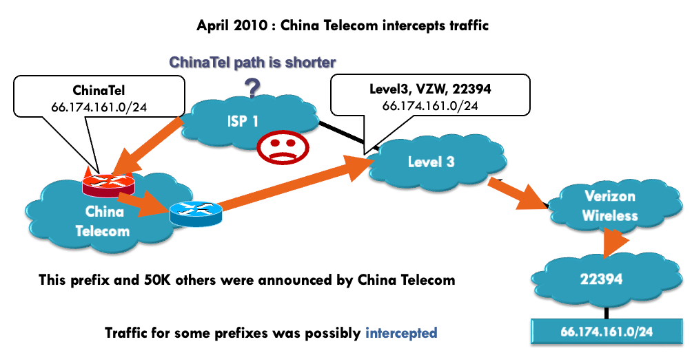

# Secure Routing

!!! bug "routing attacks"
    - distance-vector: announce 0 distance to all other nodes
    - link-state: drop links; claim direct link to other routers
    - BGP: announce arbitrary prefix; alter paths

Deliver Scheme:

- `unicast` delivers a message to a single specific node
- `broadcast` delivers a message to all nodes in the network
- `multicast` delivers a message to a group of nodes
- `anycast` delivers a message to any one out of a group of nodes, typically the one nearest to the source
- `geocast` delivers a message to a group of nodes based on **geographic location**

> Unicast is the dominant form of message delivery on the Internet. 

现在，我们的目标是将信息从一个节点传递到另一个节点，那么如何在它们之间找到一条可行的路径呢？

!!! success "This is the focus of a routing scheme."

Routing Scheme:

> **unicast** -> deliver msg to a single node

根据两个通信实体是否在一个自治系统内，有两种不同的路由选择方案：

- Intra-domain routing: inside an autonomous system (AS)
- Inter-domain routing: between different ASs

## Route Computation

### Link-state Algorithms

!!! abstract
    - 基于 Dijkstra 算法
    - each router knows **complete topology** and **link cost information**
    - independently run routing algorithm to calculate shortest path to each destination;

对于 Dijkstra：

- `c(i, j)`: link cost from `i` to `j` (equals $\infty$ if unknown)
- `D(v)`: current value of cost of path from source to destination `v`
- `p(v)`: predecessor node along path from source to `v`
- `N'`: set of nodes whose least cost path is already known

??? info "pseudo-code of Dijkstra"
    ```c
    // Initialization
    N' = {A}
    for all nodes v
        if v adjacent to A:
            then D(v) = c(A, v)
            else D(v) = infinty
    
    Loop:
        find w not in N' such that D(w) is min:
            add w to N'
            Update D(v) for all v adjacent to w and not in N':
                D(v) = min(D(v), D(w) + c(w, v))
            // new cost to v is either the old cost, or known 
            // shortest path cost to w plus cost from w to v 
    go to Loop until all nodes in N'
    ```

??? example
    

??? info "常见 Link-State 算法"
    - OSPF (Open Shortest Path First)
    - IS-IS (Intermediate System to Intermediate System)
    - SPF (Shortest Path First)
    - SPF (Shortest Path First)

- Such link-state algorithms require that each router knows complete topology & link cost information;
- What if a router has no such **global view**, especially in a relatively large network?
- Then comes the **distance-vector algorithms**

### Distance-vector

!!! abstract
    - 也称为 Bellman-Ford 或者 Ford-Fulkerson 算法
    - Each router knows direct neighbors & link costs to neighbors
    - Calculate the shortest path to each destination through an iterative process based on the neighbors' distances to each destination

对于 Distance-vector：

- `Dx(y)`: cost of least-cost path from `x` to `y`
    - `Dx(y) = min{c(x, v) + Dv(y)}` 
    - for all neighbors `v` of `x`

核心思想是：每个节点维护一个距离向量表，记录它到网络中其他节点的距离，然后通过向相邻节点广播自己的距离向量表，与相邻节点交换信息，以更新整个网络中每个节点的距离向量表。


both types of path computation algorithms can be used for intra-domain routing and inter-domain routing

## Hierarchical Routing (TODO)


- IGP (Interior Gateway Protocol)
    - RIP (Routing Information Protocol)
    - OSPF (Open Shortest Path First)
- BGP (Border Gateway Protocol)

### RIP 

- Distance-vector algorithm
    - Distance metric: number of hops (max = 15 hops)
- Each router exchanges its routing advertisement with its neighbors every 30 seconds
- Failure and Recovery
    - All routes via N invalidated; 
    - updates sent to neighbors, neighbors in turn may send out new advertisements (if tables changed)
    - Use poison reverse to prevent ping-pong loops (16 hops = $\infty$) 

??? example
    

### OSPF 

- LSP (Link-State Packet) 
    - one entry per neighbor router
    - ID of the node that created the LSP
    - a list of direct neighbors, with link cost to each
    - sequence number for this LSP message (SEQ)
    - time-to-live (TTL) for information carried in this LSP
    - Use raw IP packet (protocol ID = 89)
- Build a complete map using link states
    - everyone broadcasts a piece of topology;
    - put all pieces together $\rightarrow$ complete map

??? note "process"
    ```
    Builds and maintains topology map at each node
    Stores and forwards most recent LSP from all other nodes
        decrement TTL of stored LSP; discard info when TTL=0
    Compute routes using Dijkstra’s algorithm
    generates its own LSP periodically with increasing SEQ
    ```

### BGP 

> Border Gateway Protocol, connects other ASes


## routing attacks

- distance-vector: 
    - Announce 0 distance to all other nodes
    - Blackhole traffic
    - Eavesdrop
- link-state: 
    - Can drop links randomly
    - Can claim direct link to any other routers
    - A bit harder to attack than DV
- BGP: 
    - ASes can announce arbitrary prefix
    - ASes can alter path

### Prefix Hijacking

**Case 1: 谎称自己是某个 prefix**


**Case 2: 谎称自己有更短的路径**



### Path Tampering

通过修改路径上的 AS 节点来达到跳转具体几跳的目的，从而实现攻击：


## Secure Routing (TODO)

### RPKI

即 Resource Public Key Infrastructure


### S-BGP