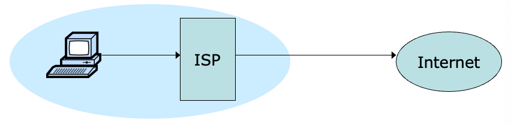
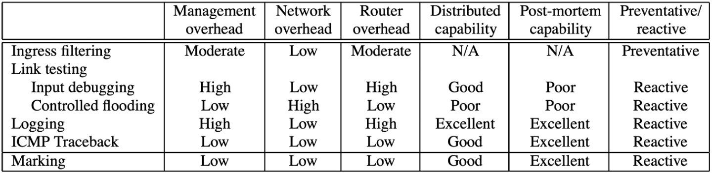

# Attack Traceback

> - Assume we have detected an attack. But we don't know where it comes from. 
> - Source IP address can be spoofed.

引入 Ingress Filtering

## Ingress Filtering

> Ingress filtering 可以解决 spoofing 的问题，但有部署问题

- How to find packet origin?

- Ingress filtering policy:
    - ISP only forwards packets with legitimate source IP
- Implementation challenges:
    - All ISPs need to do this — requires **global coordination:**
        - If 10% of networks don’t implement, there’s no defense;
        - No incentive for an ISP to implement — doesn’t affect them;
    - As of 2017 (from CAIDA):
        - 33% of autonomous systems allow spoofing;
        - 23% of announced IP address space allow spoofing;

> 因为部署困难，所以使用 Transit Routers

## IP Traceback

[DDoS Defenses - IP Traceback](./ddos.md#traceback)

- Goal:
    - given set of attack packets **determine path to source**
- How:
    - change routers to record info in packets
- Assumptions:
    - trusted routers
    - sufficient packets to track
    - stable route from attacker to victim
- Write path into packets
    - router adds its own IP address to packet victim reads path from packet
- Deterministic Packet Marking
- Limitations
    - requires space in packet 
    - path can be long
    - no extra fields in current IP format (changes to packet format too much to expect)

<!-- - Sample and Merge
    - store one link in each packet;
    - router probabilistically stores own address;
    - fixed space regardless of path length;
- Probabilistic Packet Marking -->

## ICMP

### ICMP Traceback

iTrace

- Each router samples one of packets it is forwarding and copies the contents and adjacent routers’ info into an ICMP traceback message
- Router uses **HMAC and X.509 digital certificate for authenticating** traceback messages
- Router sends ICMP traceback messages to the destination

Some issues:

- Require all the routers transmitting attack traffic be enabled with iTrace to construct an entire attack path
- yet ICMP packets are usually filtered... because of ICMP Ping Flood Attack...
- yet **not all packets** are sampled on every hop

??? info "ICMP Ping Flood"
    > DDoS 中介绍过 [ICMP Ping Flood](./ddos.md#ping-flood)

    > Exploit Internet Control Messge Protocol (ICMP)
    > 
    > - an internet layer protocol used by network devices to communicate;
    > - also used by network diagnostic tools such as traceroute and ping;

    - **ICMP Echo Request**: sender to receiver
    - **ICMP Echo Reply**: receiver to sender

    Attack Principle:

    - both incoming ICMP Echo Request and outgoing ICMP Echo Reply consume bandwidth;
    - overwhelm the target device’s ability to respond to a high number of requests and/or overload the network connection with bogus traffic
    - The attacker sends many ICMP echo request packets to the targeted server using multiple devices;
    - The targeted server then sends an ICMP echo reply packet to each requesting device’s IP address as a response.

    Solution:
    
    - disable the ICMP functionality of the target device;
    - (make the device unresponsive to ping requests and traceroute requests)

    ??? info "Ping Flood Process"
        The DDoS form of a Ping (ICMP) Flood can be broken down into 2 repeating steps:
        
        - The attacker sends many ICMP echo request packets to the targeted server using multiple devices.
        - The targeted server then sends an ICMP echo reply packet to each requesting device’s IP address as a response.

## Path Validation

- PoC: Proof of Consent
    - certify the provider’s consent to carry traffic along the path
- PoP: Proof of Provenance
    - allow upstream nodes to prove to downstream nodes that they **carried the packet**

- Routers are dictated with paths and credentials
- Routers add path proofs to packets
- Routers verify path proofs

## Link Testing

Not every packet should be always marked and sampled

Only do when needed

- Traceback from the router closest to the victim
- Determine the upstream link that is used to carry out the attack traffic
- Recursively apply the previous technique until the attack source is reached
- Has to take effect while the attack is in progress

具体来说：

- Input Debugging
    - Find **attack signature**, the common feature contained in all attack packets
    - Communicate the attack signature to the **upstream router**, which then filters attack packets and determines the port of entry
    - Recursively apply the previous technique on the upstream routers until reaching the attack source
    - A considerable management overhead at the ISP level to communicate and coordinate the traceback
- Controlled Flooding
    - Need collaborative hosts
    - Force the hosts to flood the links to upstream routers
    - Since buffer on victim is shared by all incoming links, flooding the link carrying out attack leads to drops of attack packets
    - Recursively apply the previous technique on the upstream routers until reaching the attack source
    - Require an accurate topology map  High overhead given multiple attacking sources (e.g., DDoS)

## Logging-Based Traceback

But link testing requires ongoing attack -> post-attack traceback

> log packets on routers to support query

- Routers store packet logs
- Victim queries the closest routers about packet appearance of attack packets
- The router containing attack packets recursively query upstream routers until reaching the attack source

???+ question "what packet data to log?"
    - **Raw packets?** high storage overhead on routers
    - **Hash of invariant content per packet?** still high storage overhead given high traffic rate

???+ question "How to efficient memership query?"
    **Bloom Filter**

    - Effeficent set memership query using multiple hashes per set elements
    - Use a bitmap, a bit of which is set if one element is hashed to this position

