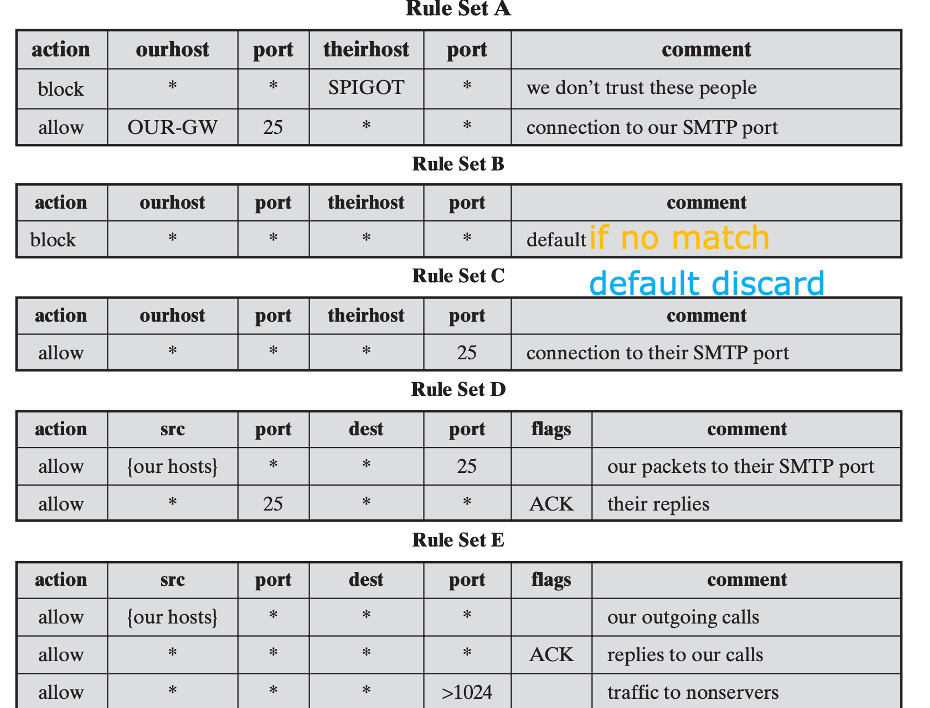
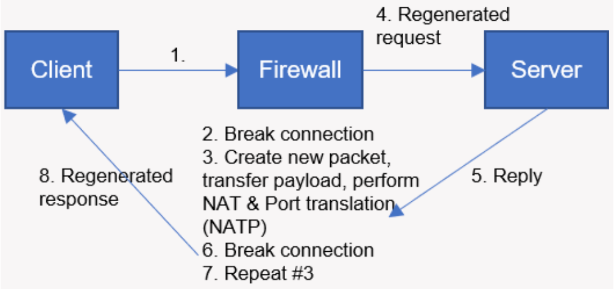

# Traffic Analysis

> filter malicious traffic

## Firewall

- Form a barrier through which the traffic going in each direction must pass | 双向流量都需要通过这个 barrier
- Use `firewall security policy` to dictate which traffic is authorized to pass in each direction

### Design Goals

- All traffic from inside to outside, and vice versa, must pass through the firewall.
- Only authorized traffic, as defined by the local security policy, will be allowed to pass. 
- The firewall itself is immune to penetration. 

### Design Techniques

#### Service Control

> determine service types that can be accessed (inbound or outbound)

- Filter traffic on the basis of **IP address**, **protocol**, or **port number**
- Provide **proxy software** that receives and interprets each service request before passing it on
- **Host the server software itself**, such as Web or Email service

#### Direction Control

determine the **direction** in which particular service requests may be initiated and allowed to flow through the firewall

#### User Control

control access to a service according to **which user is attempting to access it**

- Typically apply to local users
- Also apply to external users via secure authentication technology (e.g., IPsec Authentication Header)

#### Behavior Control

control **how** particular services are used

> E.g., 
> 
> - filter E-mail to eliminate spam, or 
> - enable external access to only a portion of the information on a local Web server

### Firewall Types

#### Packet Filtering Firewall

Apply a set of rules to each incoming and outgoing IP packet, Forward or discard the packet

- Make filtering decisions on an individual packet basis
- Consider no higher-layer context
- If no match, default discard, or default forward

??? info "Packet Filtering Firewall"
    - 对传输层进行过滤，firewall 充当 interface, 数据包头部会有 `source IP/port`, `destination IP/port`, `protocol`
    
    

    - 通过检查数据包的头部信息，来决定是否允许数据包通过

#### Stateful Inspection Firewall

Both packets and their context are examined by the firewall

> 数据包和它们的上下文都由防火墙检查，也发生在传输层

#### Application Proxy Firewall

- **Application-Level** Gateway | 应用层
- Act as a relay of application-level traffic

> 作为一个应用层的 relay，使得客户端和服务端从不直接交互，而是以防火墙作为代理，同时可以检查数据包的全部内容

??? info "more explanation"
    - An application-proxy firewall is a server program that understands the type of information being transmitted—for example, HTTP or FTP. 
    - It functions at a higher level in the protocol stack than do packet-filtering firewalls, thus providing more opportunities for the monitoring and control of accessibility

#### Circuit-Level Proxy Firewall

- Circuit-Level Gateway (还是在传输层)
- Act as a relay of TCP segments without examining the contents
- Set up two TCP connections instead

> 作为一个 transport layer 的 relay，代理主机和对方完成 TCP 连接建立；一旦建立连接后就正常转发，不检查内部内容。

??? info
    

### Where Firewall Stand?

#### DMZ Networks

#### Virtual Private Networks

#### Distributed Firewalls

