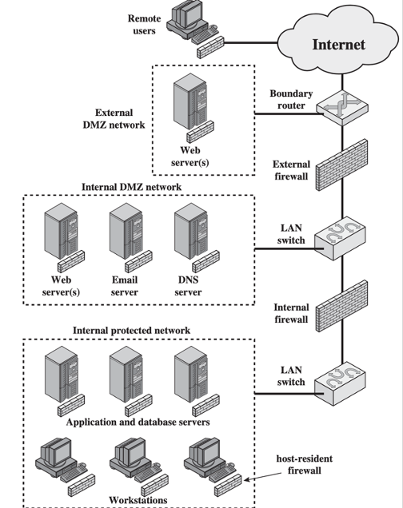

# Traffic Analysis

> filter malicious traffic

## Firewall

- Form a barrier through which the traffic going in each direction must pass | 双向流量都需要通过这个 barrier
- Use `firewall security policy` to dictate which traffic is authorized to pass in each direction

### Design Goals

- All traffic from inside to outside, and vice versa, must pass through the firewall.
- Only authorized traffic, as defined by the local security policy, will be allowed to pass. 
- The firewall itself is immune to penetration. 

### Design Techniques

#### Service Control

> determine service types that can be accessed (inbound or outbound)

- Filter traffic on the basis of **IP address**, **protocol**, or **port number**
- Provide **proxy software** that receives and interprets each service request before passing it on
- **Host the server software itself**, such as Web or Email service

#### Direction Control

determine the **direction** in which particular service requests may be initiated and allowed to flow through the firewall

#### User Control

control access to a service according to **which user is attempting to access it**

- Typically apply to local users
- Also apply to external users via secure authentication technology (e.g., IPsec Authentication Header)

#### Behavior Control

control **how** particular services are used

> E.g., 
> 
> - filter E-mail to eliminate spam, or 
> - enable external access to only a portion of the information on a local Web server

### Firewall Types

#### Packet Filtering Firewall

Apply a set of rules to each incoming and outgoing IP packet, Forward or discard the packet

- Make filtering decisions on an individual packet basis
- Consider no higher-layer context
- If no match, default discard, or default forward

??? info "Packet Filtering Firewall"
    - 对传输层进行过滤，firewall 充当 interface, 数据包头部会有 `source IP/port`, `destination IP/port`, `protocol`
    
    

    - 通过检查数据包的头部信息，来决定是否允许数据包通过

#### Stateful Inspection Firewall

Both packets and their context are examined by the firewall

> 数据包和它们的上下文都由防火墙检查，也发生在传输层

#### Application Proxy Firewall

- **Application-Level** Gateway | 应用层
- Act as a relay of application-level traffic

> 作为一个应用层的 relay，使得客户端和服务端从不直接交互，而是以防火墙作为代理，同时可以检查数据包的全部内容

??? info "more explanation"
    - An application-proxy firewall is a server program that understands the type of information being transmitted—for example, HTTP or FTP. 
    - It functions at a higher level in the protocol stack than do packet-filtering firewalls, thus providing more opportunities for the monitoring and control of accessibility

#### Circuit-Level Proxy Firewall

- Circuit-Level Gateway (还是在传输层)
- Act as a relay of TCP segments without examining the contents
- Set up two TCP connections instead

> 作为一个 transport layer 的 relay，代理主机和对方完成 TCP 连接建立；一旦建立连接后就正常转发，不检查内部内容。

??? info
    

### Where Firewall Stand?

#### DMZ Networks

> DMZ (Demilitarized Zone | 停火区)

- External Firewall
    - provide access control and protection for DMZ systems consistent with their need for external connectivity
- Internal Firewall
    - add more stringent filtering capability; 
    - protect internal network from attacks from DMZ and vice versa;
    - protect internal networks from each other;

#### Virtual Private Networks

- Use encryption and authentication in the lower protocol layers to provide a secure connection through **insecure Internet**
- Cheaper than real private networks using private lines
- Common protocol in use: **IPsec**

#### Distributed Firewalls

- Stand-alone firewall devices + host-based firewalls work together under a central administrative control

## IDS

??? question "traffic pattern learned?"
    individually secure packets yet collaboratively malicious (e.g. TCP SYN Flood)

> IDS (Intrusion Detection System)

- Detect unusual patterns of activity or patterns of activity that are known to correlate with intrusions
- Provide early warning of an intrusion so that defensive action can be taken

### Instruction Behavior Pattern

??? info
    - Hacker
        1. Select the target using IP lookup tools such as NSLookup, Dig, and others.
        2. Map network for accessible services using tools such as NMAP.
        3. Identify potentially vulnerable services (in this case, pcAnywhere)
        4. Brute force (guess) pcAnywhere password.
        5. Install remote administration tool called DameWare.
        6. Wait for administrator to log on and capture his password
        7. Use that password to access remainder of network.
    - Criminal Enterprise
        1. Act quickly and precisely to make their activities harder to detect.
        2. Exploit perimeter through vulnerable ports.
        3. Use Trojan horses (hidden software) to leave back doors for reentry.
        4. Use sniffers to capture passwords.
        5. Do not stick around until noticed.
        6. Make few or no mistakes.
    - Internet Threat
        1. Create network accounts for themselves and their friends.
        2. Access accounts and applications they wouldn't normally use for their daily jobs.
        3. E-mail former and prospective employers.
        4. Conduct furtive instant-messaging chats.
        5. Visit Web sites that cater to disgruntled employees, such as f'dcompany.com.
        6. Perform large downloads and file copying
        7. Access the network during off hours.

intruder behavior differs from that of a legitimate user in ways that can be **quantified**:

### How to Detect Intrusion

1. Audit Record
      - Record ongoing activity of users
      - Input records to IDS
      - **Native Audit Record**
          - use **available accounting software in OS** to collect user activity information;
          - need **no additional collection software**;
          - may not contain needed information or may not contain it in a convenient form;
      - **Detection-Specific Audit Record**
          - use a dedicated facility to generate audit records containing only required information for IDS;
          - vender independent and portable;
          - extra overhead
      - Example fields - Subject, Action, Object, Exception Condition, Resource-Usage, Time-Stamp 
2. Statistical Anomaly Detection
      - Threshold detection
          - **count the number of occurences of a specific event type over an interval of time**, detect an intrusion if the number exceeds a reasonable number (如果超过合理数量，则报告入侵)
      - Profile-based detection (Signature)
          - characterize past behavior of some user(s), detect an intrusion if a significant deviation occurs (如果发生重大偏差，报告入侵)
3. Rule-Based Detection
      - Detect intrusion by observing events in the system and applying a set of rules that lead to a decision regarding whether a given pattern of activity is suspicious or not
      - Analyze historical audit records to identify usage patterns and generate rules that describe those patterns
      - e.g., aggregated traffic volume exceeds a threshold

### Distributed IDS

- operate as a background process on a monitored system;
- collect data on security-related events on the host and transmit to central manager;
- operate the same as host agent module except that it analyzes LAN traffic and reports to central manager;
- receive reports from LAN monitor and host agents, process and correlate these report to detect intrusion;

!!! question "how to profile attack more?"

### Honeypot

- Decoy systems designed to lure a potential attacker away from critical systems
- Collect information about the attacker’s activity
- Encourage the attacker to stay on the system long enough for administrators to respond

> ADS (Active Defense System)

<!-- ### Honeywords -->

!!! question "how accurate is IDS?"

### IDS Detection Accuracy

- Detection rate / True Positive Rate (TP)
    - given that there is an intrusion, how likely will the IDS correctly output an alert
- False Negative Rate: FN = 1 - TP
- False Alarm / False Positive Rate (FP) 
    - given that there is no intrusion, how likely is the IDS to falsely output an alert
- True Negative Rate: TN = 1 - FP

???+ note "IDS vs Firewall"
    - Firewall supports active filtering
    - IDS provides only passive monitoring

## IPS

- Intrusion Prevention System
    - an extension of IDS to attempt to block or prevent detected malicious activity
- Host-based, network-based, or distributed
- **Anomaly detection** to identify behavior different from legitimate users
- **Signature/heuristic detection** to identify malicious behavior

## Advanced Traffic Analysis

**Pattern Correlation**

- Pair users of secure messaging applications
- Secure messaging applications’ traffic features
- event-based algorithm
- shape-based algorithm
- Machine learning
- Deep learning

but Attacker can **hide traffic patterns**:

- Traffic Obfuscation | 混淆
    - Encrypt traffic to hide payloads
    - Use proxy to hide entire packets
    - Introduce noise traffic to hide patterns
    - e.g. ditto:
        - Obfuscate packet size by padding
        - Obfuscate transmission interval by dummy packets

???+ question "how to detect evasion?"
    more advanced analysis:
    
    Active Probing

    - Suspicious of a host using a certain software (e.g., cryptomining)?
    - Send a probe (e.g., to a specific port) under the protocol of the software
    - See if the probed host responds as expected 
    
    > 大意就是主动发一个探测器过去，看看对面反应正不正常