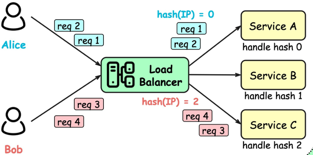
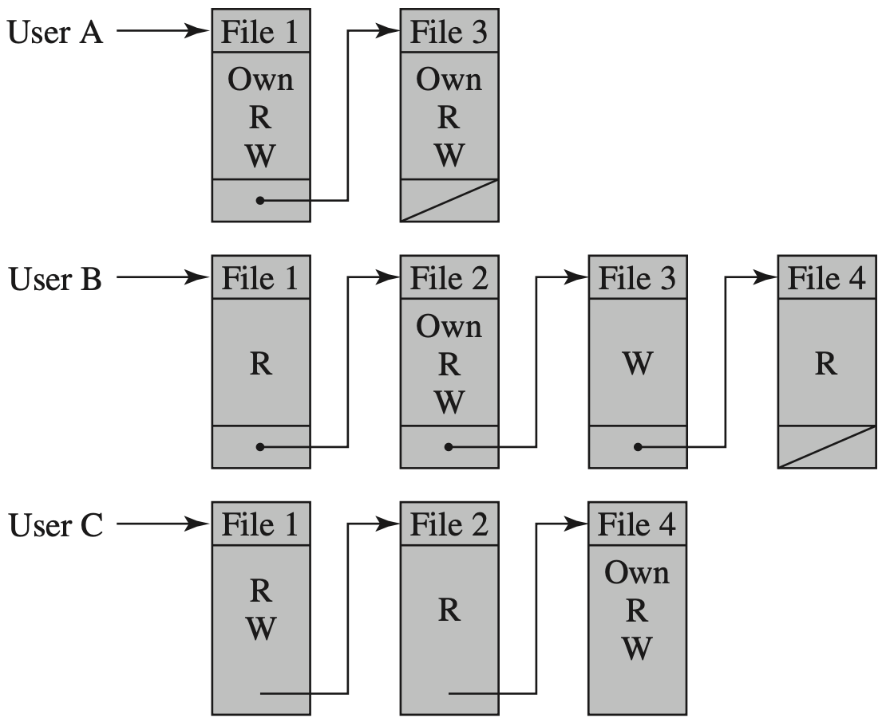

# Network Protection

## Firewall / IDS / IPS / HoneyPot

[Traffic Analysis](./traffic.md)

### Honeywords

- Associate false passwords (honeywords) with each user’s account 
- Attacker that steals (hashed) password file cannot distinguish from passwords from honeywords
- Attempted login using a honeyword sets off an alarm

## Load Balancing

- Distribute network traffic across multiple servers
- Mitigate single point of failure

=== "Least Connection Method"
    direct traffic **to** the server with **the fewest active connections**
    
    
=== "Least Response Time Method"
    direct traffic **to** the server with **the fewest active connections and the lowest average response time**
    
    
=== "Round Robin Method"
    direct traffic to one server after another **following a fixed sequence**

    
=== "IP Hash"
    direct traffic to the server indexed **by the hash of the IP address**

    

## Traffic Scrubbing

- Use a data cleansing service that analyzes traffic and filters malicious traffic
- Such service provider should be equipped with sufficient resources to sustain high volumetric floods

Once an attack is detected, 

- redirect traffic to scrubbing service
- Analyze and filter malicious traffic
- Deliver clean traffic to network/user

## User Authentication

- The basis for most types of access control and for user accountability
- The process of verifying an identity claimed by or for a system entity

=== "Identification Step"
    present an identifier to the security system
=== "Verification Step"
    present or generate authenticaton information that corroborates the binding between the entity and identifier

Means of authentication: (方式)

- Information the user knows
    - passwords, personal identification number (PIN), answers to prearranged questions
- Information the user possesses
    - electronic keycards, smart cards, physical keys
- Information the user is
    - static biometrics: fingerprint, retina, face
- Information the user does
    - dynamic biometrics: voice pattern, handwriting characteristics, typing rhythm

??? info "Token"
    Objects that a user possesses for the purpose of user authentication

    

??? info "Biometric"
    Authenticate a user based on the user’s unique physical characteristics: facial characteristics; fingerprints; hand geometry; retinal pattern; iris; signature; voice

??? info "Attack and Defense"
    

## Access Control

Implement a security policy that specifies who or what (e.g., a process) may have access to each specific system resource and the type of access that is permitted in each instance

> 不同主体有不同的访问权限

Authorize a subject with some access right(s) for some object(s)

- Subject
    - Entity capable of accessing objects
    - Owner
        - creator of a resource, system administrator, project leader, etc.
    - Group
        - a named group of users with shared access rights; 
        - a user may belong to multiple groups.
    - World
        - users other than owner and group
- Object
    - Resource to which access is controlled
    - Entity used to contain and/or receive information
- Access Right
    - Describe the way in which a subject may access an object
    - Read, write, execute, delete, create, search…

### DAC | Discretionary Access Control

简单来说可以建立一个访问控制矩阵 (Access Matrix)

> 实现快速访问，但如果过于稀疏的话，会浪费空间

引入下面两种设计：

=== "Access Control List (ACL)"
    
    <!--  -->

=== "Capability List"
    

### RBAC | Role-Based Access Control

- Assign users with **different roles** according to their responsibilities
- Check the roles that users assume in a system **rather than the user’s identity**

### ABAC | Attribute-Based Access Control

Define authorizations that express conditions on properties of both the resource and the subject

> 基于实时的属性和使用场景划分用户对某资源的访问权限, 更灵活，前几种都是分配了访问权限之后就固定了

??? info "RBAC to ABAC"
    - roles can define privileges that can be dynamically determined based on any attribute of user/subject or data/object

## Incident Response

Cyclical activity featuring ongoing learning and advancements to discover how to best protect the organization | 周期性活动，不断学习和进步，以发现如何最好地保护组织

Four main stages: (在四个阶段中不断切换反复)

- preparation
    - Set up baseline of normal activity. Determine which types of security events should be investigated
- detection/analysis
    - Detect potential attack and further investigate if and how it deviates from normal behavior
- containment/eradication
    - Identify and block attacking traffic; identify and remove attack related elements
- recovery
    - Recover normal operations as quickly as possible, taking steps to prevent subsequent attacks

??? info "Incident Response Steps"
    - Assemble a team of experts
    - Detect and ascertain the source
    - Contrain and recover
    - Assess damage and severity
    - Begin the notification process
    - Take actions for prevention
    - ...
