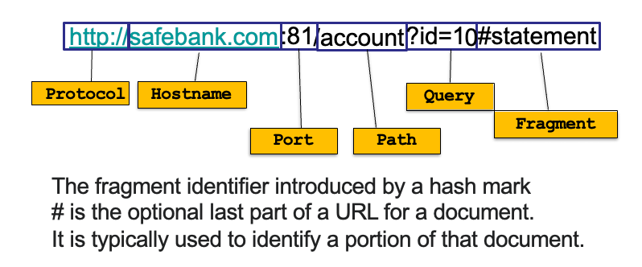
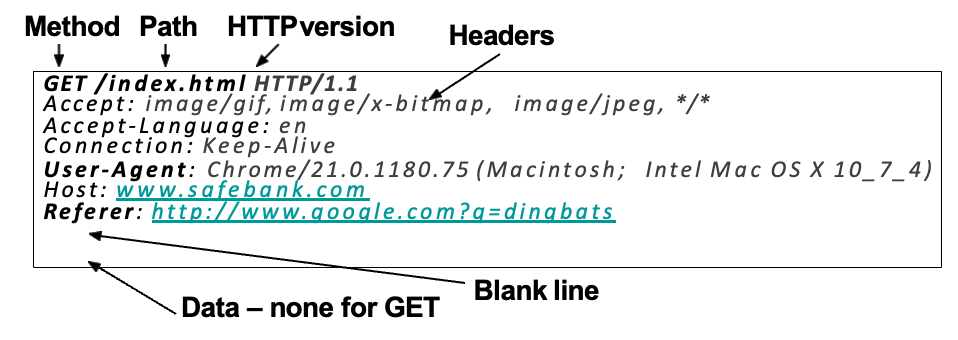
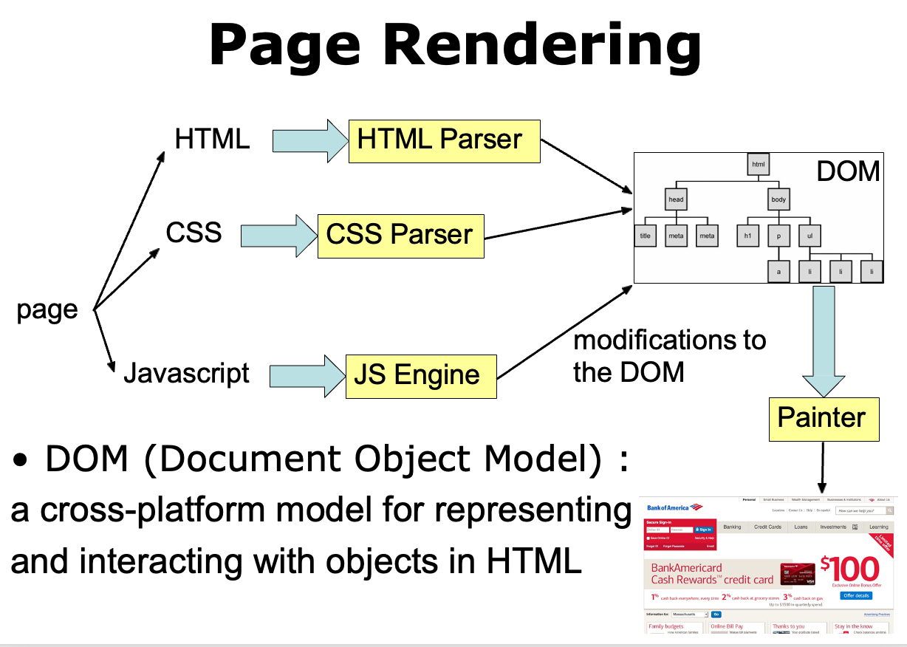

# Web Security

## Some Concepts

1. Web Service
      - A platform for deploying applications and sharing information, portably and securely, using HTTP/HTTPS
2. URL (Uniform Resource Locator)
      - Global identifiers of network-retrievable resources 
3. HTTP (HyperText Transfer Protocol)
      - A common data communication protocol on the web
      - HTTP Request
        - GET: request data from a specified resource
        - POST: send data to a server to create/update a resource

        !!! note "HTTP"
            

            - In HTTP, "Referer" is an optional HTTP header field that identifies the address of the web page, from which the resource has been requested. By checking the referrer, the server providing the new web page can see where the request originated.
            - In the most common situation, this means that when a user clicks a hyperlink in a web browser, causing the browser to send a request to the server holding the destination web page, the request may include the Referer field, which indicates the last page the user was on (the one where they clicked the link).

        - HTTP Response

- Webpage Languages:
    - HTML: HyperText Markup Language
        - A language to create structured docs
        - One can embed images, objects, or create interactive forms
    - CSS: Cascading Style Sheets
        - Style sheet language used for describing the presentation of a doc
    - JavaScript: A programming language that enables interactive web pages
        - Programming language used to manipulate  web pages. 
        - It is a high-level, untyped and  interpreted language with support for objects.
        - Supported by all web browsers
- Page Rendering  
- 